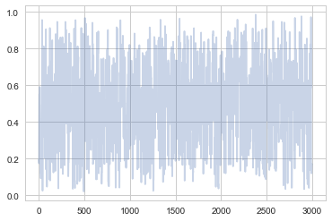



## Contents
{:.no_toc}
*  
{: toc}


## Practical thoughts on MCMC 

- despite the presence of MH to use asymmetric proposals, sometimes it might pay to just be lazy and accept additional computational time that might come with using a symmetric distribution
- the normal distribution is often a good choice


```python
def metropolis(p, qdraw, stepsize, nsamp, xinit):
    samples=np.empty(nsamp)
    x_prev = xinit
    accepted = 0
    for i in range(nsamp):
        x_star = qdraw(x_prev, stepsize)
        p_star = p(x_star)
        p_prev = p(x_prev)
        pdfratio = p_star/p_prev
        if np.random.uniform() < min(1, pdfratio):
            samples[i] = x_star
            x_prev = x_star
            accepted += 1
        else:#we always get a sample
            samples[i]= x_prev
            
    return samples, accepted
```


## The example from lecture


```python
f = lambda x: 6*x*(1-x)
```


```python
xxx= np.linspace(-1,2,100)
plt.plot(xxx, f(xxx), 'r') 
plt.axvline(0, 0,1, color="gray")
plt.axvline(1, 0,1, color="gray")
plt.axhline(0, 0,1, color="gray");
```


We wish to consider the support [0,1]. We could truncate our "distribution" beyond these. But it does not matter, even though we use a normal proposal whichcan propose negative and gretar-than-one $x$ values.

What happens if the proposal proposes a number outside of [0,1]? Notice then that our pdf is negative(ie it is not a pdf. (we could have defined it as 0 as well). Then in the metropolis acceptance formula, we are trying to check if a uniform is less than a negative or 0 number and we will not accept. This does however mean that we will need a longer set of samples than otherwise...


```python
def prop(x, step):
    return np.random.normal(x, step)
```


### Reasonable Step Size


```python
x0=np.random.uniform()
nsamps=100000
samps, acc = metropolis(f, prop, 0.6, nsamps, x0)
```


We decide to throw away 20% of our samples as burnin. 


```python
burnin = int(nsamps*0.2)
burnin
```


    20000


```python
# plot our sample histogram
plt.hist(samps[burnin:],bins=100, alpha=0.4, label=u'MCMC distribution', normed=True) 
#plot the true function
xx= np.linspace(0,1,100)
plt.plot(xx, f(xx), 'r', label=u'True distribution') 
plt.legend()

plt.show()
print("starting point was ", x0, "accepted", acc/nsamps)
```


    starting point was  0.1826859793404514 accepted 0.43322


The last many samples look  very white-noise-y, which is good


```python
plt.plot(samps[-2*burnin:], alpha=0.3);
```


The first 3000 samples will show some correlations, especially at the beginning. There might be some trends as well as the chain takes its time finding out where the "action" is.


```python
plt.plot(samps[:3000], alpha=0.3);
```





You will still see some small scale correlations. Thinning will  eliminate these.


```python
plt.plot(samps[burnin:burnin + burnin//10], alpha=0.3);
```


And lets just plot everything after burnin for comparison with small scales and large scales further down this document...


```python
plt.plot(samps[burnin:], alpha=0.3);
```


Very white noisy. While one may (rightfully) worry that we are seeing no structure because we aint zoomed in, we'll compare this unzoomed plot at different scales further down.

We can check to see if the autocorrelation is decaying quickly...


```python
def corrplot(trace, maxlags=50):
    plt.acorr(trace-np.mean(trace),  normed=True, maxlags=maxlags);
    plt.xlim([0, maxlags])
```


```python
corrplot(samps[burnin:])
```


Thinning will  decrease the autocorrelation even further...


```python
thin=5
sampsthin=samps[burnin::thin]
corrplot(sampsthin)
```


```python
# plot our sample histogram
plt.hist(sampsthin,bins=100, alpha=0.4, label=u'MCMC distribution', normed=True) 
sns.kdeplot(sampsthin)
#plot the true function
xx= np.linspace(0,1,100)
plt.plot(xx, f(xx), 'r', label=u'True distribution') 
plt.legend()

plt.show()
print("starting point was ", x0, "accepted", acc/nsamps)
```


    starting point was  0.1826859793404514 accepted 0.43322


### Large Step Size

$\sigma$ controls the step size of our proposal. A large sigma corresponds to faster coverage, but we are going to miss out details. Because we propose a lot of moves that change probability a lot, we are going to have many rejections.


```python
samps2, acc2 = metropolis(f, prop, 10.0, nsamps, x0)
acc2/nsamps
```


    0.03009


```python
# plot our sample histogram
plt.hist(samps2[burnin:],bins=100, alpha=0.4, label=u'MCMC distribution', normed=True) 
#plot the true function
xx= np.linspace(0,1,100)
plt.plot(xx, f(xx), 'r', label=u'True distribution') 
plt.legend()

plt.show()
print("starting point was ", x0, "accepted", acc2/nsamps)
```


    starting point was  0.1826859793404514 accepted 0.03009


```python
plt.plot(samps2[-2*burnin:], alpha=0.3);
```


```python
plt.plot(samps2[burnin:], alpha=0.3);
```


So you can see structure even when zoomed out...not good!


```python
corrplot(samps2[burnin:], 100)
```


### Small step size

A small $\sigma$ corresponds to a smaller step size, and thus  our sampler takes longer. But because we make only small changes in probability, our acceptance ration will be high!


```python
samps3, acc3 = metropolis(f, prop, 0.01, nsamps, x0)
acc3/nsamps
```


    0.98637


```python
# plot our sample histogram
plt.hist(samps3[burnin:],bins=100, alpha=0.4, label=u'MCMC distribution', normed=True) 
#plot the true function
xx= np.linspace(0,1,100)
plt.plot(xx, f(xx), 'r', label=u'True distribution') 
plt.legend()

plt.show()
print("starting point was ", x0, "accepted", acc3/nsamps)
```


    starting point was  0.1826859793404514 accepted 0.98637


```python
plt.plot(samps3[-2*burnin:], alpha=0.3);
```


```python
plt.plot(samps3[burnin:], alpha=0.3);
```


There's even  more structure here. Thats no way to be sampling! Sad!


```python
corrplot(samps3[burnin:], 100)
```


** A good rule of thumb is to shoot for about a 30% acceptance rate**

## Mixing and Convergence

*Mixing* is about how well we cover the relevant space.  *Convergence* is "are we there yet?" where by there we mean at the stationary distribution. Good mixing leads to faster convergence.

We do know that our sequence will converge as $n \to \infty$. But we dont want to be around, waiting for a very long time. And we dont know how many iterations it will take.

** We need to test for convergence **

This is just a lab. We will come to formal tests in a subsequent lecture, but currently let us look at some heuristics to build intution.

### Trace Plots

Trace plots are very useful for visual inspection. You should be able to see the burnin period, and then the chain produce something that looks like white noise.

**Inspecting the trace plot can show when we have not converged yet**. You will see large movements and regions of stasis where the autocorrelation is large. On the other hand, remember that without any formal tests, the traceplot cannot show for sure that we have converged either.

Some possibly useful visualizations:

- look at the whole plot
- divide into subsets of few 100s or few 1000s of samples and compare histograms/kdeplots
- start multiple different chains from random start points and compare the traceplots

### Autocorrelation

Autocorrelation can be a good diagnostic. After the burnin, the autocorrelation should decay within a few lags if we have reached ergodicity. There will likely still be some autocorrelation left. MCMC samples are samples from $p(x)$ and are guaranteed to be **act as IID**  due to the "ergodic" law of large numbers: time averages can be used as sample averages. But nearby samples are not *IID*, and you can help them along by shuffling the samples, or thinning so the the autocorrelation becomes minimal.
