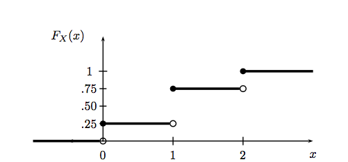
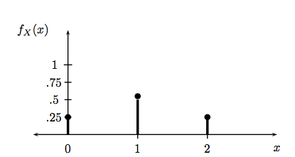
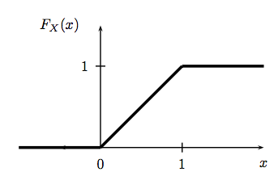

Remember that a [Random Variable](probability.html) is a mapping $ X: \Omega \rightarrow \mathbb{R}$ that assigns a real number $X(\omega)$ to each outcome $\omega$ in a sample space $\Omega$.  The definitions below are taken from Larry Wasserman's All of Statistics.

## Cumulative distribution Function

The **cumulative distribution function**, or the **CDF**, is a function

$$F_X : \mathbb{R} → [0, 1] $$,

 defined by

$$F_X (x) = p(X \le x).$$

A note on notation: $X$ is a random variable while $x$ is a particular value of the random variable.

Let $X$ be the random variable representing the number of heads in two coin tosses. Then $x$ can take on values 0, 1 and 2. The CDF for this random variable can be drawn thus (taken from All of Stats):

  Notice that this function is right-continuous and defined for all $x$, even if $x $does not take real values in-between the integers.

## Probability Mass and Distribution Function

$X$ is called a **discrete random variable** if it takes countably many values $\{x_1, x_2,…\}$. We define the **probability function** or the **probability mass function** (**pmf**) for X by:

$$f_X(x) = p(X=x)$$

$f_X$ **is a probability**.

The pmf for the number of heads in two coin tosses (taken from All of Stats) looks like this:

On the other hand, a random variable is called a **continuous random variable** if there exists a function $f_X$ such that $f_X (x) \ge 0$ for all x,  $\int_{-\infty}^{\infty} f_X (x) dx = 1$ and for every a ≤ b,

$$p(a < X < b) = \int_{a}^{b} f_X (x) dx$$

The function $f_X$ is called the probability density function (pdf). We have the CDF:

$$F_X (x) = \int_{-\infty}^{x}f_X (t) dt $$

and $f_X (x) = \frac{d F_X (x)}{dx}$ at all points x at which $F_X$ is differentiable.

Continuous variables are confusing. Note:

1. $p(X=x) = 0$ for every $x$. You **cant think** of $f_X(x)$ as $p(X=x)$. This holds only for discretes. You can only get probabilities from a pdf by integrating, if only over a very small paty of the space.
2. A pdf can be bigger than 1 unlike a probability mass function, since probability masses represent actual probabilities.

### A continuous example: the Uniform Distribution

Suppose that X has pdf
$$
f_X (x) =
\begin{cases}
1 & \text{for } 0 \leq x\leq 1\\
    0             & \text{otherwise.}
\end{cases}
$$
A random variable with this density is said to have a Uniform (0,1) distribution. This is meant to capture the idea of choosing a point at random between 0 and 1. The cdf is given by:
$$
F_X (x) =
\begin{cases}
0 & x \le 0\\
x & 0 \leq x \leq 1\\
1 & x > 1.
\end{cases}
$$
and can be visualized as so (again from All of Stats):

### A discrete example: the Bernoulli Distribution

The **Bernoulli Distribution** represents the distribution a coin flip. Let the random variable $X$ represent such a coin flip, where $X=1$ is heads, and $X=0$ is tails. Let us further say that the probability of heads is $p$ ($p=0.5$ is a fair coin).

We then say:

$$X \sim Bernoulli(p)$$

which is to be read as $X$ **has distribution** $Bernoulli(p)$. The pmf or probability function associated with the Bernoulli distribution is
$$
f(x) =
\begin{cases}
1 - p & x = 0\\
p & x = 1.
\end{cases}
$$

for p in the range 0 to 1. This pmf may  be written as

$$f(x) = p^x (1-p)^{1-x}$$

for x in the set {0,1}.

$p$ is called a parameter of the Bernoulli distribution.

## Conditional and Marginal Distributions

Marginal mass functions are defined in analog to [probabilities](probability.html). Thus:

$$f_X(x) = p(X=x) =  \sum_y f(x, y);\,\, f_Y(y) = p(Y=y) = \sum_x f(x,y).$$

Similarly, marginal densities are defined using integrals:

$$f_X(x) = \int dy f(x,y);\,\, f_Y(y) = \int dx f(x,y).$$

Notice there is no interpretation of the marginal densities in the continuous case as probabilities. An example here if $f(x,y) = e^{-(x+y)}$ defined on the positive quadrant. The marginal is an exponential defined on the positive part of the line.

Conditional mass function is similarly, just a conditional probability. So:

$$f_{X \mid Y}(x \mid y) = p(X=x \mid Y=y) = \frac{p(X=x, Y=y)}{p(Y=y)} = \frac{f_{XY}(x,y)}{f_Y(y)}$$

The similar formula for continuous densities might be suspected to a bit more complex, because we are conditioning on the event $Y=y$ which strictly speaking has 0 probability. But it can be proved that the same formula holds for densities with some additional requirements and interpretation:

$$f_{X \mid Y}(x \mid y)  = \frac{f_{XY}(x,y)}{f_Y(y)},$$

where we must assume that $f_Y(y) > 0$. Then we have the interpretation that for some event A:

$$p(X \in A \mid Y=y) = \int_{x \in A} f_{X \mid Y}(x,y) dx.$$

An example of this is the uniform distribution on the unit square. Suppose then that $y=0.3$. Then the conditional density is a uniform density on the line between 0 and 1 at $y=0.3$.
