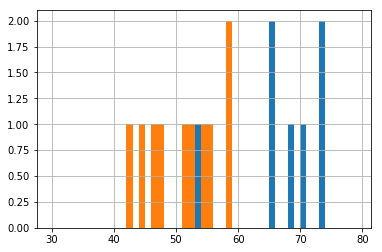
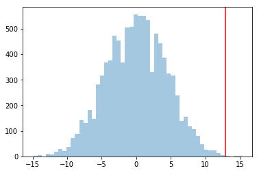
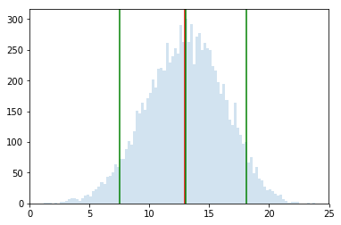



## Contents
{:.no_toc}
*  
{: toc}


```python
# The %... is an iPython thing, and is not part of the Python language.
# In this case we're just telling the plotting library to draw things on
# the notebook, instead of on a separate window.
%matplotlib inline 
#this line above prepares IPython notebook for working with matplotlib

# See all the "as ..." contructs? They're just aliasing the package names.
# That way we can call methods like plt.plot() instead of matplotlib.pyplot.plot().

import numpy as np # imports a fast numerical programming library
import scipy as sp #imports stats functions, amongst other things
import matplotlib as mpl # this actually imports matplotlib
import matplotlib.cm as cm #allows us easy access to colormaps
import matplotlib.pyplot as plt #sets up plotting under plt
import pandas as pd #lets us handle data as dataframes
#sets up pandas table display
pd.set_option('display.width', 500)
pd.set_option('display.max_columns', 100)
pd.set_option('display.notebook_repr_html', True)
```


Let us get the data and put it into a dataframe.


```python
placebo = [54, 51, 58, 44, 55, 52, 42, 47, 58, 46]
drug = [54, 73, 53, 70, 73, 68, 52, 65, 65]
dosage = placebo + drug
label = ['P']*len(placebo) + ['D']*len(drug)
df = pd.DataFrame(dict(dosage=dosage, label=label))
df
```


<div>
<style scoped>
    .dataframe tbody tr th:only-of-type {
        vertical-align: middle;
    }

    .dataframe tbody tr th {
        vertical-align: top;
    }

    .dataframe thead th {
        text-align: right;
    }
</style>
<table border="1" class="dataframe">
  <thead>
    <tr style="text-align: right;">
      <th></th>
      <th>dosage</th>
      <th>label</th>
    </tr>
  </thead>
  <tbody>
    <tr>
      <th>0</th>
      <td>54</td>
      <td>P</td>
    </tr>
    <tr>
      <th>1</th>
      <td>51</td>
      <td>P</td>
    </tr>
    <tr>
      <th>2</th>
      <td>58</td>
      <td>P</td>
    </tr>
    <tr>
      <th>3</th>
      <td>44</td>
      <td>P</td>
    </tr>
    <tr>
      <th>4</th>
      <td>55</td>
      <td>P</td>
    </tr>
    <tr>
      <th>5</th>
      <td>52</td>
      <td>P</td>
    </tr>
    <tr>
      <th>6</th>
      <td>42</td>
      <td>P</td>
    </tr>
    <tr>
      <th>7</th>
      <td>47</td>
      <td>P</td>
    </tr>
    <tr>
      <th>8</th>
      <td>58</td>
      <td>P</td>
    </tr>
    <tr>
      <th>9</th>
      <td>46</td>
      <td>P</td>
    </tr>
    <tr>
      <th>10</th>
      <td>54</td>
      <td>D</td>
    </tr>
    <tr>
      <th>11</th>
      <td>73</td>
      <td>D</td>
    </tr>
    <tr>
      <th>12</th>
      <td>53</td>
      <td>D</td>
    </tr>
    <tr>
      <th>13</th>
      <td>70</td>
      <td>D</td>
    </tr>
    <tr>
      <th>14</th>
      <td>73</td>
      <td>D</td>
    </tr>
    <tr>
      <th>15</th>
      <td>68</td>
      <td>D</td>
    </tr>
    <tr>
      <th>16</th>
      <td>52</td>
      <td>D</td>
    </tr>
    <tr>
      <th>17</th>
      <td>65</td>
      <td>D</td>
    </tr>
    <tr>
      <th>18</th>
      <td>65</td>
      <td>D</td>
    </tr>
  </tbody>
</table>
</div>


The "mean" size of the effect in our sample is about 13.


```python
actuals = df.groupby('label').dosage.mean()
actuals
```


    label
    D    63.666667
    P    50.700000
    Name: dosage, dtype: float64


```python
df.groupby('label').dosage.hist(bins=np.arange(30, 80, 1));
```





```python
actual_effect = actuals['D'] - actuals['P']
actual_effect
```


    12.966666666666661


## Permutations to get significance

*Could it have happened by chance?*

We permute, group-by labels again, and calculate the effect. This kind of randomization should "kill" the effect:


```python
temp = np.random.permutation(df.label)
```


```python
temp_series = df.groupby(temp).dosage.mean()
temp_series
```


    D    57.0
    P    56.7
    Name: dosage, dtype: float64


```python
temp_series['D'] - temp_series['P']
```


    0.29999999999999716


If we compare the distribution of effect sizes to the actual effect, this actual effect should be in a tail if it is significant...


```python
sig_means = np.zeros(10000)
for i in range(10000):
    temp = np.random.permutation(df.label)
    mean_series = df.groupby(temp).dosage.mean()
    sig_means[i] = mean_series['D'] - mean_series['P']

```


```python
plt.hist(sig_means, bins=50, alpha=0.4);
plt.axvline(actual_effect, 0, 1, color="red");
```





As a comparison, consider the case in which placebos had a much wider spread, between 50, and 450. Simply add 13 to each placebo value to get a dosage value. The mean difference would still be 13. But now, 13 would be way inside the histogram, and the effect would not be a significant one, and could have happened by chance.

*Statistically significant does not mean important*. Thats a question of, how large is the effect, or where are the confidence intervals for the effect. For instance, if a statistically significant increase in mortality was a mean of 5 days over 5 years by drug over placebo, you would not consider the effect important.

## Bootstrap to estimate size of effect

Here we randomize labels within the group, take means, and subtract. Here is an example


```python
placebo_bs = np.random.choice(list(range(10)), size=(10000, 10))
drug_bs = np.random.choice(list(range(10, 19)), size=(10000, 9))
```


```python
placebo_bs[0,:]
```


    array([7, 7, 1, 5, 1, 5, 4, 6, 0, 7])


```python
df.iloc[placebo_bs[0,:]]
```


<div>
<style scoped>
    .dataframe tbody tr th:only-of-type {
        vertical-align: middle;
    }

    .dataframe tbody tr th {
        vertical-align: top;
    }

    .dataframe thead th {
        text-align: right;
    }
</style>
<table border="1" class="dataframe">
  <thead>
    <tr style="text-align: right;">
      <th></th>
      <th>dosage</th>
      <th>label</th>
    </tr>
  </thead>
  <tbody>
    <tr>
      <th>7</th>
      <td>47</td>
      <td>P</td>
    </tr>
    <tr>
      <th>7</th>
      <td>47</td>
      <td>P</td>
    </tr>
    <tr>
      <th>1</th>
      <td>51</td>
      <td>P</td>
    </tr>
    <tr>
      <th>5</th>
      <td>52</td>
      <td>P</td>
    </tr>
    <tr>
      <th>1</th>
      <td>51</td>
      <td>P</td>
    </tr>
    <tr>
      <th>5</th>
      <td>52</td>
      <td>P</td>
    </tr>
    <tr>
      <th>4</th>
      <td>55</td>
      <td>P</td>
    </tr>
    <tr>
      <th>6</th>
      <td>42</td>
      <td>P</td>
    </tr>
    <tr>
      <th>0</th>
      <td>54</td>
      <td>P</td>
    </tr>
    <tr>
      <th>7</th>
      <td>47</td>
      <td>P</td>
    </tr>
  </tbody>
</table>
</div>


Here is the effect:


```python
df.iloc[drug_bs[0,:]].dosage.mean() - df.iloc[placebo_bs[0,:]].dosage.mean()
```


    14.977777777777774


Let us do this 10000 times.


```python
effect_diffs = np.zeros(10000)
for i in range(10000):
    effect_diffs[i] = df.iloc[drug_bs[i,:]].dosage.mean() - df.iloc[placebo_bs[i,:]].dosage.mean()
```


```python
percs = np.percentile(effect_diffs, [5, 50, 95])
percs
```


    array([  7.53333333,  13.05      ,  18.12222222])


```python
plt.hist(effect_diffs, bins=100, alpha=0.2);
plt.axvline(actual_effect, 0, 1, color="red");
for p in percs:
    plt.axvline(p, 0, 1, color="green");
```





That is, 90% of the time, the drug is 7.53 to 18.12 more effective than placebo. The average value of placebo in our sample was 50. This makes the drug 13 to 33% more effective, roghly, which seems it might be an important effect.

If you have such a confidence interval, why do a significance test. Consider the extreme case of 2 data points, wel separated. The confidence interval is tight around the difference. But a permutation test would show that half the time, you will by random chance, get a difference just as big as  the observed one. Intuitively this is too little data to show significance, and this "half the time" bears that out...
