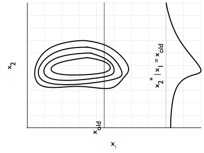

We need to show that Gibbs Sampling converges to our target distribution. We start with a componentwise MH update.

We shall use the following notation, assuming that $x$ is multidimensional: $x_{k}^i$ is the $k$th component of $x$ at $i$th step, while $x_{-k}^i$ is all other componets of $x$ at the same step.

Now consider the following proposal function:

$$q_k(x^* \vert x^i) = \begin{cases} p(x_k^* \vert x_{-k}^i) & for \,\,x_{-k}^* = x_{-k}^i,\\ 0 & otherwise \end{cases}$$

In other words, you propose from the conditional distribution of the current component, given a fixed $x_{old}$ value of the other components.  You keep all the other component values the same. If you change any of the old component values, the proposal probability is 0. This should remind you of componentwise updating in MH (and block, as $k$ could represent a block). Now you see where this conditional takes you in the $x_k$ direction.

Under this proposal distribution, let us see what our MH acceptance probability term:

$$A = min(1, \frac{p(x^*)}{p(x^i)}\,\frac{q_k(x^i \vert x^*)}{q_k(x^* \vert x^i)})$$

gives us. We use $p(x^\*) = p(x_{-k}^\*, x_k^\*) = p(x_{k}^\* \vert  x_{-k}^\*)p(x_{-k}^\*)$ to obtain

$$A = min(1, \frac{p(x_{k}^* \vert  x_{-k}^*)p(x_{-k}^*)}{p(x_{k}^i \vert  x_{-k}^i)p(x_{-k}^i)}\,\frac{q_k(x^i \vert x^*)}{q_k(x^* \vert x^i)})$$

Putting in the definition of the proposal, we get

$$A = min(1, \frac{p(x_{k}^* \vert  x_{-k}^*)p(x_{-k}^*)}{p(x_{k}^i \vert  x_{-k}^i)p(x_{-k}^i)}\,\frac{p(x_k^i \vert x_{-k}^*)}{p(x_k^* \vert x_{-k}^i)})$$

Now, because of the componentwise update, $x_{-k}^* = x_{-k}^i$ and thus we get the middle 2 terms in the numerator and denominator cancelling, and the 1st and 3rd terms from the numerator cancelling the 3rd and 1st terms respectively. Thus our acceptance probability is 1. 

We have constructed a MH sampler with no rejection!!

