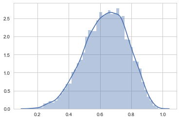
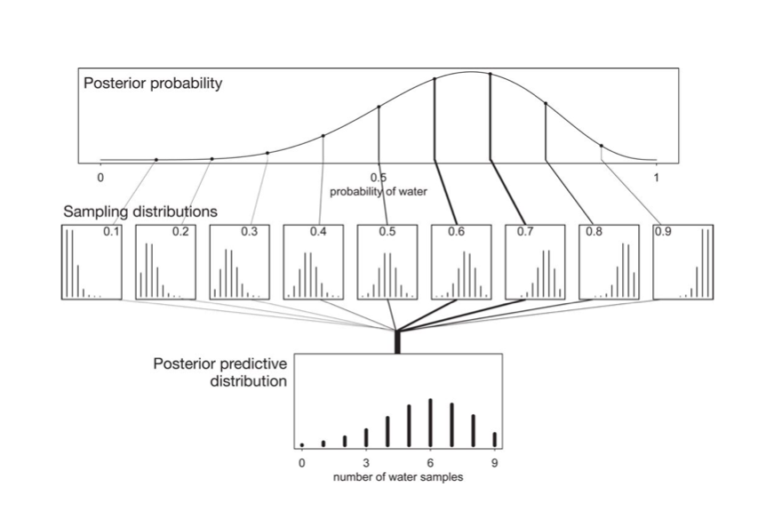



## Contents
{:.no_toc}
*  
{: toc}


```python
%matplotlib inline
import numpy as np
from scipy import stats
from scipy.stats import norm
import matplotlib.pyplot as plt
import seaborn as sns
sns.set_style("whitegrid")
```


## Formulation of the problem

This problem, taken from McElreath's book, involves a seal (or a well trained human) tossing a globe, catching it  on the nose, and noting down if the globe came down on  water or land.

The seal tells us that the first 9 samples were:

`WLWWWLWLW`.

We wish to understand the evolution of belief in the fraction of water on earth as the seal tosses the globe.

Suppose $\theta$ is the true fraction of  water covering the globe. Our data story if that $\theta$ then is the probability of the nose landing on water, with each throw or toss of the globe being independent.

Now we build a  probabilistic model for the problem, which we shall use to guide a process of **Bayesian updating** of the model as data comes in.

$$\cal{L} = p(n,k|\theta) = Binom(n,k, \theta)=\frac{n!}{k! (n-k)! } \, \theta^k \, (1-\theta)^{(n-k)} $$

Since our seal hasnt really seen any water or land, (strange, I know), it assigns equal probabilities, ie uniform probability to any value of $\theta$.

**This is our prior information**

For reasons of conjugacy we 
choose as prior the beta distribution, with $Beta(1,1)$ being the uniform prior.

## How to do the Bayesian Process

Bayes theorem and the things we will go through

(1) Grid approximation
(2) Quadratic (Laplace) Approximation
(3) Conjugate Priors
(4) MCMC (later)
(5) Model Checking

## Grid Approximation


```python
from scipy.stats import binom
```


```python
prior_pdf = lambda p: 1
like_pdf = lambda p: binom.pmf(k=6, n=9, p=p)
post_pdf = lambda p: like_pdf(p)*prior_pdf(p)
```


```python
p_grid = np.linspace(0., 1., 20)
p_grid
```


    array([ 0.        ,  0.05263158,  0.10526316,  0.15789474,  0.21052632,
            0.26315789,  0.31578947,  0.36842105,  0.42105263,  0.47368421,
            0.52631579,  0.57894737,  0.63157895,  0.68421053,  0.73684211,
            0.78947368,  0.84210526,  0.89473684,  0.94736842,  1.        ])


```python
plt.plot(p_grid, post_pdf(p_grid),'o-');
```


```python
p_grid = np.linspace(0., 1., 1000)
post_vals = post_pdf(p_grid)
post_vals_normed = post_vals/np.sum(post_vals)
grid_post_samples = np.random.choice(p_grid, size=10000, replace=True, p=post_vals_normed)
```


```python
plt.plot(p_grid, post_vals)
```


    [<matplotlib.lines.Line2D at 0x120aad2b0>]


```python
sns.distplot(grid_post_samples)
```


    <matplotlib.axes._subplots.AxesSubplot at 0x11b67a0b8>





## Laplace Approximation


```python
p_start = 0.5
from scipy.optimize import minimize
post_pdf_inv = lambda p: -post_pdf(p)
res = minimize(post_pdf_inv, p_start, method = 'Nelder-Mead', options={'disp': True})
```


    Optimization terminated successfully.
             Current function value: -0.273129
             Iterations: 13
             Function evaluations: 26


```python
res
```


     final_simplex: (array([[ 0.66669922],
           [ 0.66660156]]), array([-0.27312909, -0.27312907]))
               fun: -0.27312909031345828
           message: 'Optimization terminated successfully.'
              nfev: 26
               nit: 13
            status: 0
           success: True
                 x: array([ 0.66669922])


```python
post_MAP = res.x[0]
post_MAP
```


    0.66669921875000038


```python
insertbefore = np.searchsorted(p_grid, post_MAP)
insertbefore
```


    667


```python
postmapval = (post_vals[insertbefore-1] + post_vals[insertbefore])/2.
postmapval
```


    0.27312632244812729


```python
plt.plot(p_grid, post_vals);
plt.plot(p_grid, norm.pdf(p_grid, loc=post_MAP, scale=0.16))
```


    [<matplotlib.lines.Line2D at 0x11fbe3c50>]


```python
zq = lambda sigma: sigma*postmapval*np.sqrt(2*np.pi)
def fit_loss(sigma):
    vec = (post_vals/zq(sigma)) - norm.pdf(p_grid, loc=post_MAP, scale=sigma)
    return np.dot(vec, vec)
```


```python
res2 = minimize(fit_loss, 0.2, method = 'Nelder-Mead', options={'disp': True})
```


    Optimization terminated successfully.
             Current function value: 23.987144
             Iterations: 12
             Function evaluations: 24


```python
res2
```


     final_simplex: (array([[ 0.14921875],
           [ 0.14917969]]), array([ 23.9871437 ,  23.98715773]))
               fun: 23.987143699357638
           message: 'Optimization terminated successfully.'
              nfev: 24
               nit: 12
            status: 0
           success: True
                 x: array([ 0.14921875])


```python
post_SIG = res2.x[0]
post_SIG
```


    0.14921875000000009


```python
frozen_laplace = norm(post_MAP, post_SIG)
```


```python
plt.plot(p_grid, post_pdf(p_grid)/zq(post_SIG), label = "normalized posterior");
plt.plot(p_grid, frozen_laplace.pdf(p_grid), label = "laplace approx")
plt.legend();
```


```python
zq(post_SIG)
```


    0.10215906016979832


Now we can get samples from here:


```python
sns.distplot(frozen_laplace.rvs(10000))
```


    <matplotlib.axes._subplots.AxesSubplot at 0x120272668>


## Conjugate Priors

The  mean of $Beta(\alpha, \beta)$ is  $\mu = \frac{\alpha}{\alpha+\beta}$ while the variance is 

$$V=\mu (1- \mu)/(\alpha + \beta + 1)$$


```python
from scipy.stats import beta
x=np.linspace(0., 1., 100)
plt.plot(x, beta.pdf(x, 1, 1));
plt.plot(x, beta.pdf(x, 1, 9));
plt.plot(x, beta.pdf(x, 1.2, 9));
plt.plot(x, beta.pdf(x, 2, 18));
```


We shall choose $\alpha=1$ and $\beta=1$ to be uniform.

$$ p(\theta) = {\rm Beta}(\theta,\alpha, \beta) = \frac{\theta^{\alpha-1} (1-x)^{\beta-1} }{B(\alpha, \beta)} $$
where $B(\alpha, \beta)$ is independent of $\theta$ and it is the normalization factor.

From Bayes theorem, the posterior for $\theta$ is 

$$ p(\theta|D) \propto  p(\theta) \, p(n,k|\theta)  =  Binom(n,k, \theta) \,  {\rm Beta}(\theta,\alpha, \beta)  $$

which can be shown to be 

$${\rm Beta}(\theta, \alpha+k, \beta+n-k)$$


```python
from scipy.stats import beta, binom

plt.figure(figsize=( 15, 18))

prior_params = np.array( [1.,1.] )  # FLAT 

x = np.linspace(0.00, 1, 125)
datastring = "WLWWWLWLW"
data=[]
for c in datastring:
    data.append(1*(c=='W'))
data=np.array(data)
print(data)
choices=['Land','Water']


for i,v in enumerate(data):
    plt.subplot(9,1,i+1)
    prior_pdf = beta.pdf( x, *prior_params)
    if v==1:
        water = [1,0]
    else:
        water = [0,1]
    posterior_params = prior_params + np.array( water )    # posteriors beta parameters
    posterior_pdf = beta.pdf( x, *posterior_params)  # the posterior 
    prior_params = posterior_params
    plt.plot( x,prior_pdf, label = r"prior for this step", lw =1, color ="#348ABD" )
    plt.plot( x, posterior_pdf, label = "posterior for this step", lw= 3, color ="#A60628" )
    plt.fill_between( x, 0, prior_pdf, color ="#348ABD", alpha = 0.15) 
    plt.fill_between( x, 0, posterior_pdf, color ="#A60628", alpha = 0.15) 
    
    plt.legend(title = "N=%d, %s"%(i, choices[v]));
    #plt.ylim( 0, 10)#
```


    [1 0 1 1 1 0 1 0 1]


## Interrogating the posterior

Since we can sample from the posterior now after 9 observations, lets do so!


```python
samples = beta.rvs(*posterior_params, size=10000)
plt.hist(samples, bins=50, normed=True);
sns.kdeplot(samples);
```


### Sampling to summarize

Now we can calculate all sorts of stuff.

The probability that the amount of water is less than 50%


```python
np.mean(samples < 0.5)
```


    0.17180000000000001


The probability by which we get 80% of the samples.


```python
np.percentile(samples, 80)
```


    0.75998662608698764


You might try and find a **credible interval**. This, unlike the wierd definition of confidence intervals, is exactly what you think it is, the amount of probability mass between certain percentages, like the middle 95%


```python
np.percentile(samples, [2.5, 97.5])
```


    array([ 0.35115415,  0.8774055 ])


You can make various point estimates: mean, median


```python
np.mean(samples), np.median(samples), np.percentile(samples, 50) #last 2 are same
```


    (0.63736799839639757, 0.64714663472562717, 0.64714663472562717)


A particularly important and useful point estimate that we just saw is the **MAP**, or "maximum a-posteriori" estimate, the value of the parameter at which the pdf (num-samples) reach a maximum. It can be obtained from the samples as well.


```python
sampleshisto = np.histogram(samples, bins=50)
```


```python
maxcountindex = np.argmax(sampleshisto[0])
mapvalue = sampleshisto[1][maxcountindex]
print(maxcountindex, mapvalue)
```


    33 0.694004782956


The mean of the posterior samples corresponds to minimizing the squared loss.


```python
mse = [np.mean((xi-samples)**2) for xi in x]
plt.plot(x, mse);
plt.axvline(np.mean(samples), 0, 1, color="r")
print("Mean",np.mean(samples));
```


    Mean 0.635370253478


## Sampling to simulate prediction: the posterior predictive

Why would you want to simulate prediction?

1. Model Checking
2. Software Validation
3. Research Design
4. Forecasting

Its easy to sample from any one probability to get the sampling distribution at a particular $\theta$


```python
point3samps = np.random.binomial( len(data), 0.3, size=10000);
point7samps = np.random.binomial( len(data), 0.7, size=10000);
plt.hist(point3samps, lw=3, alpha=0.5, histtype="stepfilled", bins=np.arange(11));
plt.hist(point7samps, lw=3, alpha=0.3,histtype="stepfilled", bins=np.arange(11));
```


The posterior predictive:

$$p(y^{*} \vert D) = \int d\theta p(y^{*} \vert \theta) p(\theta \vert D)$$

seems to be a complex integral.  But if you parse it, its not so complex. This diagram from McElreath helps:




### Plug-in Approximation

Also, often, people will use the **plug-in approximation** by putting the posterior mean or MAP value 

$$p(\theta \vert D) = \delta(\theta - \theta_{MAP})$$

and then simply  drawing the posterior predictive  from :

$$p(y^{*} \vert D) = p(y^{*} \vert \theta_{MAP})$$

(the same thing could be done for $\theta_{mean}$).


```python
pluginpreds = np.random.binomial( len(data), mapvalue, size = len(samples))
```


```python
plt.hist(pluginpreds, bins=np.arange(11));
```


This approximation is just sampling from the likelihood(sampling distribution), at a posterior-obtained value of $\theta$.  It might be useful if the posterior is an expensive MCMC and the MAP is easier to find by optimization, and can be used in conjunction with quadratic (gaussian) approximations to the posterior, as we will see in variational inference. But for now we have all the samples, and it would be inane not to use them...

### The posterior predictive from sampling

But really from the perspective of sampling, all we have to do is to first draw the thetas from the posterior, then draw y's from the likelihood, and histogram the likelihood. This is the same logic as marginal posteriors, with the addition of the fact that we must draw  y from the likelihood once we drew $\theta$. You might think that we have to draw multiple $y$s at a theta, but this is already taken care of for us because of the nature of sampling. We already have multiple $\theta$s in a bin.


```python
postpred = np.random.binomial( len(data), samples);
```


```python
postpred
```


    array([7, 7, 5, ..., 6, 7, 5])


```python
samples.shape, postpred.shape
```


    ((10000,), (10000,))


```python
plt.hist(postpred, bins=np.arange(11), alpha=0.5, align="left", label="predictive")
plt.hist(pluginpreds, bins=np.arange(11), alpha=0.2, align="left", label="plug-in (MAP)")
plt.title('Posterior predictive')
plt.xlabel('k')
plt.legend()
```


    <matplotlib.legend.Legend at 0x120528470>


### Replicative predictives

There is a different kind of predictive sampling that us useful (and what you might have thought was predictive sampling). This is replicative sampling. It can be used with both priors and posteriors; the former for model callibration and the latter for model checking. We shall see both of these soon.

The idea here is to generate an entire dataset from one of the parameter samples in the posterior. So you are not generating 10000 ys for 10000 thetas, but rather 10000 y's per theta. (you can play the same game with the prior). This kind of inverts the diagram we saw earlier to produce the posterior predictive.

Our usual sample vs replication 2D setup can come useful here. Consider generating 1000 y's per replication for each theta.


```python
postpred.shape
```


    (10000,)


```python
reppostpred =np.empty((1000, 10000))
for i in range(1000):
    reppostpred[i,:] = np.random.binomial( len(data), samples);
reppostpred.shape
```


    (1000, 10000)


```python
per_theta_avgs = np.mean(reppostpred, axis=0)
per_theta_avgs.shape
```


    (10000,)


```python
plt.scatter(samples, per_theta_avgs, alpha=0.1);
```


In particular, you will find that the number of switches is not consistent with what you see in our data. This might lead you to question our model...always a good thing..but note that we have very little data as yet to go on


```python
data
```


    array([1, 0, 1, 1, 1, 0, 1, 0, 1])


```python
data[:-1] != data[1:]
```


    array([ True,  True, False, False,  True,  True,  True,  True], dtype=bool)


```python
np.sum(data[:-1] != data[1:])
```


    6


## Exercise

You can interrogate the posterior-predictive, or **simulated** samples in other ways, asking about the longest run of water tosses, or the number of times the water/land switched. This is left as an exercise. 
