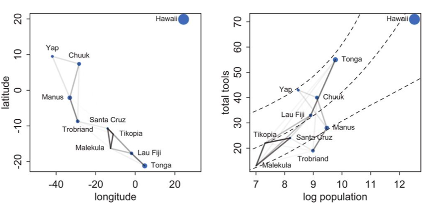



## Contents
{:.no_toc}
*  
{: toc}


```python
%matplotlib inline
import numpy as np
import scipy as sp
import matplotlib as mpl
import matplotlib.cm as cm
import matplotlib.pyplot as plt
import pandas as pd
pd.set_option('display.width', 500)
pd.set_option('display.max_columns', 100)
pd.set_option('display.notebook_repr_html', True)
import seaborn as sns
sns.set_style("whitegrid")
sns.set_context("poster")
import pymc3 as pm
```


## Reading in our data

We read back the Oceanic tools data


```python
df = pd.read_csv("data/Kline2.csv", sep=';')
df.head()
```


<div>
<style>
    .dataframe thead tr:only-child th {
        text-align: right;
    }

    .dataframe thead th {
        text-align: left;
    }

    .dataframe tbody tr th {
        vertical-align: top;
    }
</style>
<table border="1" class="dataframe">
  <thead>
    <tr style="text-align: right;">
      <th></th>
      <th>culture</th>
      <th>population</th>
      <th>contact</th>
      <th>total_tools</th>
      <th>mean_TU</th>
      <th>lat</th>
      <th>lon</th>
      <th>lon2</th>
      <th>logpop</th>
    </tr>
  </thead>
  <tbody>
    <tr>
      <th>0</th>
      <td>Malekula</td>
      <td>1100</td>
      <td>low</td>
      <td>13</td>
      <td>3.2</td>
      <td>-16.3</td>
      <td>167.5</td>
      <td>-12.5</td>
      <td>7.003065</td>
    </tr>
    <tr>
      <th>1</th>
      <td>Tikopia</td>
      <td>1500</td>
      <td>low</td>
      <td>22</td>
      <td>4.7</td>
      <td>-12.3</td>
      <td>168.8</td>
      <td>-11.2</td>
      <td>7.313220</td>
    </tr>
    <tr>
      <th>2</th>
      <td>Santa Cruz</td>
      <td>3600</td>
      <td>low</td>
      <td>24</td>
      <td>4.0</td>
      <td>-10.7</td>
      <td>166.0</td>
      <td>-14.0</td>
      <td>8.188689</td>
    </tr>
    <tr>
      <th>3</th>
      <td>Yap</td>
      <td>4791</td>
      <td>high</td>
      <td>43</td>
      <td>5.0</td>
      <td>9.5</td>
      <td>138.1</td>
      <td>-41.9</td>
      <td>8.474494</td>
    </tr>
    <tr>
      <th>4</th>
      <td>Lau Fiji</td>
      <td>7400</td>
      <td>high</td>
      <td>33</td>
      <td>5.0</td>
      <td>-17.7</td>
      <td>178.1</td>
      <td>-1.9</td>
      <td>8.909235</td>
    </tr>
  </tbody>
</table>
</div>


And center it


```python
df['logpop_c'] = df.logpop - df.logpop.mean()
```


```python
df.head()
```


<div>
<style>
    .dataframe thead tr:only-child th {
        text-align: right;
    }

    .dataframe thead th {
        text-align: left;
    }

    .dataframe tbody tr th {
        vertical-align: top;
    }
</style>
<table border="1" class="dataframe">
  <thead>
    <tr style="text-align: right;">
      <th></th>
      <th>culture</th>
      <th>population</th>
      <th>contact</th>
      <th>total_tools</th>
      <th>mean_TU</th>
      <th>lat</th>
      <th>lon</th>
      <th>lon2</th>
      <th>logpop</th>
      <th>logpop_c</th>
    </tr>
  </thead>
  <tbody>
    <tr>
      <th>0</th>
      <td>Malekula</td>
      <td>1100</td>
      <td>low</td>
      <td>13</td>
      <td>3.2</td>
      <td>-16.3</td>
      <td>167.5</td>
      <td>-12.5</td>
      <td>7.003065</td>
      <td>-1.973939</td>
    </tr>
    <tr>
      <th>1</th>
      <td>Tikopia</td>
      <td>1500</td>
      <td>low</td>
      <td>22</td>
      <td>4.7</td>
      <td>-12.3</td>
      <td>168.8</td>
      <td>-11.2</td>
      <td>7.313220</td>
      <td>-1.663784</td>
    </tr>
    <tr>
      <th>2</th>
      <td>Santa Cruz</td>
      <td>3600</td>
      <td>low</td>
      <td>24</td>
      <td>4.0</td>
      <td>-10.7</td>
      <td>166.0</td>
      <td>-14.0</td>
      <td>8.188689</td>
      <td>-0.788316</td>
    </tr>
    <tr>
      <th>3</th>
      <td>Yap</td>
      <td>4791</td>
      <td>high</td>
      <td>43</td>
      <td>5.0</td>
      <td>9.5</td>
      <td>138.1</td>
      <td>-41.9</td>
      <td>8.474494</td>
      <td>-0.502510</td>
    </tr>
    <tr>
      <th>4</th>
      <td>Lau Fiji</td>
      <td>7400</td>
      <td>high</td>
      <td>33</td>
      <td>5.0</td>
      <td>-17.7</td>
      <td>178.1</td>
      <td>-1.9</td>
      <td>8.909235</td>
      <td>-0.067769</td>
    </tr>
  </tbody>
</table>
</div>


And read in the distance matrix


```python
dfd = pd.read_csv("data/distmatrix.csv", header=None)
dij=dfd.values
dij
```


    array([[ 0.   ,  0.475,  0.631,  4.363,  1.234,  2.036,  3.178,  2.794,
             1.86 ,  5.678],
           [ 0.475,  0.   ,  0.315,  4.173,  1.236,  2.007,  2.877,  2.67 ,
             1.965,  5.283],
           [ 0.631,  0.315,  0.   ,  3.859,  1.55 ,  1.708,  2.588,  2.356,
             2.279,  5.401],
           [ 4.363,  4.173,  3.859,  0.   ,  5.391,  2.462,  1.555,  1.616,
             6.136,  7.178],
           [ 1.234,  1.236,  1.55 ,  5.391,  0.   ,  3.219,  4.027,  3.906,
             0.763,  4.884],
           [ 2.036,  2.007,  1.708,  2.462,  3.219,  0.   ,  1.801,  0.85 ,
             3.893,  6.653],
           [ 3.178,  2.877,  2.588,  1.555,  4.027,  1.801,  0.   ,  1.213,
             4.789,  5.787],
           [ 2.794,  2.67 ,  2.356,  1.616,  3.906,  0.85 ,  1.213,  0.   ,
             4.622,  6.722],
           [ 1.86 ,  1.965,  2.279,  6.136,  0.763,  3.893,  4.789,  4.622,
             0.   ,  5.037],
           [ 5.678,  5.283,  5.401,  7.178,  4.884,  6.653,  5.787,  6.722,
             5.037,  0.   ]])


## Implementing the simple tools:logpop model and varying intercepts models


```python
import theano.tensor as tt
```


```python
import theano.tensor as t
with pm.Model() as m2c_onlyp:
    betap = pm.Normal("betap", 0, 1)
    alpha = pm.Normal("alpha", 0, 10)
    loglam = alpha + betap*df.logpop_c
    y = pm.Poisson("ntools", mu=t.exp(loglam), observed=df.total_tools)
    trace2c_onlyp = pm.sample(6000, tune=1000)
```


    Auto-assigning NUTS sampler...
    Initializing NUTS using jitter+adapt_diag...
    Multiprocess sampling (2 chains in 2 jobs)
    NUTS: [alpha, betap]
    100%|██████████| 7000/7000 [00:05<00:00, 1374.78it/s]


```python
pm.summary(trace2c_onlyp)
```


<div>
<style>
    .dataframe thead tr:only-child th {
        text-align: right;
    }

    .dataframe thead th {
        text-align: left;
    }

    .dataframe tbody tr th {
        vertical-align: top;
    }
</style>
<table border="1" class="dataframe">
  <thead>
    <tr style="text-align: right;">
      <th></th>
      <th>mean</th>
      <th>sd</th>
      <th>mc_error</th>
      <th>hpd_2.5</th>
      <th>hpd_97.5</th>
      <th>n_eff</th>
      <th>Rhat</th>
    </tr>
  </thead>
  <tbody>
    <tr>
      <th>betap</th>
      <td>0.239422</td>
      <td>0.031505</td>
      <td>0.000286</td>
      <td>0.178178</td>
      <td>0.301947</td>
      <td>10383.0</td>
      <td>0.999918</td>
    </tr>
    <tr>
      <th>alpha</th>
      <td>3.478431</td>
      <td>0.057299</td>
      <td>0.000577</td>
      <td>3.366003</td>
      <td>3.587042</td>
      <td>10055.0</td>
      <td>0.999939</td>
    </tr>
  </tbody>
</table>
</div>


Notice that $\beta_P$ has a value around 0.24

We also implement the varying intercepts per society model from before


```python
with pm.Model() as m3c:
    betap = pm.Normal("betap", 0, 1)
    alpha = pm.Normal("alpha", 0, 10)
    sigmasoc = pm.HalfCauchy("sigmasoc", 1)
    alphasoc = pm.Normal("alphasoc", 0, sigmasoc, shape=df.shape[0])
    loglam = alpha + alphasoc + betap*df.logpop_c 
    y = pm.Poisson("ntools", mu=t.exp(loglam), observed=df.total_tools)
with m3c:
    trace3 = pm.sample(6000, tune=1000, nuts_kwargs=dict(target_accept=.95))
```


    Auto-assigning NUTS sampler...
    Initializing NUTS using jitter+adapt_diag...
    Multiprocess sampling (2 chains in 2 jobs)
    NUTS: [alphasoc, sigmasoc_log__, alpha, betap]
    100%|██████████| 7000/7000 [00:28<00:00, 247.87it/s]
    The number of effective samples is smaller than 25% for some parameters.


```python
pm.summary(trace3)
```


<div>
<style>
    .dataframe thead tr:only-child th {
        text-align: right;
    }

    .dataframe thead th {
        text-align: left;
    }

    .dataframe tbody tr th {
        vertical-align: top;
    }
</style>
<table border="1" class="dataframe">
  <thead>
    <tr style="text-align: right;">
      <th></th>
      <th>mean</th>
      <th>sd</th>
      <th>mc_error</th>
      <th>hpd_2.5</th>
      <th>hpd_97.5</th>
      <th>n_eff</th>
      <th>Rhat</th>
    </tr>
  </thead>
  <tbody>
    <tr>
      <th>betap</th>
      <td>0.258089</td>
      <td>0.082296</td>
      <td>0.001338</td>
      <td>0.096656</td>
      <td>0.424239</td>
      <td>4166.0</td>
      <td>0.999973</td>
    </tr>
    <tr>
      <th>alpha</th>
      <td>3.446465</td>
      <td>0.120746</td>
      <td>0.002027</td>
      <td>3.199103</td>
      <td>3.687472</td>
      <td>3653.0</td>
      <td>0.999921</td>
    </tr>
    <tr>
      <th>alphasoc__0</th>
      <td>-0.209619</td>
      <td>0.247940</td>
      <td>0.003688</td>
      <td>-0.718741</td>
      <td>0.259506</td>
      <td>4968.0</td>
      <td>1.000043</td>
    </tr>
    <tr>
      <th>alphasoc__1</th>
      <td>0.038430</td>
      <td>0.219664</td>
      <td>0.002941</td>
      <td>-0.404914</td>
      <td>0.487200</td>
      <td>5961.0</td>
      <td>0.999917</td>
    </tr>
    <tr>
      <th>alphasoc__2</th>
      <td>-0.050901</td>
      <td>0.195434</td>
      <td>0.002468</td>
      <td>-0.447657</td>
      <td>0.339753</td>
      <td>5818.0</td>
      <td>0.999921</td>
    </tr>
    <tr>
      <th>alphasoc__3</th>
      <td>0.324157</td>
      <td>0.189557</td>
      <td>0.002763</td>
      <td>-0.031798</td>
      <td>0.699002</td>
      <td>4321.0</td>
      <td>0.999929</td>
    </tr>
    <tr>
      <th>alphasoc__4</th>
      <td>0.039406</td>
      <td>0.175986</td>
      <td>0.002227</td>
      <td>-0.301135</td>
      <td>0.401451</td>
      <td>6167.0</td>
      <td>1.000062</td>
    </tr>
    <tr>
      <th>alphasoc__5</th>
      <td>-0.320429</td>
      <td>0.208348</td>
      <td>0.003087</td>
      <td>-0.733230</td>
      <td>0.055638</td>
      <td>4967.0</td>
      <td>0.999927</td>
    </tr>
    <tr>
      <th>alphasoc__6</th>
      <td>0.144230</td>
      <td>0.172236</td>
      <td>0.002496</td>
      <td>-0.168542</td>
      <td>0.513625</td>
      <td>5458.0</td>
      <td>0.999972</td>
    </tr>
    <tr>
      <th>alphasoc__7</th>
      <td>-0.174227</td>
      <td>0.184070</td>
      <td>0.002252</td>
      <td>-0.568739</td>
      <td>0.162993</td>
      <td>6696.0</td>
      <td>0.999919</td>
    </tr>
    <tr>
      <th>alphasoc__8</th>
      <td>0.273610</td>
      <td>0.174185</td>
      <td>0.002854</td>
      <td>-0.050347</td>
      <td>0.627762</td>
      <td>4248.0</td>
      <td>1.000032</td>
    </tr>
    <tr>
      <th>alphasoc__9</th>
      <td>-0.088533</td>
      <td>0.291865</td>
      <td>0.004870</td>
      <td>-0.679972</td>
      <td>0.487844</td>
      <td>4385.0</td>
      <td>0.999929</td>
    </tr>
    <tr>
      <th>sigmasoc</th>
      <td>0.312019</td>
      <td>0.129527</td>
      <td>0.002224</td>
      <td>0.098244</td>
      <td>0.588338</td>
      <td>2907.0</td>
      <td>0.999981</td>
    </tr>
  </tbody>
</table>
</div>


## A model with a custom covariance matrix

The assumption here now is that the intercepts for these various societies are correlated...

We use a custom covariance matrix which inverse-square weights distance


You have seen this before! This is an example of a Gaussian Process Covariance Matrix. 

Here is the complete model:


```python
with pm.Model() as mgc:
    betap = pm.Normal("betap", 0, 1)
    alpha = pm.Normal("alpha", 0, 10)
    etasq = pm.HalfCauchy("etasq", 1)
    rhosq = pm.HalfCauchy("rhosq", 1)
    means=tt.stack([0.0]*10)
    sigma_matrix = tt.nlinalg.diag([0.01]*10)
    cov=tt.exp(-rhosq*dij*dij)*etasq + sigma_matrix
    gammasoc = pm.MvNormal("gammasoc", means, cov=cov, shape=df.shape[0])
    loglam = alpha + gammasoc + betap*df.logpop_c 
    y = pm.Poisson("ntools", mu=t.exp(loglam), observed=df.total_tools)
```


```python
with mgc:
    mgctrace = pm.sample(10000, tune=2000, nuts_kwargs=dict(target_accept=.95))
```


    Auto-assigning NUTS sampler...
    Initializing NUTS using jitter+adapt_diag...
    Multiprocess sampling (2 chains in 2 jobs)
    NUTS: [gammasoc, rhosq_log__, etasq_log__, alpha, betap]
    100%|██████████| 12000/12000 [05:11<00:00, 38.58it/s]
    The acceptance probability does not match the target. It is 0.895944134094, but should be close to 0.8. Try to increase the number of tuning steps.
    The number of effective samples is smaller than 25% for some parameters.


```python
pm.summary(mgctrace)
```


<div>
<style>
    .dataframe thead tr:only-child th {
        text-align: right;
    }

    .dataframe thead th {
        text-align: left;
    }

    .dataframe tbody tr th {
        vertical-align: top;
    }
</style>
<table border="1" class="dataframe">
  <thead>
    <tr style="text-align: right;">
      <th></th>
      <th>mean</th>
      <th>sd</th>
      <th>mc_error</th>
      <th>hpd_2.5</th>
      <th>hpd_97.5</th>
      <th>n_eff</th>
      <th>Rhat</th>
    </tr>
  </thead>
  <tbody>
    <tr>
      <th>betap</th>
      <td>0.247414</td>
      <td>0.116188</td>
      <td>0.001554</td>
      <td>0.005191</td>
      <td>0.474834</td>
      <td>5471.0</td>
      <td>1.000157</td>
    </tr>
    <tr>
      <th>alpha</th>
      <td>3.512649</td>
      <td>0.357406</td>
      <td>0.007140</td>
      <td>2.790415</td>
      <td>4.239959</td>
      <td>2111.0</td>
      <td>1.001964</td>
    </tr>
    <tr>
      <th>gammasoc__0</th>
      <td>-0.269862</td>
      <td>0.455632</td>
      <td>0.008620</td>
      <td>-1.239333</td>
      <td>0.607492</td>
      <td>2569.0</td>
      <td>1.001484</td>
    </tr>
    <tr>
      <th>gammasoc__1</th>
      <td>-0.117755</td>
      <td>0.445192</td>
      <td>0.008520</td>
      <td>-1.041095</td>
      <td>0.757448</td>
      <td>2439.0</td>
      <td>1.001758</td>
    </tr>
    <tr>
      <th>gammasoc__2</th>
      <td>-0.165474</td>
      <td>0.430544</td>
      <td>0.008116</td>
      <td>-1.042846</td>
      <td>0.686170</td>
      <td>2406.0</td>
      <td>1.001881</td>
    </tr>
    <tr>
      <th>gammasoc__3</th>
      <td>0.299581</td>
      <td>0.387140</td>
      <td>0.007481</td>
      <td>-0.481745</td>
      <td>1.079855</td>
      <td>2365.0</td>
      <td>1.001936</td>
    </tr>
    <tr>
      <th>gammasoc__4</th>
      <td>0.026350</td>
      <td>0.382587</td>
      <td>0.007425</td>
      <td>-0.763338</td>
      <td>0.770842</td>
      <td>2292.0</td>
      <td>1.001728</td>
    </tr>
    <tr>
      <th>gammasoc__5</th>
      <td>-0.458827</td>
      <td>0.389807</td>
      <td>0.006976</td>
      <td>-1.286453</td>
      <td>0.231992</td>
      <td>2481.0</td>
      <td>1.001517</td>
    </tr>
    <tr>
      <th>gammasoc__6</th>
      <td>0.097538</td>
      <td>0.377499</td>
      <td>0.007064</td>
      <td>-0.653992</td>
      <td>0.840048</td>
      <td>2382.0</td>
      <td>1.001464</td>
    </tr>
    <tr>
      <th>gammasoc__7</th>
      <td>-0.263660</td>
      <td>0.378417</td>
      <td>0.006917</td>
      <td>-1.077743</td>
      <td>0.404521</td>
      <td>2407.0</td>
      <td>1.001890</td>
    </tr>
    <tr>
      <th>gammasoc__8</th>
      <td>0.233544</td>
      <td>0.361616</td>
      <td>0.006715</td>
      <td>-0.510818</td>
      <td>0.909164</td>
      <td>2407.0</td>
      <td>1.001721</td>
    </tr>
    <tr>
      <th>gammasoc__9</th>
      <td>-0.123068</td>
      <td>0.473731</td>
      <td>0.006671</td>
      <td>-1.034810</td>
      <td>0.850175</td>
      <td>3985.0</td>
      <td>1.000439</td>
    </tr>
    <tr>
      <th>etasq</th>
      <td>0.354953</td>
      <td>0.660893</td>
      <td>0.009717</td>
      <td>0.001437</td>
      <td>1.114851</td>
      <td>4904.0</td>
      <td>1.000206</td>
    </tr>
    <tr>
      <th>rhosq</th>
      <td>2.306880</td>
      <td>30.113269</td>
      <td>0.343453</td>
      <td>0.000437</td>
      <td>4.550517</td>
      <td>8112.0</td>
      <td>0.999955</td>
    </tr>
  </tbody>
</table>
</div>


```python
pm.traceplot(mgctrace);
```


```python
pm.autocorrplot(mgctrace);
```


```python
d={}
for i, v in enumerate(df.culture.values):
    d[v] = mgctrace['gammasoc'][:,i]
dfsamps=pd.DataFrame.from_dict(d)
dfsamps.head()
```


<div>
<style>
    .dataframe thead tr:only-child th {
        text-align: right;
    }

    .dataframe thead th {
        text-align: left;
    }

    .dataframe tbody tr th {
        vertical-align: top;
    }
</style>
<table border="1" class="dataframe">
  <thead>
    <tr style="text-align: right;">
      <th></th>
      <th>Chuuk</th>
      <th>Hawaii</th>
      <th>Lau Fiji</th>
      <th>Malekula</th>
      <th>Manus</th>
      <th>Santa Cruz</th>
      <th>Tikopia</th>
      <th>Tonga</th>
      <th>Trobriand</th>
      <th>Yap</th>
    </tr>
  </thead>
  <tbody>
    <tr>
      <th>0</th>
      <td>0.282612</td>
      <td>0.059503</td>
      <td>0.145726</td>
      <td>-0.024485</td>
      <td>-0.283392</td>
      <td>-0.064665</td>
      <td>0.211578</td>
      <td>0.421679</td>
      <td>-0.337896</td>
      <td>0.552060</td>
    </tr>
    <tr>
      <th>1</th>
      <td>0.138628</td>
      <td>-0.023895</td>
      <td>0.202573</td>
      <td>0.083340</td>
      <td>-0.147399</td>
      <td>0.037469</td>
      <td>0.259075</td>
      <td>0.432713</td>
      <td>-0.513998</td>
      <td>0.579821</td>
    </tr>
    <tr>
      <th>2</th>
      <td>0.257026</td>
      <td>0.065751</td>
      <td>0.263479</td>
      <td>-0.175381</td>
      <td>-0.196812</td>
      <td>-0.139182</td>
      <td>-0.060890</td>
      <td>0.358894</td>
      <td>-0.478396</td>
      <td>0.349795</td>
    </tr>
    <tr>
      <th>3</th>
      <td>0.138580</td>
      <td>-0.494443</td>
      <td>0.124155</td>
      <td>0.065190</td>
      <td>-0.183672</td>
      <td>0.130431</td>
      <td>0.207621</td>
      <td>0.186890</td>
      <td>-0.280590</td>
      <td>0.541165</td>
    </tr>
    <tr>
      <th>4</th>
      <td>0.034011</td>
      <td>0.036418</td>
      <td>0.224733</td>
      <td>-0.600040</td>
      <td>-0.405896</td>
      <td>-0.531054</td>
      <td>-0.348027</td>
      <td>0.026920</td>
      <td>-0.589172</td>
      <td>0.220345</td>
    </tr>
  </tbody>
</table>
</div>


```python
dfsamps.describe()
```


<div>
<style>
    .dataframe thead tr:only-child th {
        text-align: right;
    }

    .dataframe thead th {
        text-align: left;
    }

    .dataframe tbody tr th {
        vertical-align: top;
    }
</style>
<table border="1" class="dataframe">
  <thead>
    <tr style="text-align: right;">
      <th></th>
      <th>Chuuk</th>
      <th>Hawaii</th>
      <th>Lau Fiji</th>
      <th>Malekula</th>
      <th>Manus</th>
      <th>Santa Cruz</th>
      <th>Tikopia</th>
      <th>Tonga</th>
      <th>Trobriand</th>
      <th>Yap</th>
    </tr>
  </thead>
  <tbody>
    <tr>
      <th>count</th>
      <td>20000.000000</td>
      <td>20000.000000</td>
      <td>20000.000000</td>
      <td>20000.000000</td>
      <td>20000.000000</td>
      <td>20000.000000</td>
      <td>20000.000000</td>
      <td>20000.000000</td>
      <td>20000.000000</td>
      <td>20000.000000</td>
    </tr>
    <tr>
      <th>mean</th>
      <td>0.097538</td>
      <td>-0.123068</td>
      <td>0.026350</td>
      <td>-0.269862</td>
      <td>-0.263660</td>
      <td>-0.165474</td>
      <td>-0.117755</td>
      <td>0.233544</td>
      <td>-0.458827</td>
      <td>0.299581</td>
    </tr>
    <tr>
      <th>std</th>
      <td>0.377509</td>
      <td>0.473743</td>
      <td>0.382597</td>
      <td>0.455644</td>
      <td>0.378426</td>
      <td>0.430555</td>
      <td>0.445203</td>
      <td>0.361625</td>
      <td>0.389816</td>
      <td>0.387149</td>
    </tr>
    <tr>
      <th>min</th>
      <td>-3.359014</td>
      <td>-3.773198</td>
      <td>-3.389680</td>
      <td>-3.856332</td>
      <td>-3.592680</td>
      <td>-3.704032</td>
      <td>-3.634145</td>
      <td>-3.229867</td>
      <td>-3.808333</td>
      <td>-3.046678</td>
    </tr>
    <tr>
      <th>25%</th>
      <td>-0.080201</td>
      <td>-0.369415</td>
      <td>-0.156227</td>
      <td>-0.507103</td>
      <td>-0.444126</td>
      <td>-0.377180</td>
      <td>-0.344367</td>
      <td>0.064836</td>
      <td>-0.650613</td>
      <td>0.107982</td>
    </tr>
    <tr>
      <th>50%</th>
      <td>0.108659</td>
      <td>-0.112151</td>
      <td>0.039389</td>
      <td>-0.242684</td>
      <td>-0.244814</td>
      <td>-0.140033</td>
      <td>-0.098324</td>
      <td>0.241970</td>
      <td>-0.429267</td>
      <td>0.304480</td>
    </tr>
    <tr>
      <th>75%</th>
      <td>0.287604</td>
      <td>0.132445</td>
      <td>0.220311</td>
      <td>-0.015149</td>
      <td>-0.057941</td>
      <td>0.070862</td>
      <td>0.129670</td>
      <td>0.415369</td>
      <td>-0.233960</td>
      <td>0.500363</td>
    </tr>
    <tr>
      <th>max</th>
      <td>2.908532</td>
      <td>3.523802</td>
      <td>2.684128</td>
      <td>2.373157</td>
      <td>2.501715</td>
      <td>2.561251</td>
      <td>2.619592</td>
      <td>3.046274</td>
      <td>2.093728</td>
      <td>3.017744</td>
    </tr>
  </tbody>
</table>
</div>


## Plotting posteriors and predictives

Lets plot the covariance posteriors for the 100 random samples in the trace.


```python
smalleta=np.random.choice(mgctrace['etasq'], replace=False, size=100)
smallrho=np.random.choice(mgctrace['rhosq'], replace=False, size=100)
```


```python
with sns.plotting_context('poster'):
    d=np.linspace(0,10,100)
    for i in range(100):
        covarod = lambda d: smalleta[i]*np.exp(-smallrho[i]*d*d)
        plt.plot(d, covarod(d),alpha=0.1, color='k')
    medetasq=np.median(mgctrace['etasq'])
    medrhosq=np.median(mgctrace['rhosq'])
    covarodmed = lambda d: medetasq*np.exp(-medrhosq*d*d)
    plt.plot(d, covarodmed(d),alpha=1.0, color='k', lw=3)
    plt.ylim([0,1]); 
```


The x-axis is thousands of kilometers. Notice how almost everything damps out by 4000 kms. Lets calculate the median correlation matrix:


```python
medkij = np.diag([0.01]*10)+medetasq*(np.exp(-medrhosq*dij*dij))
```


```python
#from statsmodels
def cov2corr(cov, return_std=False):
    '''convert covariance matrix to correlation matrix

    Parameters
    ----------
    cov : array_like, 2d
        covariance matrix, see Notes

    Returns
    -------
    corr : ndarray (subclass)
        correlation matrix
    return_std : bool
        If this is true then the standard deviation is also returned.
        By default only the correlation matrix is returned.

    Notes
    -----
    This function does not convert subclasses of ndarrays. This requires
    that division is defined elementwise. np.ma.array and np.matrix are allowed.

    '''
    cov = np.asanyarray(cov)
    std_ = np.sqrt(np.diag(cov))
    corr = cov / np.outer(std_, std_)
    if return_std:
        return corr, std_
    else:
        return corr
```


```python
medcorrij=cov2corr(medkij)
medcorrij
```


    array([[  1.00000000e+00,   8.71785980e-01,   8.14096714e-01,
              4.99776683e-04,   5.21038310e-01,   1.84041573e-01,
              1.73288749e-02,   4.30502586e-02,   2.41593313e-01,
              2.65025654e-06],
           [  8.71785980e-01,   1.00000000e+00,   9.16627626e-01,
              9.51206322e-04,   5.20017938e-01,   1.92806478e-01,
              3.57157022e-02,   5.63298362e-02,   2.06001853e-01,
              1.47715424e-05],
           [  8.14096714e-01,   9.16627626e-01,   1.00000000e+00,
              2.58767794e-03,   3.67501866e-01,   2.99604292e-01,
              6.68407750e-02,   1.05368392e-01,   1.21399142e-01,
              8.95698536e-06],
           [  4.99776683e-04,   9.51206322e-04,   2.58767794e-03,
              1.00000000e+00,   9.34889296e-06,   8.60394889e-02,
              3.65244813e-01,   3.38258916e-01,   3.09612981e-07,
              1.25890327e-09],
           [  5.21038310e-01,   5.20017938e-01,   3.67501866e-01,
              9.34889296e-06,   1.00000000e+00,   1.56160443e-02,
              1.52965471e-03,   2.23880332e-03,   7.56772084e-01,
              7.38793465e-05],
           [  1.84041573e-01,   1.92806478e-01,   2.99604292e-01,
              8.60394889e-02,   1.56160443e-02,   1.00000000e+00,
              2.63213982e-01,   7.15782789e-01,   2.33071089e-03,
              2.24573987e-08],
           [  1.73288749e-02,   3.57157022e-02,   6.68407750e-02,
              3.65244813e-01,   1.52965471e-03,   2.63213982e-01,
              1.00000000e+00,   5.31771921e-01,   1.06386644e-04,
              1.61407707e-06],
           [  4.30502586e-02,   5.63298362e-02,   1.05368392e-01,
              3.38258916e-01,   2.23880332e-03,   7.15782789e-01,
              5.31771921e-01,   1.00000000e+00,   1.98487950e-04,
              1.55709958e-08],
           [  2.41593313e-01,   2.06001853e-01,   1.21399142e-01,
              3.09612981e-07,   7.56772084e-01,   2.33071089e-03,
              1.06386644e-04,   1.98487950e-04,   1.00000000e+00,
              4.04514877e-05],
           [  2.65025654e-06,   1.47715424e-05,   8.95698536e-06,
              1.25890327e-09,   7.38793465e-05,   2.24573987e-08,
              1.61407707e-06,   1.55709958e-08,   4.04514877e-05,
              1.00000000e+00]])


We'll data frame it to see clearly


```python
dfcorr = pd.DataFrame(medcorrij*100).set_index(df.culture.values)
dfcorr.columns = df.culture.values
dfcorr
```


<div>
<style>
    .dataframe thead tr:only-child th {
        text-align: right;
    }

    .dataframe thead th {
        text-align: left;
    }

    .dataframe tbody tr th {
        vertical-align: top;
    }
</style>
<table border="1" class="dataframe">
  <thead>
    <tr style="text-align: right;">
      <th></th>
      <th>Malekula</th>
      <th>Tikopia</th>
      <th>Santa Cruz</th>
      <th>Yap</th>
      <th>Lau Fiji</th>
      <th>Trobriand</th>
      <th>Chuuk</th>
      <th>Manus</th>
      <th>Tonga</th>
      <th>Hawaii</th>
    </tr>
  </thead>
  <tbody>
    <tr>
      <th>Malekula</th>
      <td>100.000000</td>
      <td>87.178598</td>
      <td>81.409671</td>
      <td>4.997767e-02</td>
      <td>52.103831</td>
      <td>18.404157</td>
      <td>1.732887</td>
      <td>4.305026</td>
      <td>24.159331</td>
      <td>2.650257e-04</td>
    </tr>
    <tr>
      <th>Tikopia</th>
      <td>87.178598</td>
      <td>100.000000</td>
      <td>91.662763</td>
      <td>9.512063e-02</td>
      <td>52.001794</td>
      <td>19.280648</td>
      <td>3.571570</td>
      <td>5.632984</td>
      <td>20.600185</td>
      <td>1.477154e-03</td>
    </tr>
    <tr>
      <th>Santa Cruz</th>
      <td>81.409671</td>
      <td>91.662763</td>
      <td>100.000000</td>
      <td>2.587678e-01</td>
      <td>36.750187</td>
      <td>29.960429</td>
      <td>6.684077</td>
      <td>10.536839</td>
      <td>12.139914</td>
      <td>8.956985e-04</td>
    </tr>
    <tr>
      <th>Yap</th>
      <td>0.049978</td>
      <td>0.095121</td>
      <td>0.258768</td>
      <td>1.000000e+02</td>
      <td>0.000935</td>
      <td>8.603949</td>
      <td>36.524481</td>
      <td>33.825892</td>
      <td>0.000031</td>
      <td>1.258903e-07</td>
    </tr>
    <tr>
      <th>Lau Fiji</th>
      <td>52.103831</td>
      <td>52.001794</td>
      <td>36.750187</td>
      <td>9.348893e-04</td>
      <td>100.000000</td>
      <td>1.561604</td>
      <td>0.152965</td>
      <td>0.223880</td>
      <td>75.677208</td>
      <td>7.387935e-03</td>
    </tr>
    <tr>
      <th>Trobriand</th>
      <td>18.404157</td>
      <td>19.280648</td>
      <td>29.960429</td>
      <td>8.603949e+00</td>
      <td>1.561604</td>
      <td>100.000000</td>
      <td>26.321398</td>
      <td>71.578279</td>
      <td>0.233071</td>
      <td>2.245740e-06</td>
    </tr>
    <tr>
      <th>Chuuk</th>
      <td>1.732887</td>
      <td>3.571570</td>
      <td>6.684077</td>
      <td>3.652448e+01</td>
      <td>0.152965</td>
      <td>26.321398</td>
      <td>100.000000</td>
      <td>53.177192</td>
      <td>0.010639</td>
      <td>1.614077e-04</td>
    </tr>
    <tr>
      <th>Manus</th>
      <td>4.305026</td>
      <td>5.632984</td>
      <td>10.536839</td>
      <td>3.382589e+01</td>
      <td>0.223880</td>
      <td>71.578279</td>
      <td>53.177192</td>
      <td>100.000000</td>
      <td>0.019849</td>
      <td>1.557100e-06</td>
    </tr>
    <tr>
      <th>Tonga</th>
      <td>24.159331</td>
      <td>20.600185</td>
      <td>12.139914</td>
      <td>3.096130e-05</td>
      <td>75.677208</td>
      <td>0.233071</td>
      <td>0.010639</td>
      <td>0.019849</td>
      <td>100.000000</td>
      <td>4.045149e-03</td>
    </tr>
    <tr>
      <th>Hawaii</th>
      <td>0.000265</td>
      <td>0.001477</td>
      <td>0.000896</td>
      <td>1.258903e-07</td>
      <td>0.007388</td>
      <td>0.000002</td>
      <td>0.000161</td>
      <td>0.000002</td>
      <td>0.004045</td>
      <td>1.000000e+02</td>
    </tr>
  </tbody>
</table>
</div>


Notice how there is correlation in the upper left and with Manus and Trobriand. Mcelreath has a distance plot i reproduce below:



To produce a plot like the one on the right, we calculate the posterior predictives with the correlation free part of the model and then overlay the correlations


```python
from scipy.stats import poisson
def compute_pp_no_corr(lpgrid, trace, contact=0):
    alphatrace = trace['alpha']
    betaptrace = trace['betap']
    tl=len(trace)
    gl=lpgrid.shape[0]
    lam = np.empty((gl, 2*tl))
    lpgrid = lpgrid - lpgrid.mean()
    for i, v in enumerate(lpgrid):
        temp = alphatrace + betaptrace*lpgrid[i]
        lam[i,:] = poisson.rvs(np.exp(temp))
    return lam
```


```python
lpgrid = np.linspace(6,13,30)
pp = compute_pp_no_corr(lpgrid, mgctrace)
ppmed = np.median(pp, axis=1)
pphpd = pm.stats.hpd(pp.T)
```


```python
import itertools
corrs={}
for i, j in itertools.product(range(10), range(10)):
    if i <j:
        corrs[(i,j)]=medcorrij[i,j]
corrs
```


    {(0, 1): 0.87178598035086485,
     (0, 2): 0.81409671378956938,
     (0, 3): 0.00049977668270061984,
     (0, 4): 0.52103830967748688,
     (0, 5): 0.18404157314186861,
     (0, 6): 0.017328874910928813,
     (0, 7): 0.04305025856741021,
     (0, 8): 0.241593313072233,
     (0, 9): 2.6502565440185815e-06,
     (1, 2): 0.9166276258652174,
     (1, 3): 0.00095120632192379471,
     (1, 4): 0.5200179376567835,
     (1, 5): 0.19280647828541175,
     (1, 6): 0.035715702211517139,
     (1, 7): 0.05632983623575849,
     (1, 8): 0.20600185316804365,
     (1, 9): 1.4771542363619412e-05,
     (2, 3): 0.0025876779443579313,
     (2, 4): 0.36750186564264986,
     (2, 5): 0.29960429169647806,
     (2, 6): 0.066840774961541019,
     (2, 7): 0.10536839180821188,
     (2, 8): 0.12139914234488278,
     (2, 9): 8.9569853640368644e-06,
     (3, 4): 9.348892959453282e-06,
     (3, 5): 0.086039488876625755,
     (3, 6): 0.36524481329909764,
     (3, 7): 0.33825891559247928,
     (3, 8): 3.0961298086947269e-07,
     (3, 9): 1.2589032666550904e-09,
     (4, 5): 0.01561604425648749,
     (4, 6): 0.0015296547115497437,
     (4, 7): 0.0022388033209531861,
     (4, 8): 0.75677208354568837,
     (4, 9): 7.3879346458710708e-05,
     (5, 6): 0.26321398249820332,
     (5, 7): 0.71578278931845729,
     (5, 8): 0.0023307108876489215,
     (5, 9): 2.2457398672039314e-08,
     (6, 7): 0.53177192062078238,
     (6, 8): 0.00010638664384256532,
     (6, 9): 1.6140770654271327e-06,
     (7, 8): 0.00019848794950225336,
     (7, 9): 1.557099581470421e-08,
     (8, 9): 4.0451487726182869e-05}


```python
with sns.plotting_context('poster'):
    plt.plot(df.logpop, df.total_tools,'o', color="g")
    lpv = df.logpop.values
    ttv = df.total_tools.values
    for a,x,y in zip(df.culture.values, lpv, ttv):
        plt.annotate(a, xy=(x,y))
    for i in range(10):
        for j in range(10):
            if i < j:
                plt.plot([lpv[i],lpv[j]],[ttv[i], ttv[j]],'k', alpha=corrs[(i,j)]/1.)
    plt.plot(lpgrid, ppmed, color="g")
    plt.fill_between(lpgrid, pphpd[:,0], pphpd[:,1], color="g", alpha=0.2, lw=1)
    plt.ylim([10, 75])
    plt.xlim([6.5, 13])
```


Notice how distance probably pulls Fiji up from the median, and how Manus and Trobriand are below the median but highly correlated. A smaller effect can be seen with the triangle on the left. Of-course, causality is uncertain
