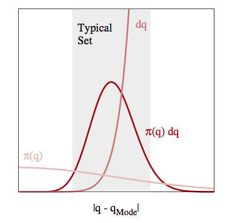
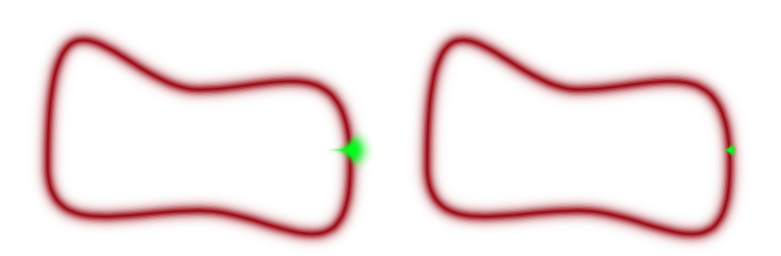
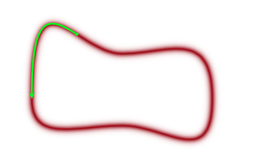
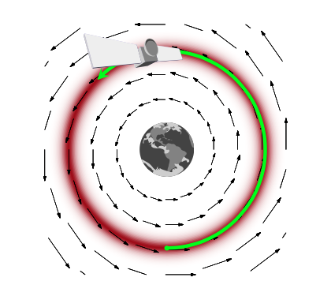
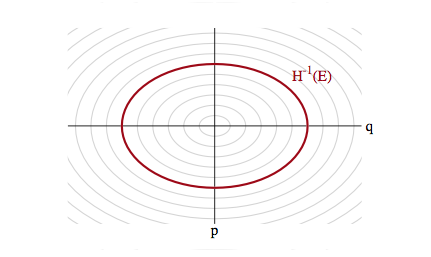
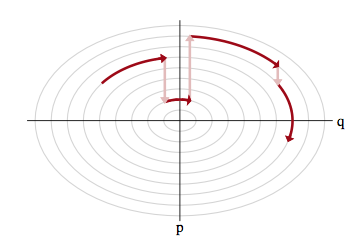

## Exploring the typical set

The neighborhoods around the maxima of probability distributions feature a lot of probability density, but, especially in a large number of dimensions, or in long tailed distributions, they do not feature much volume. In other words, the "sliver" size $dP$ tends to be small there.

The **typical set** refers to the portion of space where most of these slivers live. This is typically an interplay of density and volume, and thus is likely to be found as a more-concentrated space not containing the modes in higher dimensions. 

Thus if we design a sampler which efficiently traverses the typical set, we can tolerate poor sampling elsewhere and not incur large penalties in calculating our expectations. So far, we have used MCMC methods which stumble around like a drunk using proposal distributions. These proposals have issues: too large a step size and you propose to go outside the typical set (especially in large dimensions) and are rejected, too small and you spend a large time in a small part of the typical set, as illustrated below.

Furthermore, we have problems in pinches and areas of large curvature and separated modes as transitioning is hard and oscillatory behavior is more likely

## Gliding instead of stumbling

Given infinite resources, we will ultimately travel the whole typical set and more of the density. But we dont have these, especially in larger dimensions, and thus we would do better if we found a way to glide around the typical set, rather than making random walk transitions which would keep us on the typical set at times and off at other times.

In other words, we'd like to explore the typical-set surface smoothly. To do this we must first characterize the surface, something we can do via a gradient. To do this we must identify the equation of the typical set surface so that we can find the gradient which is perpendicular to the surface. And once we do that, we are not done, as the gradient points towards regions of higher density (modes) from the surface of the typical set.

To do this imagine a sliver $dP = p(q)dq$ thats in the typical set. If $dq$ (we are using $q$ instead of $x$) is small enough, then we can consider the typical set as a collection of foliates $\{q_i\}$ each of constant probability density  $p(q)=c_i$ where $c_i$ is a constant. Thus there are n such foliates, or "orbits", or level sets. Now we know that the gradient is perpendicular to such level-sets and we can use it to characterize these sets.

## Mechanics to the rescue

We can make our usual connection to the energy of a physical system by tentatively identifying the energy $E = - log(p(q))$. This is what we did to find distributions in Metropolis and the inverse $p(q) = e^{-E(q)/T}$ the minima of functions in simulated annealing. There we proposed a move using a proposal distribution, creating a random walk.

We dont want to do that here, preferring something that will move us smoothly along a level set. We use our newly acquired knowledge of data-augmentation and gibbs-sampling from an augmented distribution instead. The basic idea is to add a **momentum** variable $p$ for each $q$ in our probability density, creating a joint pdf $p(p,q)$. 

How would this work? And why momentum? Lets think about a rocket (or a satellite with thrusters it can fire) in orbit around the earth

If this rocket had no velocity, it would simply fall down to the earth because it would not be able to counterbalance earth's gravitational potential (the equivalent of the energy we formulated above and have used in simulated annealing). On the other hand, if it had too much velocity, it would escape earth's gravity and take off to mars or similar.

If we add just the right amount of momentum, it will exactly counterbalance the gravitational force, and the satellite will continue to move in its orbit. And this is an orbit of minimum energy (and therefore constant energy, since a system at minumum energy wont lift from it unless kicked(perhaps stochastically) to do so). Thus the satellite will move exactly along a level-curve of the energy level, in a direction exactly perpendicular to the gradient.

Thus the key to moving a sampler along a probability level curve is to give the sampler momentum and thus kinetic energy via the augmented momemtum variable. In other words, we must carry out an augmentation with an additional momentum which leaves the energy **Hamiltonian**

$$H(p, q) = \frac{p^2}{2m} +  V(q) = E_i,$$

with $E_i$ constants (constant energies) for each level-set foliate and where the **potential energy** $V(q) = -log(p(q))$ replaces the energy term we had earlier in simulated annealing. The first term above is called the kinetic energy $K(p,q)$ and has a mass parameter $m(q)$, as you might be familiar with from introductory physics (where $m$ is a constant. One can consider generalizations of the kinetic energy term, but with a quadratic in $p$ and if $V(q) = \frac{1}{2}q^2$ our distribution is gaussian and the level sets are ellipses of constant energy, as illustrated below.

Our distribution over $p$ and $q$ is now:

$$p(p,q) = e^{-H(p,q)} = e^{-K(p, q)}e^{-V(q)} = p(p \vert q)p(q)$$

and thus:

$$H(p,q) = -log(p(p,q)) = -log p(p \vert q) - log p(q)$$

The choice of a kinetic energy term then is the choice of a conditional probability distribution over the "augmented" momentum which ensures that

$$\int dp p(p, q) = \int dp p(p \vert q) p(q) = p(q) \int p(p \vert q) dp = p(q).$$

The game now is to sample from this two-N-dimensional distribution and marginalize over the momenta to get the distribution from the $q$. To carry out this sampling, we'll use the physics equations of motion in the **Hamiltonian Formalism** (thus leading to the name Hamiltonian Monte Carlo) to "glide" over a level set. 

But this then leaves us with the problem of having to go from one level-set to another: after all, we wish to explore the entire typical set. The solution to this is simple..after exploring a given level set for a while, we resample the momentum, and off to another level-set we go, as illustrated below:

This is like a rocket firing its thrusters.

There remains the issue of ensuring reversibility, and showing that we have an appropriate MCMC transition. This requires delving into the deeper mechanical and statistical-mechanics of the process, and we shall come to that soon. We also need to understand how much time we should spend exploring a level set vs momentum resampling…these are all practicalities we will tackle soon!
