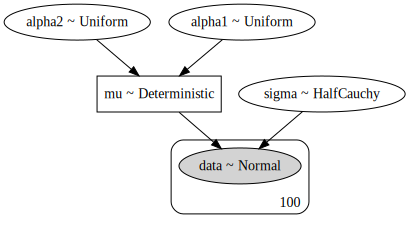
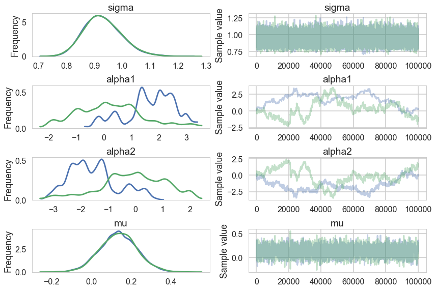
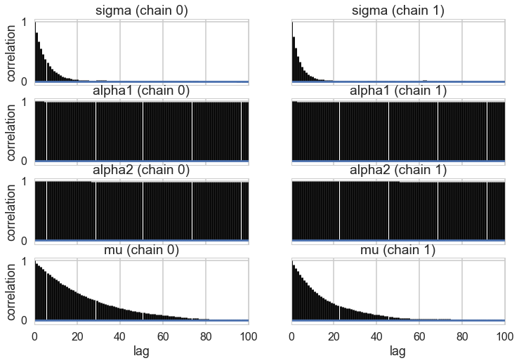
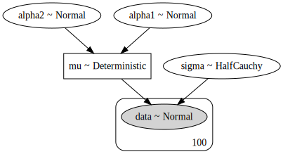
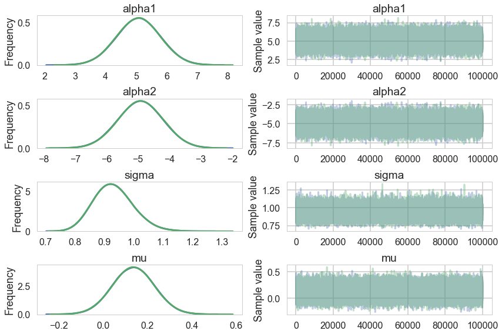



## Contents
{:.no_toc}
*  
{: toc}


```python
%matplotlib inline
import numpy as np
import scipy as sp
import matplotlib as mpl
import matplotlib.cm as cm
import matplotlib.pyplot as plt
import pandas as pd
pd.set_option('display.width', 500)
pd.set_option('display.max_columns', 100)
pd.set_option('display.notebook_repr_html', True)
import seaborn as sns
sns.set_style("whitegrid")
sns.set_context("poster")
```


We generate some test data from $N(0,1)$:


```python
from scipy.stats import norm
data = norm.rvs(size=100)
data
```


    array([  1.36915564e+00,   1.05529290e+00,  -4.60818168e-01,
             4.43641268e-01,   1.04113884e+00,   5.37649494e-01,
             7.60942560e-01,  -1.19804968e+00,   2.60566303e-01,
            -1.59689277e-01,   1.20547931e+00,   5.49728756e-01,
            -3.98610594e-01,   1.17620621e+00,  -1.02786937e-01,
             5.69037802e-01,  -6.01246985e-01,  -1.13331329e+00,
             8.54294530e-01,  -3.08324755e-01,   1.70618430e-01,
             4.51807215e-01,  -9.09119383e-02,  -1.78929328e-01,
             5.08269848e-01,  -1.24816874e+00,   4.75595913e-01,
             1.54785631e+00,  -4.71245561e-01,   1.62311337e+00,
            -3.41351283e-01,  -1.80469802e-01,   2.11632172e+00,
             8.41353133e-01,  -7.59104066e-01,  -1.55689174e+00,
            -2.41292745e-01,   2.24845053e-01,   3.91140426e-01,
            -6.85331082e-01,   5.79668372e-01,   8.36376400e-01,
            -2.54014208e-01,   1.75048511e+00,  -3.77872885e-01,
            -1.25172135e+00,  -2.17600397e-01,   3.15190627e-01,
             3.09352205e-01,   5.82187822e-03,   8.46971134e-01,
            -1.27378792e+00,  -1.58238529e+00,   3.79882049e-01,
             4.05398087e-01,  -5.24250939e-01,   1.82095389e-01,
            -1.44264482e+00,  -8.30774322e-01,  -1.53947998e+00,
             3.71236071e-01,  -8.84748037e-01,   5.15176219e-01,
             2.75972541e-01,  -7.00062965e-01,   1.48180541e+00,
             2.61253233e-01,  -1.14039049e-01,   8.74695837e-01,
             2.92856746e+00,  -9.60566331e-01,   1.50764549e-01,
            -1.95244936e-03,   6.28764490e-01,   9.96449749e-01,
             6.79706207e-01,   1.79320769e-01,   5.80139066e-01,
            -5.35478677e-01,   1.42260090e+00,  -1.54703643e-01,
             3.67620982e-01,   6.78943636e-01,  -8.96368493e-01,
            -4.90099004e-01,  -7.11463855e-01,  -1.57853576e+00,
             2.33149688e+00,  -6.36936390e-01,   4.93011087e-01,
            -1.55102354e-01,   6.52594170e-01,   2.07283645e+00,
            -1.41202558e+00,  -7.99693611e-01,  -5.45509876e-01,
             1.20850780e+00,   7.32805993e-01,  -6.08890816e-01,
             4.91920477e-01])


We fit this data using the following model:

$$
y \sim N(\mu, \sigma)\\
\mu = \alpha_1 + \alpha_2\\
\alpha_1 \sim Unif(-\infty, \infty)\\
\alpha_2 \sim Unif(-\infty, \infty)\\
\sigma \sim HalfCauchy(0,1)
$$


```python
import pymc3 as pm
```


In our sampler, we have chosen `njobs=2` which allows us to run on multiple processes, generating two separate chains.


```python
with pm.Model() as ni:
    sigma = pm.HalfCauchy("sigma", beta=1)
    alpha1=pm.Uniform('alpha1', lower=-10**6, upper=10**6)
    alpha2=pm.Uniform('alpha2', lower=-10**6, upper=10**6)
    mu = pm.Deterministic("mu", alpha1 + alpha2)
    y = pm.Normal("data", mu=mu, sd=sigma, observed=data)
    stepper=pm.Metropolis()
    traceni = pm.sample(100000, step=stepper, njobs=2)
```


    Multiprocess sampling (2 chains in 2 jobs)
    CompoundStep
    >Metropolis: [alpha2]
    >Metropolis: [alpha1]
    >Metropolis: [sigma]
    Sampling 2 chains: 100%|██████████| 201000/201000 [01:09<00:00, 2875.45draws/s]
    The gelman-rubin statistic is larger than 1.2 for some parameters.
    The estimated number of effective samples is smaller than 200 for some parameters.


```python
pm.model_to_graphviz(ni)
```





```python
pm.summary(traceni)
```


<div>
<style scoped>
    .dataframe tbody tr th:only-of-type {
        vertical-align: middle;
    }

    .dataframe tbody tr th {
        vertical-align: top;
    }

    .dataframe thead th {
        text-align: right;
    }
</style>
<table border="1" class="dataframe">
  <thead>
    <tr style="text-align: right;">
      <th></th>
      <th>mean</th>
      <th>sd</th>
      <th>mc_error</th>
      <th>hpd_2.5</th>
      <th>hpd_97.5</th>
      <th>n_eff</th>
      <th>Rhat</th>
    </tr>
  </thead>
  <tbody>
    <tr>
      <th>sigma</th>
      <td>0.929859</td>
      <td>0.067029</td>
      <td>0.000488</td>
      <td>0.798521</td>
      <td>1.059213</td>
      <td>21927.306462</td>
      <td>1.000014</td>
    </tr>
    <tr>
      <th>alpha1</th>
      <td>0.965169</td>
      <td>1.275430</td>
      <td>0.125124</td>
      <td>-1.363886</td>
      <td>3.242092</td>
      <td>3.084729</td>
      <td>1.371864</td>
    </tr>
    <tr>
      <th>alpha2</th>
      <td>-0.829637</td>
      <td>1.276056</td>
      <td>0.125050</td>
      <td>-3.128876</td>
      <td>1.486237</td>
      <td>3.073467</td>
      <td>1.372306</td>
    </tr>
    <tr>
      <th>mu</th>
      <td>0.135532</td>
      <td>0.091854</td>
      <td>0.001345</td>
      <td>-0.037689</td>
      <td>0.322161</td>
      <td>4918.178358</td>
      <td>1.000050</td>
    </tr>
  </tbody>
</table>
</div>


```python
pm.traceplot(traceni);
```


    //anaconda/envs/py3l/lib/python3.6/site-packages/matplotlib/axes/_base.py:3449: MatplotlibDeprecationWarning: 
    The `ymin` argument was deprecated in Matplotlib 3.0 and will be removed in 3.2. Use `bottom` instead.
      alternative='`bottom`', obj_type='argument')





Look at our traces for $\alpha_1$ and $\alpha_2$. These are bad, and worse, they look entirely different for two chains. Despite this, $\mu$ looks totally fine. Our trac


```python
df=pm.trace_to_dataframe(traceni)
df.corr()
```


<div>
<style scoped>
    .dataframe tbody tr th:only-of-type {
        vertical-align: middle;
    }

    .dataframe tbody tr th {
        vertical-align: top;
    }

    .dataframe thead th {
        text-align: right;
    }
</style>
<table border="1" class="dataframe">
  <thead>
    <tr style="text-align: right;">
      <th></th>
      <th>sigma</th>
      <th>alpha1</th>
      <th>alpha2</th>
      <th>mu</th>
    </tr>
  </thead>
  <tbody>
    <tr>
      <th>sigma</th>
      <td>1.000000</td>
      <td>0.001891</td>
      <td>-0.002385</td>
      <td>-0.006882</td>
    </tr>
    <tr>
      <th>alpha1</th>
      <td>0.001891</td>
      <td>1.000000</td>
      <td>-0.997408</td>
      <td>0.029191</td>
    </tr>
    <tr>
      <th>alpha2</th>
      <td>-0.002385</td>
      <td>-0.997408</td>
      <td>1.000000</td>
      <td>0.042806</td>
    </tr>
    <tr>
      <th>mu</th>
      <td>-0.006882</td>
      <td>0.029191</td>
      <td>0.042806</td>
      <td>1.000000</td>
    </tr>
  </tbody>
</table>
</div>


Just like in our uncentered regression example, we have $\alpha_1$ and $\alpha_2$ sharing information: they are totally negatively correlated and unidentifiable. Indeed our intuition probably told us as much.


```python
pm.autocorrplot(traceni)
```


    array([[<matplotlib.axes._subplots.AxesSubplot object at 0x11c706198>,
            <matplotlib.axes._subplots.AxesSubplot object at 0x11cb94240>],
           [<matplotlib.axes._subplots.AxesSubplot object at 0x11cbe0390>,
            <matplotlib.axes._subplots.AxesSubplot object at 0x11cd9e470>],
           [<matplotlib.axes._subplots.AxesSubplot object at 0x11ce6f160>,
            <matplotlib.axes._subplots.AxesSubplot object at 0x11c69f4a8>],
           [<matplotlib.axes._subplots.AxesSubplot object at 0x11f4d8438>,
            <matplotlib.axes._subplots.AxesSubplot object at 0x11e706780>]], dtype=object)





A look at the effective number of samples using two chains tells us that we have only one effective sample for $\alpha_1$ and $\alpha_2$.


```python
pm.effective_n(traceni)
```


    {'alpha1': 3.0847290976843218,
     'alpha2': 3.0734670584705572,
     'mu': 4918.1783580295532,
     'sigma': 21927.306461639713}


The Gelman-Rubin statistic is awful for them. No convergence.


```python
pm.gelman_rubin(traceni)
```


    {'alpha1': 1.3718637421441382,
     'alpha2': 1.3723057686966671,
     'mu': 1.0000502933374407,
     'sigma': 1.0000144819583978}


Its going to be hard to break this unidentifiability. We try by forcing $\alpha_2$ to be negative in our prior


```python
with pm.Model() as ni2:
    sigma = pm.HalfCauchy("sigma", beta=1)
    alpha1=pm.Normal('alpha1', mu=5, sd=1)
    alpha2=pm.Normal('alpha2', mu=-5, sd=1)
    mu = pm.Deterministic("mu", alpha1 + alpha2)
    y = pm.Normal("data", mu=mu, sd=sigma, observed=data)
    #stepper=pm.Metropolis()
    #traceni2 = pm.sample(100000, step=stepper, njobs=2)
    traceni2 = pm.sample(100000)
```


    Auto-assigning NUTS sampler...
    Initializing NUTS using jitter+adapt_diag...
    Multiprocess sampling (2 chains in 2 jobs)
    NUTS: [alpha2, alpha1, sigma]
    Sampling 2 chains: 100%|██████████| 201000/201000 [08:29<00:00, 394.59draws/s]


```python
pm.model_to_graphviz(ni2)
```





Notice we are using the built in NUTS sampler. It takes longer but explores the distributions far better. This is directly related to our priors imposing regions. I could not even run the previous sampler in any reasonable time in NUTS.


```python
pm.traceplot(traceni2);
```


    //anaconda/envs/py3l/lib/python3.6/site-packages/matplotlib/axes/_base.py:3449: MatplotlibDeprecationWarning: 
    The `ymin` argument was deprecated in Matplotlib 3.0 and will be removed in 3.2. Use `bottom` instead.
      alternative='`bottom`', obj_type='argument')





Our extremely strong priors have helped us do a much better job.


```python
pm.summary(traceni2)
```


<div>
<style scoped>
    .dataframe tbody tr th:only-of-type {
        vertical-align: middle;
    }

    .dataframe tbody tr th {
        vertical-align: top;
    }

    .dataframe thead th {
        text-align: right;
    }
</style>
<table border="1" class="dataframe">
  <thead>
    <tr style="text-align: right;">
      <th></th>
      <th>mean</th>
      <th>sd</th>
      <th>mc_error</th>
      <th>hpd_2.5</th>
      <th>hpd_97.5</th>
      <th>n_eff</th>
      <th>Rhat</th>
    </tr>
  </thead>
  <tbody>
    <tr>
      <th>alpha1</th>
      <td>5.066310</td>
      <td>0.708625</td>
      <td>0.002569</td>
      <td>3.678977</td>
      <td>6.456753</td>
      <td>77586.667382</td>
      <td>1.000020</td>
    </tr>
    <tr>
      <th>alpha2</th>
      <td>-4.931296</td>
      <td>0.708567</td>
      <td>0.002562</td>
      <td>-6.333776</td>
      <td>-3.554861</td>
      <td>77570.663271</td>
      <td>1.000019</td>
    </tr>
    <tr>
      <th>sigma</th>
      <td>0.930199</td>
      <td>0.066613</td>
      <td>0.000198</td>
      <td>0.805719</td>
      <td>1.064302</td>
      <td>96892.104502</td>
      <td>0.999996</td>
    </tr>
    <tr>
      <th>mu</th>
      <td>0.135013</td>
      <td>0.093098</td>
      <td>0.000204</td>
      <td>-0.045187</td>
      <td>0.319260</td>
      <td>195950.078927</td>
      <td>0.999996</td>
    </tr>
  </tbody>
</table>
</div>


Our effective sample size is still poor and our traces still look dodgy, but things are better. 


```python
pm.effective_n(traceni2)
```


    {'alpha1': 77586.667381948821,
     'alpha2': 77570.663270675213,
     'mu': 195950.07892697665,
     'sigma': 96892.104501958092}


```python
pm.gelman_rubin(traceni2)
```


    {'alpha1': 1.0000203740430271,
     'alpha2': 1.000018798766553,
     'mu': 0.99999646960401545,
     'sigma': 0.99999594999714658}


..and this shows in our Gelman-Rubin statistics as well...


```python
pm.trace_to_dataframe(traceni2).corr()
```


<div>
<style scoped>
    .dataframe tbody tr th:only-of-type {
        vertical-align: middle;
    }

    .dataframe tbody tr th {
        vertical-align: top;
    }

    .dataframe thead th {
        text-align: right;
    }
</style>
<table border="1" class="dataframe">
  <thead>
    <tr style="text-align: right;">
      <th></th>
      <th>alpha1</th>
      <th>alpha2</th>
      <th>sigma</th>
      <th>mu</th>
    </tr>
  </thead>
  <tbody>
    <tr>
      <th>alpha1</th>
      <td>1.000000</td>
      <td>-0.991369</td>
      <td>-0.003822</td>
      <td>0.066316</td>
    </tr>
    <tr>
      <th>alpha2</th>
      <td>-0.991369</td>
      <td>1.000000</td>
      <td>0.003936</td>
      <td>0.065067</td>
    </tr>
    <tr>
      <th>sigma</th>
      <td>-0.003822</td>
      <td>0.003936</td>
      <td>1.000000</td>
      <td>0.000868</td>
    </tr>
    <tr>
      <th>mu</th>
      <td>0.066316</td>
      <td>0.065067</td>
      <td>0.000868</td>
      <td>1.000000</td>
    </tr>
  </tbody>
</table>
</div>


..but our unidentifiability is still high when we look at the correlation. This reflects the fundamental un-identifiability and sharing of information in our model since $\mu = \alpha_1 +\alpha_2$: all the priors do is artificially peg one of the parameters. And once one is pegged the other is too because of the symmetry.
