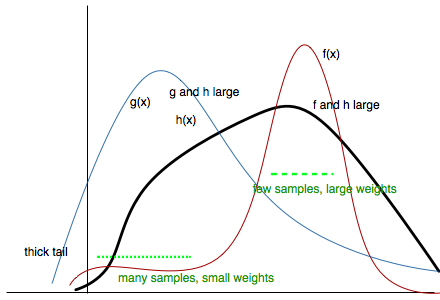
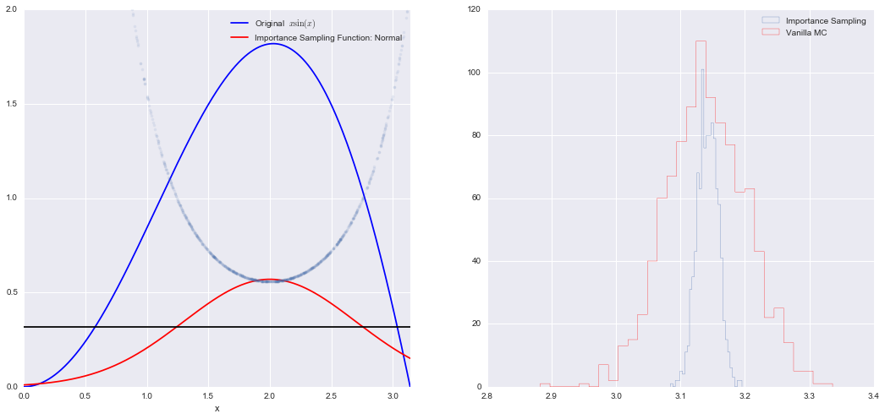



## Contents
{:.no_toc}
*  
{: toc}


## Contents
{:.no_toc}
* 
{: toc}

Importance sampling is directly a method to calculate integrals or expectations, which is one of our main goals at the end of things.

The basic idea behind importance sampling is that we want to draw more samples where $h(x)$, a function whose integral or expectation we desire, is large.  In the case we are doing an expectation, it would indeed be even better to draw more samples where $h(x)f(x)$ is large, where $f(x)$ is the pdf we are calculating the integral with respect to.

Why is this important? Often, in the computation of an expectation or other integral, the integrand has a very small value on a dominant fraction of the whole integration volume.
If the points are chosen evenly in the integration volume, the small minority of the points close to the 'peak' give the dominant contribution to the integral.

For example lets look at the expectation

$$ E_f[h] = \int_V f(x) h(x) dx. $$

Choose a distribution $g(x)$, which is close to the function $f(x)$, but which is simple
enough so that it is possible to generate random $x$-values from this distribution.
The integral can now be re-written as:

$$ E_f[h] = \int h(x) g(x) \frac{f(x)}{g(x)} dx $$

Therefore if we choose random numbers $x_i$ from distribution $g(x)$, we obtain

$$ E_f[h] = \lim_{N\rightarrow \infty} \frac{1}{N} \sum_{x_{i}\sim g(.)} h(x_i)\frac{f(x_i)}{g(x_i)} $$

Usually you might have written:

$$E_f[h] = \lim_{N\rightarrow \infty} \frac{1}{N} \sum_{x_{i}\sim f(.)} h(x_i) $$

but now we have a reweighting with $w(x_i) =  \frac{f(x_i)}{g(x_i)}$ and the samples are drawn from $g(x)$:

$$ E_f[h] = \lim_{N\rightarrow \infty} \frac{1}{N} \sum_{x_{i}\sim g(.)} w(x_i) h(x_i) $$

Unlike rejection sampling we have used all samples!

Now remember that the variance of our montecarlo estimate is given to us by

$$\hat{V} = \frac{V_f[h(x)]}{N}$$

where $N$ is the sample size. 

With importance sampling this formula has now changed to

$$\hat{V} = \frac{V_g[w(x)h(x)]}{N}$$

Our game here now is to try and minimize  $V_g[w(x)h(x)]$.

As a somewhat absurd notion, this variance would be sent to zero, if:

$$w(x)h(x) = C \implies f(x) h(x) = C g(x),$$

which leads to (since g(x) is a density we must normalize)

$$g(x) = \frac{f(x)h(x)}{\int f(x) h(x) dx} = \frac{f(x)h(x)}{E_f[h(x)]}$$

The expectation was what we were trying to estimate in the first place so our tautological absurdity seems to grow..

But, ignoring the denominator, this formula tells us that to achieve low variance, we must have **$g(x)$ large where the product  $f(x)h(x)$ is large**.  After all,  maximizing the latter in some fashion was our original intuition. 

Or to put it another way, $\frac{g(x)}{f(x)}$ ought to be large where $h(x)$ is large. This means that, as we said earlier, choose more samples near the peak.

So now we have the ingredients of our method. We have a $f$ that we might or might not know. We have a pdf $g$ which we choose to be higher than $f$ at the points where $h$ has peaks. Now what we are left to do is to sample from $g$, and this will give us an oversampling at the place $h$ has peaks, and thus we must correct this there by multiplying by weights $w  = \frac{f}{g} \lt 1$ in thse places.

Be careful to choose $g(x)$ appropriately, it should have thicker tails than f, or the ratio $f/g$ will be too big and count contribute too much in the tails.

All of these considerations may be seen in the diagram below:



Another way of seeing this whole thing is that we will draw the sample from a proposal
distribution and re-weight the integral appropriately so that the expectation with respect to the correct distribution is used. And since $f/g$ is flatter than $f$, the variance of $h \times f/g$ is smaller that the variance of $h \times f$ and therefore the error will be smaller for all $N$.

### Example: Calculate $\int_{0}^{\pi} \sin(x) \, x \, dx $

The function has a shape that is similar to Gaussian and therefore we choose here a Gaussian as importance sampling distribution. 


```python
from scipy import stats
from scipy.stats import norm

mu = 2;
sig =.7;

f = lambda x: np.sin(x)*x
infun = lambda x: np.sin(x)-x*np.cos(x)
p = lambda x: (1/np.sqrt(2*np.pi*sig**2))*np.exp(-(x-mu)**2/(2.0*sig**2))
normfun = lambda x:  norm.cdf(x-mu, scale=sig)
```


```python
plt.figure(figsize=(18,8))  # set the figure size


# range of integration
xmax =np.pi 
xmin =0

# Number of draws 
N =1000

# Just want to plot the function
x=np.linspace(xmin, xmax, 1000)
plt.subplot(1,2,1)
plt.plot(x, f(x), 'b', label=u'Original  $x\sin(x)$')
plt.plot( x, p(x), 'r', label=u'Importance Sampling Function: Normal')
plt.plot(x, np.ones(1000)/np.pi,'k')
xis = mu + sig*np.random.randn(N,1);
plt.plot(xis, 1/(np.pi*p(xis)),'.', alpha=0.1)
plt.xlim([0, np.pi])
plt.ylim([0,2])
plt.xlabel('x')
plt.legend()
# =============================================
# EXACT SOLUTION 
# =============================================
Iexact = infun(xmax)-infun(xmin)
print("Exact solution is: ", Iexact)

# ============================================
# VANILLA MONTE CARLO 
# ============================================
Ivmc = np.zeros(1000)
for k in np.arange(0,1000):
    x = np.random.uniform(low=xmin, high=xmax, size=N)
    Ivmc[k] = (xmax-xmin)*np.mean( f(x))

print("Mean basic MC estimate: ", np.mean(Ivmc))
print("Standard deviation of our estimates: ", np.std(Ivmc))

# ============================================
# IMPORTANCE SAMPLING 
# ============================================
# CHOOSE Gaussian so it similar to the original functions

Iis = np.zeros(1000)
for k in np.arange(0,1000):
    # DRAW FROM THE GAUSSIAN mean =2 std = sqrt(0.4) 
    xis = mu + sig*np.random.randn(N,1);
    #hist(x)
    xis = xis[ (xis<xmax) & (xis>xmin)] ;

    # normalization for gaussian from 0..pi
    normal = normfun(np.pi)-normfun(0);


    Iis[k] =np.mean(f(xis)/p(xis))*normal;

print("Mean importance sampling MC estimate: ", np.mean(Iis))
print("Standard deviation of our estimates: ", np.std(Iis))
plt.subplot(1,2,2)
plt.hist(Iis,30, histtype='step', label=u'Importance Sampling');
plt.hist(Ivmc, 30, color='r',histtype='step', label=u'Vanilla MC');
 
plt.legend()
 
 
 
```


    Exact solution is:  3.14159265359
    Mean basic MC estimate:  3.14068341144
    Standard deviation of our estimates:  0.0617743877206
    Mean importance sampling MC estimate:  3.14197268362
    Standard deviation of our estimates:  0.0161935244302


    <matplotlib.legend.Legend at 0x11d112940>




