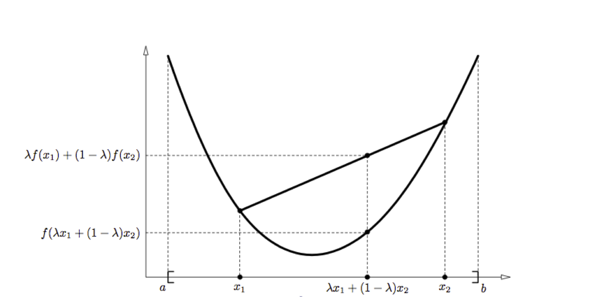



## Contents
{:.no_toc}
*  
{: toc}

## Contents
{:.no_toc}
* 
{: toc}

## Convexity

Let $f$ be a function with domain the set of real numbers. If the second derivative is greater than zero 
for all $x\in R$ this function is convex\footnote{In the case of vector inputs this is called positive 
semi-definite}. 

Consider the case of two random variables $x_1$ and $x_2$, as seen in the diagram below:

**Defnition** Let f be a real valued function defined on an interval $I = [a, b]$.
$f$ is said to be convex on I if $\forall x_1, x_2 \in I, \lambda \in [0, 1]$,

\begin{equation}
f(\lambda x_1 + (1 - \lambda)\,x_2) \le \lambda f(x_1) + (1- \lambda)\,f(x_2).
\end{equation}

$f$ is said to be strictly convex if the inequality is strict. Intuitively, this definition
states that the function falls below  the
straight line (the secant) from points $(x_1, f(x_1))$ to $(x_2, f(x_2))$. In other words, the equality is satisfied only for $\lambda = 0$ and $\lambda = 1$.

## Jensen's Inequality

Let $f$ be a convex function defined on an interval $I$. 
If $x_1,x_2,\dots,x_n \in I {\rm and} \lambda_1, \lambda_2,\ldots,\lambda_n \ge  0$ with $\sum^n_{i=1} \lambda_i = 1$,

\begin{equation}
f \left( \sum_{i=1}^n \lambda_i \,  x_i \right) \le  \sum_{i=1}^n \lambda_i f(x_i) 
\end{equation}

**Proof:**	For $n = 1$ this is trivial. The case $n = 2$ corresponds to the definition of convexity (see above). 
To show that this is true for all natural numbers, we proceed by induction. Assume the theorem is true for some $n$ then,

$$
\begin{eqnarray}
f \left( \sum_{i=1}^{n+1} \lambda_i \,  x_i \right) &=& f\left( \lambda_{n+1} x_{n+1} + \sum_{i=1}^n \lambda_i \,  x_i  \right) \nonumber \\
		&=&  f\left( \lambda_{n+1} x_{n+1} + \frac{(1-\lambda_{n+1})}{(1-\lambda_{n+1})}\sum_{i=1}^n \lambda_i \,  x_i  \right) \nonumber \\
		& \le & \lambda_{n+1} f(x_{n+1}) + (1-\lambda_{n+1}) f \left( \frac{1}{(1-\lambda_{n+1})} \sum_{i=1}^n \lambda_i \,  x_i  \right) \nonumber \\
		& = & \lambda_{n+1} f(x_{n+1}) + (1-\lambda_{n+1}) f \left( \sum_{i=1}^n \frac{\lambda_i}{(1-\lambda_{n+1})} \,  x_i  \right)  \nonumber \\
		& \le & \lambda_{n+1} f(x_{n+1}) + (1-\lambda_{n+1})  \sum_{i=1}^n \frac{\lambda_i}{(1-\lambda_{n+1})} \,  f(x_i)  \nonumber \\ 
		& =&  \lambda_{n+1} f(x_{n+1}) + \sum_{i=1}^n \lambda_i f(x_i) \nonumber \\ 
		& =&  \sum_{i=1}^{n+1}  \lambda_i f(x_i)
\end{eqnarray}
$$

By interpreting the $\lambda_i$ as the probability distribution over a discrete variable $x$ taking the values $\{x_i\}$:

$$f(\mathrm{E}[x]) \le \mathrm{E}[f(x)]$$

 

**Theorem**. Let $f$ be a convex function, and $X$ be a random variable, then

$$ E[f(X)] \ge f(E[X]) $$ 

Furthermore, if $f$ is stricly convex (i.e. $f''(x)>0$), then $E[f(x)]=f(E[X])$ only if $X=E[X]$ with
probability 1 ($X$ is constant).  
