

## Contents
{:.no_toc}
*  
{: toc}


```python
%matplotlib inline
import numpy as np
import scipy as sp
import matplotlib as mpl
import matplotlib.cm as cm
import matplotlib.pyplot as plt
import pandas as pd
pd.set_option('display.width', 500)
pd.set_option('display.max_columns', 100)
pd.set_option('display.notebook_repr_html', True)
import seaborn as sns
sns.set_style("whitegrid")
sns.set_context("poster")
import pymc3 as pm
import theano.tensor as tt
```


    //anaconda/envs/py3l/lib/python3.6/site-packages/h5py/__init__.py:34: FutureWarning: Conversion of the second argument of issubdtype from `float` to `np.floating` is deprecated. In future, it will be treated as `np.float64 == np.dtype(float).type`.
      from ._conv import register_converters as _register_converters


We'll first load the tightly coupled gaussian data from the notebook where we did the non-marginalized sampling.


```python
data=np.loadtxt("data/3gv2.dat")
data.shape
```


    (100,)


### The choice of a prior

The Dirichlet is the multi-dimensional analog of the Beta. Higher values force you to be more central. 

## The log-sum-exp trick and mixtures

From the Stan Manual:

>The log sum of exponentials function is used to define mixtures on the log scale. It is defined for two inputs by

$$log\_sum\_exp(a, b) = log(exp(a) + exp(b)).$$

>If a and b are probabilities on the log scale, then $exp(a) + exp(b)$ is their sum on the linear scale, and the outer log converts the result back to the log scale; to summarize, log_sum_exp does linear addition on the log scale. The reason to use the built-in log_sum_exp function is that it can prevent underflow and overflow in the exponentiation, by calculating the result as

$$log \left( exp(a) + exp(b) \right)  = c + log  exp(a − c) + exp(b − c)  ,$$

>where c = max(a, b). In this evaluation, one of the terms, a − c or b − c, is zero and the other is negative, thus eliminating the possibility of overflow or underflow in the leading term and eking the most arithmetic precision possible out of the operation.

As one can see below, `pymc3` uses the same definition

From https://github.com/pymc-devs/pymc3/blob/master/pymc3/math.py#L27

```python
def logsumexp(x, axis=None):
    # Adapted from https://github.com/Theano/Theano/issues/1563
    x_max = tt.max(x, axis=axis, keepdims=True)
    return tt.log(tt.sum(tt.exp(x - x_max), axis=axis, keepdims=True)) + x_max
```

For example (as taken from the Stan Manual), the mixture of $N(−1, 2)$ and $N(3, 1)$ with mixing proportion $\lambda = (0.3, 0.7)$:

$$logp(y \vert \lambda, \mu, \sigma)$$

$$= log\left(0.3×N(y \vert −1,2) + 0.7×N(y \vert 3,1)\right)$$

$$= log\left(exp(log(0.3 × N(y \vert − 1, 2)))  + exp(log(0.7 × N(y \vert 3, 1))) \right)$$

$$= \mathtt{log\_sum\_exp}\left(log(0.3) + log\,N(y \vert − 1, 2), log(0.7) + log\, N(y \vert 3, 1) \right).$$

where `log_sum_exp` is the function as defined above.

This generalizes to the case of more mixture components.

This is thus a custon distribution `logp` we must define. If we do this, we can go directly from the Dirichlet priors for $p$ and forget the `category` variable

## Pymc3 implements the log-sum-exp directly

Lets see the source here to see how its done:

https://github.com/pymc-devs/pymc3/blob/master/pymc3/distributions/mixture.py

There is a marginalized Gaussian Mixture model available, as well as a general mixture. We'll use the `NormalMixture`, to which we must provide mixing weights and components.


```python
import pymc3.distributions.transforms as tr
with pm.Model() as mof3:
    p = pm.Dirichlet('p', a=np.array([10., 10., 10.]), shape=3)
    means = pm.Normal('means', mu=0, sd=10, shape=3, transform=tr.ordered,
                  testval=np.array([-1, 0, 1]))


    points = pm.NormalMixture('obs', p, mu=means, sd=1, observed=data)

```


```python
with mof3:
    tripletrace_full3 = pm.sample(10000, tune=2000, nuts_kwargs=dict(target_accept=0.95))
```


    Auto-assigning NUTS sampler...
    Initializing NUTS using jitter+adapt_diag...
    Multiprocess sampling (2 chains in 2 jobs)
    NUTS: [means, p]
    Sampling 2 chains: 100%|██████████| 24000/24000 [01:34<00:00, 253.32draws/s]
    The number of effective samples is smaller than 25% for some parameters.


```python
pm.traceplot(tripletrace_full3, combined=True);
```


    //anaconda/envs/py3l/lib/python3.6/site-packages/matplotlib/axes/_base.py:3604: MatplotlibDeprecationWarning: 
    The `ymin` argument was deprecated in Matplotlib 3.0 and will be removed in 3.2. Use `bottom` instead.
      alternative='`bottom`', obj_type='argument')


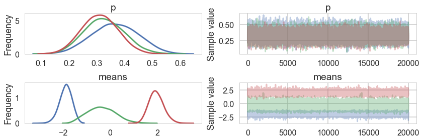


```python
pm.autocorrplot(tripletrace_full3);
```


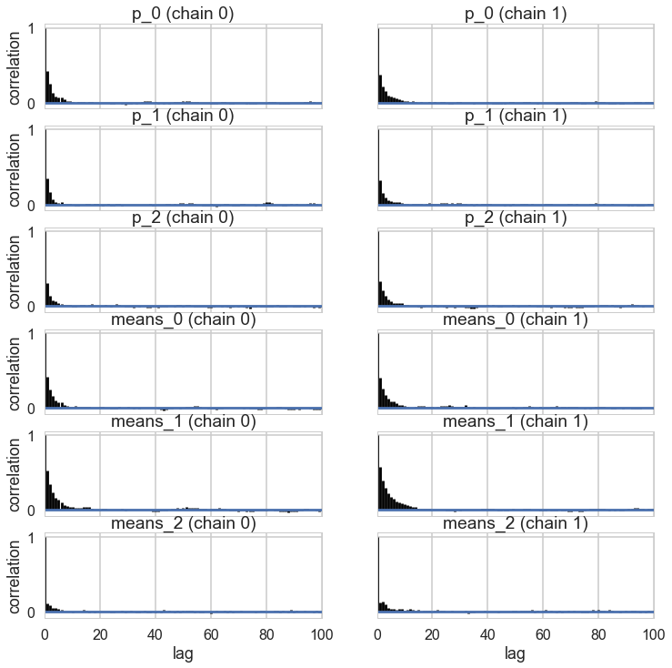


```python
pm.plot_posterior(tripletrace_full3);
```


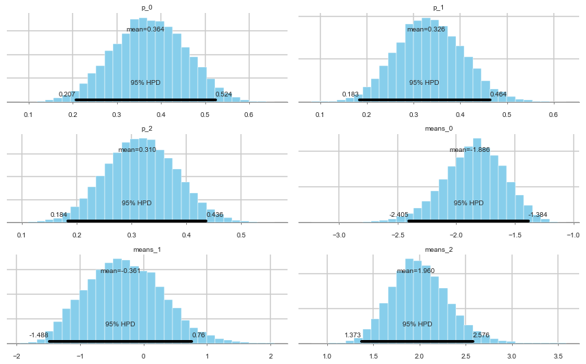


Ordered, even with Dirichlets, our model fits quite nicely.

## Posterior Predictive


```python
with mof3:
    ppc_trace = pm.sample_ppc(tripletrace_full3, 5000)
```


    100%|██████████| 5000/5000 [00:10<00:00, 479.60it/s]


```python
plt.hist(data, bins=30, normed=True,
        histtype='step', lw=2,
        label='Observed data');
plt.hist(ppc_trace['obs'][:,0], bins=30, normed=True,
        histtype='step', lw=2,
        label='Posterior predictive distribution');

plt.legend(loc=1);
```


    //anaconda/envs/py3l/lib/python3.6/site-packages/matplotlib/axes/_axes.py:6521: MatplotlibDeprecationWarning: 
    The 'normed' kwarg was deprecated in Matplotlib 2.1 and will be removed in 3.1. Use 'density' instead.
      alternative="'density'", removal="3.1")


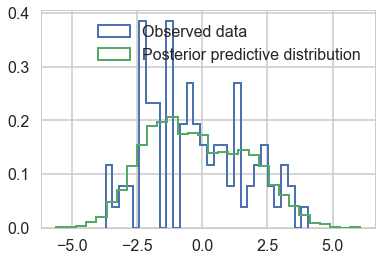


You can see the general agreement between these two distributions in this posterior predictive check!

## Marginalizing By Hand

We need to write out the `logp` for the likelihood ourself now, using `logsumexp` to do the sum we need.


```python
from pymc3.math import logsumexp


def logp_normal(mu, sigma, value):
    # log probability of individual samples
    delta = lambda mu: value - mu
    return (-1 / 2.) * (tt.log(2 * np.pi) + tt.log(sigma*sigma) +
                         (delta(mu)* delta(mu))/(sigma*sigma))

# Log likelihood of Gaussian mixture distribution
def logp_gmix(mus, pis, sigmas, n_samples, n_components):
                        
    def logp_(value):        
        logps = [tt.log(pis[i]) + logp_normal(means[i], sigmas[i], value)
                 for i in range(n_components)]
            
        return tt.sum(logsumexp(tt.stacklists(logps)[:, :n_samples], axis=0))

    return logp_
```


```python
with pm.Model() as mof2:
    p = pm.Dirichlet('p', a=np.array([10., 10., 10.]), shape=3)

    # cluster centers
    means = pm.Normal('means', mu=0, sd=10, shape=3, transform=tr.ordered,
                  testval=np.array([-1, 0, 1]))


    sds = [1., 1., 1.]


    # likelihood for each observed valueDensityDist('x', logp_gmix(mus, pi, np.eye(2)), observed=data)
    points = pm.DensityDist('obs', logp_gmix(means, p, sds, data.shape[0], 3),
                       observed=data)
```


```python
with mof2:
    tripletrace_full2 = pm.sample(10000, tune=2000, nuts_kwargs=dict(target_accept=0.95))
```


    Auto-assigning NUTS sampler...
    Initializing NUTS using jitter+adapt_diag...
    Multiprocess sampling (2 chains in 2 jobs)
    NUTS: [means, p]
    Sampling 2 chains: 100%|██████████| 24000/24000 [01:58<00:00, 202.33draws/s]
    The number of effective samples is smaller than 25% for some parameters.


```python
pm.traceplot(tripletrace_full2);
```


    //anaconda/envs/py3l/lib/python3.6/site-packages/matplotlib/axes/_base.py:3604: MatplotlibDeprecationWarning: 
    The `ymin` argument was deprecated in Matplotlib 3.0 and will be removed in 3.2. Use `bottom` instead.
      alternative='`bottom`', obj_type='argument')


### Posterior predictive

You cant use `sample_ppc` directly because we did not create a sampling function for our DensityDist. But this is easy to do for a mixture model. Sample a categorical from the p's above, and then sample the appropriate gaussian.

>Exercise: Write a function to do this!


```python
with mof2:
    ppc_trace2 = pm.sample_ppc(tripletrace_full2, 5000)
```


      0%|          | 0/5000 [00:00<?, ?it/s]


    ---------------------------------------------------------------------------

    ValueError                                Traceback (most recent call last)

    //anaconda/envs/py3l/lib/python3.6/site-packages/pymc3/distributions/distribution.py in _draw_value(param, point, givens, size)
        397                 try:
    --> 398                     dist_tmp.random(point=point, size=size)
        399                 except (ValueError, TypeError):


    //anaconda/envs/py3l/lib/python3.6/site-packages/pymc3/distributions/distribution.py in random(self, *args, **kwargs)
        212         else:
    --> 213             raise ValueError("Distribution was not passed any random method "
        214                             "Define a custom random method and pass it as kwarg random")


    ValueError: Distribution was not passed any random method Define a custom random method and pass it as kwarg random

    
    During handling of the above exception, another exception occurred:


    ValueError                                Traceback (most recent call last)

    <ipython-input-45-bc8d116a4478> in <module>()
          1 with mof2:
    ----> 2     ppc_trace2 = pm.sample_ppc(tripletrace_full2, 5000)
    

    //anaconda/envs/py3l/lib/python3.6/site-packages/pymc3/sampling.py in sample_ppc(trace, samples, model, vars, size, random_seed, progressbar)
       1127     # draw once to inspect the shape
       1128     var_values = list(zip(varnames,
    -> 1129                           draw_values(vars, point=model.test_point, size=size)))
       1130     ppc_trace = defaultdict(list)
       1131     for varname, value in var_values:


    //anaconda/envs/py3l/lib/python3.6/site-packages/pymc3/distributions/distribution.py in draw_values(params, point, size)
        319             else:
        320                 try:  # might evaluate in a bad order,
    --> 321                     evaluated[param_idx] = _draw_value(param, point=point, givens=givens.values(), size=size)
        322                     if isinstance(param, collections.Hashable) and named_nodes_parents.get(param):
        323                         givens[param.name] = (param, evaluated[param_idx])


    //anaconda/envs/py3l/lib/python3.6/site-packages/pymc3/distributions/distribution.py in _draw_value(param, point, givens, size)
        401                     # with theano.shared inputs
        402                     dist_tmp.shape = np.array([])
    --> 403                     val = dist_tmp.random(point=point, size=None)
        404                     dist_tmp.shape = val.shape
        405                 return dist_tmp.random(point=point, size=size)


    //anaconda/envs/py3l/lib/python3.6/site-packages/pymc3/distributions/distribution.py in random(self, *args, **kwargs)
        211             return self.rand(*args, **kwargs)
        212         else:
    --> 213             raise ValueError("Distribution was not passed any random method "
        214                             "Define a custom random method and pass it as kwarg random")
        215 


    ValueError: Distribution was not passed any random method Define a custom random method and pass it as kwarg random


## ADVI

ADVI also needs a marginalized model as it uses gradient descent.


```python
mdvar = pm.ADVI(model=mof3)
mdvar.fit(n=15000)
```


    Average Loss = 213.02: 100%|██████████| 15000/15000 [00:13<00:00, 1081.19it/s]
    Finished [100%]: Average Loss = 213.02


    <pymc3.variational.approximations.MeanField at 0x1237600b8>


```python
plt.plot(-mdvar.hist[::10])
```


    [<matplotlib.lines.Line2D at 0x125f096a0>]


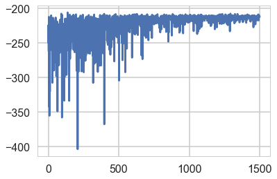


```python
samps=mdvar.approx.sample(5000)
```


```python
pm.traceplot(samps);
```


    //anaconda/envs/py3l/lib/python3.6/site-packages/matplotlib/axes/_base.py:3604: MatplotlibDeprecationWarning: 
    The `ymin` argument was deprecated in Matplotlib 3.0 and will be removed in 3.2. Use `bottom` instead.
      alternative='`bottom`', obj_type='argument')


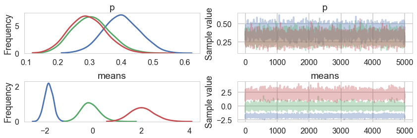


```python
pred = pm.sample_ppc(samps, 5000, model=mof3)
```


    100%|██████████| 5000/5000 [00:10<00:00, 463.14it/s]


```python
plt.hist(data, bins=30, normed=True,
        histtype='step', lw=2,
        label='Observed data');
plt.hist(pred['obs'][:,0], bins=30, normed=True,
        histtype='step', lw=2,
        label='Posterior predictive distribution');

plt.legend(loc=1);
```


    //anaconda/envs/py3l/lib/python3.6/site-packages/matplotlib/axes/_axes.py:6521: MatplotlibDeprecationWarning: 
    The 'normed' kwarg was deprecated in Matplotlib 2.1 and will be removed in 3.1. Use 'density' instead.
      alternative="'density'", removal="3.1")


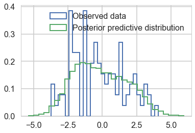


We do quite well!

## A much more separated gaussian model


```python
data2=np.loadtxt("data/3g.dat")
```


```python
plt.hist(data2, bins=30, normed=True,
        histtype='step', lw=2,
        label='Observed data');
```


    //anaconda/envs/py3l/lib/python3.6/site-packages/matplotlib/axes/_axes.py:6521: MatplotlibDeprecationWarning: 
    The 'normed' kwarg was deprecated in Matplotlib 2.1 and will be removed in 3.1. Use 'density' instead.
      alternative="'density'", removal="3.1")


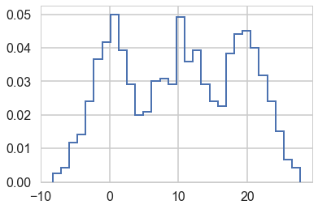


Notice below the use of Potentials. These ensure that there are (a) some members in each cluster and (b) provide us a fifferent way to specify the ordering. This works aby adding log-probability to a model to prevent the sampler going to places where this is negative infinity.


```python
## Class Model for 3 gaussian mixture

with pm.Model() as mofsep:
    p = pm.Dirichlet('p', a=np.array([2., 2., 2.]), shape=3)
    # ensure all clusters have some points
    p_min_potential = pm.Potential('p_min_potential', tt.switch(tt.min(p) < .1, -np.inf, 0))

    # cluster centers
    means = pm.Normal('means', mu=[0, 10, 20], sd=5, shape=3)

    order_means_potential = pm.Potential('order_means_potential',
                                         tt.switch(means[1]-means[0] < 0, -np.inf, 0)
                                         + tt.switch(means[2]-means[1] < 0, -np.inf, 0))
                                         
    # measurement error
    sds = pm.HalfCauchy('sds', beta=5, shape=3)


    # likelihood for each observed value
    points = pm.NormalMixture('obs', p, mu=means, sd=sds, observed=data2)


```


```python
with mofsep:
    tracesep_full = pm.sample(10000, tune=2000, nuts_kwargs=dict(target_accept=0.95))
```


    Auto-assigning NUTS sampler...
    Initializing NUTS using jitter+adapt_diag...
    Multiprocess sampling (2 chains in 2 jobs)
    NUTS: [sds, means, p]
    Sampling 2 chains: 100%|██████████| 24000/24000 [02:09<00:00, 184.97draws/s]


```python
pm.traceplot(tracesep_full, combined=True);
```


    //anaconda/envs/py3l/lib/python3.6/site-packages/matplotlib/axes/_base.py:3604: MatplotlibDeprecationWarning: 
    The `ymin` argument was deprecated in Matplotlib 3.0 and will be removed in 3.2. Use `bottom` instead.
      alternative='`bottom`', obj_type='argument')


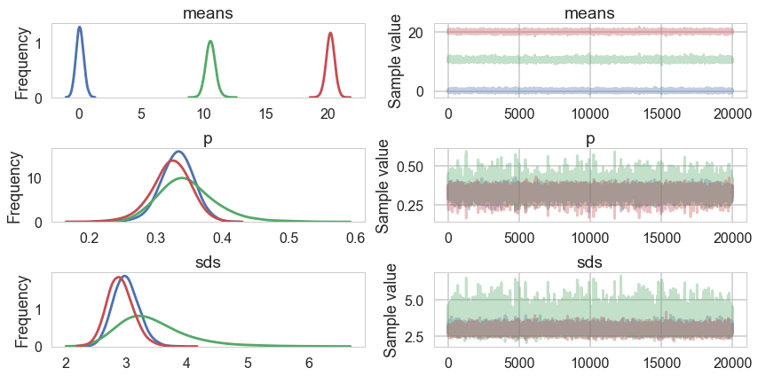


```python
with mofsep:
    ppc_tracesep = pm.sample_ppc(tracesep_full, 5000)
```


    100%|██████████| 5000/5000 [00:13<00:00, 376.18it/s]


```python
plt.hist(data2, bins=30, normed=True,
        histtype='step', lw=2,
        label='Observed data');
plt.hist(ppc_tracesep['obs'][:,0], bins=30, normed=True,
        histtype='step', lw=2,
        label='Posterior predictive distribution');

plt.legend(loc=1);
```


    //anaconda/envs/py3l/lib/python3.6/site-packages/matplotlib/axes/_axes.py:6521: MatplotlibDeprecationWarning: 
    The 'normed' kwarg was deprecated in Matplotlib 2.1 and will be removed in 3.1. Use 'density' instead.
      alternative="'density'", removal="3.1")


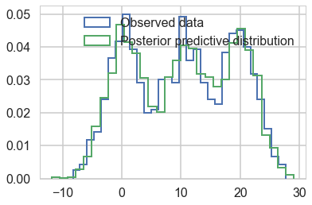


This samples very cleanly and we can do ADVI as well...


```python
mdvarsep = pm.ADVI(model=mofsep)
mdvarsep.fit(n=15000)
```


    Average Loss = 3,475.3: 100%|██████████| 15000/15000 [00:19<00:00, 779.49it/s]
    Finished [100%]: Average Loss = 3,475.3


    <pymc3.variational.approximations.MeanField at 0x124aca8d0>


```python
plt.plot(-mdvarsep.hist[::10])
```


    [<matplotlib.lines.Line2D at 0x12801ec18>]


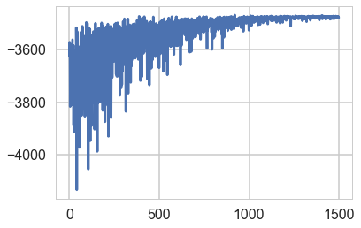


```python
sampssep=mdvarsep.approx.sample(5000)
```


```python
pm.traceplot(sampssep);
```


    //anaconda/envs/py3l/lib/python3.6/site-packages/matplotlib/axes/_base.py:3604: MatplotlibDeprecationWarning: 
    The `ymin` argument was deprecated in Matplotlib 3.0 and will be removed in 3.2. Use `bottom` instead.
      alternative='`bottom`', obj_type='argument')


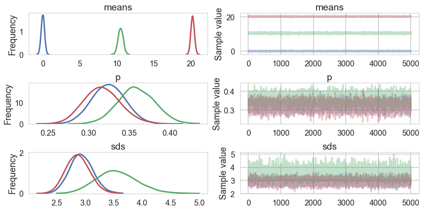


```python
predsep = pm.sample_ppc(sampssep, 5000, model=mofsep)
```


    100%|██████████| 5000/5000 [00:11<00:00, 440.11it/s]


```python
plt.hist(data2, bins=30, normed=True,
        histtype='step', lw=2,
        label='Observed data');
plt.hist(predsep['obs'][:,0], bins=30, normed=True,
        histtype='step', lw=2,
        label='Posterior predictive distribution');

plt.legend(loc=1);
```


    //anaconda/envs/py3l/lib/python3.6/site-packages/matplotlib/axes/_axes.py:6521: MatplotlibDeprecationWarning: 
    The 'normed' kwarg was deprecated in Matplotlib 2.1 and will be removed in 3.1. Use 'density' instead.
      alternative="'density'", removal="3.1")


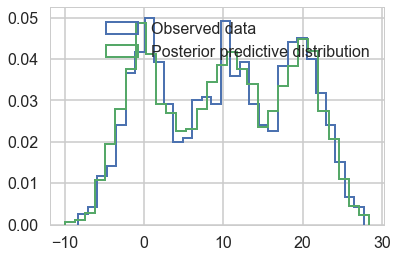

