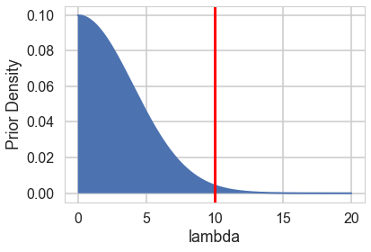



## Contents
{:.no_toc}
*  
{: toc}


```python
%matplotlib inline
import numpy as np
import scipy as sp
import matplotlib as mpl
import matplotlib.cm as cm
import matplotlib.pyplot as plt
import pandas as pd
pd.set_option('display.width', 500)
pd.set_option('display.max_columns', 100)
pd.set_option('display.notebook_repr_html', True)
import seaborn as sns
sns.set_style("whitegrid")
sns.set_context("poster")
import pymc3 as pm
```


    //anaconda/envs/py3l/lib/python3.6/site-packages/h5py/__init__.py:34: FutureWarning: Conversion of the second argument of issubdtype from `float` to `np.floating` is deprecated. In future, it will be treated as `np.float64 == np.dtype(float).type`.
      from ._conv import register_converters as _register_converters


## Monks working on manuscripts

From McElreath:

>Now imagine that the monks take breaks on some days. On those days, no manuscripts are completed. Instead, the wine cellar is opened and more earthly delights are practiced. As the monastery owner, you'd like to know how often the monks drink. The obstacle for inference is that there will be zeros on honest non-drinking days, as well, just by chance. So how can you estimate the number of days spent drinking?


The kind of model used to solve this problem is called a **Mixture Model**. We'll see these in more detail next week, but here is a simple version that arises in Poisson regression.

Let $p$ be the probability that the monks spend the day drinking, and $\lambda$ be the mean number of manuscripts completed, when they work.


### Likelihood

The likelihood of observing 0 manuscripts produced is is:

 $$\cal{L}(y=0) = p + (1-p) e^{-\lambda},$$

since the Poisson likelihood of $y$ is $ \lambda^y exp(–\lambda)/y!$

Likelihood of a non-zero $y$ is:

 $$\cal{L}(y \ne 0) = (1-p) \frac{\lambda^y e^{-\lambda}}{y!}$$

This model can be described by this diagram, taken from Mc-Elreath


### Generating the data

We're throwing bernoullis for whether a given day in the year is a drinking day or not...


```python
from scipy.stats import binom
p_drink=0.2
rate_work=1
N=365
drink=binom.rvs(n=1, p=p_drink, size=N)
drink
```


    array([0, 0, 0, 0, 0, 0, 1, 0, 0, 1, 0, 0, 0, 0, 0, 0, 0, 0, 0, 0, 1, 1,
           0, 1, 0, 1, 1, 0, 0, 0, 1, 0, 1, 0, 0, 0, 0, 0, 0, 0, 0, 1, 0, 0,
           0, 1, 0, 1, 1, 0, 0, 0, 0, 0, 0, 0, 0, 0, 0, 0, 0, 0, 0, 0, 0, 0,
           1, 0, 0, 0, 0, 0, 0, 1, 0, 0, 0, 1, 0, 0, 0, 0, 0, 0, 0, 0, 1, 0,
           0, 0, 0, 0, 0, 1, 0, 0, 0, 0, 0, 0, 1, 0, 0, 0, 0, 0, 1, 0, 0, 1,
           0, 0, 0, 1, 1, 0, 0, 1, 0, 0, 0, 0, 1, 1, 0, 0, 0, 0, 0, 1, 0, 0,
           1, 0, 0, 0, 0, 1, 0, 0, 0, 0, 0, 0, 1, 0, 0, 0, 0, 0, 1, 0, 0, 0,
           0, 0, 0, 1, 0, 0, 0, 0, 1, 0, 0, 0, 0, 1, 0, 0, 0, 0, 1, 0, 0, 1,
           0, 1, 1, 1, 1, 1, 0, 0, 1, 0, 0, 0, 1, 0, 0, 0, 0, 0, 0, 0, 0, 1,
           0, 1, 0, 1, 0, 1, 0, 0, 0, 0, 0, 0, 1, 0, 0, 0, 0, 1, 0, 1, 0, 1,
           1, 0, 0, 0, 0, 0, 0, 0, 0, 1, 0, 0, 0, 0, 0, 1, 0, 0, 0, 1, 0, 0,
           1, 0, 0, 0, 0, 0, 0, 0, 0, 0, 0, 0, 0, 0, 0, 1, 0, 0, 0, 1, 1, 0,
           0, 0, 0, 0, 0, 1, 0, 0, 0, 0, 0, 0, 0, 0, 0, 0, 0, 0, 0, 0, 0, 0,
           0, 0, 0, 1, 0, 0, 0, 0, 0, 0, 0, 1, 0, 0, 0, 0, 1, 0, 0, 0, 0, 0,
           0, 0, 0, 1, 1, 1, 0, 0, 0, 0, 0, 0, 0, 0, 1, 0, 0, 1, 1, 1, 0, 1,
           0, 0, 0, 0, 0, 0, 0, 0, 0, 0, 0, 0, 0, 0, 0, 1, 0, 1, 0, 0, 0, 1,
           0, 1, 0, 0, 0, 0, 0, 0, 0, 0, 0, 1, 0])


On days we dont drink, we produce some work...though it might be 0 work...


```python
from scipy.stats import poisson
y = ( 1 - drink)*poisson.rvs(mu=rate_work, size=N)
y
```


    array([1, 0, 0, 1, 1, 2, 0, 0, 0, 0, 0, 1, 0, 1, 0, 2, 0, 4, 0, 1, 0, 0,
           0, 0, 1, 0, 0, 1, 0, 1, 0, 0, 0, 0, 0, 0, 3, 0, 1, 0, 0, 0, 0, 3,
           0, 0, 0, 0, 0, 1, 1, 4, 1, 1, 2, 1, 3, 0, 1, 2, 2, 1, 1, 2, 1, 0,
           0, 2, 3, 1, 1, 2, 1, 0, 0, 1, 0, 0, 0, 0, 0, 0, 1, 1, 1, 0, 0, 2,
           1, 2, 2, 1, 2, 0, 1, 0, 1, 1, 3, 1, 0, 2, 1, 1, 0, 1, 0, 1, 0, 0,
           0, 0, 0, 0, 0, 3, 1, 0, 0, 0, 3, 0, 0, 0, 0, 2, 1, 1, 1, 0, 2, 0,
           0, 0, 0, 1, 1, 0, 2, 0, 2, 1, 1, 2, 0, 0, 0, 0, 2, 1, 0, 0, 1, 1,
           0, 0, 0, 0, 0, 1, 2, 1, 0, 0, 1, 1, 2, 0, 0, 2, 1, 2, 0, 0, 2, 0,
           1, 0, 0, 0, 0, 0, 0, 2, 0, 3, 0, 1, 0, 0, 0, 1, 1, 0, 0, 2, 1, 0,
           3, 0, 2, 0, 3, 0, 0, 1, 0, 0, 1, 1, 0, 1, 1, 1, 1, 0, 0, 0, 1, 0,
           0, 0, 0, 1, 0, 0, 1, 0, 0, 0, 0, 2, 1, 1, 0, 0, 2, 0, 0, 0, 0, 4,
           0, 2, 0, 0, 1, 4, 2, 0, 1, 1, 0, 1, 1, 2, 3, 0, 0, 0, 0, 0, 0, 1,
           2, 2, 0, 0, 1, 0, 1, 1, 2, 2, 2, 1, 1, 0, 1, 1, 0, 2, 1, 1, 0, 3,
           0, 1, 3, 0, 0, 3, 1, 1, 1, 2, 2, 0, 1, 0, 2, 1, 0, 1, 0, 0, 1, 2,
           3, 1, 0, 0, 0, 0, 1, 3, 0, 2, 0, 2, 2, 1, 0, 4, 0, 0, 0, 0, 2, 0,
           3, 0, 0, 0, 0, 1, 0, 0, 1, 1, 2, 1, 2, 3, 2, 0, 1, 0, 2, 0, 2, 0,
           1, 0, 1, 0, 2, 0, 0, 3, 1, 1, 2, 0, 2])


Lets manufacture a histogram of manuscripts produced in a day.


```python
zeros_drink=np.sum(drink)
a=drink==0
b=y==0
zeros_work=np.sum(a & b)
zeros_drink, zeros_work, np.sum(b)
```


    (76, 107, 183)


```python
plt.hist(zeros_work*[0], bins=np.arange(10))
plt.hist(y, bins=np.arange(10), alpha=0.5)
```


    (array([183., 104.,  54.,  19.,   5.,   0.,   0.,   0.,   0.]),
     array([0, 1, 2, 3, 4, 5, 6, 7, 8, 9]),
     <a list of 9 Patch objects>)


### Lets throw in some domain expertise

*A survey of Abbey Heads has told us, that the most a monk could produce, ever, was 10 manuscripts in a day.*

## First model: just do a simple poisson


```python
import theano.tensor as t
```


```python
def model_poisson(observed=False):
    with pm.Model() as model:
        lam=pm.HalfNormal("lambda", 100)
        like = pm.Poisson("obsv", mu=lam, observed=observed)
    return model
```


```python
model0 = model_poisson(observed=y)
```


```python
with model0:
    trace0=pm.sample(3000)
```


    Auto-assigning NUTS sampler...
    Initializing NUTS using jitter+adapt_diag...
    Multiprocess sampling (2 chains in 2 jobs)
    NUTS: [lambda]
    Sampling 2 chains: 100%|██████████| 7000/7000 [00:02<00:00, 2551.34draws/s]
    The acceptance probability does not match the target. It is 0.8826517317809268, but should be close to 0.8. Try to increase the number of tuning steps.
    The acceptance probability does not match the target. It is 0.8823970764263942, but should be close to 0.8. Try to increase the number of tuning steps.


```python
pm.traceplot(trace0)
```


    //anaconda/envs/py3l/lib/python3.6/site-packages/matplotlib/axes/_base.py:3604: MatplotlibDeprecationWarning: 
    The `ymin` argument was deprecated in Matplotlib 3.0 and will be removed in 3.2. Use `bottom` instead.
      alternative='`bottom`', obj_type='argument')


    array([[<matplotlib.axes._subplots.AxesSubplot object at 0x12456cd68>,
            <matplotlib.axes._subplots.AxesSubplot object at 0x1263975f8>]],
          dtype=object)


```python
pm.summary(trace0)
```


<div>
<style scoped>
    .dataframe tbody tr th:only-of-type {
        vertical-align: middle;
    }

    .dataframe tbody tr th {
        vertical-align: top;
    }

    .dataframe thead th {
        text-align: right;
    }
</style>
<table border="1" class="dataframe">
  <thead>
    <tr style="text-align: right;">
      <th></th>
      <th>mean</th>
      <th>sd</th>
      <th>mc_error</th>
      <th>hpd_2.5</th>
      <th>hpd_97.5</th>
      <th>n_eff</th>
      <th>Rhat</th>
    </tr>
  </thead>
  <tbody>
    <tr>
      <th>lambda</th>
      <td>0.794177</td>
      <td>0.046064</td>
      <td>0.001038</td>
      <td>0.704709</td>
      <td>0.884261</td>
      <td>2167.755813</td>
      <td>1.001699</td>
    </tr>
  </tbody>
</table>
</div>


```python
from scipy import stats
lbda  = np.linspace(0, 200, num=1000)
normpdf = stats.norm(loc=0,scale=100).pdf(lbda)
plt.plot(lbda, normpdf, lw=2)
plt.xlabel("lambda"); 
plt.ylabel("Prior Density");
plt.fill_between(lbda,0.,normpdf)
plt.axvline(10, 0 ,1, c="r", lw=3);
```


### Some proper workflow

Notice the prior specification though: at the 3$\sigma$ level, $\lambda$ could range from 0 to 300, ie from 0 to an extremely large number to an extremely large "mean" of counts. Not possible. Indeed, the max count is around 10. For a poisson, since the variance is equal to the mean, this means that (at 3$\sigma):

$$max(\lambda + 3\sqrt{\lambda}) < 10$$

Any prior should only take us marginally outside this range:


```python
4+3*np.sqrt(4)
```


    10.0


```python
from scipy import stats
lbda  = np.linspace(0, 20, num=1000)
normpdf = stats.norm(loc=0,scale=4).pdf(lbda)
plt.plot(lbda, normpdf, lw=2)
plt.xlabel("lambda"); 
plt.ylabel("Prior Density");
plt.fill_between(lbda,0.,normpdf)
plt.axvline(10, 0 ,1, c="r", lw=3);
```





```python
pois = stats.poisson.rvs(stats.halfnorm(scale=4).rvs(1000))
plt.hist(pois)
```


    (array([366., 281., 171.,  54.,  65.,  35.,  10.,  10.,   6.,   2.]),
     array([ 0. ,  1.7,  3.4,  5.1,  6.8,  8.5, 10.2, 11.9, 13.6, 15.3, 17. ]),
     <a list of 10 Patch objects>)


```python
np.mean(pois > 10)
```


    0.028


### Limiting the prior

Thus a prior should mainly limit $\lambda$ to values upto 4. To so this consider:


```python
from scipy.stats import halfnorm
halfnorm.ppf(0.99, loc=0,scale=4)
```


    10.303317214195602


```python
def model_poisson1(sd, datasize, observed=False):
    with pm.Model() as model:
        lam=pm.HalfNormal("lambda", sd)
        like = pm.Poisson("obsv", mu=lam, shape = datasize, observed=observed)
    return model
```


### Simulating the Bayesian Joint distribution

This should be way enough!, So lets go again:


```python
N = y.shape[0]
N
```


    365


```python
model1_pr = model_poisson1(4, N, observed=None)
```


```python
with model1_pr:
    trace1_pr = pm.sample_prior_predictive(500)
```


```python
trace1_pr['lambda'].shape, trace1_pr['obsv'].shape
```


    ((500,), (500, 365))


```python
plt.hist(trace1_pr['lambda']);
```


```python
simy = trace1_pr['obsv']
```


```python
simu_lbdas = trace1_pr['lambda']
simu_lbdas.shape, simy.shape
```


    ((500,), (500, 365))


```python
simu_lbdas = stats.halfnorm(scale=4).rvs(500)
simy = np.zeros((500, y.shape[0]))
for i in range(500):
    simy[i,:] = stats.poisson(simu_lbdas[i]).rvs(y.shape[0])
```


```python
x_max = 21
bins = np.arange(0,x_max)
hists = np.apply_along_axis(lambda a: np.histogram(a, bins=bins)[0], 1, simy)
```


```python
hists.shape #500 rows with 20 cols
```


    (500, 20)


```python
np.linspace(10,90,num=9, dtype=int)
```


    array([10, 20, 30, 40, 50, 60, 70, 80, 90])


```python
prctiles = np.percentile(hists,np.linspace(10,90,num=9, dtype=int),axis=0)
```


```python
bin_interp = np.linspace(0,x_max-1,num=(x_max-1)*10)
bin_interp
```


    array([ 0.        ,  0.10050251,  0.20100503,  0.30150754,  0.40201005,
            0.50251256,  0.60301508,  0.70351759,  0.8040201 ,  0.90452261,
            1.00502513,  1.10552764,  1.20603015,  1.30653266,  1.40703518,
            1.50753769,  1.6080402 ,  1.70854271,  1.80904523,  1.90954774,
            2.01005025,  2.11055276,  2.21105528,  2.31155779,  2.4120603 ,
            2.51256281,  2.61306533,  2.71356784,  2.81407035,  2.91457286,
            3.01507538,  3.11557789,  3.2160804 ,  3.31658291,  3.41708543,
            3.51758794,  3.61809045,  3.71859296,  3.81909548,  3.91959799,
            4.0201005 ,  4.12060302,  4.22110553,  4.32160804,  4.42211055,
            4.52261307,  4.62311558,  4.72361809,  4.8241206 ,  4.92462312,
            5.02512563,  5.12562814,  5.22613065,  5.32663317,  5.42713568,
            5.52763819,  5.6281407 ,  5.72864322,  5.82914573,  5.92964824,
            6.03015075,  6.13065327,  6.23115578,  6.33165829,  6.4321608 ,
            6.53266332,  6.63316583,  6.73366834,  6.83417085,  6.93467337,
            7.03517588,  7.13567839,  7.2361809 ,  7.33668342,  7.43718593,
            7.53768844,  7.63819095,  7.73869347,  7.83919598,  7.93969849,
            8.04020101,  8.14070352,  8.24120603,  8.34170854,  8.44221106,
            8.54271357,  8.64321608,  8.74371859,  8.84422111,  8.94472362,
            9.04522613,  9.14572864,  9.24623116,  9.34673367,  9.44723618,
            9.54773869,  9.64824121,  9.74874372,  9.84924623,  9.94974874,
           10.05025126, 10.15075377, 10.25125628, 10.35175879, 10.45226131,
           10.55276382, 10.65326633, 10.75376884, 10.85427136, 10.95477387,
           11.05527638, 11.15577889, 11.25628141, 11.35678392, 11.45728643,
           11.55778894, 11.65829146, 11.75879397, 11.85929648, 11.95979899,
           12.06030151, 12.16080402, 12.26130653, 12.36180905, 12.46231156,
           12.56281407, 12.66331658, 12.7638191 , 12.86432161, 12.96482412,
           13.06532663, 13.16582915, 13.26633166, 13.36683417, 13.46733668,
           13.5678392 , 13.66834171, 13.76884422, 13.86934673, 13.96984925,
           14.07035176, 14.17085427, 14.27135678, 14.3718593 , 14.47236181,
           14.57286432, 14.67336683, 14.77386935, 14.87437186, 14.97487437,
           15.07537688, 15.1758794 , 15.27638191, 15.37688442, 15.47738693,
           15.57788945, 15.67839196, 15.77889447, 15.87939698, 15.9798995 ,
           16.08040201, 16.18090452, 16.28140704, 16.38190955, 16.48241206,
           16.58291457, 16.68341709, 16.7839196 , 16.88442211, 16.98492462,
           17.08542714, 17.18592965, 17.28643216, 17.38693467, 17.48743719,
           17.5879397 , 17.68844221, 17.78894472, 17.88944724, 17.98994975,
           18.09045226, 18.19095477, 18.29145729, 18.3919598 , 18.49246231,
           18.59296482, 18.69346734, 18.79396985, 18.89447236, 18.99497487,
           19.09547739, 19.1959799 , 19.29648241, 19.39698492, 19.49748744,
           19.59798995, 19.69849246, 19.79899497, 19.89949749, 20.        ])


```python
prctiles_interp = np.repeat(prctiles, 10,axis=1)
```


```python
c_light ="#DCBCBC"
c_light_highlight ="#C79999"
c_mid ="#B97C7C"
c_mid_highlight ="#A25050"
c_dark ="#8F2727"
c_dark_highlight ="#7C0000"
for i,color in enumerate([c_light,c_light_highlight,c_mid,c_mid_highlight]):
    plt.fill_between(bin_interp,prctiles_interp[i,:],prctiles_interp[-1-i,:],alpha=1.0,color=color);


plt.plot(bin_interp,prctiles_interp[4,:],color=c_dark_highlight);
plt.axvline(x=10,ls='-',lw=2,color='k');
plt.xlabel('y');
plt.title('Prior predictive distribution');
```


```python
plt.plot(simu_lbdas)
```


    [<matplotlib.lines.Line2D at 0x128ecd2b0>]


```python
choices = np.random.choice(simu_lbdas.shape[0], 100)
choices
```


    array([268, 202,  67, 203, 274, 321, 161, 283, 105, 414, 196,  32,  96,
           313,  45, 438, 173, 377, 358, 108, 301, 178, 143, 377, 374, 276,
           120, 497,  57, 489, 461, 152, 223, 103, 487, 184, 361, 271, 234,
           224, 344, 175, 429, 199, 193, 295, 273,  23, 430, 122, 107, 483,
            47, 440, 152, 342, 289,  21, 195, 375,   8, 469, 164, 393, 344,
           408,  69, 319, 423, 495, 223, 105, 277, 329, 225, 334, 227, 119,
           303, 294, 196, 376, 147, 293, 117, 467, 307, 313, 234, 469, 238,
           266, 116,  13, 221, 148, 116, 345, 164, 256])


```python
plt.plot(simu_lbdas, alpha=0.3)
plt.plot(choices, simu_lbdas[choices], 'o')
```


    [<matplotlib.lines.Line2D at 0x1284498d0>]


```python
simlamsmall = simu_lbdas[choices]
simysmall = simy[choices,:]
simysmall.shape
```


    (100, 365)


```python
junkm = model_poisson1(4, y.shape[0], observed=simy[53,:])
with junkm:
    junkt = pm.sample(3000, tune=1000)
```


    Auto-assigning NUTS sampler...
    Initializing NUTS using jitter+adapt_diag...
    Multiprocess sampling (2 chains in 2 jobs)
    NUTS: [lambda]
    Sampling 2 chains: 100%|██████████| 8000/8000 [00:03<00:00, 2529.59draws/s]


```python
simu_lbdas[53]
```


    2.1571347219574495


```python
pm.traceplot(junkt)
```


    //anaconda/envs/py3l/lib/python3.6/site-packages/matplotlib/axes/_base.py:3604: MatplotlibDeprecationWarning: 
    The `ymin` argument was deprecated in Matplotlib 3.0 and will be removed in 3.2. Use `bottom` instead.
      alternative='`bottom`', obj_type='argument')


    array([[<matplotlib.axes._subplots.AxesSubplot object at 0x12c28c438>,
            <matplotlib.axes._subplots.AxesSubplot object at 0x128a318d0>]],
          dtype=object)


```python
pm.summary(junkt)
```


<div>
<style scoped>
    .dataframe tbody tr th:only-of-type {
        vertical-align: middle;
    }

    .dataframe tbody tr th {
        vertical-align: top;
    }

    .dataframe thead th {
        text-align: right;
    }
</style>
<table border="1" class="dataframe">
  <thead>
    <tr style="text-align: right;">
      <th></th>
      <th>mean</th>
      <th>sd</th>
      <th>mc_error</th>
      <th>hpd_2.5</th>
      <th>hpd_97.5</th>
      <th>n_eff</th>
      <th>Rhat</th>
    </tr>
  </thead>
  <tbody>
    <tr>
      <th>lambda</th>
      <td>2.186212</td>
      <td>0.077299</td>
      <td>0.001335</td>
      <td>2.040262</td>
      <td>2.344938</td>
      <td>2550.350587</td>
      <td>0.999855</td>
    </tr>
  </tbody>
</table>
</div>


```python
junkt.report.ok
```


    True


```python
junkt['lambda'].shape
```


    (6000,)


```python
R=100
sbcpost = np.zeros((R, 6000))
problems = [False]*R
summaries = []
for i in range(R):
    m = model_poisson1(4, y.shape[0], observed=simysmall[i,:])
    junkt = pm.sample(3000, tune=1000, model=m, progressbar=False)
    sbcpost[i,:] = junkt['lambda']
    s = pm.stats.summary(junkt,varnames=['lambda'])
    summaries.append(s)
    problems[i] = junkt.report.ok
```


    Auto-assigning NUTS sampler...
    Initializing NUTS using jitter+adapt_diag...
    Multiprocess sampling (2 chains in 2 jobs)
    NUTS: [lambda]
    Auto-assigning NUTS sampler...
    Initializing NUTS using jitter+adapt_diag...
    Multiprocess sampling (2 chains in 2 jobs)
    NUTS: [lambda]
    Auto-assigning NUTS sampler...
    Initializing NUTS using jitter+adapt_diag...
    Multiprocess sampling (2 chains in 2 jobs)
    NUTS: [lambda]
    Auto-assigning NUTS sampler...
    Initializing NUTS using jitter+adapt_diag...
    Multiprocess sampling (2 chains in 2 jobs)
    NUTS: [lambda]
    Auto-assigning NUTS sampler...
    Initializing NUTS using jitter+adapt_diag...
    Multiprocess sampling (2 chains in 2 jobs)
    NUTS: [lambda]
    The acceptance probability does not match the target. It is 0.8825518725681838, but should be close to 0.8. Try to increase the number of tuning steps.
    Auto-assigning NUTS sampler...
    Initializing NUTS using jitter+adapt_diag...
    Multiprocess sampling (2 chains in 2 jobs)
    NUTS: [lambda]
    Auto-assigning NUTS sampler...
    Initializing NUTS using jitter+adapt_diag...
    Multiprocess sampling (2 chains in 2 jobs)
    NUTS: [lambda]
    Auto-assigning NUTS sampler...
    Initializing NUTS using jitter+adapt_diag...
    Multiprocess sampling (2 chains in 2 jobs)
    NUTS: [lambda]
    Auto-assigning NUTS sampler...
    Initializing NUTS using jitter+adapt_diag...
    Multiprocess sampling (2 chains in 2 jobs)
    NUTS: [lambda]
    Auto-assigning NUTS sampler...
    Initializing NUTS using jitter+adapt_diag...
    Multiprocess sampling (2 chains in 2 jobs)
    NUTS: [lambda]
    Auto-assigning NUTS sampler...
    Initializing NUTS using jitter+adapt_diag...
    Multiprocess sampling (2 chains in 2 jobs)
    NUTS: [lambda]
    Auto-assigning NUTS sampler...
    Initializing NUTS using jitter+adapt_diag...
    Multiprocess sampling (2 chains in 2 jobs)
    NUTS: [lambda]
    Auto-assigning NUTS sampler...
    Initializing NUTS using jitter+adapt_diag...
    Multiprocess sampling (2 chains in 2 jobs)
    NUTS: [lambda]
    Auto-assigning NUTS sampler...
    Initializing NUTS using jitter+adapt_diag...
    Multiprocess sampling (2 chains in 2 jobs)
    NUTS: [lambda]
    Auto-assigning NUTS sampler...
    Initializing NUTS using jitter+adapt_diag...
    Multiprocess sampling (2 chains in 2 jobs)
    NUTS: [lambda]
    Auto-assigning NUTS sampler...
    Initializing NUTS using jitter+adapt_diag...
    Multiprocess sampling (2 chains in 2 jobs)
    NUTS: [lambda]
    Auto-assigning NUTS sampler...
    Initializing NUTS using jitter+adapt_diag...
    Multiprocess sampling (2 chains in 2 jobs)
    NUTS: [lambda]
    Auto-assigning NUTS sampler...
    Initializing NUTS using jitter+adapt_diag...
    Multiprocess sampling (2 chains in 2 jobs)
    NUTS: [lambda]
    Auto-assigning NUTS sampler...
    Initializing NUTS using jitter+adapt_diag...
    Multiprocess sampling (2 chains in 2 jobs)
    NUTS: [lambda]
    Auto-assigning NUTS sampler...
    Initializing NUTS using jitter+adapt_diag...
    Multiprocess sampling (2 chains in 2 jobs)
    NUTS: [lambda]
    Auto-assigning NUTS sampler...
    Initializing NUTS using jitter+adapt_diag...
    Multiprocess sampling (2 chains in 2 jobs)
    NUTS: [lambda]
    Auto-assigning NUTS sampler...
    Initializing NUTS using jitter+adapt_diag...
    Multiprocess sampling (2 chains in 2 jobs)
    NUTS: [lambda]
    Auto-assigning NUTS sampler...
    Initializing NUTS using jitter+adapt_diag...
    Multiprocess sampling (2 chains in 2 jobs)
    NUTS: [lambda]
    Auto-assigning NUTS sampler...
    Initializing NUTS using jitter+adapt_diag...
    Multiprocess sampling (2 chains in 2 jobs)
    NUTS: [lambda]
    Auto-assigning NUTS sampler...
    Initializing NUTS using jitter+adapt_diag...
    Multiprocess sampling (2 chains in 2 jobs)
    NUTS: [lambda]
    Auto-assigning NUTS sampler...
    Initializing NUTS using jitter+adapt_diag...
    Multiprocess sampling (2 chains in 2 jobs)
    NUTS: [lambda]
    Auto-assigning NUTS sampler...
    Initializing NUTS using jitter+adapt_diag...
    Multiprocess sampling (2 chains in 2 jobs)
    NUTS: [lambda]
    Auto-assigning NUTS sampler...
    Initializing NUTS using jitter+adapt_diag...
    Multiprocess sampling (2 chains in 2 jobs)
    NUTS: [lambda]
    Auto-assigning NUTS sampler...
    Initializing NUTS using jitter+adapt_diag...
    Multiprocess sampling (2 chains in 2 jobs)
    NUTS: [lambda]
    Auto-assigning NUTS sampler...
    Initializing NUTS using jitter+adapt_diag...
    Multiprocess sampling (2 chains in 2 jobs)
    NUTS: [lambda]
    Auto-assigning NUTS sampler...
    Initializing NUTS using jitter+adapt_diag...
    Multiprocess sampling (2 chains in 2 jobs)
    NUTS: [lambda]
    The acceptance probability does not match the target. It is 0.8829819214760952, but should be close to 0.8. Try to increase the number of tuning steps.
    Auto-assigning NUTS sampler...
    Initializing NUTS using jitter+adapt_diag...
    Multiprocess sampling (2 chains in 2 jobs)
    NUTS: [lambda]
    Auto-assigning NUTS sampler...
    Initializing NUTS using jitter+adapt_diag...
    Multiprocess sampling (2 chains in 2 jobs)
    NUTS: [lambda]
    Auto-assigning NUTS sampler...
    Initializing NUTS using jitter+adapt_diag...
    Multiprocess sampling (2 chains in 2 jobs)
    NUTS: [lambda]
    Auto-assigning NUTS sampler...
    Initializing NUTS using jitter+adapt_diag...
    Multiprocess sampling (2 chains in 2 jobs)
    NUTS: [lambda]
    Auto-assigning NUTS sampler...
    Initializing NUTS using jitter+adapt_diag...
    Multiprocess sampling (2 chains in 2 jobs)
    NUTS: [lambda]
    Auto-assigning NUTS sampler...
    Initializing NUTS using jitter+adapt_diag...
    Multiprocess sampling (2 chains in 2 jobs)
    NUTS: [lambda]
    Auto-assigning NUTS sampler...
    Initializing NUTS using jitter+adapt_diag...
    Multiprocess sampling (2 chains in 2 jobs)
    NUTS: [lambda]
    Auto-assigning NUTS sampler...
    Initializing NUTS using jitter+adapt_diag...
    Multiprocess sampling (2 chains in 2 jobs)
    NUTS: [lambda]
    Auto-assigning NUTS sampler...
    Initializing NUTS using jitter+adapt_diag...
    Multiprocess sampling (2 chains in 2 jobs)
    NUTS: [lambda]
    The acceptance probability does not match the target. It is 0.8797957787550474, but should be close to 0.8. Try to increase the number of tuning steps.
    Auto-assigning NUTS sampler...
    Initializing NUTS using jitter+adapt_diag...
    Multiprocess sampling (2 chains in 2 jobs)
    NUTS: [lambda]
    Auto-assigning NUTS sampler...
    Initializing NUTS using jitter+adapt_diag...
    Multiprocess sampling (2 chains in 2 jobs)
    NUTS: [lambda]
    Auto-assigning NUTS sampler...
    Initializing NUTS using jitter+adapt_diag...
    Multiprocess sampling (2 chains in 2 jobs)
    NUTS: [lambda]
    Auto-assigning NUTS sampler...
    Initializing NUTS using jitter+adapt_diag...
    Multiprocess sampling (2 chains in 2 jobs)
    NUTS: [lambda]
    Auto-assigning NUTS sampler...
    Initializing NUTS using jitter+adapt_diag...
    Multiprocess sampling (2 chains in 2 jobs)
    NUTS: [lambda]
    Auto-assigning NUTS sampler...
    Initializing NUTS using jitter+adapt_diag...
    Multiprocess sampling (2 chains in 2 jobs)
    NUTS: [lambda]
    Auto-assigning NUTS sampler...
    Initializing NUTS using jitter+adapt_diag...
    Multiprocess sampling (2 chains in 2 jobs)
    NUTS: [lambda]
    Auto-assigning NUTS sampler...
    Initializing NUTS using jitter+adapt_diag...
    Multiprocess sampling (2 chains in 2 jobs)
    NUTS: [lambda]
    Auto-assigning NUTS sampler...
    Initializing NUTS using jitter+adapt_diag...
    Multiprocess sampling (2 chains in 2 jobs)
    NUTS: [lambda]
    Auto-assigning NUTS sampler...
    Initializing NUTS using jitter+adapt_diag...
    Multiprocess sampling (2 chains in 2 jobs)
    NUTS: [lambda]
    Auto-assigning NUTS sampler...
    Initializing NUTS using jitter+adapt_diag...
    Multiprocess sampling (2 chains in 2 jobs)
    NUTS: [lambda]
    Auto-assigning NUTS sampler...
    Initializing NUTS using jitter+adapt_diag...
    Multiprocess sampling (2 chains in 2 jobs)
    NUTS: [lambda]
    Auto-assigning NUTS sampler...
    Initializing NUTS using jitter+adapt_diag...
    Multiprocess sampling (2 chains in 2 jobs)
    NUTS: [lambda]
    The acceptance probability does not match the target. It is 0.8803631883661142, but should be close to 0.8. Try to increase the number of tuning steps.
    Auto-assigning NUTS sampler...
    Initializing NUTS using jitter+adapt_diag...
    Multiprocess sampling (2 chains in 2 jobs)
    NUTS: [lambda]
    Auto-assigning NUTS sampler...
    Initializing NUTS using jitter+adapt_diag...
    Multiprocess sampling (2 chains in 2 jobs)
    NUTS: [lambda]
    Auto-assigning NUTS sampler...
    Initializing NUTS using jitter+adapt_diag...
    Multiprocess sampling (2 chains in 2 jobs)
    NUTS: [lambda]
    Auto-assigning NUTS sampler...
    Initializing NUTS using jitter+adapt_diag...
    Multiprocess sampling (2 chains in 2 jobs)
    NUTS: [lambda]
    Auto-assigning NUTS sampler...
    Initializing NUTS using jitter+adapt_diag...
    Multiprocess sampling (2 chains in 2 jobs)
    NUTS: [lambda]
    Auto-assigning NUTS sampler...
    Initializing NUTS using jitter+adapt_diag...
    Multiprocess sampling (2 chains in 2 jobs)
    NUTS: [lambda]
    Auto-assigning NUTS sampler...
    Initializing NUTS using jitter+adapt_diag...
    Multiprocess sampling (2 chains in 2 jobs)
    NUTS: [lambda]
    Auto-assigning NUTS sampler...
    Initializing NUTS using jitter+adapt_diag...
    Multiprocess sampling (2 chains in 2 jobs)
    NUTS: [lambda]
    Auto-assigning NUTS sampler...
    Initializing NUTS using jitter+adapt_diag...
    Multiprocess sampling (2 chains in 2 jobs)
    NUTS: [lambda]
    Auto-assigning NUTS sampler...
    Initializing NUTS using jitter+adapt_diag...
    Multiprocess sampling (2 chains in 2 jobs)
    NUTS: [lambda]
    Auto-assigning NUTS sampler...
    Initializing NUTS using jitter+adapt_diag...
    Multiprocess sampling (2 chains in 2 jobs)
    NUTS: [lambda]
    Auto-assigning NUTS sampler...
    Initializing NUTS using jitter+adapt_diag...
    Multiprocess sampling (2 chains in 2 jobs)
    NUTS: [lambda]
    Auto-assigning NUTS sampler...
    Initializing NUTS using jitter+adapt_diag...
    Multiprocess sampling (2 chains in 2 jobs)
    NUTS: [lambda]
    Auto-assigning NUTS sampler...
    Initializing NUTS using jitter+adapt_diag...
    Multiprocess sampling (2 chains in 2 jobs)
    NUTS: [lambda]
    Auto-assigning NUTS sampler...
    Initializing NUTS using jitter+adapt_diag...
    Multiprocess sampling (2 chains in 2 jobs)
    NUTS: [lambda]
    Auto-assigning NUTS sampler...
    Initializing NUTS using jitter+adapt_diag...
    Multiprocess sampling (2 chains in 2 jobs)
    NUTS: [lambda]
    Auto-assigning NUTS sampler...
    Initializing NUTS using jitter+adapt_diag...
    Multiprocess sampling (2 chains in 2 jobs)
    NUTS: [lambda]
    The acceptance probability does not match the target. It is 0.8847092815626316, but should be close to 0.8. Try to increase the number of tuning steps.
    Auto-assigning NUTS sampler...
    Initializing NUTS using jitter+adapt_diag...
    Multiprocess sampling (2 chains in 2 jobs)
    NUTS: [lambda]
    Auto-assigning NUTS sampler...
    Initializing NUTS using jitter+adapt_diag...
    Multiprocess sampling (2 chains in 2 jobs)
    NUTS: [lambda]
    Auto-assigning NUTS sampler...
    Initializing NUTS using jitter+adapt_diag...
    Multiprocess sampling (2 chains in 2 jobs)
    NUTS: [lambda]
    Auto-assigning NUTS sampler...
    Initializing NUTS using jitter+adapt_diag...
    Multiprocess sampling (2 chains in 2 jobs)
    NUTS: [lambda]
    Auto-assigning NUTS sampler...
    Initializing NUTS using jitter+adapt_diag...
    Multiprocess sampling (2 chains in 2 jobs)
    NUTS: [lambda]
    Auto-assigning NUTS sampler...
    Initializing NUTS using jitter+adapt_diag...
    Multiprocess sampling (2 chains in 2 jobs)
    NUTS: [lambda]
    Auto-assigning NUTS sampler...
    Initializing NUTS using jitter+adapt_diag...
    Multiprocess sampling (2 chains in 2 jobs)
    NUTS: [lambda]
    The acceptance probability does not match the target. It is 0.8792446343358976, but should be close to 0.8. Try to increase the number of tuning steps.
    Auto-assigning NUTS sampler...
    Initializing NUTS using jitter+adapt_diag...
    Multiprocess sampling (2 chains in 2 jobs)
    NUTS: [lambda]
    The acceptance probability does not match the target. It is 0.881944264363315, but should be close to 0.8. Try to increase the number of tuning steps.
    Auto-assigning NUTS sampler...
    Initializing NUTS using jitter+adapt_diag...
    Multiprocess sampling (2 chains in 2 jobs)
    NUTS: [lambda]
    Auto-assigning NUTS sampler...
    Initializing NUTS using jitter+adapt_diag...
    Multiprocess sampling (2 chains in 2 jobs)
    NUTS: [lambda]
    Auto-assigning NUTS sampler...
    Initializing NUTS using jitter+adapt_diag...
    Multiprocess sampling (2 chains in 2 jobs)
    NUTS: [lambda]
    Auto-assigning NUTS sampler...
    Initializing NUTS using jitter+adapt_diag...
    Multiprocess sampling (2 chains in 2 jobs)
    NUTS: [lambda]
    Auto-assigning NUTS sampler...
    Initializing NUTS using jitter+adapt_diag...
    Multiprocess sampling (2 chains in 2 jobs)
    NUTS: [lambda]
    Auto-assigning NUTS sampler...
    Initializing NUTS using jitter+adapt_diag...
    Multiprocess sampling (2 chains in 2 jobs)
    NUTS: [lambda]
    Auto-assigning NUTS sampler...
    Initializing NUTS using jitter+adapt_diag...
    Multiprocess sampling (2 chains in 2 jobs)
    NUTS: [lambda]
    Auto-assigning NUTS sampler...
    Initializing NUTS using jitter+adapt_diag...
    Multiprocess sampling (2 chains in 2 jobs)
    NUTS: [lambda]
    Auto-assigning NUTS sampler...
    Initializing NUTS using jitter+adapt_diag...
    Multiprocess sampling (2 chains in 2 jobs)
    NUTS: [lambda]
    Auto-assigning NUTS sampler...
    Initializing NUTS using jitter+adapt_diag...
    Multiprocess sampling (2 chains in 2 jobs)
    NUTS: [lambda]
    Auto-assigning NUTS sampler...
    Initializing NUTS using jitter+adapt_diag...
    Multiprocess sampling (2 chains in 2 jobs)
    NUTS: [lambda]
    Auto-assigning NUTS sampler...
    Initializing NUTS using jitter+adapt_diag...
    Multiprocess sampling (2 chains in 2 jobs)
    NUTS: [lambda]
    Auto-assigning NUTS sampler...
    Initializing NUTS using jitter+adapt_diag...
    Multiprocess sampling (2 chains in 2 jobs)
    NUTS: [lambda]
    Auto-assigning NUTS sampler...
    Initializing NUTS using jitter+adapt_diag...
    Multiprocess sampling (2 chains in 2 jobs)
    NUTS: [lambda]
    Auto-assigning NUTS sampler...
    Initializing NUTS using jitter+adapt_diag...
    Multiprocess sampling (2 chains in 2 jobs)
    NUTS: [lambda]
    Auto-assigning NUTS sampler...
    Initializing NUTS using jitter+adapt_diag...
    Multiprocess sampling (2 chains in 2 jobs)
    NUTS: [lambda]
    Auto-assigning NUTS sampler...
    Initializing NUTS using jitter+adapt_diag...
    Multiprocess sampling (2 chains in 2 jobs)
    NUTS: [lambda]
    Auto-assigning NUTS sampler...
    Initializing NUTS using jitter+adapt_diag...
    Multiprocess sampling (2 chains in 2 jobs)
    NUTS: [lambda]
    The acceptance probability does not match the target. It is 0.878943315484823, but should be close to 0.8. Try to increase the number of tuning steps.
    Auto-assigning NUTS sampler...
    Initializing NUTS using jitter+adapt_diag...
    Multiprocess sampling (2 chains in 2 jobs)
    NUTS: [lambda]
    Auto-assigning NUTS sampler...
    Initializing NUTS using jitter+adapt_diag...
    Multiprocess sampling (2 chains in 2 jobs)
    NUTS: [lambda]
    Auto-assigning NUTS sampler...
    Initializing NUTS using jitter+adapt_diag...
    Multiprocess sampling (2 chains in 2 jobs)
    NUTS: [lambda]
    Auto-assigning NUTS sampler...
    Initializing NUTS using jitter+adapt_diag...
    Multiprocess sampling (2 chains in 2 jobs)
    NUTS: [lambda]


```python
plt.plot(simlamsmall, 'o', alpha=0.3)
plt.plot(np.array(range(R))[problems], simlamsmall[problems], 'o')
```


    [<matplotlib.lines.Line2D at 0x12c436400>]


### Calculating simulated posterior statistics


```python
def sbc_rank(source_param, param_post, thin):
    return np.sum(source_param < param_post[::thin])
def z_scores_func(source_param, param_post):
    mean_param = np.mean(param_post)
    std_param = np.std(param_post)
    zs = np.abs(mean_param - source_param)/std_param
    return zs
def shrinkages_func(std_source, param_post):
    std_param = np.std(param_post)
    zs = 1. - (std_param*std_param)/(std_source*std_source)
    return zs    
```


```python
summaries[0]
```


<div>
<style scoped>
    .dataframe tbody tr th:only-of-type {
        vertical-align: middle;
    }

    .dataframe tbody tr th {
        vertical-align: top;
    }

    .dataframe thead th {
        text-align: right;
    }
</style>
<table border="1" class="dataframe">
  <thead>
    <tr style="text-align: right;">
      <th></th>
      <th>mean</th>
      <th>sd</th>
      <th>mc_error</th>
      <th>hpd_2.5</th>
      <th>hpd_97.5</th>
      <th>n_eff</th>
      <th>Rhat</th>
    </tr>
  </thead>
  <tbody>
    <tr>
      <th>lambda</th>
      <td>6.414486</td>
      <td>0.130675</td>
      <td>0.002855</td>
      <td>6.167806</td>
      <td>6.670111</td>
      <td>2382.524697</td>
      <td>1.000655</td>
    </tr>
  </tbody>
</table>
</div>


```python
# posterior sensitivities analysis
z_scores = np.zeros(R)
shrinkages = np.zeros(R)
for i, s in enumerate(summaries):
    post_mean_lbda = s['mean'].values[0]
    #post_sd_lbda = s['sd'].values[0]
    prior_sd_lbda = 4.0
    print(simlamsmall[i], post_mean_lbda)
    #z_scores[i] = np.abs((post_mean_lbda - simlamsmall[i]) / post_sd_lbda)
    z_scores[i] = z_scores_func(simlamsmall[i], sbcpost[i,:])
    #shrinkages[i] = 1 - (post_sd_lbda / prior_sd_lbda ) ** 2
    shrinkages[i] = shrinkages_func(prior_sd_lbda, sbcpost[i,:])
```


    6.41723985519039 6.414485564553586
    3.3375481460770304 3.1903701333540133
    2.566627451857849 2.543248872319566
    0.7465858830269789 0.715877420202882
    5.0515144524177895 4.975233023669956
    2.8790333587143393 2.9148706558430275
    5.789695782063364 5.824930845003097
    0.8526796954786386 0.835003235467652
    1.6579202801044672 1.6732910589120487
    2.744400581569949 2.8095663942992086
    1.5002597776031485 1.5680736515805316
    1.0051570244822148 0.9779972012691904
    2.4921784512697176 2.4606009069430086
    3.210259909361477 3.109322040123031
    0.4572400711835704 0.46030298909603257
    1.9237431849458069 1.8465502032584742
    5.291027482053392 5.240691518515105
    2.744550074199637 2.771484627057473
    0.8499338566006396 0.895314876548667
    2.9405893841905266 3.059250819354544
    2.88990476422701 2.8917614128496605
    1.3500860565448067 1.3592211878100222
    1.9750124952368815 1.8863896368281603
    2.744550074199637 2.7734548689864473
    0.9693189019739621 1.0056656397713153
    0.774101496493859 0.7096863357577977
    5.668384942053783 5.539701574489197
    3.1036126384557 3.0281361648425613
    3.745756478216811 3.5879929394683887
    0.7676112007009431 0.7761477642744253
    0.9367821045502362 0.8117141913653386
    0.36711139752110356 0.3409599996599431
    1.6240545053976507 1.602277035759763
    6.880336284409727 6.945146451480416
    1.7266279410660093 1.6940741911008492
    4.592310576749811 4.628558916285208
    1.8569438977055963 1.7887883524259771
    2.97490022285298 2.864618449232959
    6.734393541803753 6.774427297271684
    4.708152649298847 4.882530816730709
    1.2285187015654833 1.2203128400012895
    5.454181432638862 5.514396483693017
    5.90380400267185 5.706415568228287
    0.8816579795618298 0.8638589711919344
    4.38295840893627 4.460872402223795
    2.25252318389187 2.3558201000518038
    3.333332282265827 3.2091317357281084
    1.9806000890144357 2.129168450275471
    2.9687517855293395 2.8982693794429615
    3.0807347983198587 3.074932933898502
    6.967620323534478 6.955807716202042
    10.017564482457619 10.225275528589028
    8.821440037923772 8.600600312083166
    0.8516367802302435 0.8253529229933483
    0.36711139752110356 0.34227949351518716
    7.384021865554807 7.320817178542294
    7.1202353546587025 7.471007631871554
    1.212181179040889 1.2102371208731166
    2.236689855148519 2.2438458901147356
    0.11111482644811253 0.12413708666853136
    1.672294919372901 1.5522137657274895
    1.6397712692170883 1.639597187404476
    0.0683657109362711 0.0684443893185653
    1.3505752432044167 1.3865067965585514
    1.2285187015654833 1.2171922075344765
    0.21789862513285682 0.17010448721879884
    1.0946235127073893 1.1620255167355107
    5.423964630904606 5.568574450966693
    2.355271800070208 2.343124253052943
    3.142378352140631 3.284832522326769
    1.6240545053976507 1.6006868748486331
    1.6579202801044672 1.6740358584212294
    8.50209722588145 8.278164191865518
    4.300661652744093 4.402597015996311
    4.2605728901311775 3.9659144801139767
    3.2349221852795766 3.237188511946372
    2.8279695371929705 2.9471877346647775
    0.45916031837062726 0.43147391839518334
    5.759413143859845 5.686997183779262
    2.2547623896661735 2.427701660710945
    1.5002597776031485 1.5681066683421547
    2.73124484754489 2.5479704737049644
    3.9721430367121697 3.7981634469028602
    0.8394580527286565 0.7847808473533251
    1.6892653177536772 1.7809666574562946
    7.175380822644326 7.17359231408961
    3.739629870575026 3.768000042134631
    3.210259909361477 3.107242474635106
    6.734393541803753 6.772289642665042
    1.6397712692170883 1.6425287965976871
    8.049301155717458 8.18385840021637
    4.507356626853358 4.468423460985501
    2.3556843774074094 2.4132529307053656
    2.6662507006004685 2.660512696387857
    3.901350955248992 4.116156895086786
    5.133374656183931 5.456219518652679
    2.3556843774074094 2.4136491261905855
    0.09671933230949659 0.09113862599257729
    0.0683657109362711 0.06853832668227812
    1.2218014645416215 1.1801929045610626


### Shrinkage Plot


```python
plt.plot(shrinkages, z_scores, '.');
plt.xlim([0,1]);
```


### Simulation Based Callibration


```python
ranks=np.empty(R, dtype='int')
for i, lam in enumerate(simlamsmall):
    ranks[i] = sbc_rank(lam, sbcpost[i,:], 4)
ranks
```


    array([ 730,   95,  556,  384,  366,  969,  903,  517,  882, 1158, 1255,
            445,  535,  214,  794,  206,  520,  900, 1242, 1355,  753,  816,
            177,  927, 1158,  110,  210,  301,   88,  855,    8,  294,  549,
           1038,  437,  924,  244,  152,  911, 1409,  647, 1020,   90,  554,
           1132, 1342,  163, 1462,  328,  678,  690, 1345,  114,  422,  302,
            474, 1490,  718,  802, 1121,   68,  744,  715, 1059,  631,   21,
           1323, 1321,  634, 1398,  549,  884,  124, 1245,    3,  760, 1362,
            326,  442, 1476, 1287,   21,   70,  179, 1364,  759,  935,  200,
            915,  785, 1228,  540, 1119,  722, 1461, 1498, 1158,  515,  740,
            313])


```python
# 1500 left over samples after thinning, 1501 spots, 100 replications
sbc_low = stats.binom.ppf(0.005, R, 150.0 / 1500)
sbc_mid = stats.binom.ppf(0.5, R, 150.0 / 1500)
sbc_high = stats.binom.ppf(0.995, R, 150.0 / 1500)
plt.hist(ranks, bins=[150*x for x in range(11)]);
plt.axhline(sbc_low, 0,1, c='r')
plt.axhline(sbc_mid, 0,1, c='r')
plt.axhline(sbc_high, 0,1, c='r')
```


    <matplotlib.lines.Line2D at 0x128daa908>


### Posterior Predictive Check


```python
mpo = model_poisson1(4, y.shape[0], observed=y)
with mpo:
    samples = pm.sample(3000, tune=1000)
posterior = samples.get_values('lambda')
```


    Auto-assigning NUTS sampler...
    Initializing NUTS using jitter+adapt_diag...
    Multiprocess sampling (2 chains in 2 jobs)
    NUTS: [lambda]
    Sampling 2 chains: 100%|██████████| 8000/8000 [00:03<00:00, 2598.48draws/s]


```python
pm.traceplot(samples)
```


    //anaconda/envs/py3l/lib/python3.6/site-packages/matplotlib/axes/_base.py:3604: MatplotlibDeprecationWarning: 
    The `ymin` argument was deprecated in Matplotlib 3.0 and will be removed in 3.2. Use `bottom` instead.
      alternative='`bottom`', obj_type='argument')


    array([[<matplotlib.axes._subplots.AxesSubplot object at 0x12eb4feb8>,
            <matplotlib.axes._subplots.AxesSubplot object at 0x12cb30908>]],
          dtype=object)


```python
with mpo:
    samples_ppc = pm.sample_ppc(samples)
```


    100%|██████████| 3000/3000 [00:01<00:00, 2636.15it/s]


```python
samples_ppc['obsv'].shape
```


    (3000, 365)


```python
plt.hist(y,  normed=True, histtype='step', lw=3, label="y");
plt.hist(samples_ppc['obsv'][0,:],  normed=True, histtype='step', lw=3, label="pp")
plt.legend();
```


    //anaconda/envs/py3l/lib/python3.6/site-packages/matplotlib/axes/_axes.py:6521: MatplotlibDeprecationWarning: 
    The 'normed' kwarg was deprecated in Matplotlib 2.1 and will be removed in 3.1. Use 'density' instead.
      alternative="'density'", removal="3.1")


```python
zeros = np.zeros(3000)
for i in range(3000):
    zeros[i] = np.sum(samples_ppc['obsv'][i,:]==0)
plt.hist(zeros)
plt.axvline(np.sum(y==0), 0,1, c='r')
```


    <matplotlib.lines.Line2D at 0x12edc9438>


## A second model: 0 inflated poisson

The likelihood that combines the two cases considered above is called the **Zero Inflated poisson**. It has two arguments, the Poisson rate parameter, and the proportion of poisson variates (theta and psi in pymc).


```python
def model_0ipoisson1(sd, shp, observed=None):
    with pm.Model() as model:
        lam=pm.HalfNormal("lambda", sd)
        theta=pm.Beta("theta", 1,1)
        like = pm.ZeroInflatedPoisson("obsv", theta=lam, psi=theta, shape = shp, observed=observed)
    return model
```


```python
model2 = model_0ipoisson1(4, y.shape[0], observed=y)
with model2:
    trace2 = pm.sample(3000, tune=1000)
```


    Auto-assigning NUTS sampler...
    Initializing NUTS using jitter+adapt_diag...
    Multiprocess sampling (2 chains in 2 jobs)
    NUTS: [theta, lambda]
    Sampling 2 chains: 100%|██████████| 8000/8000 [00:06<00:00, 1223.84draws/s]


```python
pm.traceplot(trace2);
```


    //anaconda/envs/py3l/lib/python3.6/site-packages/matplotlib/axes/_base.py:3604: MatplotlibDeprecationWarning: 
    The `ymin` argument was deprecated in Matplotlib 3.0 and will be removed in 3.2. Use `bottom` instead.
      alternative='`bottom`', obj_type='argument')


```python
pm.summary(trace2)
```


<div>
<style scoped>
    .dataframe tbody tr th:only-of-type {
        vertical-align: middle;
    }

    .dataframe tbody tr th {
        vertical-align: top;
    }

    .dataframe thead th {
        text-align: right;
    }
</style>
<table border="1" class="dataframe">
  <thead>
    <tr style="text-align: right;">
      <th></th>
      <th>mean</th>
      <th>sd</th>
      <th>mc_error</th>
      <th>hpd_2.5</th>
      <th>hpd_97.5</th>
      <th>n_eff</th>
      <th>Rhat</th>
    </tr>
  </thead>
  <tbody>
    <tr>
      <th>lambda</th>
      <td>1.010743</td>
      <td>0.090270</td>
      <td>0.001997</td>
      <td>0.841846</td>
      <td>1.188071</td>
      <td>1877.185581</td>
      <td>0.999891</td>
    </tr>
    <tr>
      <th>theta</th>
      <td>0.787184</td>
      <td>0.058392</td>
      <td>0.001319</td>
      <td>0.673310</td>
      <td>0.897211</td>
      <td>1842.570275</td>
      <td>0.999837</td>
    </tr>
  </tbody>
</table>
</div>


### Identifiability Problems through simple prior-predictive checks


```python
plt.scatter(trace2['lambda'], trace2['theta'])
```


    <matplotlib.collections.PathCollection at 0x130961208>


```python
pm.autocorrplot(trace2)
```


    array([[<matplotlib.axes._subplots.AxesSubplot object at 0x130cd0a20>,
            <matplotlib.axes._subplots.AxesSubplot object at 0x130cc6f60>],
           [<matplotlib.axes._subplots.AxesSubplot object at 0x130d042e8>,
            <matplotlib.axes._subplots.AxesSubplot object at 0x130dc8668>]],
          dtype=object)


### Sampling some prior predictives

We sample those likely to be troublesome, especially high drunkenness probability, and low productivity


```python
simu_lbdas2 = stats.halfnorm(scale=4).rvs(500)
simu_betas2 = stats.beta(1,1).rvs(500)
simy2 = np.zeros((500, N))
for i in range(500):
    simu_bern = stats.bernoulli(1 - simu_betas2[i]).rvs(N).astype('bool')
    indices = np.array(range(N))[simu_bern]
    simy2[i,indices] = stats.poisson(simu_lbdas2[i]).rvs(indices.shape[0])
```


```python
simy2[0,:].shape, simy2[53,:].shape
```


    ((365,), (365,))


```python
lowlamindices = np.argsort(simu_lbdas2)[:5]
lowlamindices, simu_lbdas2[lowlamindices]
```


    (array([211, 149, 489,  61, 235]),
     array([8.21614304e-05, 2.67515303e-03, 3.93248405e-03, 4.44471181e-03,
            5.28773436e-03]))


```python
highpindices = np.argsort(simu_betas2)[-5:]
highpindices, simu_betas2[highpindices]
```


    (array([290,  65, 231, 487, 263]),
     array([0.98278988, 0.98723031, 0.99244229, 0.99354593, 0.99973682]))


```python
reps_to_sample = np.concatenate((lowlamindices, highpindices))
reps_to_sample
```


    array([211, 149, 489,  61, 235, 290,  65, 231, 487, 263])


```python
reps_to_sample2 = np.concatenate((np.argsort(simu_lbdas2)[181:186], np.argsort(simu_betas2)[181:186]))
```


```python
for j in reps_to_sample:
    m = model_0ipoisson1(4, N, observed=simy2[j,:])
    t = pm.sample(3000, tune=1000, model=m)
```


    Auto-assigning NUTS sampler...
    Initializing NUTS using jitter+adapt_diag...
    Multiprocess sampling (2 chains in 2 jobs)
    NUTS: [theta, lambda]
    Sampling 2 chains: 100%|██████████| 8000/8000 [00:07<00:00, 1056.93draws/s]
    There were 6 divergences after tuning. Increase `target_accept` or reparameterize.
    There were 27 divergences after tuning. Increase `target_accept` or reparameterize.
    The number of effective samples is smaller than 25% for some parameters.
    Auto-assigning NUTS sampler...
    Initializing NUTS using jitter+adapt_diag...
    Multiprocess sampling (2 chains in 2 jobs)
    NUTS: [theta, lambda]
    Sampling 2 chains: 100%|██████████| 8000/8000 [00:07<00:00, 1088.21draws/s]
    There were 13 divergences after tuning. Increase `target_accept` or reparameterize.
    There were 17 divergences after tuning. Increase `target_accept` or reparameterize.
    The number of effective samples is smaller than 25% for some parameters.
    Auto-assigning NUTS sampler...
    Initializing NUTS using jitter+adapt_diag...
    Multiprocess sampling (2 chains in 2 jobs)
    NUTS: [theta, lambda]
    Sampling 2 chains: 100%|██████████| 8000/8000 [00:08<00:00, 911.35draws/s] 
    There was 1 divergence after tuning. Increase `target_accept` or reparameterize.
    The number of effective samples is smaller than 25% for some parameters.
    Auto-assigning NUTS sampler...
    Initializing NUTS using jitter+adapt_diag...
    Multiprocess sampling (2 chains in 2 jobs)
    NUTS: [theta, lambda]
    Sampling 2 chains: 100%|██████████| 8000/8000 [00:07<00:00, 1076.51draws/s]
    There were 12 divergences after tuning. Increase `target_accept` or reparameterize.
    There were 7 divergences after tuning. Increase `target_accept` or reparameterize.
    The number of effective samples is smaller than 25% for some parameters.
    Auto-assigning NUTS sampler...
    Initializing NUTS using jitter+adapt_diag...
    Multiprocess sampling (2 chains in 2 jobs)
    NUTS: [theta, lambda]
    Sampling 2 chains: 100%|██████████| 8000/8000 [00:08<00:00, 912.17draws/s]
    The number of effective samples is smaller than 25% for some parameters.
    Auto-assigning NUTS sampler...
    Initializing NUTS using jitter+adapt_diag...
    Multiprocess sampling (2 chains in 2 jobs)
    NUTS: [theta, lambda]
    Sampling 2 chains: 100%|██████████| 8000/8000 [00:04<00:00, 1602.74draws/s]
    Auto-assigning NUTS sampler...
    Initializing NUTS using jitter+adapt_diag...
    Multiprocess sampling (2 chains in 2 jobs)
    NUTS: [theta, lambda]
    Sampling 2 chains: 100%|██████████| 8000/8000 [00:05<00:00, 1446.49draws/s]
    Auto-assigning NUTS sampler...
    Initializing NUTS using jitter+adapt_diag...
    Multiprocess sampling (2 chains in 2 jobs)
    NUTS: [theta, lambda]
    Sampling 2 chains: 100%|██████████| 8000/8000 [00:07<00:00, 1002.20draws/s]
    There were 7 divergences after tuning. Increase `target_accept` or reparameterize.
    There were 19 divergences after tuning. Increase `target_accept` or reparameterize.
    The number of effective samples is smaller than 25% for some parameters.
    Auto-assigning NUTS sampler...
    Initializing NUTS using jitter+adapt_diag...
    Multiprocess sampling (2 chains in 2 jobs)
    NUTS: [theta, lambda]
    Sampling 2 chains: 100%|██████████| 8000/8000 [00:08<00:00, 948.62draws/s] 
    There were 10 divergences after tuning. Increase `target_accept` or reparameterize.
    There were 12 divergences after tuning. Increase `target_accept` or reparameterize.
    The number of effective samples is smaller than 25% for some parameters.
    Auto-assigning NUTS sampler...
    Initializing NUTS using jitter+adapt_diag...
    Multiprocess sampling (2 chains in 2 jobs)
    NUTS: [theta, lambda]
    Sampling 2 chains: 100%|██████████| 8000/8000 [00:08<00:00, 942.51draws/s] 
    There were 8 divergences after tuning. Increase `target_accept` or reparameterize.
    There were 8 divergences after tuning. Increase `target_accept` or reparameterize.
    The number of effective samples is smaller than 25% for some parameters.


```python
for j in reps_to_sample2:
    m = model_0ipoisson1(4, N, observed=simy2[j,:])
    t = pm.sample(3000, tune=1000, model=m)
```


    Auto-assigning NUTS sampler...
    Initializing NUTS using jitter+adapt_diag...
    Multiprocess sampling (2 chains in 2 jobs)
    NUTS: [theta, lambda]
    Sampling 2 chains: 100%|██████████| 8000/8000 [00:04<00:00, 1701.98draws/s]
    Auto-assigning NUTS sampler...
    Initializing NUTS using jitter+adapt_diag...
    Multiprocess sampling (2 chains in 2 jobs)
    NUTS: [theta, lambda]
    Sampling 2 chains: 100%|██████████| 8000/8000 [00:05<00:00, 1507.52draws/s]
    Auto-assigning NUTS sampler...
    Initializing NUTS using jitter+adapt_diag...
    Multiprocess sampling (2 chains in 2 jobs)
    NUTS: [theta, lambda]
    Sampling 2 chains: 100%|██████████| 8000/8000 [00:05<00:00, 1425.50draws/s]
    Auto-assigning NUTS sampler...
    Initializing NUTS using jitter+adapt_diag...
    Multiprocess sampling (2 chains in 2 jobs)
    NUTS: [theta, lambda]
    Sampling 2 chains: 100%|██████████| 8000/8000 [00:04<00:00, 1623.30draws/s]
    Auto-assigning NUTS sampler...
    Initializing NUTS using jitter+adapt_diag...
    Multiprocess sampling (2 chains in 2 jobs)
    NUTS: [theta, lambda]
    Sampling 2 chains: 100%|██████████| 8000/8000 [00:06<00:00, 1268.53draws/s]
    Auto-assigning NUTS sampler...
    Initializing NUTS using jitter+adapt_diag...
    Multiprocess sampling (2 chains in 2 jobs)
    NUTS: [theta, lambda]
    Sampling 2 chains: 100%|██████████| 8000/8000 [00:06<00:00, 1260.10draws/s]
    Auto-assigning NUTS sampler...
    Initializing NUTS using jitter+adapt_diag...
    Multiprocess sampling (2 chains in 2 jobs)
    NUTS: [theta, lambda]
    Sampling 2 chains: 100%|██████████| 8000/8000 [00:05<00:00, 1585.96draws/s]
    Auto-assigning NUTS sampler...
    Initializing NUTS using jitter+adapt_diag...
    Multiprocess sampling (2 chains in 2 jobs)
    NUTS: [theta, lambda]
    Sampling 2 chains: 100%|██████████| 8000/8000 [00:07<00:00, 1091.63draws/s]
    The number of effective samples is smaller than 25% for some parameters.
    Auto-assigning NUTS sampler...
    Initializing NUTS using jitter+adapt_diag...
    Multiprocess sampling (2 chains in 2 jobs)
    NUTS: [theta, lambda]
    Sampling 2 chains: 100%|██████████| 8000/8000 [00:04<00:00, 1612.43draws/s]
    Auto-assigning NUTS sampler...
    Initializing NUTS using jitter+adapt_diag...
    Multiprocess sampling (2 chains in 2 jobs)
    NUTS: [theta, lambda]
    Sampling 2 chains: 100%|██████████| 8000/8000 [00:04<00:00, 1609.68draws/s]


## In search of a better model

### Lets throw in some domain expertise

*A survey of Abbey Heads has told us, that the most a monk would produce, even at low productivity, one manuscript a day.*

### Choosing better Priors


```python
cdfig = lambda alpha, beta: stats.invgamma(alpha,scale=beta).cdf(1)
```


```python
asp = np.linspace(2,5,100)
bsp = np.linspace(7,10,100)
aa,bb = np.meshgrid(asp, bsp)
aa
```


    array([[2.        , 2.03030303, 2.06060606, ..., 4.93939394, 4.96969697,
            5.        ],
           [2.        , 2.03030303, 2.06060606, ..., 4.93939394, 4.96969697,
            5.        ],
           [2.        , 2.03030303, 2.06060606, ..., 4.93939394, 4.96969697,
            5.        ],
           ...,
           [2.        , 2.03030303, 2.06060606, ..., 4.93939394, 4.96969697,
            5.        ],
           [2.        , 2.03030303, 2.06060606, ..., 4.93939394, 4.96969697,
            5.        ],
           [2.        , 2.03030303, 2.06060606, ..., 4.93939394, 4.96969697,
            5.        ]])


```python
z=cdfig(aa,bb)
```


```python
plt.contourf(aa, bb, z, 20, cmap='RdGy')
plt.colorbar();
```


```python
lbda  = np.linspace(0, 20, num=int(20/0.001))
alpha=3.5
beta=8.5
pdf = stats.invgamma(alpha, scale=beta)
plt.plot(lbda, pdf.pdf(lbda), c=c_dark_highlight, lw=2)
plt.xlabel("lambda"); plt.ylabel("Prior Density"); plt.yticks([]);
plt.axvline(1, 0, 1, c="blue")
```


    <matplotlib.lines.Line2D at 0x12ded14e0>


```python
stats.invgamma(alpha, scale=beta).cdf(1.), 1 - stats.invgamma(alpha, scale=beta).cdf(9.)
```


    (0.017396182569124504, 0.0342667918309546)


```python
theta  = np.linspace(0, 1, num=int(1/0.001))
curve=1.4
pdf = stats.beta(curve, curve)
plt.plot(theta, pdf.pdf(theta), c=c_dark_highlight, lw=2)
plt.xlabel("theta"); plt.ylabel("Prior Density"); plt.yticks([]);
plt.axvline(0.01, 0, 1, c="blue")
```


    <matplotlib.lines.Line2D at 0x131fb55f8>


```python
stats.beta(curve, curve).cdf(0.2), 1 - stats.beta(curve, curve).cdf(0.8)
```


    (0.15200913356356724, 0.15200913356356716)


```python
def model_0ipoisson2(alpha, beta, curve, shp, observed=None):
    with pm.Model() as model:
        lam = pm.InverseGamma("lambda",alpha=alpha,beta=beta)
        theta=pm.Beta("theta", curve, curve)
        like = pm.ZeroInflatedPoisson("obsv", theta=lam, psi=theta, shape = shp, observed=observed)
    return model
```


### Quick Posterior Predictive

We will in a later notebook, do the whole workflow, but in the meanwhile, here is the posterior predictive


```python
model3 = model_0ipoisson2(alpha, beta, curve, y.shape[0], observed=y)
with model3:
    trace3 = pm.sample(3000, tune=1000)
```


    Auto-assigning NUTS sampler...
    Initializing NUTS using jitter+adapt_diag...
    Multiprocess sampling (2 chains in 2 jobs)
    NUTS: [theta, lambda]
    Sampling 2 chains: 100%|██████████| 8000/8000 [00:06<00:00, 1263.90draws/s]


```python
pm.summary(trace3)
```


<div>
<style scoped>
    .dataframe tbody tr th:only-of-type {
        vertical-align: middle;
    }

    .dataframe tbody tr th {
        vertical-align: top;
    }

    .dataframe thead th {
        text-align: right;
    }
</style>
<table border="1" class="dataframe">
  <thead>
    <tr style="text-align: right;">
      <th></th>
      <th>mean</th>
      <th>sd</th>
      <th>mc_error</th>
      <th>hpd_2.5</th>
      <th>hpd_97.5</th>
      <th>n_eff</th>
      <th>Rhat</th>
    </tr>
  </thead>
  <tbody>
    <tr>
      <th>lambda</th>
      <td>1.047114</td>
      <td>0.091194</td>
      <td>0.001884</td>
      <td>0.865752</td>
      <td>1.219998</td>
      <td>2129.650694</td>
      <td>0.999833</td>
    </tr>
    <tr>
      <th>theta</th>
      <td>0.769899</td>
      <td>0.056432</td>
      <td>0.001331</td>
      <td>0.661380</td>
      <td>0.879076</td>
      <td>1779.443335</td>
      <td>1.000031</td>
    </tr>
  </tbody>
</table>
</div>


```python
pm.traceplot(trace3)
```


    //anaconda/envs/py3l/lib/python3.6/site-packages/matplotlib/axes/_base.py:3604: MatplotlibDeprecationWarning: 
    The `ymin` argument was deprecated in Matplotlib 3.0 and will be removed in 3.2. Use `bottom` instead.
      alternative='`bottom`', obj_type='argument')


    array([[<matplotlib.axes._subplots.AxesSubplot object at 0x12e56ab38>,
            <matplotlib.axes._subplots.AxesSubplot object at 0x12e3f1be0>],
           [<matplotlib.axes._subplots.AxesSubplot object at 0x12efab9e8>,
            <matplotlib.axes._subplots.AxesSubplot object at 0x132289fd0>]],
          dtype=object)


### Sampling some prior predictives

Once again, we are looking at those likely to be troublesome...


```python
simu_lbdas3 = stats.invgamma(alpha, scale=beta).rvs(500)
simu_betas3 = stats.beta(curve, curve).rvs(500)
simy3 = np.zeros((500, N))
for i in range(500):
    simu_bern = stats.bernoulli(1 - simu_betas3[i]).rvs(N).astype('bool')
    indices = np.array(range(N))[simu_bern]
    simy3[i,indices] = stats.poisson(simu_lbdas3[i]).rvs(indices.shape[0])
```


```python
lowlamindices = np.argsort(simu_lbdas2)[:5]
lowlamindices, simu_lbdas2[lowlamindices]

```


    (array([211, 149, 489,  61, 235]),
     array([8.21614304e-05, 2.67515303e-03, 3.93248405e-03, 4.44471181e-03,
            5.28773436e-03]))


```python
for j in lowlamindices:
    m = model_0ipoisson2(alpha, beta, curve, N, observed=simy2[j,:])
    t = pm.sample(3000, tune=1000, model=m)
```


    Auto-assigning NUTS sampler...
    Initializing NUTS using jitter+adapt_diag...
    Multiprocess sampling (2 chains in 2 jobs)
    NUTS: [theta, lambda]
    Sampling 2 chains: 100%|██████████| 8000/8000 [00:05<00:00, 1541.88draws/s]
    Auto-assigning NUTS sampler...
    Initializing NUTS using jitter+adapt_diag...
    Multiprocess sampling (2 chains in 2 jobs)
    NUTS: [theta, lambda]
    Sampling 2 chains: 100%|██████████| 8000/8000 [00:04<00:00, 1659.39draws/s]
    There was 1 divergence after tuning. Increase `target_accept` or reparameterize.
    Auto-assigning NUTS sampler...
    Initializing NUTS using jitter+adapt_diag...
    Multiprocess sampling (2 chains in 2 jobs)
    NUTS: [theta, lambda]
    Sampling 2 chains: 100%|██████████| 8000/8000 [00:05<00:00, 1522.45draws/s]
    There was 1 divergence after tuning. Increase `target_accept` or reparameterize.
    There was 1 divergence after tuning. Increase `target_accept` or reparameterize.
    Auto-assigning NUTS sampler...
    Initializing NUTS using jitter+adapt_diag...
    Multiprocess sampling (2 chains in 2 jobs)
    NUTS: [theta, lambda]
    Sampling 2 chains: 100%|██████████| 8000/8000 [00:05<00:00, 1413.76draws/s]
    There was 1 divergence after tuning. Increase `target_accept` or reparameterize.
    Auto-assigning NUTS sampler...
    Initializing NUTS using jitter+adapt_diag...
    Multiprocess sampling (2 chains in 2 jobs)
    NUTS: [theta, lambda]
    Sampling 2 chains: 100%|██████████| 8000/8000 [00:05<00:00, 1468.52draws/s]


```python
highpindices = np.argsort(simu_betas2)[-5:]
highpindices, simu_betas2[highpindices]
```


    (array([316, 399, 138, 437, 281]),
     array([0.99376565, 0.99656648, 0.99745191, 0.99795533, 0.99821804]))


```python
for j in highpindices:
    m = model_0ipoisson2(alpha, beta, curve, N, observed=simy2[j,:])
    t = pm.sample(3000, tune=1000, model=m)
```


    Auto-assigning NUTS sampler...
    Initializing NUTS using jitter+adapt_diag...
    Multiprocess sampling (2 chains in 2 jobs)
    NUTS: [theta, lambda]
    Sampling 2 chains: 100%|██████████| 8000/8000 [00:05<00:00, 1564.07draws/s]
    There was 1 divergence after tuning. Increase `target_accept` or reparameterize.
    Auto-assigning NUTS sampler...
    Initializing NUTS using jitter+adapt_diag...
    Multiprocess sampling (2 chains in 2 jobs)
    NUTS: [theta, lambda]
    Sampling 2 chains: 100%|██████████| 8000/8000 [00:04<00:00, 1696.81draws/s]
    Auto-assigning NUTS sampler...
    Initializing NUTS using jitter+adapt_diag...
    Multiprocess sampling (2 chains in 2 jobs)
    NUTS: [theta, lambda]
    Sampling 2 chains: 100%|██████████| 8000/8000 [00:06<00:00, 1324.69draws/s]
    There were 5 divergences after tuning. Increase `target_accept` or reparameterize.
    Auto-assigning NUTS sampler...
    Initializing NUTS using jitter+adapt_diag...
    Multiprocess sampling (2 chains in 2 jobs)
    NUTS: [theta, lambda]
    Sampling 2 chains: 100%|██████████| 8000/8000 [00:06<00:00, 1282.83draws/s]
    Auto-assigning NUTS sampler...
    Initializing NUTS using jitter+adapt_diag...
    Multiprocess sampling (2 chains in 2 jobs)
    NUTS: [theta, lambda]
    Sampling 2 chains: 100%|██████████| 8000/8000 [00:05<00:00, 1561.93draws/s]

