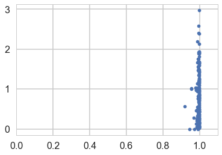
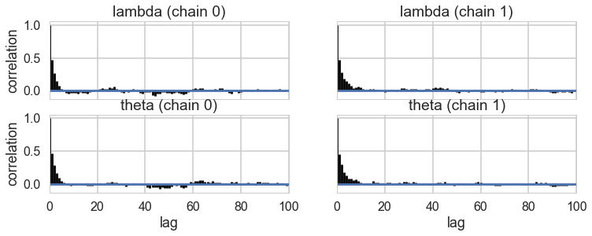



## Contents
{:.no_toc}
*  
{: toc}


```python
%matplotlib inline
import numpy as np
import scipy as sp
import matplotlib as mpl
import matplotlib.cm as cm
import matplotlib.pyplot as plt
import pandas as pd
pd.set_option('display.width', 500)
pd.set_option('display.max_columns', 100)
pd.set_option('display.notebook_repr_html', True)
import seaborn as sns
sns.set_style("whitegrid")
sns.set_context("poster")
import pymc3 as pm
```


    //anaconda/envs/py3l/lib/python3.6/site-packages/h5py/__init__.py:34: FutureWarning: Conversion of the second argument of issubdtype from `float` to `np.floating` is deprecated. In future, it will be treated as `np.float64 == np.dtype(float).type`.
      from ._conv import register_converters as _register_converters


## Monks working on manuscripts

From McElreath:

>Now imagine that the monks take breaks on some days. On those days, no manuscripts are completed. Instead, the wine cellar is opened and more earthly delights are practiced. As the monastery owner, you'd like to know how often the monks drink. The obstacle for inference is that there will be zeros on honest non-drinking days, as well, just by chance. So how can you estimate the number of days spent drinking?


The kind of model used to solve this problem is called a **Mixture Model**. We'll see these in more detail next week, but here is a simple version that arises in Poisson regression.

Let $p$ be the probability that the monks spend the day drinking, and $\lambda$ be the mean number of manuscripts completed, when they work.


### Likelihood

The likelihood of observing 0 manuscripts produced is is:

 $$\cal{L}(y=0) = p + (1-p) e^{-\lambda},$$

since the Poisson likelihood of $y$ is $ \lambda^y exp(–\lambda)/y!$

Likelihood of a non-zero $y$ is:

 $$\cal{L}(y \ne 0) = (1-p) \frac{\lambda^y e^{-\lambda}}{y!}$$

This model can be described by this diagram, taken from Mc-Elreath


### Generating the data

We're throwing bernoullis for whether a given day in the year is a drinking day or not...


```python
from scipy.stats import binom
p_drink=0.2
rate_work=1
N=365
drink=binom.rvs(n=1, p=p_drink, size=N)
drink
```


    array([1, 0, 0, 0, 0, 0, 0, 0, 0, 0, 0, 1, 1, 0, 0, 0, 1, 0, 1, 0, 0, 0,
           0, 0, 0, 0, 0, 1, 0, 0, 1, 0, 1, 0, 0, 0, 1, 1, 0, 0, 1, 0, 0, 0,
           1, 0, 0, 0, 0, 0, 0, 1, 0, 0, 0, 0, 0, 0, 0, 0, 0, 0, 0, 0, 1, 0,
           1, 0, 0, 0, 0, 1, 0, 0, 0, 0, 1, 0, 0, 0, 0, 0, 0, 0, 1, 0, 1, 0,
           1, 1, 1, 0, 0, 0, 0, 0, 0, 0, 0, 0, 0, 0, 0, 0, 1, 0, 0, 0, 1, 0,
           1, 0, 0, 0, 1, 0, 0, 0, 0, 0, 0, 0, 1, 0, 0, 0, 1, 0, 1, 0, 0, 1,
           0, 0, 1, 0, 1, 0, 0, 1, 0, 0, 0, 0, 0, 0, 1, 0, 0, 0, 0, 0, 0, 0,
           0, 1, 0, 0, 0, 0, 0, 0, 0, 0, 0, 0, 0, 0, 0, 0, 0, 0, 0, 1, 0, 0,
           1, 0, 1, 0, 0, 0, 0, 0, 1, 0, 0, 0, 0, 1, 0, 0, 1, 1, 1, 0, 0, 0,
           1, 0, 1, 0, 0, 1, 0, 0, 0, 1, 0, 0, 1, 0, 0, 0, 0, 0, 1, 0, 0, 1,
           0, 1, 1, 0, 1, 0, 0, 0, 1, 0, 0, 0, 0, 0, 0, 0, 0, 1, 1, 0, 0, 0,
           0, 1, 0, 0, 1, 0, 0, 0, 1, 0, 1, 0, 0, 0, 0, 0, 0, 0, 0, 0, 1, 0,
           0, 0, 0, 0, 1, 0, 0, 0, 1, 1, 0, 0, 0, 0, 0, 1, 0, 0, 0, 1, 1, 0,
           0, 0, 0, 0, 0, 0, 0, 0, 1, 0, 0, 0, 0, 0, 0, 0, 0, 0, 0, 0, 1, 0,
           1, 0, 0, 0, 0, 0, 0, 0, 1, 0, 0, 0, 0, 0, 0, 0, 0, 0, 1, 0, 0, 0,
           0, 1, 0, 0, 1, 0, 0, 0, 0, 1, 1, 1, 0, 0, 0, 1, 0, 0, 0, 0, 0, 1,
           0, 0, 0, 0, 1, 1, 0, 0, 0, 0, 0, 1, 0])


On days we dont drink, we produce some work...though it might be 0 work...


```python
from scipy.stats import poisson
y = ( 1 - drink)*poisson.rvs(mu=rate_work, size=N)
y
```


    array([0, 2, 1, 1, 0, 2, 1, 0, 2, 1, 1, 0, 0, 2, 1, 0, 0, 1, 0, 3, 1, 1,
           0, 0, 0, 3, 0, 0, 0, 1, 0, 2, 0, 0, 0, 3, 0, 0, 1, 1, 0, 3, 2, 0,
           0, 2, 1, 0, 2, 0, 0, 0, 0, 1, 1, 2, 0, 0, 0, 0, 0, 0, 2, 3, 0, 1,
           0, 0, 0, 0, 0, 0, 2, 1, 0, 1, 0, 2, 1, 0, 1, 2, 0, 1, 0, 1, 0, 1,
           0, 0, 0, 2, 1, 1, 1, 0, 2, 3, 2, 0, 1, 1, 0, 2, 0, 0, 1, 0, 0, 1,
           0, 1, 2, 1, 0, 2, 1, 1, 0, 0, 0, 2, 0, 2, 1, 1, 0, 1, 0, 2, 1, 0,
           1, 2, 0, 3, 0, 1, 1, 0, 2, 0, 0, 0, 0, 0, 0, 0, 0, 3, 2, 0, 0, 1,
           3, 0, 0, 1, 0, 3, 1, 0, 1, 0, 0, 1, 1, 2, 1, 1, 4, 1, 0, 0, 0, 1,
           0, 0, 0, 1, 2, 0, 1, 2, 0, 1, 2, 0, 2, 0, 1, 1, 0, 0, 0, 0, 1, 0,
           0, 0, 0, 1, 3, 0, 0, 1, 0, 0, 0, 2, 0, 0, 1, 0, 3, 0, 0, 1, 0, 0,
           1, 0, 0, 0, 0, 1, 0, 1, 0, 1, 1, 1, 1, 2, 1, 1, 0, 0, 0, 0, 0, 2,
           0, 0, 0, 0, 0, 1, 0, 0, 0, 0, 0, 0, 0, 2, 2, 2, 1, 3, 2, 2, 0, 0,
           2, 0, 1, 1, 0, 0, 2, 1, 0, 0, 1, 0, 1, 1, 1, 0, 0, 3, 0, 0, 0, 0,
           1, 1, 3, 1, 0, 2, 3, 1, 0, 0, 1, 1, 2, 0, 1, 0, 2, 0, 1, 1, 0, 1,
           0, 2, 0, 1, 3, 1, 2, 2, 0, 0, 0, 0, 3, 0, 0, 0, 2, 0, 0, 2, 0, 2,
           2, 0, 2, 0, 0, 0, 0, 2, 1, 0, 0, 0, 2, 2, 1, 0, 1, 1, 1, 3, 0, 0,
           0, 4, 0, 0, 0, 0, 1, 1, 3, 2, 0, 0, 3])


Lets manufacture a histogram of manuscripts produced in a day.


```python
zeros_drink=np.sum(drink)
a=drink==0
b=y==0
zeros_work=np.sum(a & b)
zeros_drink, zeros_work, np.sum(b)
```


    (82, 107, 189)


```python
plt.hist(zeros_work*[0], bins=np.arange(10))
plt.hist(y, bins=np.arange(10), alpha=0.5)
```


    (array([189.,  98.,  55.,  21.,   2.,   0.,   0.,   0.,   0.]),
     array([0, 1, 2, 3, 4, 5, 6, 7, 8, 9]),
     <a list of 9 Patch objects>)


### Lets throw in some domain expertise

*A survey of Abbey Heads has told us, that the most a monk could produce, ever, was 10 manuscripts in a day.*

## First model: just do a simple poisson


```python
import theano.tensor as t
```


```python
def model_poisson(observed=False):
    with pm.Model() as model:
        lam=pm.HalfNormal("lambda", 100)
        like = pm.Poisson("obsv", mu=lam, observed=observed)
    return model
```


```python
model0 = model_poisson(observed=y)
```


```python
with model0:
    trace0=pm.sample(3000, tune=1000)
```


    Auto-assigning NUTS sampler...
    Initializing NUTS using jitter+adapt_diag...
    Multiprocess sampling (2 chains in 2 jobs)
    NUTS: [lambda]
    Sampling 2 chains: 100%|██████████| 8000/8000 [00:03<00:00, 2301.56draws/s]


```python
pm.traceplot(trace0)
```


    //anaconda/envs/py3l/lib/python3.6/site-packages/matplotlib/axes/_base.py:3604: MatplotlibDeprecationWarning: 
    The `ymin` argument was deprecated in Matplotlib 3.0 and will be removed in 3.2. Use `bottom` instead.
      alternative='`bottom`', obj_type='argument')


    array([[<matplotlib.axes._subplots.AxesSubplot object at 0x125d3d9e8>,
            <matplotlib.axes._subplots.AxesSubplot object at 0x1259d7c18>]],
          dtype=object)


```python
pm.summary(trace0)
```


<div>
<style scoped>
    .dataframe tbody tr th:only-of-type {
        vertical-align: middle;
    }

    .dataframe tbody tr th {
        vertical-align: top;
    }

    .dataframe thead th {
        text-align: right;
    }
</style>
<table border="1" class="dataframe">
  <thead>
    <tr style="text-align: right;">
      <th></th>
      <th>mean</th>
      <th>sd</th>
      <th>mc_error</th>
      <th>hpd_2.5</th>
      <th>hpd_97.5</th>
      <th>n_eff</th>
      <th>Rhat</th>
    </tr>
  </thead>
  <tbody>
    <tr>
      <th>lambda</th>
      <td>0.765773</td>
      <td>0.045322</td>
      <td>0.000949</td>
      <td>0.673305</td>
      <td>0.850332</td>
      <td>2366.278381</td>
      <td>1.000073</td>
    </tr>
  </tbody>
</table>
</div>


```python
from scipy import stats
lbda  = np.linspace(0, 200, num=1000)
normpdf = stats.norm(loc=0,scale=100).pdf(lbda)
plt.plot(lbda, normpdf, lw=2)
plt.xlabel("lambda"); 
plt.ylabel("Prior Density");
plt.fill_between(lbda,0.,normpdf)
plt.axvline(10, 0 ,1, c="r", lw=3);
```


### Some proper workflow

Notice the prior specification though: at the 3$\sigma$ level, $\lambda$ could range from 0 to 300, ie from 0 to an extremely large number to an extremely large "mean" of counts. Not possible. Indeed, the max count is around 10. For a poisson, since the variance is equal to the mean, this means that (at 3$\sigma):

$$max(\lambda + 3\sqrt{\lambda}) < 10$$

Any prior should only take us marginally outside this range:


```python
4+3*np.sqrt(4)
```


    10.0


```python
from scipy import stats
lbda  = np.linspace(0, 20, num=1000)
normpdf = stats.norm(loc=0,scale=4).pdf(lbda)
plt.plot(lbda, normpdf, lw=2)
plt.xlabel("lambda"); 
plt.ylabel("Prior Density");
plt.fill_between(lbda,0.,normpdf)
plt.axvline(10, 0 ,1, c="r", lw=3);
```


```python
pois = stats.poisson.rvs(stats.halfnorm(scale=4).rvs(1000))
plt.hist(pois)
```


    (array([331., 278., 104., 138.,  39.,  59.,  26.,  10.,  11.,   4.]),
     array([ 0. ,  1.6,  3.2,  4.8,  6.4,  8. ,  9.6, 11.2, 12.8, 14.4, 16. ]),
     <a list of 10 Patch objects>)


```python
np.mean(pois > 10)
```


    0.036


### Limiting the prior

Thus a prior should mainly limit $\lambda$ to values upto 4. To so this consider:


```python
from scipy.stats import halfnorm
halfnorm.ppf(0.99, loc=0,scale=4)
```


    10.303317214195602


```python
def model_poisson1(sd, datasize, observed=False):
    with pm.Model() as model:
        lam=pm.HalfNormal("lambda", sd)
        like = pm.Poisson("obsv", mu=lam, shape = datasize, observed=observed)
    return model
```


### Simulating the Bayesian Joint distribution

This should be way enough!, So lets go again:


```python
N = y.shape[0]
N
```


    365


```python
simu_lbdas = stats.halfnorm(scale=4).rvs(500)
simy = np.zeros((500, y.shape[0]))
for i in range(500):
    simy[i,:] = stats.poisson(simu_lbdas[i]).rvs(y.shape[0])
```


```python
x_max = 21
bins = np.arange(0,x_max)
hists = np.apply_along_axis(lambda a: np.histogram(a, bins=bins)[0], 1, simy)
```


```python
hists.shape #500 rows with 20 cols
```


    (500, 20)


```python
np.linspace(10,90,num=9, dtype=int)
```


    array([10, 20, 30, 40, 50, 60, 70, 80, 90])


```python
prctiles = np.percentile(hists,np.linspace(10,90,num=9, dtype=int),axis=0)
```


```python
bin_interp = np.linspace(0,x_max-1,num=(x_max-1)*10)
bin_interp
```


    array([ 0.        ,  0.10050251,  0.20100503,  0.30150754,  0.40201005,
            0.50251256,  0.60301508,  0.70351759,  0.8040201 ,  0.90452261,
            1.00502513,  1.10552764,  1.20603015,  1.30653266,  1.40703518,
            1.50753769,  1.6080402 ,  1.70854271,  1.80904523,  1.90954774,
            2.01005025,  2.11055276,  2.21105528,  2.31155779,  2.4120603 ,
            2.51256281,  2.61306533,  2.71356784,  2.81407035,  2.91457286,
            3.01507538,  3.11557789,  3.2160804 ,  3.31658291,  3.41708543,
            3.51758794,  3.61809045,  3.71859296,  3.81909548,  3.91959799,
            4.0201005 ,  4.12060302,  4.22110553,  4.32160804,  4.42211055,
            4.52261307,  4.62311558,  4.72361809,  4.8241206 ,  4.92462312,
            5.02512563,  5.12562814,  5.22613065,  5.32663317,  5.42713568,
            5.52763819,  5.6281407 ,  5.72864322,  5.82914573,  5.92964824,
            6.03015075,  6.13065327,  6.23115578,  6.33165829,  6.4321608 ,
            6.53266332,  6.63316583,  6.73366834,  6.83417085,  6.93467337,
            7.03517588,  7.13567839,  7.2361809 ,  7.33668342,  7.43718593,
            7.53768844,  7.63819095,  7.73869347,  7.83919598,  7.93969849,
            8.04020101,  8.14070352,  8.24120603,  8.34170854,  8.44221106,
            8.54271357,  8.64321608,  8.74371859,  8.84422111,  8.94472362,
            9.04522613,  9.14572864,  9.24623116,  9.34673367,  9.44723618,
            9.54773869,  9.64824121,  9.74874372,  9.84924623,  9.94974874,
           10.05025126, 10.15075377, 10.25125628, 10.35175879, 10.45226131,
           10.55276382, 10.65326633, 10.75376884, 10.85427136, 10.95477387,
           11.05527638, 11.15577889, 11.25628141, 11.35678392, 11.45728643,
           11.55778894, 11.65829146, 11.75879397, 11.85929648, 11.95979899,
           12.06030151, 12.16080402, 12.26130653, 12.36180905, 12.46231156,
           12.56281407, 12.66331658, 12.7638191 , 12.86432161, 12.96482412,
           13.06532663, 13.16582915, 13.26633166, 13.36683417, 13.46733668,
           13.5678392 , 13.66834171, 13.76884422, 13.86934673, 13.96984925,
           14.07035176, 14.17085427, 14.27135678, 14.3718593 , 14.47236181,
           14.57286432, 14.67336683, 14.77386935, 14.87437186, 14.97487437,
           15.07537688, 15.1758794 , 15.27638191, 15.37688442, 15.47738693,
           15.57788945, 15.67839196, 15.77889447, 15.87939698, 15.9798995 ,
           16.08040201, 16.18090452, 16.28140704, 16.38190955, 16.48241206,
           16.58291457, 16.68341709, 16.7839196 , 16.88442211, 16.98492462,
           17.08542714, 17.18592965, 17.28643216, 17.38693467, 17.48743719,
           17.5879397 , 17.68844221, 17.78894472, 17.88944724, 17.98994975,
           18.09045226, 18.19095477, 18.29145729, 18.3919598 , 18.49246231,
           18.59296482, 18.69346734, 18.79396985, 18.89447236, 18.99497487,
           19.09547739, 19.1959799 , 19.29648241, 19.39698492, 19.49748744,
           19.59798995, 19.69849246, 19.79899497, 19.89949749, 20.        ])


```python
prctiles_interp = np.repeat(prctiles, 10,axis=1)
```


```python
c_light ="#DCBCBC"
c_light_highlight ="#C79999"
c_mid ="#B97C7C"
c_mid_highlight ="#A25050"
c_dark ="#8F2727"
c_dark_highlight ="#7C0000"
for i,color in enumerate([c_light,c_light_highlight,c_mid,c_mid_highlight]):
    plt.fill_between(bin_interp,prctiles_interp[i,:],prctiles_interp[-1-i,:],alpha=1.0,color=color);


plt.plot(bin_interp,prctiles_interp[4,:],color=c_dark_highlight);
plt.axvline(x=10,ls='-',lw=2,color='k');
plt.xlabel('y');
plt.title('Prior predictive distribution');
```


```python
plt.plot(simu_lbdas);
```


```python
R=200 #number of replications we choose for simulation based callibration
choices = np.random.choice(simu_lbdas.shape[0], R)
choices
```


    array([101, 246, 476, 231, 170, 234,  14,  22, 116, 137, 222, 488, 396,
           179, 478, 357, 166, 225, 303,  18, 113, 148, 398, 243, 373, 256,
           145, 173, 381,  80, 272, 364,  67, 400, 293, 219, 308,  81,  51,
            81, 162, 434, 204, 324, 327, 394, 444, 440, 317, 142, 125, 337,
           400, 315, 186, 208,  58, 344, 321,  92, 362, 490, 274, 318, 162,
           243,  19,  51,  60,  76, 495,  30, 179, 317, 109, 489, 132, 408,
           427, 245,  91, 314,  69, 384,  15, 181, 360, 335, 386, 228,   9,
           177, 383, 445,   7, 109,  10, 153,  91,  72, 422,  87,  33,  70,
           336, 421, 496, 297,  62, 439, 432, 154, 117, 397,  97, 148, 142,
            83, 337, 490,  28,  41,  26,  25, 488, 103, 406, 404, 379, 311,
           135, 332,  38, 285, 147, 173, 292,  10, 247, 205, 178, 360, 222,
           232,  25, 311,  73, 481, 308, 375, 464,  18, 218,  60, 478, 336,
           479, 351, 323, 444, 147, 251,  82, 312, 217, 152, 260, 321, 346,
           384, 133,  82, 196, 334, 178, 292, 234, 137, 374, 128, 160, 435,
           358, 165,  88,  23, 300, 400, 143,  18, 105,  49, 361, 155,  19,
           273, 109, 399, 139, 385])


```python
plt.plot(simu_lbdas, alpha=0.3)
plt.plot(choices, simu_lbdas[choices], 'o')
```


    [<matplotlib.lines.Line2D at 0x124f3e9e8>]


```python
simlamsmall = simu_lbdas[choices]
simysmall = simy[choices,:]
simysmall.shape
```


    (200, 365)


```python
junkm = model_poisson1(4, y.shape[0], observed=simy[53,:])
with junkm:
    junkt = pm.sample(3000, tune=1000)
```


    Auto-assigning NUTS sampler...
    Initializing NUTS using jitter+adapt_diag...
    Multiprocess sampling (2 chains in 2 jobs)
    NUTS: [lambda]
    Sampling 2 chains: 100%|██████████| 8000/8000 [00:03<00:00, 2296.78draws/s]


```python
simu_lbdas[53]
```


    1.4991225903545407


```python
pm.traceplot(junkt)
```


    //anaconda/envs/py3l/lib/python3.6/site-packages/matplotlib/axes/_base.py:3604: MatplotlibDeprecationWarning: 
    The `ymin` argument was deprecated in Matplotlib 3.0 and will be removed in 3.2. Use `bottom` instead.
      alternative='`bottom`', obj_type='argument')


    array([[<matplotlib.axes._subplots.AxesSubplot object at 0x1253cfda0>,
            <matplotlib.axes._subplots.AxesSubplot object at 0x1254e8c50>]],
          dtype=object)


```python
pm.summary(junkt)
```


<div>
<style scoped>
    .dataframe tbody tr th:only-of-type {
        vertical-align: middle;
    }

    .dataframe tbody tr th {
        vertical-align: top;
    }

    .dataframe thead th {
        text-align: right;
    }
</style>
<table border="1" class="dataframe">
  <thead>
    <tr style="text-align: right;">
      <th></th>
      <th>mean</th>
      <th>sd</th>
      <th>mc_error</th>
      <th>hpd_2.5</th>
      <th>hpd_97.5</th>
      <th>n_eff</th>
      <th>Rhat</th>
    </tr>
  </thead>
  <tbody>
    <tr>
      <th>lambda</th>
      <td>1.548423</td>
      <td>0.0658</td>
      <td>0.001263</td>
      <td>1.424511</td>
      <td>1.68153</td>
      <td>2442.392751</td>
      <td>0.999848</td>
    </tr>
  </tbody>
</table>
</div>


```python
junkt.report.ok
```


    True


```python
sbcpost = np.zeros((R, 6000))
problems = [False]*R
summaries = []
for i in range(R):
    m = model_poisson1(4, y.shape[0], observed=simysmall[i,:])
    junkt = pm.sample(3000, tune=1000, model=m, progressbar=False)
    sbcpost[i,:] = junkt['lambda']
    s = pm.stats.summary(junkt,varnames=['lambda'])
    summaries.append(s)
    problems[i] = junkt.report.ok
```


    Auto-assigning NUTS sampler...
    Initializing NUTS using jitter+adapt_diag...
    Multiprocess sampling (2 chains in 2 jobs)
    NUTS: [lambda]
    Auto-assigning NUTS sampler...
    Initializing NUTS using jitter+adapt_diag...
    Multiprocess sampling (2 chains in 2 jobs)
    NUTS: [lambda]
    The acceptance probability does not match the target. It is 0.8808644421197311, but should be close to 0.8. Try to increase the number of tuning steps.
    Auto-assigning NUTS sampler...
    Initializing NUTS using jitter+adapt_diag...
    Multiprocess sampling (2 chains in 2 jobs)
    NUTS: [lambda]
    Auto-assigning NUTS sampler...
    Initializing NUTS using jitter+adapt_diag...
    Multiprocess sampling (2 chains in 2 jobs)
    NUTS: [lambda]
    Auto-assigning NUTS sampler...
    Initializing NUTS using jitter+adapt_diag...
    Multiprocess sampling (2 chains in 2 jobs)
    NUTS: [lambda]
    Auto-assigning NUTS sampler...
    Initializing NUTS using jitter+adapt_diag...
    Multiprocess sampling (2 chains in 2 jobs)
    NUTS: [lambda]
    Auto-assigning NUTS sampler...
    Initializing NUTS using jitter+adapt_diag...
    Multiprocess sampling (2 chains in 2 jobs)
    NUTS: [lambda]
    Auto-assigning NUTS sampler...
    Initializing NUTS using jitter+adapt_diag...
    Multiprocess sampling (2 chains in 2 jobs)
    NUTS: [lambda]
    Auto-assigning NUTS sampler...
    Initializing NUTS using jitter+adapt_diag...
    Multiprocess sampling (2 chains in 2 jobs)
    NUTS: [lambda]
    Auto-assigning NUTS sampler...
    Initializing NUTS using jitter+adapt_diag...
    Multiprocess sampling (2 chains in 2 jobs)
    NUTS: [lambda]
    Auto-assigning NUTS sampler...
    Initializing NUTS using jitter+adapt_diag...
    Multiprocess sampling (2 chains in 2 jobs)
    NUTS: [lambda]
    Auto-assigning NUTS sampler...
    Initializing NUTS using jitter+adapt_diag...
    Multiprocess sampling (2 chains in 2 jobs)
    NUTS: [lambda]
    Auto-assigning NUTS sampler...
    Initializing NUTS using jitter+adapt_diag...
    Multiprocess sampling (2 chains in 2 jobs)
    NUTS: [lambda]
    Auto-assigning NUTS sampler...
    Initializing NUTS using jitter+adapt_diag...
    Multiprocess sampling (2 chains in 2 jobs)
    NUTS: [lambda]
    Auto-assigning NUTS sampler...
    Initializing NUTS using jitter+adapt_diag...
    Multiprocess sampling (2 chains in 2 jobs)
    NUTS: [lambda]
    Auto-assigning NUTS sampler...
    Initializing NUTS using jitter+adapt_diag...
    Multiprocess sampling (2 chains in 2 jobs)
    NUTS: [lambda]
    Auto-assigning NUTS sampler...
    Initializing NUTS using jitter+adapt_diag...
    Multiprocess sampling (2 chains in 2 jobs)
    NUTS: [lambda]
    Auto-assigning NUTS sampler...
    Initializing NUTS using jitter+adapt_diag...
    Multiprocess sampling (2 chains in 2 jobs)
    NUTS: [lambda]
    Auto-assigning NUTS sampler...
    Initializing NUTS using jitter+adapt_diag...
    Multiprocess sampling (2 chains in 2 jobs)
    NUTS: [lambda]
    Auto-assigning NUTS sampler...
    Initializing NUTS using jitter+adapt_diag...
    Multiprocess sampling (2 chains in 2 jobs)
    NUTS: [lambda]
    Auto-assigning NUTS sampler...
    Initializing NUTS using jitter+adapt_diag...
    Multiprocess sampling (2 chains in 2 jobs)
    NUTS: [lambda]
    Auto-assigning NUTS sampler...
    Initializing NUTS using jitter+adapt_diag...
    Multiprocess sampling (2 chains in 2 jobs)
    NUTS: [lambda]
    Auto-assigning NUTS sampler...
    Initializing NUTS using jitter+adapt_diag...
    Multiprocess sampling (2 chains in 2 jobs)
    NUTS: [lambda]
    Auto-assigning NUTS sampler...
    Initializing NUTS using jitter+adapt_diag...
    Multiprocess sampling (2 chains in 2 jobs)
    NUTS: [lambda]
    The acceptance probability does not match the target. It is 0.8850739521121844, but should be close to 0.8. Try to increase the number of tuning steps.
    Auto-assigning NUTS sampler...
    Initializing NUTS using jitter+adapt_diag...
    Multiprocess sampling (2 chains in 2 jobs)
    NUTS: [lambda]
    Auto-assigning NUTS sampler...
    Initializing NUTS using jitter+adapt_diag...
    Multiprocess sampling (2 chains in 2 jobs)
    NUTS: [lambda]
    Auto-assigning NUTS sampler...
    Initializing NUTS using jitter+adapt_diag...
    Multiprocess sampling (2 chains in 2 jobs)
    NUTS: [lambda]
    Auto-assigning NUTS sampler...
    Initializing NUTS using jitter+adapt_diag...
    Multiprocess sampling (2 chains in 2 jobs)
    NUTS: [lambda]
    Auto-assigning NUTS sampler...
    Initializing NUTS using jitter+adapt_diag...
    Multiprocess sampling (2 chains in 2 jobs)
    NUTS: [lambda]
    Auto-assigning NUTS sampler...
    Initializing NUTS using jitter+adapt_diag...
    Multiprocess sampling (2 chains in 2 jobs)
    NUTS: [lambda]
    Auto-assigning NUTS sampler...
    Initializing NUTS using jitter+adapt_diag...
    Multiprocess sampling (2 chains in 2 jobs)
    NUTS: [lambda]
    Auto-assigning NUTS sampler...
    Initializing NUTS using jitter+adapt_diag...
    Multiprocess sampling (2 chains in 2 jobs)
    NUTS: [lambda]
    Auto-assigning NUTS sampler...
    Initializing NUTS using jitter+adapt_diag...
    Multiprocess sampling (2 chains in 2 jobs)
    NUTS: [lambda]
    The acceptance probability does not match the target. It is 0.8799328719829247, but should be close to 0.8. Try to increase the number of tuning steps.
    Auto-assigning NUTS sampler...
    Initializing NUTS using jitter+adapt_diag...
    Multiprocess sampling (2 chains in 2 jobs)
    NUTS: [lambda]
    The acceptance probability does not match the target. It is 0.8892105164158448, but should be close to 0.8. Try to increase the number of tuning steps.
    Auto-assigning NUTS sampler...
    Initializing NUTS using jitter+adapt_diag...
    Multiprocess sampling (2 chains in 2 jobs)
    NUTS: [lambda]
    Auto-assigning NUTS sampler...
    Initializing NUTS using jitter+adapt_diag...
    Multiprocess sampling (2 chains in 2 jobs)
    NUTS: [lambda]
    Auto-assigning NUTS sampler...
    Initializing NUTS using jitter+adapt_diag...
    Multiprocess sampling (2 chains in 2 jobs)
    NUTS: [lambda]
    Auto-assigning NUTS sampler...
    Initializing NUTS using jitter+adapt_diag...
    Multiprocess sampling (2 chains in 2 jobs)
    NUTS: [lambda]
    Auto-assigning NUTS sampler...
    Initializing NUTS using jitter+adapt_diag...
    Multiprocess sampling (2 chains in 2 jobs)
    NUTS: [lambda]
    Auto-assigning NUTS sampler...
    Initializing NUTS using jitter+adapt_diag...
    Multiprocess sampling (2 chains in 2 jobs)
    NUTS: [lambda]
    Auto-assigning NUTS sampler...
    Initializing NUTS using jitter+adapt_diag...
    Multiprocess sampling (2 chains in 2 jobs)
    NUTS: [lambda]
    Auto-assigning NUTS sampler...
    Initializing NUTS using jitter+adapt_diag...
    Multiprocess sampling (2 chains in 2 jobs)
    NUTS: [lambda]
    Auto-assigning NUTS sampler...
    Initializing NUTS using jitter+adapt_diag...
    Multiprocess sampling (2 chains in 2 jobs)
    NUTS: [lambda]
    Auto-assigning NUTS sampler...
    Initializing NUTS using jitter+adapt_diag...
    Multiprocess sampling (2 chains in 2 jobs)
    NUTS: [lambda]
    Auto-assigning NUTS sampler...
    Initializing NUTS using jitter+adapt_diag...
    Multiprocess sampling (2 chains in 2 jobs)
    NUTS: [lambda]
    Auto-assigning NUTS sampler...
    Initializing NUTS using jitter+adapt_diag...
    Multiprocess sampling (2 chains in 2 jobs)
    NUTS: [lambda]
    Auto-assigning NUTS sampler...
    Initializing NUTS using jitter+adapt_diag...
    Multiprocess sampling (2 chains in 2 jobs)
    NUTS: [lambda]
    The acceptance probability does not match the target. It is 0.8840274090594865, but should be close to 0.8. Try to increase the number of tuning steps.
    Auto-assigning NUTS sampler...
    Initializing NUTS using jitter+adapt_diag...
    Multiprocess sampling (2 chains in 2 jobs)
    NUTS: [lambda]
    Auto-assigning NUTS sampler...
    Initializing NUTS using jitter+adapt_diag...
    Multiprocess sampling (2 chains in 2 jobs)
    NUTS: [lambda]
    Auto-assigning NUTS sampler...
    Initializing NUTS using jitter+adapt_diag...
    Multiprocess sampling (2 chains in 2 jobs)
    NUTS: [lambda]
    Auto-assigning NUTS sampler...
    Initializing NUTS using jitter+adapt_diag...
    Multiprocess sampling (2 chains in 2 jobs)
    NUTS: [lambda]
    Auto-assigning NUTS sampler...
    Initializing NUTS using jitter+adapt_diag...
    Multiprocess sampling (2 chains in 2 jobs)
    NUTS: [lambda]
    Auto-assigning NUTS sampler...
    Initializing NUTS using jitter+adapt_diag...
    Multiprocess sampling (2 chains in 2 jobs)
    NUTS: [lambda]
    Auto-assigning NUTS sampler...
    Initializing NUTS using jitter+adapt_diag...
    Multiprocess sampling (2 chains in 2 jobs)
    NUTS: [lambda]
    Auto-assigning NUTS sampler...
    Initializing NUTS using jitter+adapt_diag...
    Multiprocess sampling (2 chains in 2 jobs)
    NUTS: [lambda]
    Auto-assigning NUTS sampler...
    Initializing NUTS using jitter+adapt_diag...
    Multiprocess sampling (2 chains in 2 jobs)
    NUTS: [lambda]
    Auto-assigning NUTS sampler...
    Initializing NUTS using jitter+adapt_diag...
    Multiprocess sampling (2 chains in 2 jobs)
    NUTS: [lambda]
    Auto-assigning NUTS sampler...
    Initializing NUTS using jitter+adapt_diag...
    Multiprocess sampling (2 chains in 2 jobs)
    NUTS: [lambda]
    Auto-assigning NUTS sampler...
    Initializing NUTS using jitter+adapt_diag...
    Multiprocess sampling (2 chains in 2 jobs)
    NUTS: [lambda]
    Auto-assigning NUTS sampler...
    Initializing NUTS using jitter+adapt_diag...
    Multiprocess sampling (2 chains in 2 jobs)
    NUTS: [lambda]
    Auto-assigning NUTS sampler...
    Initializing NUTS using jitter+adapt_diag...
    Multiprocess sampling (2 chains in 2 jobs)
    NUTS: [lambda]
    Auto-assigning NUTS sampler...
    Initializing NUTS using jitter+adapt_diag...
    Multiprocess sampling (2 chains in 2 jobs)
    NUTS: [lambda]
    The acceptance probability does not match the target. It is 0.8863016117603773, but should be close to 0.8. Try to increase the number of tuning steps.
    Auto-assigning NUTS sampler...
    Initializing NUTS using jitter+adapt_diag...
    Multiprocess sampling (2 chains in 2 jobs)
    NUTS: [lambda]
    Auto-assigning NUTS sampler...
    Initializing NUTS using jitter+adapt_diag...
    Multiprocess sampling (2 chains in 2 jobs)
    NUTS: [lambda]
    Auto-assigning NUTS sampler...
    Initializing NUTS using jitter+adapt_diag...
    Multiprocess sampling (2 chains in 2 jobs)
    NUTS: [lambda]
    Auto-assigning NUTS sampler...
    Initializing NUTS using jitter+adapt_diag...
    Multiprocess sampling (2 chains in 2 jobs)
    NUTS: [lambda]
    Auto-assigning NUTS sampler...
    Initializing NUTS using jitter+adapt_diag...
    Multiprocess sampling (2 chains in 2 jobs)
    NUTS: [lambda]
    Auto-assigning NUTS sampler...
    Initializing NUTS using jitter+adapt_diag...
    Multiprocess sampling (2 chains in 2 jobs)
    NUTS: [lambda]
    Auto-assigning NUTS sampler...
    Initializing NUTS using jitter+adapt_diag...
    Multiprocess sampling (2 chains in 2 jobs)
    NUTS: [lambda]
    Auto-assigning NUTS sampler...
    Initializing NUTS using jitter+adapt_diag...
    Multiprocess sampling (2 chains in 2 jobs)
    NUTS: [lambda]
    Auto-assigning NUTS sampler...
    Initializing NUTS using jitter+adapt_diag...
    Multiprocess sampling (2 chains in 2 jobs)
    NUTS: [lambda]
    The acceptance probability does not match the target. It is 0.8805545550860793, but should be close to 0.8. Try to increase the number of tuning steps.
    Auto-assigning NUTS sampler...
    Initializing NUTS using jitter+adapt_diag...
    Multiprocess sampling (2 chains in 2 jobs)
    NUTS: [lambda]
    Auto-assigning NUTS sampler...
    Initializing NUTS using jitter+adapt_diag...
    Multiprocess sampling (2 chains in 2 jobs)
    NUTS: [lambda]
    Auto-assigning NUTS sampler...
    Initializing NUTS using jitter+adapt_diag...
    Multiprocess sampling (2 chains in 2 jobs)
    NUTS: [lambda]
    Auto-assigning NUTS sampler...
    Initializing NUTS using jitter+adapt_diag...
    Multiprocess sampling (2 chains in 2 jobs)
    NUTS: [lambda]
    Auto-assigning NUTS sampler...
    Initializing NUTS using jitter+adapt_diag...
    Multiprocess sampling (2 chains in 2 jobs)
    NUTS: [lambda]
    Auto-assigning NUTS sampler...
    Initializing NUTS using jitter+adapt_diag...
    Multiprocess sampling (2 chains in 2 jobs)
    NUTS: [lambda]
    Auto-assigning NUTS sampler...
    Initializing NUTS using jitter+adapt_diag...
    Multiprocess sampling (2 chains in 2 jobs)
    NUTS: [lambda]
    Auto-assigning NUTS sampler...
    Initializing NUTS using jitter+adapt_diag...
    Multiprocess sampling (2 chains in 2 jobs)
    NUTS: [lambda]
    Auto-assigning NUTS sampler...
    Initializing NUTS using jitter+adapt_diag...
    Multiprocess sampling (2 chains in 2 jobs)
    NUTS: [lambda]
    Auto-assigning NUTS sampler...
    Initializing NUTS using jitter+adapt_diag...
    Multiprocess sampling (2 chains in 2 jobs)
    NUTS: [lambda]
    Auto-assigning NUTS sampler...
    Initializing NUTS using jitter+adapt_diag...
    Multiprocess sampling (2 chains in 2 jobs)
    NUTS: [lambda]
    Auto-assigning NUTS sampler...
    Initializing NUTS using jitter+adapt_diag...
    Multiprocess sampling (2 chains in 2 jobs)
    NUTS: [lambda]
    Auto-assigning NUTS sampler...
    Initializing NUTS using jitter+adapt_diag...
    Multiprocess sampling (2 chains in 2 jobs)
    NUTS: [lambda]
    Auto-assigning NUTS sampler...
    Initializing NUTS using jitter+adapt_diag...
    Multiprocess sampling (2 chains in 2 jobs)
    NUTS: [lambda]
    Auto-assigning NUTS sampler...
    Initializing NUTS using jitter+adapt_diag...
    Multiprocess sampling (2 chains in 2 jobs)
    NUTS: [lambda]
    Auto-assigning NUTS sampler...
    Initializing NUTS using jitter+adapt_diag...
    Multiprocess sampling (2 chains in 2 jobs)
    NUTS: [lambda]
    Auto-assigning NUTS sampler...
    Initializing NUTS using jitter+adapt_diag...
    Multiprocess sampling (2 chains in 2 jobs)
    NUTS: [lambda]
    Auto-assigning NUTS sampler...
    Initializing NUTS using jitter+adapt_diag...
    Multiprocess sampling (2 chains in 2 jobs)
    NUTS: [lambda]
    Auto-assigning NUTS sampler...
    Initializing NUTS using jitter+adapt_diag...
    Multiprocess sampling (2 chains in 2 jobs)
    NUTS: [lambda]
    Auto-assigning NUTS sampler...
    Initializing NUTS using jitter+adapt_diag...
    Multiprocess sampling (2 chains in 2 jobs)
    NUTS: [lambda]
    Auto-assigning NUTS sampler...
    Initializing NUTS using jitter+adapt_diag...
    Multiprocess sampling (2 chains in 2 jobs)
    NUTS: [lambda]
    Auto-assigning NUTS sampler...
    Initializing NUTS using jitter+adapt_diag...
    Multiprocess sampling (2 chains in 2 jobs)
    NUTS: [lambda]
    Auto-assigning NUTS sampler...
    Initializing NUTS using jitter+adapt_diag...
    Multiprocess sampling (2 chains in 2 jobs)
    NUTS: [lambda]
    Auto-assigning NUTS sampler...
    Initializing NUTS using jitter+adapt_diag...
    Multiprocess sampling (2 chains in 2 jobs)
    NUTS: [lambda]
    Auto-assigning NUTS sampler...
    Initializing NUTS using jitter+adapt_diag...
    Multiprocess sampling (2 chains in 2 jobs)
    NUTS: [lambda]
    Auto-assigning NUTS sampler...
    Initializing NUTS using jitter+adapt_diag...
    Multiprocess sampling (2 chains in 2 jobs)
    NUTS: [lambda]
    Auto-assigning NUTS sampler...
    Initializing NUTS using jitter+adapt_diag...
    Multiprocess sampling (2 chains in 2 jobs)
    NUTS: [lambda]
    Auto-assigning NUTS sampler...
    Initializing NUTS using jitter+adapt_diag...
    Multiprocess sampling (2 chains in 2 jobs)
    NUTS: [lambda]
    Auto-assigning NUTS sampler...
    Initializing NUTS using jitter+adapt_diag...
    Multiprocess sampling (2 chains in 2 jobs)
    NUTS: [lambda]
    Auto-assigning NUTS sampler...
    Initializing NUTS using jitter+adapt_diag...
    Multiprocess sampling (2 chains in 2 jobs)
    NUTS: [lambda]
    Auto-assigning NUTS sampler...
    Initializing NUTS using jitter+adapt_diag...
    Multiprocess sampling (2 chains in 2 jobs)
    NUTS: [lambda]
    Auto-assigning NUTS sampler...
    Initializing NUTS using jitter+adapt_diag...
    Multiprocess sampling (2 chains in 2 jobs)
    NUTS: [lambda]
    Auto-assigning NUTS sampler...
    Initializing NUTS using jitter+adapt_diag...
    Multiprocess sampling (2 chains in 2 jobs)
    NUTS: [lambda]
    Auto-assigning NUTS sampler...
    Initializing NUTS using jitter+adapt_diag...
    Multiprocess sampling (2 chains in 2 jobs)
    NUTS: [lambda]
    Auto-assigning NUTS sampler...
    Initializing NUTS using jitter+adapt_diag...
    Multiprocess sampling (2 chains in 2 jobs)
    NUTS: [lambda]
    Auto-assigning NUTS sampler...
    Initializing NUTS using jitter+adapt_diag...
    Multiprocess sampling (2 chains in 2 jobs)
    NUTS: [lambda]
    Auto-assigning NUTS sampler...
    Initializing NUTS using jitter+adapt_diag...
    Multiprocess sampling (2 chains in 2 jobs)
    NUTS: [lambda]
    Auto-assigning NUTS sampler...
    Initializing NUTS using jitter+adapt_diag...
    Multiprocess sampling (2 chains in 2 jobs)
    NUTS: [lambda]
    Auto-assigning NUTS sampler...
    Initializing NUTS using jitter+adapt_diag...
    Multiprocess sampling (2 chains in 2 jobs)
    NUTS: [lambda]
    Auto-assigning NUTS sampler...
    Initializing NUTS using jitter+adapt_diag...
    Multiprocess sampling (2 chains in 2 jobs)
    NUTS: [lambda]
    Auto-assigning NUTS sampler...
    Initializing NUTS using jitter+adapt_diag...
    Multiprocess sampling (2 chains in 2 jobs)
    NUTS: [lambda]
    Auto-assigning NUTS sampler...
    Initializing NUTS using jitter+adapt_diag...
    Multiprocess sampling (2 chains in 2 jobs)
    NUTS: [lambda]
    Auto-assigning NUTS sampler...
    Initializing NUTS using jitter+adapt_diag...
    Multiprocess sampling (2 chains in 2 jobs)
    NUTS: [lambda]
    Auto-assigning NUTS sampler...
    Initializing NUTS using jitter+adapt_diag...
    Multiprocess sampling (2 chains in 2 jobs)
    NUTS: [lambda]
    Auto-assigning NUTS sampler...
    Initializing NUTS using jitter+adapt_diag...
    Multiprocess sampling (2 chains in 2 jobs)
    NUTS: [lambda]
    Auto-assigning NUTS sampler...
    Initializing NUTS using jitter+adapt_diag...
    Multiprocess sampling (2 chains in 2 jobs)
    NUTS: [lambda]
    Auto-assigning NUTS sampler...
    Initializing NUTS using jitter+adapt_diag...
    Multiprocess sampling (2 chains in 2 jobs)
    NUTS: [lambda]
    The acceptance probability does not match the target. It is 0.8843428382706925, but should be close to 0.8. Try to increase the number of tuning steps.
    Auto-assigning NUTS sampler...
    Initializing NUTS using jitter+adapt_diag...
    Multiprocess sampling (2 chains in 2 jobs)
    NUTS: [lambda]
    Auto-assigning NUTS sampler...
    Initializing NUTS using jitter+adapt_diag...
    Multiprocess sampling (2 chains in 2 jobs)
    NUTS: [lambda]
    Auto-assigning NUTS sampler...
    Initializing NUTS using jitter+adapt_diag...
    Multiprocess sampling (2 chains in 2 jobs)
    NUTS: [lambda]
    Auto-assigning NUTS sampler...
    Initializing NUTS using jitter+adapt_diag...
    Multiprocess sampling (2 chains in 2 jobs)
    NUTS: [lambda]
    Auto-assigning NUTS sampler...
    Initializing NUTS using jitter+adapt_diag...
    Multiprocess sampling (2 chains in 2 jobs)
    NUTS: [lambda]
    Auto-assigning NUTS sampler...
    Initializing NUTS using jitter+adapt_diag...
    Multiprocess sampling (2 chains in 2 jobs)
    NUTS: [lambda]
    Auto-assigning NUTS sampler...
    Initializing NUTS using jitter+adapt_diag...
    Multiprocess sampling (2 chains in 2 jobs)
    NUTS: [lambda]
    Auto-assigning NUTS sampler...
    Initializing NUTS using jitter+adapt_diag...
    Multiprocess sampling (2 chains in 2 jobs)
    NUTS: [lambda]
    Auto-assigning NUTS sampler...
    Initializing NUTS using jitter+adapt_diag...
    Multiprocess sampling (2 chains in 2 jobs)
    NUTS: [lambda]
    The acceptance probability does not match the target. It is 0.8787801250629814, but should be close to 0.8. Try to increase the number of tuning steps.
    Auto-assigning NUTS sampler...
    Initializing NUTS using jitter+adapt_diag...
    Multiprocess sampling (2 chains in 2 jobs)
    NUTS: [lambda]
    Auto-assigning NUTS sampler...
    Initializing NUTS using jitter+adapt_diag...
    Multiprocess sampling (2 chains in 2 jobs)
    NUTS: [lambda]
    Auto-assigning NUTS sampler...
    Initializing NUTS using jitter+adapt_diag...
    Multiprocess sampling (2 chains in 2 jobs)
    NUTS: [lambda]
    Auto-assigning NUTS sampler...
    Initializing NUTS using jitter+adapt_diag...
    Multiprocess sampling (2 chains in 2 jobs)
    NUTS: [lambda]
    Auto-assigning NUTS sampler...
    Initializing NUTS using jitter+adapt_diag...
    Multiprocess sampling (2 chains in 2 jobs)
    NUTS: [lambda]
    Auto-assigning NUTS sampler...
    Initializing NUTS using jitter+adapt_diag...
    Multiprocess sampling (2 chains in 2 jobs)
    NUTS: [lambda]
    Auto-assigning NUTS sampler...
    Initializing NUTS using jitter+adapt_diag...
    Multiprocess sampling (2 chains in 2 jobs)
    NUTS: [lambda]
    Auto-assigning NUTS sampler...
    Initializing NUTS using jitter+adapt_diag...
    Multiprocess sampling (2 chains in 2 jobs)
    NUTS: [lambda]
    Auto-assigning NUTS sampler...
    Initializing NUTS using jitter+adapt_diag...
    Multiprocess sampling (2 chains in 2 jobs)
    NUTS: [lambda]
    Auto-assigning NUTS sampler...
    Initializing NUTS using jitter+adapt_diag...
    Multiprocess sampling (2 chains in 2 jobs)
    NUTS: [lambda]
    Auto-assigning NUTS sampler...
    Initializing NUTS using jitter+adapt_diag...
    Multiprocess sampling (2 chains in 2 jobs)
    NUTS: [lambda]
    Auto-assigning NUTS sampler...
    Initializing NUTS using jitter+adapt_diag...
    Multiprocess sampling (2 chains in 2 jobs)
    NUTS: [lambda]
    Auto-assigning NUTS sampler...
    Initializing NUTS using jitter+adapt_diag...
    Multiprocess sampling (2 chains in 2 jobs)
    NUTS: [lambda]
    Auto-assigning NUTS sampler...
    Initializing NUTS using jitter+adapt_diag...
    Multiprocess sampling (2 chains in 2 jobs)
    NUTS: [lambda]
    Auto-assigning NUTS sampler...
    Initializing NUTS using jitter+adapt_diag...
    Multiprocess sampling (2 chains in 2 jobs)
    NUTS: [lambda]
    Auto-assigning NUTS sampler...
    Initializing NUTS using jitter+adapt_diag...
    Multiprocess sampling (2 chains in 2 jobs)
    NUTS: [lambda]
    Auto-assigning NUTS sampler...
    Initializing NUTS using jitter+adapt_diag...
    Multiprocess sampling (2 chains in 2 jobs)
    NUTS: [lambda]
    Auto-assigning NUTS sampler...
    Initializing NUTS using jitter+adapt_diag...
    Multiprocess sampling (2 chains in 2 jobs)
    NUTS: [lambda]
    Auto-assigning NUTS sampler...
    Initializing NUTS using jitter+adapt_diag...
    Multiprocess sampling (2 chains in 2 jobs)
    NUTS: [lambda]
    Auto-assigning NUTS sampler...
    Initializing NUTS using jitter+adapt_diag...
    Multiprocess sampling (2 chains in 2 jobs)
    NUTS: [lambda]
    Auto-assigning NUTS sampler...
    Initializing NUTS using jitter+adapt_diag...
    Multiprocess sampling (2 chains in 2 jobs)
    NUTS: [lambda]
    Auto-assigning NUTS sampler...
    Initializing NUTS using jitter+adapt_diag...
    Multiprocess sampling (2 chains in 2 jobs)
    NUTS: [lambda]
    Auto-assigning NUTS sampler...
    Initializing NUTS using jitter+adapt_diag...
    Multiprocess sampling (2 chains in 2 jobs)
    NUTS: [lambda]
    Auto-assigning NUTS sampler...
    Initializing NUTS using jitter+adapt_diag...
    Multiprocess sampling (2 chains in 2 jobs)
    NUTS: [lambda]
    Auto-assigning NUTS sampler...
    Initializing NUTS using jitter+adapt_diag...
    Multiprocess sampling (2 chains in 2 jobs)
    NUTS: [lambda]
    Auto-assigning NUTS sampler...
    Initializing NUTS using jitter+adapt_diag...
    Multiprocess sampling (2 chains in 2 jobs)
    NUTS: [lambda]
    Auto-assigning NUTS sampler...
    Initializing NUTS using jitter+adapt_diag...
    Multiprocess sampling (2 chains in 2 jobs)
    NUTS: [lambda]
    Auto-assigning NUTS sampler...
    Initializing NUTS using jitter+adapt_diag...
    Multiprocess sampling (2 chains in 2 jobs)
    NUTS: [lambda]
    Auto-assigning NUTS sampler...
    Initializing NUTS using jitter+adapt_diag...
    Multiprocess sampling (2 chains in 2 jobs)
    NUTS: [lambda]
    Auto-assigning NUTS sampler...
    Initializing NUTS using jitter+adapt_diag...
    Multiprocess sampling (2 chains in 2 jobs)
    NUTS: [lambda]
    Auto-assigning NUTS sampler...
    Initializing NUTS using jitter+adapt_diag...
    Multiprocess sampling (2 chains in 2 jobs)
    NUTS: [lambda]
    Auto-assigning NUTS sampler...
    Initializing NUTS using jitter+adapt_diag...
    Multiprocess sampling (2 chains in 2 jobs)
    NUTS: [lambda]
    Auto-assigning NUTS sampler...
    Initializing NUTS using jitter+adapt_diag...
    Multiprocess sampling (2 chains in 2 jobs)
    NUTS: [lambda]
    Auto-assigning NUTS sampler...
    Initializing NUTS using jitter+adapt_diag...
    Multiprocess sampling (2 chains in 2 jobs)
    NUTS: [lambda]
    Auto-assigning NUTS sampler...
    Initializing NUTS using jitter+adapt_diag...
    Multiprocess sampling (2 chains in 2 jobs)
    NUTS: [lambda]
    Auto-assigning NUTS sampler...
    Initializing NUTS using jitter+adapt_diag...
    Multiprocess sampling (2 chains in 2 jobs)
    NUTS: [lambda]
    Auto-assigning NUTS sampler...
    Initializing NUTS using jitter+adapt_diag...
    Multiprocess sampling (2 chains in 2 jobs)
    NUTS: [lambda]
    Auto-assigning NUTS sampler...
    Initializing NUTS using jitter+adapt_diag...
    Multiprocess sampling (2 chains in 2 jobs)
    NUTS: [lambda]
    Auto-assigning NUTS sampler...
    Initializing NUTS using jitter+adapt_diag...
    Multiprocess sampling (2 chains in 2 jobs)
    NUTS: [lambda]
    Auto-assigning NUTS sampler...
    Initializing NUTS using jitter+adapt_diag...
    Multiprocess sampling (2 chains in 2 jobs)
    NUTS: [lambda]
    Auto-assigning NUTS sampler...
    Initializing NUTS using jitter+adapt_diag...
    Multiprocess sampling (2 chains in 2 jobs)
    NUTS: [lambda]
    Auto-assigning NUTS sampler...
    Initializing NUTS using jitter+adapt_diag...
    Multiprocess sampling (2 chains in 2 jobs)
    NUTS: [lambda]
    Auto-assigning NUTS sampler...
    Initializing NUTS using jitter+adapt_diag...
    Multiprocess sampling (2 chains in 2 jobs)
    NUTS: [lambda]
    Auto-assigning NUTS sampler...
    Initializing NUTS using jitter+adapt_diag...
    Multiprocess sampling (2 chains in 2 jobs)
    NUTS: [lambda]
    Auto-assigning NUTS sampler...
    Initializing NUTS using jitter+adapt_diag...
    Multiprocess sampling (2 chains in 2 jobs)
    NUTS: [lambda]
    The acceptance probability does not match the target. It is 0.8896861329128065, but should be close to 0.8. Try to increase the number of tuning steps.
    Auto-assigning NUTS sampler...
    Initializing NUTS using jitter+adapt_diag...
    Multiprocess sampling (2 chains in 2 jobs)
    NUTS: [lambda]
    Auto-assigning NUTS sampler...
    Initializing NUTS using jitter+adapt_diag...
    Multiprocess sampling (2 chains in 2 jobs)
    NUTS: [lambda]
    Auto-assigning NUTS sampler...
    Initializing NUTS using jitter+adapt_diag...
    Multiprocess sampling (2 chains in 2 jobs)
    NUTS: [lambda]
    Auto-assigning NUTS sampler...
    Initializing NUTS using jitter+adapt_diag...
    Multiprocess sampling (2 chains in 2 jobs)
    NUTS: [lambda]
    Auto-assigning NUTS sampler...
    Initializing NUTS using jitter+adapt_diag...
    Multiprocess sampling (2 chains in 2 jobs)
    NUTS: [lambda]
    Auto-assigning NUTS sampler...
    Initializing NUTS using jitter+adapt_diag...
    Multiprocess sampling (2 chains in 2 jobs)
    NUTS: [lambda]
    Auto-assigning NUTS sampler...
    Initializing NUTS using jitter+adapt_diag...
    Multiprocess sampling (2 chains in 2 jobs)
    NUTS: [lambda]
    Auto-assigning NUTS sampler...
    Initializing NUTS using jitter+adapt_diag...
    Multiprocess sampling (2 chains in 2 jobs)
    NUTS: [lambda]
    Auto-assigning NUTS sampler...
    Initializing NUTS using jitter+adapt_diag...
    Multiprocess sampling (2 chains in 2 jobs)
    NUTS: [lambda]
    Auto-assigning NUTS sampler...
    Initializing NUTS using jitter+adapt_diag...
    Multiprocess sampling (2 chains in 2 jobs)
    NUTS: [lambda]
    Auto-assigning NUTS sampler...
    Initializing NUTS using jitter+adapt_diag...
    Multiprocess sampling (2 chains in 2 jobs)
    NUTS: [lambda]
    Auto-assigning NUTS sampler...
    Initializing NUTS using jitter+adapt_diag...
    Multiprocess sampling (2 chains in 2 jobs)
    NUTS: [lambda]
    Auto-assigning NUTS sampler...
    Initializing NUTS using jitter+adapt_diag...
    Multiprocess sampling (2 chains in 2 jobs)
    NUTS: [lambda]
    Auto-assigning NUTS sampler...
    Initializing NUTS using jitter+adapt_diag...
    Multiprocess sampling (2 chains in 2 jobs)
    NUTS: [lambda]
    Auto-assigning NUTS sampler...
    Initializing NUTS using jitter+adapt_diag...
    Multiprocess sampling (2 chains in 2 jobs)
    NUTS: [lambda]
    Auto-assigning NUTS sampler...
    Initializing NUTS using jitter+adapt_diag...
    Multiprocess sampling (2 chains in 2 jobs)
    NUTS: [lambda]
    Auto-assigning NUTS sampler...
    Initializing NUTS using jitter+adapt_diag...
    Multiprocess sampling (2 chains in 2 jobs)
    NUTS: [lambda]
    Auto-assigning NUTS sampler...
    Initializing NUTS using jitter+adapt_diag...
    Multiprocess sampling (2 chains in 2 jobs)
    NUTS: [lambda]
    Auto-assigning NUTS sampler...
    Initializing NUTS using jitter+adapt_diag...
    Multiprocess sampling (2 chains in 2 jobs)
    NUTS: [lambda]
    Auto-assigning NUTS sampler...
    Initializing NUTS using jitter+adapt_diag...
    Multiprocess sampling (2 chains in 2 jobs)
    NUTS: [lambda]
    Auto-assigning NUTS sampler...
    Initializing NUTS using jitter+adapt_diag...
    Multiprocess sampling (2 chains in 2 jobs)
    NUTS: [lambda]
    Auto-assigning NUTS sampler...
    Initializing NUTS using jitter+adapt_diag...
    Multiprocess sampling (2 chains in 2 jobs)
    NUTS: [lambda]
    Auto-assigning NUTS sampler...
    Initializing NUTS using jitter+adapt_diag...
    Multiprocess sampling (2 chains in 2 jobs)
    NUTS: [lambda]
    Auto-assigning NUTS sampler...
    Initializing NUTS using jitter+adapt_diag...
    Multiprocess sampling (2 chains in 2 jobs)
    NUTS: [lambda]
    Auto-assigning NUTS sampler...
    Initializing NUTS using jitter+adapt_diag...
    Multiprocess sampling (2 chains in 2 jobs)
    NUTS: [lambda]
    Auto-assigning NUTS sampler...
    Initializing NUTS using jitter+adapt_diag...
    Multiprocess sampling (2 chains in 2 jobs)
    NUTS: [lambda]
    Auto-assigning NUTS sampler...
    Initializing NUTS using jitter+adapt_diag...
    Multiprocess sampling (2 chains in 2 jobs)
    NUTS: [lambda]
    Auto-assigning NUTS sampler...
    Initializing NUTS using jitter+adapt_diag...
    Multiprocess sampling (2 chains in 2 jobs)
    NUTS: [lambda]


```python
notp = ~np.array(problems)
notp
```


    array([False,  True, False, False, False, False, False, False, False,
           False, False, False, False, False, False, False, False, False,
           False, False, False, False, False,  True, False, False, False,
           False, False, False, False, False,  True,  True, False, False,
           False, False, False, False, False, False, False, False, False,
           False,  True, False, False, False, False, False, False, False,
           False, False, False, False, False, False, False,  True, False,
           False, False, False, False, False, False, False,  True, False,
           False, False, False, False, False, False, False, False, False,
           False, False, False, False, False, False, False, False, False,
           False, False, False, False, False, False, False, False, False,
           False, False, False, False, False, False, False, False, False,
           False, False, False, False, False, False, False, False, False,
            True, False, False, False, False, False, False, False, False,
            True, False, False, False, False, False, False, False, False,
           False, False, False, False, False, False, False, False, False,
           False, False, False, False, False, False, False, False, False,
           False, False, False, False, False, False, False, False, False,
           False, False, False, False, False, False, False, False, False,
            True, False, False, False, False, False, False, False, False,
           False, False, False, False, False, False, False, False, False,
           False, False, False, False, False, False, False, False, False,
           False, False])


```python
plt.plot(simlamsmall, 'o', alpha=0.3)
plt.plot(np.array(range(R))[notp], simlamsmall[notp], 'o')
```


    [<matplotlib.lines.Line2D at 0x127ac3e10>]


### Calculating simulated posterior statistics


```python
def sbc_rank(source_param, param_post, thin):
    return np.sum(source_param < param_post[::thin])
def z_scores_func(source_param, param_post):
    mean_param = np.mean(param_post)
    std_param = np.std(param_post)
    zs = np.abs(mean_param - source_param)/std_param
    return zs
def shrinkages_func(std_source, param_post):
    std_param = np.std(param_post)
    zs = 1. - (std_param*std_param)/(std_source*std_source)
    return zs    
```


```python
summaries[0]
```


<div>
<style scoped>
    .dataframe tbody tr th:only-of-type {
        vertical-align: middle;
    }

    .dataframe tbody tr th {
        vertical-align: top;
    }

    .dataframe thead th {
        text-align: right;
    }
</style>
<table border="1" class="dataframe">
  <thead>
    <tr style="text-align: right;">
      <th></th>
      <th>mean</th>
      <th>sd</th>
      <th>mc_error</th>
      <th>hpd_2.5</th>
      <th>hpd_97.5</th>
      <th>n_eff</th>
      <th>Rhat</th>
    </tr>
  </thead>
  <tbody>
    <tr>
      <th>lambda</th>
      <td>7.345933</td>
      <td>0.141964</td>
      <td>0.002917</td>
      <td>7.076649</td>
      <td>7.628386</td>
      <td>2438.993346</td>
      <td>0.999835</td>
    </tr>
  </tbody>
</table>
</div>


```python
# posterior sensitivities analysis
z_scores = np.zeros(R)
shrinkages = np.zeros(R)
for i, s in enumerate(summaries):
    post_mean_lbda = s['mean'].values[0]
    #post_sd_lbda = s['sd'].values[0]
    prior_sd_lbda = 4.0
    print(simlamsmall[i], post_mean_lbda)
    #z_scores[i] = np.abs((post_mean_lbda - simlamsmall[i]) / post_sd_lbda)
    z_scores[i] = z_scores_func(simlamsmall[i], sbcpost[i,:])
    #shrinkages[i] = 1 - (post_sd_lbda / prior_sd_lbda ) ** 2
    shrinkages[i] = shrinkages_func(prior_sd_lbda, sbcpost[i,:])
```


    7.2826984369820185 7.345932985903501
    0.03619793200328896 0.03540082074039641
    0.3954334191920077 0.4095846951880233
    1.76460931533759 1.7947910375926843
    0.6929353168768441 0.6754828559512187
    1.3772673567042537 1.4735562245690907
    3.5622233582365705 3.607859951653604
    2.8231366999794942 2.8995741579839365
    0.9876608574633664 1.0120167663109545
    4.010897429351958 3.9387845425737273
    7.018393121278332 7.225735422348905
    6.197027986802879 6.209886534674978
    0.7617387271263913 0.7515184933372625
    2.933794186404721 2.873331297902717
    3.573654980106229 3.68095804664517
    3.2348128838315846 3.0821513810926664
    0.9486328855665391 0.9882201822149745
    0.35481926347662707 0.34303818936468555
    1.220580091796372 1.118043846679517
    1.9376093990928283 1.897105999338289
    2.1027849714499447 2.1397263961363047
    1.9391516398475588 1.97112499535163
    5.20406416845636 5.187409085166008
    3.1318077921978493 3.0516719226401157
    5.902794100633386 5.7458538907281715
    1.0230550306538866 0.9961245770215215
    6.036407719308618 6.204158087508849
    3.340836757064582 3.378510619319706
    0.8329616260910828 0.8305285968201674
    6.084111591794105 6.121778657958681
    0.11153660938293998 0.11246945862476802
    8.181133361893194 8.174407623089783
    0.9427784508223991 0.9069248937035734
    6.997380895694308 7.127898861693789
    2.15547487191142 2.119098440451208
    6.671762931014753 6.6929670952688705
    3.193382869509858 3.0368170850426712
    6.469926910780854 6.661173091542952
    4.0523813080727535 3.8293336762419283
    6.469926910780854 6.66029675657627
    4.572996200946531 4.423597723118218
    3.4860133858912974 3.645169246570349
    1.9629188410372145 1.9546437379086188
    3.43356005151781 3.3478675907557176
    2.6596412988294333 2.702589359258535
    3.2220518707203505 3.2996612391980973
    2.484895586706837 2.4942083534629886
    4.064825235899982 4.111658338182655
    2.422405547116866 2.4835482421913926
    4.585394765789924 4.483206381529762
    3.119298583521011 3.189381920339447
    0.03817769309237039 0.06035069726644223
    6.997380895694308 7.131465817692619
    3.5827669149370673 3.474581962143741
    8.79967344779686 8.87970791933122
    3.2134956586697268 3.2707301460435083
    2.225498258814864 2.3292248576366474
    2.6157665119402034 2.582035022139519
    0.20744789763973162 0.19972443057846367
    2.6122641471365395 2.6381404250531175
    2.6326697021518797 2.7145823009646493
    0.6759043221788684 0.6797416291389559
    1.844372153159033 1.8635618636440747
    2.4911333378375806 2.5609754064856745
    4.572996200946531 4.427829209740356
    3.1318077921978493 3.0480595823847927
    4.612194778088214 4.5050284761184765
    4.0523813080727535 3.8314707296809876
    4.132706930007344 4.168321787254377
    2.228446720197418 2.2251333602354157
    1.7949051866918608 1.7158264058048789
    2.3584237536210444 2.281203515277013
    2.933794186404721 2.8737593757886657
    2.422405547116866 2.4827633727303997
    2.486314205991447 2.528056680318884
    1.7237999344419557 1.7504761392763182
    5.502636313922686 5.646711017925622
    8.550368847409318 8.552638511412553
    4.2623520413167215 4.3053681715299055
    7.134331241858815 7.451140572189254
    4.857387269313438 4.7663591497355915
    9.73280165402966 9.835294702337452
    7.157184767578597 7.103556550056971
    3.2830472528965324 3.2896126462990325
    5.159394252710531 5.1518121710845035
    3.3599068036409108 3.288712210984045
    3.2251874497126747 3.2727090600916746
    7.386744053266562 7.051047778246902
    0.84229867468115 0.7723609985709218
    5.604601804671675 5.29778880365557
    3.4174401628165905 3.305076055458917
    2.838332471639491 2.959536200426758
    3.696316544679573 3.58633378155062
    2.345452380013552 2.3542378962023682
    0.7346056335611157 0.6792045569555223
    2.486314205991447 2.526972362495824
    5.20620454156435 5.177461445344475
    1.167584539748153 1.0877915562201248
    4.857387269313438 4.766650657876116
    1.7187335778208863 1.6377626133340661
    1.9482346907105559 1.9782661914031179
    0.035430237665782766 0.030139496683423653
    0.9098495248796673 0.8915612562127017
    3.44927261251626 3.4542361913790542
    0.3431895546317933 0.3389926140238774
    0.9187955174041024 0.9183380448020283
    1.4589095297659542 1.5342624448546656
    0.5139315858233096 0.4760113672623236
    1.0395660398228412 1.0566430717474078
    4.856582381654109 4.682181848157419
    0.25217002221252033 0.22131531042873562
    1.9407393307296688 1.901425410055919
    1.8852196895215012 1.9858194065410566
    0.2713847833111055 0.2772706407971013
    5.415317102582947 5.267834262444579
    1.9391516398475588 1.9739166756414863
    4.585394765789924 4.483674776885416
    5.216535380316766 5.275821385581619
    0.03817769309237039 0.060342736403456
    0.6759043221788684 0.6793669094495782
    3.254539479826841 3.3089180204569826
    1.500595315780895 1.496353360967402
    3.8986787399401273 4.057510473821466
    4.777459230954051 4.56983751193843
    6.197027986802879 6.211355660431207
    1.3393600529156082 1.1774559101855535
    3.8693970098186377 3.787818643889183
    7.164317305631956 7.253856931430412
    4.74518196604441 4.590938905949165
    0.3636653965167879 0.36184579333854766
    1.241121231444473 1.2154598842028355
    3.6828964172139798 3.5783899574626665
    3.868368192806715 3.949466394260149
    6.701285995452152 6.521622315481793
    1.9964166658504352 2.052994482240054
    3.340836757064582 3.3737668861708903
    4.233332437470485 4.205167260103648
    5.20620454156435 5.175800565303159
    1.4371014568534255 1.5432708195820397
    1.7814900200999095 1.761733899641707
    6.740904766993598 6.579101250841008
    3.2251874497126747 3.2781294906057785
    7.018393121278332 7.224865543404434
    1.6249512635260013 1.6573864088877848
    4.777459230954051 4.56865738887547
    0.3636653965167879 0.36216778015129747
    9.848231168751418 9.881217994016792
    1.6516307003554629 1.573193989681008
    3.193382869509858 3.030950589094231
    6.453073384813643 6.42160345789088
    3.0591092745356607 3.0621051037723226
    1.9376093990928283 1.894816829216801
    0.672528416780314 0.6984034402965902
    4.132706930007344 4.164270950580022
    3.573654980106229 3.679137318043061
    0.3431895546317933 0.33946060611323187
    1.1754598023225844 1.1765908416414501
    3.725288631004163 3.710289966794524
    1.9065775940913636 1.9596197308754781
    2.484895586706837 2.4910343980091882
    1.9964166658504352 2.052682764497434
    6.56384912819229 6.686968066375453
    4.167890063336097 4.175451672266074
    1.2585898960062925 1.154335003157175
    5.124953293645298 5.005593677411034
    2.0954156049743364 2.1802223667035565
    6.583484870240447 6.475991432099711
    0.20744789763973162 0.198610468804972
    0.56265830235279 0.5292289162821643
    3.2830472528965324 3.289339414285066
    2.2095684740264696 2.309090640378749
    4.167890063336097 4.1796242550409906
    0.5288033626458726 0.5208749415862467
    4.119699091243003 4.076195946765227
    6.740904766993598 6.581108369793104
    4.233332437470485 4.206974933405772
    1.3772673567042537 1.4751569089043708
    4.010897429351958 3.937374834790713
    3.464086781995397 3.3301947420232523
    2.750381026661114 2.8867479794202895
    4.707831958654185 4.707525813632555
    6.108187450226264 6.232763466566886
    5.0019630047787755 4.983004520028212
    2.110631206584338 2.1416829562227
    1.0841133213931529 1.020879763456837
    3.322669610559967 3.3154027300078184
    2.0536562168392156 1.9526180727392803
    6.997380895694308 7.127006642121162
    2.698701290660276 2.6304080268216317
    1.9376093990928283 1.8992321212111822
    1.2300783076100468 1.3207262158946047
    1.5289034541384585 1.5093033936302402
    3.097300304993036 2.9955018636318336
    0.031597275997990476 0.0247921124224158
    4.612194778088214 4.50681471208765
    2.773137019428315 2.956448085022442
    2.486314205991447 2.5286828494507025
    5.673165089270677 5.968470343951673
    1.7797643480535323 1.8424107554525095
    0.10990495381955397 0.12834398143700784


### Shrinkage Plot


```python
plt.plot(shrinkages, z_scores, '.');
plt.xlim([0,1]);
```


### Simulation Based Callibration


```python
ranks=np.empty(R, dtype='int')
for i, lam in enumerate(simlamsmall):
    ranks[i] = sbc_rank(lam, sbcpost[i,:], 4)
ranks
```


    array([ 999,  655,  965, 1007,  510, 1411, 1003, 1199,  986,  358, 1395,
            795,  618,  347, 1273,   82, 1157,  529,   52,  420, 1030,  957,
            661,  271,  158,  444, 1350,  967,  703,  945,  751,  708,  352,
           1235,  457,  824,   75, 1373,   27, 1393,  113, 1426,  661,  283,
           1033, 1187,  818, 1015, 1141,  249, 1133, 1458, 1249,  188, 1054,
           1078, 1375,  533,  523,  917, 1227,  801,  902, 1205,  165,  262,
            238,   25,  946,  759,  175,  227,  367, 1161, 1027,  960, 1312,
            742,  978, 1486,  306, 1121,  535,  786,  717,  338, 1029,   15,
            115,    5,  189, 1357,  204,  815,  158, 1023,  627,   96,  318,
            172,  979,  368,  512,  787,  660,  737, 1322,  223,  925,   89,
            166,  437, 1387,  861,  176, 1001,  251, 1028, 1453,  773, 1052,
            719, 1413,   46,  826,    3,  323, 1078,  123,  693,  469,  211,
           1192,  136, 1161,  938,  583,  609, 1427,  604,  171, 1075, 1384,
           1005,   54,  716,  886,  160,   78,  601,  762,  409, 1090,  917,
           1290,  657,  776,  640, 1150,  778, 1137, 1233,  794,   50,  225,
           1296,  308,  492,  296,  795, 1336,  834,  595,  497,  167,  577,
           1421,  357,  109, 1404,  745, 1280,  638,  972,  186,  708,  117,
           1240,  320,  427, 1407,  571,  198,  280,  259, 1462, 1053, 1482,
           1209, 1252])


```python
# 1500 left over samples after thinning, 1501 spots, R=200 replications
sbc_low = stats.binom.ppf(0.005, R, 150.0 / 1501)
sbc_mid = stats.binom.ppf(0.5, R, 150.0 / 1501)
sbc_high = stats.binom.ppf(0.995, R, 150.0 / 1501)
plt.hist(ranks, bins=[150*x for x in range(11)]);
plt.axhline(sbc_low, 0,1, c='r')
plt.axhline(sbc_mid, 0,1, c='r')
plt.axhline(sbc_high, 0,1, c='r')
```


    <matplotlib.lines.Line2D at 0x125af06a0>


### Posterior Predictive Check


```python
mpo = model_poisson1(4, y.shape[0], observed=y)
with mpo:
    samples = pm.sample(3000, tune=1000)
posterior = samples.get_values('lambda')
```


    Auto-assigning NUTS sampler...
    Initializing NUTS using jitter+adapt_diag...
    Multiprocess sampling (2 chains in 2 jobs)
    NUTS: [lambda]
    Sampling 2 chains: 100%|██████████| 8000/8000 [00:03<00:00, 2109.25draws/s]


```python
pm.traceplot(samples);
```


    //anaconda/envs/py3l/lib/python3.6/site-packages/matplotlib/axes/_base.py:3604: MatplotlibDeprecationWarning: 
    The `ymin` argument was deprecated in Matplotlib 3.0 and will be removed in 3.2. Use `bottom` instead.
      alternative='`bottom`', obj_type='argument')


```python
with mpo:
    samples_ppc = pm.sample_ppc(samples)
```


    100%|██████████| 3000/3000 [00:01<00:00, 2275.59it/s]


```python
samples_ppc['obsv'].shape
```


    (3000, 365)


```python
plt.hist(y,  normed=True, histtype='step', lw=3, label="y");
plt.hist(samples_ppc['obsv'][0,:],  normed=True, histtype='step', lw=3, label="pp")
plt.legend();
```


    //anaconda/envs/py3l/lib/python3.6/site-packages/matplotlib/axes/_axes.py:6521: MatplotlibDeprecationWarning: 
    The 'normed' kwarg was deprecated in Matplotlib 2.1 and will be removed in 3.1. Use 'density' instead.
      alternative="'density'", removal="3.1")


```python
zeros = np.zeros(3000)
for i in range(3000):
    zeros[i] = np.sum(samples_ppc['obsv'][i,:]==0)
plt.hist(zeros)
plt.axvline(np.sum(y==0), 0,1, c='r')
```


    <matplotlib.lines.Line2D at 0x12861de48>


## A second model: 0 inflated poisson

The likelihood that combines the two cases considered above is called the **Zero Inflated poisson**. It has two arguments, the Poisson rate parameter, and the proportion of poisson variates (theta and psi in pymc).


```python
def model_0ipoisson1(sd, shp, observed=None):
    with pm.Model() as model:
        lam=pm.HalfNormal("lambda", sd)
        theta=pm.Beta("theta", 1,1)
        like = pm.ZeroInflatedPoisson("obsv", theta=lam, psi=theta, shape = shp, observed=observed)
    return model
```


```python
model2 = model_0ipoisson1(4, y.shape[0], observed=y)
with model2:
    trace2 = pm.sample(3000, tune=1000)
```


    Auto-assigning NUTS sampler...
    Initializing NUTS using jitter+adapt_diag...
    Multiprocess sampling (2 chains in 2 jobs)
    NUTS: [theta, lambda]
    Sampling 2 chains: 100%|██████████| 8000/8000 [00:06<00:00, 1193.56draws/s]


```python
pm.traceplot(trace2);
```


    //anaconda/envs/py3l/lib/python3.6/site-packages/matplotlib/axes/_base.py:3604: MatplotlibDeprecationWarning: 
    The `ymin` argument was deprecated in Matplotlib 3.0 and will be removed in 3.2. Use `bottom` instead.
      alternative='`bottom`', obj_type='argument')


```python
pm.summary(trace2)
```


<div>
<style scoped>
    .dataframe tbody tr th:only-of-type {
        vertical-align: middle;
    }

    .dataframe tbody tr th {
        vertical-align: top;
    }

    .dataframe thead th {
        text-align: right;
    }
</style>
<table border="1" class="dataframe">
  <thead>
    <tr style="text-align: right;">
      <th></th>
      <th>mean</th>
      <th>sd</th>
      <th>mc_error</th>
      <th>hpd_2.5</th>
      <th>hpd_97.5</th>
      <th>n_eff</th>
      <th>Rhat</th>
    </tr>
  </thead>
  <tbody>
    <tr>
      <th>lambda</th>
      <td>1.006511</td>
      <td>0.092614</td>
      <td>0.002081</td>
      <td>0.824101</td>
      <td>1.192509</td>
      <td>1882.153174</td>
      <td>0.999892</td>
    </tr>
    <tr>
      <th>theta</th>
      <td>0.765535</td>
      <td>0.057240</td>
      <td>0.001329</td>
      <td>0.659945</td>
      <td>0.882764</td>
      <td>1812.193668</td>
      <td>0.999836</td>
    </tr>
  </tbody>
</table>
</div>


### Identifiability Problems through simple prior-predictive checks


```python
plt.scatter(trace2['lambda'], trace2['theta'])
```


    <matplotlib.collections.PathCollection at 0x127782dd8>


```python
pm.autocorrplot(trace2)
```


    array([[<matplotlib.axes._subplots.AxesSubplot object at 0x129bc9588>,
            <matplotlib.axes._subplots.AxesSubplot object at 0x1282bf4e0>],
           [<matplotlib.axes._subplots.AxesSubplot object at 0x12823f2b0>,
            <matplotlib.axes._subplots.AxesSubplot object at 0x128ba7b38>]],
          dtype=object)


### Sampling some prior predictives

We sample those likely to be troublesome, especially high drunkenness probability, and low productivity


```python
simu_lbdas2 = stats.halfnorm(scale=4).rvs(500)
simu_betas2 = stats.beta(1,1).rvs(500)
simy2 = np.zeros((500, N))
for i in range(500):
    simu_bern = stats.bernoulli(1 - simu_betas2[i]).rvs(N).astype('bool')
    indices = np.array(range(N))[simu_bern]
    simy2[i,indices] = stats.poisson(simu_lbdas2[i]).rvs(indices.shape[0])
```


```python
simy2[0,:].shape, simy2[53,:].shape
```


    ((365,), (365,))


```python
lowlamindices = np.argsort(simu_lbdas2)[:5]
lowlamindices, simu_lbdas2[lowlamindices]
```


    (array([ 25, 218,  94, 133, 397]),
     array([0.00236154, 0.00580884, 0.02587444, 0.02740405, 0.03943001]))


```python
highpindices = np.argsort(simu_betas2)[-5:]
highpindices, simu_betas2[highpindices]
```


    (array([118, 112, 243, 442, 113]),
     array([0.99627351, 0.99664489, 0.99836319, 0.99930241, 0.99959989]))


```python
reps_to_sample = np.concatenate((lowlamindices, highpindices))
reps_to_sample
```


    array([ 25, 218,  94, 133, 397, 118, 112, 243, 442, 113])


```python
reps_to_sample2 = np.concatenate((np.argsort(simu_lbdas2)[181:186], np.argsort(simu_betas2)[181:186]))
```


```python
for j in reps_to_sample:
    m = model_0ipoisson1(4, N, observed=simy2[j,:])
    t = pm.sample(3000, tune=1000, model=m)
```


    Auto-assigning NUTS sampler...
    Initializing NUTS using jitter+adapt_diag...
    Multiprocess sampling (2 chains in 2 jobs)
    NUTS: [theta, lambda]
    Sampling 2 chains: 100%|██████████| 8000/8000 [00:08<00:00, 890.89draws/s] 
    There were 27 divergences after tuning. Increase `target_accept` or reparameterize.
    There were 2 divergences after tuning. Increase `target_accept` or reparameterize.
    The number of effective samples is smaller than 25% for some parameters.
    Auto-assigning NUTS sampler...
    Initializing NUTS using jitter+adapt_diag...
    Multiprocess sampling (2 chains in 2 jobs)
    NUTS: [theta, lambda]
    Sampling 2 chains: 100%|██████████| 8000/8000 [00:10<00:00, 769.78draws/s]
    The acceptance probability does not match the target. It is 0.8833682804304704, but should be close to 0.8. Try to increase the number of tuning steps.
    There were 9 divergences after tuning. Increase `target_accept` or reparameterize.
    The number of effective samples is smaller than 25% for some parameters.
    Auto-assigning NUTS sampler...
    Initializing NUTS using jitter+adapt_diag...
    Multiprocess sampling (2 chains in 2 jobs)
    NUTS: [theta, lambda]
    Sampling 2 chains: 100%|██████████| 8000/8000 [00:13<00:00, 598.89draws/s]
    The number of effective samples is smaller than 25% for some parameters.
    Auto-assigning NUTS sampler...
    Initializing NUTS using jitter+adapt_diag...
    Multiprocess sampling (2 chains in 2 jobs)
    NUTS: [theta, lambda]
    Sampling 2 chains: 100%|██████████| 8000/8000 [00:13<00:00, 574.23draws/s]
    There were 2 divergences after tuning. Increase `target_accept` or reparameterize.
    There was 1 divergence after tuning. Increase `target_accept` or reparameterize.
    The number of effective samples is smaller than 25% for some parameters.
    Auto-assigning NUTS sampler...
    Initializing NUTS using jitter+adapt_diag...
    Multiprocess sampling (2 chains in 2 jobs)
    NUTS: [theta, lambda]
    Sampling 2 chains: 100%|██████████| 8000/8000 [00:14<00:00, 547.96draws/s]
    The number of effective samples is smaller than 25% for some parameters.
    Auto-assigning NUTS sampler...
    Initializing NUTS using jitter+adapt_diag...
    Multiprocess sampling (2 chains in 2 jobs)
    NUTS: [theta, lambda]
    Sampling 2 chains: 100%|██████████| 8000/8000 [00:06<00:00, 1231.58draws/s]
    Auto-assigning NUTS sampler...
    Initializing NUTS using jitter+adapt_diag...
    Multiprocess sampling (2 chains in 2 jobs)
    NUTS: [theta, lambda]
    Sampling 2 chains: 100%|██████████| 8000/8000 [00:11<00:00, 687.74draws/s]
    There was 1 divergence after tuning. Increase `target_accept` or reparameterize.
    The number of effective samples is smaller than 25% for some parameters.
    Auto-assigning NUTS sampler...
    Initializing NUTS using jitter+adapt_diag...
    Multiprocess sampling (2 chains in 2 jobs)
    NUTS: [theta, lambda]
    Sampling 2 chains: 100%|██████████| 8000/8000 [00:09<00:00, 800.23draws/s] 
    There were 26 divergences after tuning. Increase `target_accept` or reparameterize.
    There were 15 divergences after tuning. Increase `target_accept` or reparameterize.
    The number of effective samples is smaller than 25% for some parameters.
    Auto-assigning NUTS sampler...
    Initializing NUTS using jitter+adapt_diag...
    Multiprocess sampling (2 chains in 2 jobs)
    NUTS: [theta, lambda]
    Sampling 2 chains: 100%|██████████| 8000/8000 [00:10<00:00, 749.58draws/s]
    There were 34 divergences after tuning. Increase `target_accept` or reparameterize.
    There were 7 divergences after tuning. Increase `target_accept` or reparameterize.
    The number of effective samples is smaller than 25% for some parameters.
    Auto-assigning NUTS sampler...
    Initializing NUTS using jitter+adapt_diag...
    Multiprocess sampling (2 chains in 2 jobs)
    NUTS: [theta, lambda]
    Sampling 2 chains: 100%|██████████| 8000/8000 [00:10<00:00, 730.97draws/s] 
    There was 1 divergence after tuning. Increase `target_accept` or reparameterize.
    The acceptance probability does not match the target. It is 0.9109517254252875, but should be close to 0.8. Try to increase the number of tuning steps.
    There were 5 divergences after tuning. Increase `target_accept` or reparameterize.
    The number of effective samples is smaller than 10% for some parameters.


And these are more reasonable models to compare...


```python
for j in reps_to_sample2:
    m = model_0ipoisson1(4, N, observed=simy2[j,:])
    t = pm.sample(3000, tune=1000, model=m)
```


    Auto-assigning NUTS sampler...
    Initializing NUTS using jitter+adapt_diag...
    Multiprocess sampling (2 chains in 2 jobs)
    NUTS: [theta, lambda]
    Sampling 2 chains: 100%|██████████| 8000/8000 [00:06<00:00, 1321.62draws/s]
    Auto-assigning NUTS sampler...
    Initializing NUTS using jitter+adapt_diag...
    Multiprocess sampling (2 chains in 2 jobs)
    NUTS: [theta, lambda]
    Sampling 2 chains: 100%|██████████| 8000/8000 [00:05<00:00, 1460.35draws/s]
    Auto-assigning NUTS sampler...
    Initializing NUTS using jitter+adapt_diag...
    Multiprocess sampling (2 chains in 2 jobs)
    NUTS: [theta, lambda]
    Sampling 2 chains: 100%|██████████| 8000/8000 [00:05<00:00, 1456.51draws/s]
    Auto-assigning NUTS sampler...
    Initializing NUTS using jitter+adapt_diag...
    Multiprocess sampling (2 chains in 2 jobs)
    NUTS: [theta, lambda]
    Sampling 2 chains: 100%|██████████| 8000/8000 [00:05<00:00, 1431.31draws/s]
    Auto-assigning NUTS sampler...
    Initializing NUTS using jitter+adapt_diag...
    Multiprocess sampling (2 chains in 2 jobs)
    NUTS: [theta, lambda]
    Sampling 2 chains: 100%|██████████| 8000/8000 [00:05<00:00, 1398.95draws/s]
    Auto-assigning NUTS sampler...
    Initializing NUTS using jitter+adapt_diag...
    Multiprocess sampling (2 chains in 2 jobs)
    NUTS: [theta, lambda]
    Sampling 2 chains: 100%|██████████| 8000/8000 [00:05<00:00, 1568.55draws/s]
    Auto-assigning NUTS sampler...
    Initializing NUTS using jitter+adapt_diag...
    Multiprocess sampling (2 chains in 2 jobs)
    NUTS: [theta, lambda]
    Sampling 2 chains: 100%|██████████| 8000/8000 [00:07<00:00, 1045.19draws/s]
    Auto-assigning NUTS sampler...
    Initializing NUTS using jitter+adapt_diag...
    Multiprocess sampling (2 chains in 2 jobs)
    NUTS: [theta, lambda]
    Sampling 2 chains: 100%|██████████| 8000/8000 [00:05<00:00, 1442.41draws/s]
    Auto-assigning NUTS sampler...
    Initializing NUTS using jitter+adapt_diag...
    Multiprocess sampling (2 chains in 2 jobs)
    NUTS: [theta, lambda]
    Sampling 2 chains: 100%|██████████| 8000/8000 [00:05<00:00, 1432.39draws/s]
    Auto-assigning NUTS sampler...
    Initializing NUTS using jitter+adapt_diag...
    Multiprocess sampling (2 chains in 2 jobs)
    NUTS: [theta, lambda]
    Sampling 2 chains: 100%|██████████| 8000/8000 [00:05<00:00, 1425.51draws/s]


## In search of a better model

### Lets throw in some domain expertise

*A survey of Abbey Heads has told us, that the most a monk would produce, even at low productivity, one manuscript a day.*

### Choosing better Priors


```python
cdfig = lambda alpha, beta: stats.invgamma(alpha,scale=beta).cdf(1)
```


```python
asp = np.linspace(2,5,100)
bsp = np.linspace(7,10,100)
aa,bb = np.meshgrid(asp, bsp)
aa
```


    array([[2.        , 2.03030303, 2.06060606, ..., 4.93939394, 4.96969697,
            5.        ],
           [2.        , 2.03030303, 2.06060606, ..., 4.93939394, 4.96969697,
            5.        ],
           [2.        , 2.03030303, 2.06060606, ..., 4.93939394, 4.96969697,
            5.        ],
           ...,
           [2.        , 2.03030303, 2.06060606, ..., 4.93939394, 4.96969697,
            5.        ],
           [2.        , 2.03030303, 2.06060606, ..., 4.93939394, 4.96969697,
            5.        ],
           [2.        , 2.03030303, 2.06060606, ..., 4.93939394, 4.96969697,
            5.        ]])


```python
z=cdfig(aa,bb)
```


```python
plt.contourf(aa, bb, z, 20, cmap='RdGy')
plt.colorbar();
```


```python
lbda  = np.linspace(0, 20, num=int(20/0.001))
alpha=3.5
beta=8.5
pdf = stats.invgamma(alpha, scale=beta)
plt.plot(lbda, pdf.pdf(lbda), c=c_dark_highlight, lw=2)
plt.xlabel("lambda"); plt.ylabel("Prior Density"); plt.yticks([]);
plt.axvline(1, 0, 1, c="blue")
```


    <matplotlib.lines.Line2D at 0x12b816b70>


```python
stats.invgamma(alpha, scale=beta).cdf(1.), 1 - stats.invgamma(alpha, scale=beta).cdf(9.)
```


    (0.017396182569124504, 0.0342667918309546)


```python
theta  = np.linspace(0, 1, num=int(1/0.001))
curve=1.4
pdf = stats.beta(curve, curve)
plt.plot(theta, pdf.pdf(theta), c=c_dark_highlight, lw=2)
plt.xlabel("theta"); plt.ylabel("Prior Density"); plt.yticks([]);
plt.axvline(0.01, 0, 1, c="blue")
```


    <matplotlib.lines.Line2D at 0x12b2eacf8>


```python
stats.beta(curve, curve).cdf(0.2), 1 - stats.beta(curve, curve).cdf(0.8)
```


    (0.15200913356356724, 0.15200913356356716)


```python
def model_0ipoisson2(alpha, beta, curve, shp, observed=None):
    with pm.Model() as model:
        lam = pm.InverseGamma("lambda",alpha=alpha,beta=beta)
        theta=pm.Beta("theta", curve, curve)
        like = pm.ZeroInflatedPoisson("obsv", theta=lam, psi=theta, shape = shp, observed=observed)
    return model
```


### Quick Posterior Predictive

In the meanwhile, here is the posterior predictive


```python
model3 = model_0ipoisson2(alpha, beta, curve, y.shape[0], observed=y)
with model3:
    trace3 = pm.sample(3000, tune=1000)
```


    Auto-assigning NUTS sampler...
    Initializing NUTS using jitter+adapt_diag...
    Multiprocess sampling (2 chains in 2 jobs)
    NUTS: [theta, lambda]
    Sampling 2 chains: 100%|██████████| 8000/8000 [00:07<00:00, 1053.30draws/s]


```python
pm.summary(trace3)
```


<div>
<style scoped>
    .dataframe tbody tr th:only-of-type {
        vertical-align: middle;
    }

    .dataframe tbody tr th {
        vertical-align: top;
    }

    .dataframe thead th {
        text-align: right;
    }
</style>
<table border="1" class="dataframe">
  <thead>
    <tr style="text-align: right;">
      <th></th>
      <th>mean</th>
      <th>sd</th>
      <th>mc_error</th>
      <th>hpd_2.5</th>
      <th>hpd_97.5</th>
      <th>n_eff</th>
      <th>Rhat</th>
    </tr>
  </thead>
  <tbody>
    <tr>
      <th>lambda</th>
      <td>1.041342</td>
      <td>0.089236</td>
      <td>0.001997</td>
      <td>0.877989</td>
      <td>1.227242</td>
      <td>1989.053944</td>
      <td>1.001134</td>
    </tr>
    <tr>
      <th>theta</th>
      <td>0.747666</td>
      <td>0.054828</td>
      <td>0.001371</td>
      <td>0.646006</td>
      <td>0.859916</td>
      <td>1555.073911</td>
      <td>1.001301</td>
    </tr>
  </tbody>
</table>
</div>


```python
pm.traceplot(trace3);
```


    //anaconda/envs/py3l/lib/python3.6/site-packages/matplotlib/axes/_base.py:3604: MatplotlibDeprecationWarning: 
    The `ymin` argument was deprecated in Matplotlib 3.0 and will be removed in 3.2. Use `bottom` instead.
      alternative='`bottom`', obj_type='argument')


### Sampling some prior predictives

Once again, we are looking at those likely to be troublesome...


```python
simu_lbdas3 = stats.invgamma(alpha, scale=beta).rvs(500)
simu_betas3 = stats.beta(curve, curve).rvs(500)
simy3 = np.zeros((500, N))
for i in range(500):
    simu_bern = stats.bernoulli(1 - simu_betas3[i]).rvs(N).astype('bool')
    indices = np.array(range(N))[simu_bern]
    simy3[i,indices] = stats.poisson(simu_lbdas3[i]).rvs(indices.shape[0])
```


```python
lowlamindices = np.argsort(simu_lbdas3)[:5]
lowlamindices, simu_lbdas3[lowlamindices]

```


    (array([467, 484, 300, 338,  82]),
     array([0.74253068, 0.90654821, 0.93076548, 0.93337921, 1.00774676]))


```python
for j in lowlamindices:
    m = model_0ipoisson2(alpha, beta, curve, N, observed=simy3[j,:])
    t = pm.sample(3000, tune=1000, model=m)
```


    Auto-assigning NUTS sampler...
    Initializing NUTS using jitter+adapt_diag...
    Multiprocess sampling (2 chains in 2 jobs)
    NUTS: [theta, lambda]
    Sampling 2 chains: 100%|██████████| 8000/8000 [00:06<00:00, 1229.79draws/s]
    Auto-assigning NUTS sampler...
    Initializing NUTS using jitter+adapt_diag...
    Multiprocess sampling (2 chains in 2 jobs)
    NUTS: [theta, lambda]
    Sampling 2 chains: 100%|██████████| 8000/8000 [00:07<00:00, 1084.03draws/s]
    Auto-assigning NUTS sampler...
    Initializing NUTS using jitter+adapt_diag...
    Multiprocess sampling (2 chains in 2 jobs)
    NUTS: [theta, lambda]
    Sampling 2 chains: 100%|██████████| 8000/8000 [00:07<00:00, 1095.60draws/s]
    Auto-assigning NUTS sampler...
    Initializing NUTS using jitter+adapt_diag...
    Multiprocess sampling (2 chains in 2 jobs)
    NUTS: [theta, lambda]
    Sampling 2 chains: 100%|██████████| 8000/8000 [00:08<00:00, 958.98draws/s] 
    Auto-assigning NUTS sampler...
    Initializing NUTS using jitter+adapt_diag...
    Multiprocess sampling (2 chains in 2 jobs)
    NUTS: [theta, lambda]
    Sampling 2 chains: 100%|██████████| 8000/8000 [00:12<00:00, 618.37draws/s]


```python
highpindices = np.argsort(simu_betas3)[-5:]
highpindices, simu_betas3[highpindices]
```


    (array([178,  44, 409, 100, 306]),
     array([0.97579352, 0.9798864 , 0.98467105, 0.98573803, 0.99104879]))


```python
for j in highpindices:
    m = model_0ipoisson2(alpha, beta, curve, N, observed=simy3[j,:])
    t = pm.sample(3000, tune=1000, model=m)
```


    Auto-assigning NUTS sampler...
    Initializing NUTS using jitter+adapt_diag...
    Multiprocess sampling (2 chains in 2 jobs)
    NUTS: [theta, lambda]
    Sampling 2 chains: 100%|██████████| 8000/8000 [00:06<00:00, 1238.25draws/s]
    Auto-assigning NUTS sampler...
    Initializing NUTS using jitter+adapt_diag...
    Multiprocess sampling (2 chains in 2 jobs)
    NUTS: [theta, lambda]
    Sampling 2 chains: 100%|██████████| 8000/8000 [00:07<00:00, 1037.76draws/s]
    Auto-assigning NUTS sampler...
    Initializing NUTS using jitter+adapt_diag...
    Multiprocess sampling (2 chains in 2 jobs)
    NUTS: [theta, lambda]
    Sampling 2 chains: 100%|██████████| 8000/8000 [00:07<00:00, 1122.96draws/s]
    Auto-assigning NUTS sampler...
    Initializing NUTS using jitter+adapt_diag...
    Multiprocess sampling (2 chains in 2 jobs)
    NUTS: [theta, lambda]
    Sampling 2 chains: 100%|██████████| 8000/8000 [00:07<00:00, 1068.12draws/s]
    There was 1 divergence after tuning. Increase `target_accept` or reparameterize.
    Auto-assigning NUTS sampler...
    Initializing NUTS using jitter+adapt_diag...
    Multiprocess sampling (2 chains in 2 jobs)
    NUTS: [theta, lambda]
    Sampling 2 chains: 100%|██████████| 8000/8000 [00:05<00:00, 1364.19draws/s]


```python
for j in highpindices:
    m = model_0ipoisson2(alpha, beta, curve, N, observed=simy3[j,:])
    t = pm.sample(3000, tune=1000, model=m, nuts_kwargs=dict(target_accept=.90))
```


    Auto-assigning NUTS sampler...
    Initializing NUTS using jitter+adapt_diag...
    Multiprocess sampling (2 chains in 2 jobs)
    NUTS: [theta, lambda]
    Sampling 2 chains: 100%|██████████| 8000/8000 [00:08<00:00, 930.86draws/s] 
    Auto-assigning NUTS sampler...
    Initializing NUTS using jitter+adapt_diag...
    Multiprocess sampling (2 chains in 2 jobs)
    NUTS: [theta, lambda]
    Sampling 2 chains: 100%|██████████| 8000/8000 [00:08<00:00, 952.02draws/s] 
    Auto-assigning NUTS sampler...
    Initializing NUTS using jitter+adapt_diag...
    Multiprocess sampling (2 chains in 2 jobs)
    NUTS: [theta, lambda]
    Sampling 2 chains: 100%|██████████| 8000/8000 [00:07<00:00, 1059.14draws/s]
    Auto-assigning NUTS sampler...
    Initializing NUTS using jitter+adapt_diag...
    Multiprocess sampling (2 chains in 2 jobs)
    NUTS: [theta, lambda]
    Sampling 2 chains: 100%|██████████| 8000/8000 [00:07<00:00, 1103.28draws/s]
    Auto-assigning NUTS sampler...
    Initializing NUTS using jitter+adapt_diag...
    Multiprocess sampling (2 chains in 2 jobs)
    NUTS: [theta, lambda]
    Sampling 2 chains: 100%|██████████| 8000/8000 [00:07<00:00, 1032.52draws/s]


### The complete prior-predictive run

We seem much better so we fit all the prior predictives (well 200 of them).


```python
choices = np.random.choice(simu_lbdas2.shape[0], R)
simlamsmall3 = simu_lbdas3[choices]
simthetasmall3 = simu_betas3[choices]
simysmall3 = simy3[choices,:]
simysmall3.shape
```


    (200, 365)


```python
simthetasmall3 = 1. - simu_betas3[choices]
```


```python
sbcpost3_lambda = np.zeros((R, 6000))
sbcpost3_theta = np.zeros((R, 6000))


problems3 = [False]*R
summaries3 = []
for i in range(R):
    m = model_0ipoisson2(alpha, beta, curve, N, observed=simysmall3[i,:])
    junkt = pm.sample(3000, tune=1000, model=m, progressbar=False, nuts_kwargs=dict(target_accept=.90))
    sbcpost3_lambda[i,:] = junkt['lambda']
    sbcpost3_theta[i,:] = junkt['theta']
    s3 = pm.stats.summary(junkt,varnames=['lambda', 'theta'])
    summaries3.append(s3)
    problems3[i] = junkt.report.ok
```


    Auto-assigning NUTS sampler...
    Initializing NUTS using jitter+adapt_diag...
    Multiprocess sampling (2 chains in 2 jobs)
    NUTS: [theta, lambda]
    Auto-assigning NUTS sampler...
    Initializing NUTS using jitter+adapt_diag...
    Multiprocess sampling (2 chains in 2 jobs)
    NUTS: [theta, lambda]
    Auto-assigning NUTS sampler...
    Initializing NUTS using jitter+adapt_diag...
    Multiprocess sampling (2 chains in 2 jobs)
    NUTS: [theta, lambda]
    Auto-assigning NUTS sampler...
    Initializing NUTS using jitter+adapt_diag...
    Multiprocess sampling (2 chains in 2 jobs)
    NUTS: [theta, lambda]
    Auto-assigning NUTS sampler...
    Initializing NUTS using jitter+adapt_diag...
    Multiprocess sampling (2 chains in 2 jobs)
    NUTS: [theta, lambda]
    Auto-assigning NUTS sampler...
    Initializing NUTS using jitter+adapt_diag...
    Multiprocess sampling (2 chains in 2 jobs)
    NUTS: [theta, lambda]
    Auto-assigning NUTS sampler...
    Initializing NUTS using jitter+adapt_diag...
    Multiprocess sampling (2 chains in 2 jobs)
    NUTS: [theta, lambda]
    Auto-assigning NUTS sampler...
    Initializing NUTS using jitter+adapt_diag...
    Multiprocess sampling (2 chains in 2 jobs)
    NUTS: [theta, lambda]
    Auto-assigning NUTS sampler...
    Initializing NUTS using jitter+adapt_diag...
    Multiprocess sampling (2 chains in 2 jobs)
    NUTS: [theta, lambda]
    Auto-assigning NUTS sampler...
    Initializing NUTS using jitter+adapt_diag...
    Multiprocess sampling (2 chains in 2 jobs)
    NUTS: [theta, lambda]
    Auto-assigning NUTS sampler...
    Initializing NUTS using jitter+adapt_diag...
    Multiprocess sampling (2 chains in 2 jobs)
    NUTS: [theta, lambda]
    Auto-assigning NUTS sampler...
    Initializing NUTS using jitter+adapt_diag...
    Multiprocess sampling (2 chains in 2 jobs)
    NUTS: [theta, lambda]
    Auto-assigning NUTS sampler...
    Initializing NUTS using jitter+adapt_diag...
    Multiprocess sampling (2 chains in 2 jobs)
    NUTS: [theta, lambda]
    Auto-assigning NUTS sampler...
    Initializing NUTS using jitter+adapt_diag...
    Multiprocess sampling (2 chains in 2 jobs)
    NUTS: [theta, lambda]
    Auto-assigning NUTS sampler...
    Initializing NUTS using jitter+adapt_diag...
    Multiprocess sampling (2 chains in 2 jobs)
    NUTS: [theta, lambda]
    Auto-assigning NUTS sampler...
    Initializing NUTS using jitter+adapt_diag...
    Multiprocess sampling (2 chains in 2 jobs)
    NUTS: [theta, lambda]
    Auto-assigning NUTS sampler...
    Initializing NUTS using jitter+adapt_diag...
    Multiprocess sampling (2 chains in 2 jobs)
    NUTS: [theta, lambda]
    Auto-assigning NUTS sampler...
    Initializing NUTS using jitter+adapt_diag...
    Multiprocess sampling (2 chains in 2 jobs)
    NUTS: [theta, lambda]
    Auto-assigning NUTS sampler...
    Initializing NUTS using jitter+adapt_diag...
    Multiprocess sampling (2 chains in 2 jobs)
    NUTS: [theta, lambda]
    Auto-assigning NUTS sampler...
    Initializing NUTS using jitter+adapt_diag...
    Multiprocess sampling (2 chains in 2 jobs)
    NUTS: [theta, lambda]
    Auto-assigning NUTS sampler...
    Initializing NUTS using jitter+adapt_diag...
    Multiprocess sampling (2 chains in 2 jobs)
    NUTS: [theta, lambda]
    Auto-assigning NUTS sampler...
    Initializing NUTS using jitter+adapt_diag...
    Multiprocess sampling (2 chains in 2 jobs)
    NUTS: [theta, lambda]
    Auto-assigning NUTS sampler...
    Initializing NUTS using jitter+adapt_diag...
    Multiprocess sampling (2 chains in 2 jobs)
    NUTS: [theta, lambda]
    Auto-assigning NUTS sampler...
    Initializing NUTS using jitter+adapt_diag...
    Multiprocess sampling (2 chains in 2 jobs)
    NUTS: [theta, lambda]
    Auto-assigning NUTS sampler...
    Initializing NUTS using jitter+adapt_diag...
    Multiprocess sampling (2 chains in 2 jobs)
    NUTS: [theta, lambda]
    Auto-assigning NUTS sampler...
    Initializing NUTS using jitter+adapt_diag...
    Multiprocess sampling (2 chains in 2 jobs)
    NUTS: [theta, lambda]
    Auto-assigning NUTS sampler...
    Initializing NUTS using jitter+adapt_diag...
    Multiprocess sampling (2 chains in 2 jobs)
    NUTS: [theta, lambda]
    Auto-assigning NUTS sampler...
    Initializing NUTS using jitter+adapt_diag...
    Multiprocess sampling (2 chains in 2 jobs)
    NUTS: [theta, lambda]
    Auto-assigning NUTS sampler...
    Initializing NUTS using jitter+adapt_diag...
    Multiprocess sampling (2 chains in 2 jobs)
    NUTS: [theta, lambda]
    Auto-assigning NUTS sampler...
    Initializing NUTS using jitter+adapt_diag...
    Multiprocess sampling (2 chains in 2 jobs)
    NUTS: [theta, lambda]
    Auto-assigning NUTS sampler...
    Initializing NUTS using jitter+adapt_diag...
    Multiprocess sampling (2 chains in 2 jobs)
    NUTS: [theta, lambda]
    Auto-assigning NUTS sampler...
    Initializing NUTS using jitter+adapt_diag...
    Multiprocess sampling (2 chains in 2 jobs)
    NUTS: [theta, lambda]
    Auto-assigning NUTS sampler...
    Initializing NUTS using jitter+adapt_diag...
    Multiprocess sampling (2 chains in 2 jobs)
    NUTS: [theta, lambda]
    Auto-assigning NUTS sampler...
    Initializing NUTS using jitter+adapt_diag...
    Multiprocess sampling (2 chains in 2 jobs)
    NUTS: [theta, lambda]
    Auto-assigning NUTS sampler...
    Initializing NUTS using jitter+adapt_diag...
    Multiprocess sampling (2 chains in 2 jobs)
    NUTS: [theta, lambda]
    Auto-assigning NUTS sampler...
    Initializing NUTS using jitter+adapt_diag...
    Multiprocess sampling (2 chains in 2 jobs)
    NUTS: [theta, lambda]
    Auto-assigning NUTS sampler...
    Initializing NUTS using jitter+adapt_diag...
    Multiprocess sampling (2 chains in 2 jobs)
    NUTS: [theta, lambda]
    Auto-assigning NUTS sampler...
    Initializing NUTS using jitter+adapt_diag...
    Multiprocess sampling (2 chains in 2 jobs)
    NUTS: [theta, lambda]
    Auto-assigning NUTS sampler...
    Initializing NUTS using jitter+adapt_diag...
    Multiprocess sampling (2 chains in 2 jobs)
    NUTS: [theta, lambda]
    Auto-assigning NUTS sampler...
    Initializing NUTS using jitter+adapt_diag...
    Multiprocess sampling (2 chains in 2 jobs)
    NUTS: [theta, lambda]
    Auto-assigning NUTS sampler...
    Initializing NUTS using jitter+adapt_diag...
    Multiprocess sampling (2 chains in 2 jobs)
    NUTS: [theta, lambda]
    Auto-assigning NUTS sampler...
    Initializing NUTS using jitter+adapt_diag...
    Multiprocess sampling (2 chains in 2 jobs)
    NUTS: [theta, lambda]
    Auto-assigning NUTS sampler...
    Initializing NUTS using jitter+adapt_diag...
    Multiprocess sampling (2 chains in 2 jobs)
    NUTS: [theta, lambda]
    Auto-assigning NUTS sampler...
    Initializing NUTS using jitter+adapt_diag...
    Multiprocess sampling (2 chains in 2 jobs)
    NUTS: [theta, lambda]
    Auto-assigning NUTS sampler...
    Initializing NUTS using jitter+adapt_diag...
    Multiprocess sampling (2 chains in 2 jobs)
    NUTS: [theta, lambda]
    Auto-assigning NUTS sampler...
    Initializing NUTS using jitter+adapt_diag...
    Multiprocess sampling (2 chains in 2 jobs)
    NUTS: [theta, lambda]
    Auto-assigning NUTS sampler...
    Initializing NUTS using jitter+adapt_diag...
    Multiprocess sampling (2 chains in 2 jobs)
    NUTS: [theta, lambda]
    Auto-assigning NUTS sampler...
    Initializing NUTS using jitter+adapt_diag...
    Multiprocess sampling (2 chains in 2 jobs)
    NUTS: [theta, lambda]
    Auto-assigning NUTS sampler...
    Initializing NUTS using jitter+adapt_diag...
    Multiprocess sampling (2 chains in 2 jobs)
    NUTS: [theta, lambda]
    Auto-assigning NUTS sampler...
    Initializing NUTS using jitter+adapt_diag...
    Multiprocess sampling (2 chains in 2 jobs)
    NUTS: [theta, lambda]
    Auto-assigning NUTS sampler...
    Initializing NUTS using jitter+adapt_diag...
    Multiprocess sampling (2 chains in 2 jobs)
    NUTS: [theta, lambda]
    Auto-assigning NUTS sampler...
    Initializing NUTS using jitter+adapt_diag...
    Multiprocess sampling (2 chains in 2 jobs)
    NUTS: [theta, lambda]
    Auto-assigning NUTS sampler...
    Initializing NUTS using jitter+adapt_diag...
    Multiprocess sampling (2 chains in 2 jobs)
    NUTS: [theta, lambda]
    Auto-assigning NUTS sampler...
    Initializing NUTS using jitter+adapt_diag...
    Multiprocess sampling (2 chains in 2 jobs)
    NUTS: [theta, lambda]
    Auto-assigning NUTS sampler...
    Initializing NUTS using jitter+adapt_diag...
    Multiprocess sampling (2 chains in 2 jobs)
    NUTS: [theta, lambda]
    Auto-assigning NUTS sampler...
    Initializing NUTS using jitter+adapt_diag...
    Multiprocess sampling (2 chains in 2 jobs)
    NUTS: [theta, lambda]
    Auto-assigning NUTS sampler...
    Initializing NUTS using jitter+adapt_diag...
    Multiprocess sampling (2 chains in 2 jobs)
    NUTS: [theta, lambda]
    Auto-assigning NUTS sampler...
    Initializing NUTS using jitter+adapt_diag...
    Multiprocess sampling (2 chains in 2 jobs)
    NUTS: [theta, lambda]
    Auto-assigning NUTS sampler...
    Initializing NUTS using jitter+adapt_diag...
    Multiprocess sampling (2 chains in 2 jobs)
    NUTS: [theta, lambda]
    Auto-assigning NUTS sampler...
    Initializing NUTS using jitter+adapt_diag...
    Multiprocess sampling (2 chains in 2 jobs)
    NUTS: [theta, lambda]
    Auto-assigning NUTS sampler...
    Initializing NUTS using jitter+adapt_diag...
    Multiprocess sampling (2 chains in 2 jobs)
    NUTS: [theta, lambda]
    Auto-assigning NUTS sampler...
    Initializing NUTS using jitter+adapt_diag...
    Multiprocess sampling (2 chains in 2 jobs)
    NUTS: [theta, lambda]
    Auto-assigning NUTS sampler...
    Initializing NUTS using jitter+adapt_diag...
    Multiprocess sampling (2 chains in 2 jobs)
    NUTS: [theta, lambda]
    Auto-assigning NUTS sampler...
    Initializing NUTS using jitter+adapt_diag...
    Multiprocess sampling (2 chains in 2 jobs)
    NUTS: [theta, lambda]
    Auto-assigning NUTS sampler...
    Initializing NUTS using jitter+adapt_diag...
    Multiprocess sampling (2 chains in 2 jobs)
    NUTS: [theta, lambda]
    Auto-assigning NUTS sampler...
    Initializing NUTS using jitter+adapt_diag...
    Multiprocess sampling (2 chains in 2 jobs)
    NUTS: [theta, lambda]
    Auto-assigning NUTS sampler...
    Initializing NUTS using jitter+adapt_diag...
    Multiprocess sampling (2 chains in 2 jobs)
    NUTS: [theta, lambda]
    Auto-assigning NUTS sampler...
    Initializing NUTS using jitter+adapt_diag...
    Multiprocess sampling (2 chains in 2 jobs)
    NUTS: [theta, lambda]
    Auto-assigning NUTS sampler...
    Initializing NUTS using jitter+adapt_diag...
    Multiprocess sampling (2 chains in 2 jobs)
    NUTS: [theta, lambda]
    Auto-assigning NUTS sampler...
    Initializing NUTS using jitter+adapt_diag...
    Multiprocess sampling (2 chains in 2 jobs)
    NUTS: [theta, lambda]
    Auto-assigning NUTS sampler...
    Initializing NUTS using jitter+adapt_diag...
    Multiprocess sampling (2 chains in 2 jobs)
    NUTS: [theta, lambda]
    Auto-assigning NUTS sampler...
    Initializing NUTS using jitter+adapt_diag...
    Multiprocess sampling (2 chains in 2 jobs)
    NUTS: [theta, lambda]
    Auto-assigning NUTS sampler...
    Initializing NUTS using jitter+adapt_diag...
    Multiprocess sampling (2 chains in 2 jobs)
    NUTS: [theta, lambda]
    Auto-assigning NUTS sampler...
    Initializing NUTS using jitter+adapt_diag...
    Multiprocess sampling (2 chains in 2 jobs)
    NUTS: [theta, lambda]
    Auto-assigning NUTS sampler...
    Initializing NUTS using jitter+adapt_diag...
    Multiprocess sampling (2 chains in 2 jobs)
    NUTS: [theta, lambda]
    Auto-assigning NUTS sampler...
    Initializing NUTS using jitter+adapt_diag...
    Multiprocess sampling (2 chains in 2 jobs)
    NUTS: [theta, lambda]
    Auto-assigning NUTS sampler...
    Initializing NUTS using jitter+adapt_diag...
    Multiprocess sampling (2 chains in 2 jobs)
    NUTS: [theta, lambda]
    Auto-assigning NUTS sampler...
    Initializing NUTS using jitter+adapt_diag...
    Multiprocess sampling (2 chains in 2 jobs)
    NUTS: [theta, lambda]
    Auto-assigning NUTS sampler...
    Initializing NUTS using jitter+adapt_diag...
    Multiprocess sampling (2 chains in 2 jobs)
    NUTS: [theta, lambda]
    Auto-assigning NUTS sampler...
    Initializing NUTS using jitter+adapt_diag...
    Multiprocess sampling (2 chains in 2 jobs)
    NUTS: [theta, lambda]
    Auto-assigning NUTS sampler...
    Initializing NUTS using jitter+adapt_diag...
    Multiprocess sampling (2 chains in 2 jobs)
    NUTS: [theta, lambda]
    Auto-assigning NUTS sampler...
    Initializing NUTS using jitter+adapt_diag...
    Multiprocess sampling (2 chains in 2 jobs)
    NUTS: [theta, lambda]
    Auto-assigning NUTS sampler...
    Initializing NUTS using jitter+adapt_diag...
    Multiprocess sampling (2 chains in 2 jobs)
    NUTS: [theta, lambda]
    Auto-assigning NUTS sampler...
    Initializing NUTS using jitter+adapt_diag...
    Multiprocess sampling (2 chains in 2 jobs)
    NUTS: [theta, lambda]
    Auto-assigning NUTS sampler...
    Initializing NUTS using jitter+adapt_diag...
    Multiprocess sampling (2 chains in 2 jobs)
    NUTS: [theta, lambda]
    Auto-assigning NUTS sampler...
    Initializing NUTS using jitter+adapt_diag...
    Multiprocess sampling (2 chains in 2 jobs)
    NUTS: [theta, lambda]
    Auto-assigning NUTS sampler...
    Initializing NUTS using jitter+adapt_diag...
    Multiprocess sampling (2 chains in 2 jobs)
    NUTS: [theta, lambda]
    Auto-assigning NUTS sampler...
    Initializing NUTS using jitter+adapt_diag...
    Multiprocess sampling (2 chains in 2 jobs)
    NUTS: [theta, lambda]
    Auto-assigning NUTS sampler...
    Initializing NUTS using jitter+adapt_diag...
    Multiprocess sampling (2 chains in 2 jobs)
    NUTS: [theta, lambda]
    Auto-assigning NUTS sampler...
    Initializing NUTS using jitter+adapt_diag...
    Multiprocess sampling (2 chains in 2 jobs)
    NUTS: [theta, lambda]
    Auto-assigning NUTS sampler...
    Initializing NUTS using jitter+adapt_diag...
    Multiprocess sampling (2 chains in 2 jobs)
    NUTS: [theta, lambda]
    Auto-assigning NUTS sampler...
    Initializing NUTS using jitter+adapt_diag...
    Multiprocess sampling (2 chains in 2 jobs)
    NUTS: [theta, lambda]
    Auto-assigning NUTS sampler...
    Initializing NUTS using jitter+adapt_diag...
    Multiprocess sampling (2 chains in 2 jobs)
    NUTS: [theta, lambda]
    Auto-assigning NUTS sampler...
    Initializing NUTS using jitter+adapt_diag...
    Multiprocess sampling (2 chains in 2 jobs)
    NUTS: [theta, lambda]
    Auto-assigning NUTS sampler...
    Initializing NUTS using jitter+adapt_diag...
    Multiprocess sampling (2 chains in 2 jobs)
    NUTS: [theta, lambda]
    Auto-assigning NUTS sampler...
    Initializing NUTS using jitter+adapt_diag...
    Multiprocess sampling (2 chains in 2 jobs)
    NUTS: [theta, lambda]
    Auto-assigning NUTS sampler...
    Initializing NUTS using jitter+adapt_diag...
    Multiprocess sampling (2 chains in 2 jobs)
    NUTS: [theta, lambda]
    Auto-assigning NUTS sampler...
    Initializing NUTS using jitter+adapt_diag...
    Multiprocess sampling (2 chains in 2 jobs)
    NUTS: [theta, lambda]
    Auto-assigning NUTS sampler...
    Initializing NUTS using jitter+adapt_diag...
    Multiprocess sampling (2 chains in 2 jobs)
    NUTS: [theta, lambda]
    Auto-assigning NUTS sampler...
    Initializing NUTS using jitter+adapt_diag...
    Multiprocess sampling (2 chains in 2 jobs)
    NUTS: [theta, lambda]
    Auto-assigning NUTS sampler...
    Initializing NUTS using jitter+adapt_diag...
    Multiprocess sampling (2 chains in 2 jobs)
    NUTS: [theta, lambda]
    Auto-assigning NUTS sampler...
    Initializing NUTS using jitter+adapt_diag...
    Multiprocess sampling (2 chains in 2 jobs)
    NUTS: [theta, lambda]
    Auto-assigning NUTS sampler...
    Initializing NUTS using jitter+adapt_diag...
    Multiprocess sampling (2 chains in 2 jobs)
    NUTS: [theta, lambda]
    Auto-assigning NUTS sampler...
    Initializing NUTS using jitter+adapt_diag...
    Multiprocess sampling (2 chains in 2 jobs)
    NUTS: [theta, lambda]
    Auto-assigning NUTS sampler...
    Initializing NUTS using jitter+adapt_diag...
    Multiprocess sampling (2 chains in 2 jobs)
    NUTS: [theta, lambda]
    Auto-assigning NUTS sampler...
    Initializing NUTS using jitter+adapt_diag...
    Multiprocess sampling (2 chains in 2 jobs)
    NUTS: [theta, lambda]
    Auto-assigning NUTS sampler...
    Initializing NUTS using jitter+adapt_diag...
    Multiprocess sampling (2 chains in 2 jobs)
    NUTS: [theta, lambda]
    Auto-assigning NUTS sampler...
    Initializing NUTS using jitter+adapt_diag...
    Multiprocess sampling (2 chains in 2 jobs)
    NUTS: [theta, lambda]
    Auto-assigning NUTS sampler...
    Initializing NUTS using jitter+adapt_diag...
    Multiprocess sampling (2 chains in 2 jobs)
    NUTS: [theta, lambda]
    Auto-assigning NUTS sampler...
    Initializing NUTS using jitter+adapt_diag...
    Multiprocess sampling (2 chains in 2 jobs)
    NUTS: [theta, lambda]
    Auto-assigning NUTS sampler...
    Initializing NUTS using jitter+adapt_diag...
    Multiprocess sampling (2 chains in 2 jobs)
    NUTS: [theta, lambda]
    Auto-assigning NUTS sampler...
    Initializing NUTS using jitter+adapt_diag...
    Multiprocess sampling (2 chains in 2 jobs)
    NUTS: [theta, lambda]
    Auto-assigning NUTS sampler...
    Initializing NUTS using jitter+adapt_diag...
    Multiprocess sampling (2 chains in 2 jobs)
    NUTS: [theta, lambda]
    Auto-assigning NUTS sampler...
    Initializing NUTS using jitter+adapt_diag...
    Multiprocess sampling (2 chains in 2 jobs)
    NUTS: [theta, lambda]
    Auto-assigning NUTS sampler...
    Initializing NUTS using jitter+adapt_diag...
    Multiprocess sampling (2 chains in 2 jobs)
    NUTS: [theta, lambda]
    Auto-assigning NUTS sampler...
    Initializing NUTS using jitter+adapt_diag...
    Multiprocess sampling (2 chains in 2 jobs)
    NUTS: [theta, lambda]
    Auto-assigning NUTS sampler...
    Initializing NUTS using jitter+adapt_diag...
    Multiprocess sampling (2 chains in 2 jobs)
    NUTS: [theta, lambda]
    Auto-assigning NUTS sampler...
    Initializing NUTS using jitter+adapt_diag...
    Multiprocess sampling (2 chains in 2 jobs)
    NUTS: [theta, lambda]
    Auto-assigning NUTS sampler...
    Initializing NUTS using jitter+adapt_diag...
    Multiprocess sampling (2 chains in 2 jobs)
    NUTS: [theta, lambda]
    Auto-assigning NUTS sampler...
    Initializing NUTS using jitter+adapt_diag...
    Multiprocess sampling (2 chains in 2 jobs)
    NUTS: [theta, lambda]
    Auto-assigning NUTS sampler...
    Initializing NUTS using jitter+adapt_diag...
    Multiprocess sampling (2 chains in 2 jobs)
    NUTS: [theta, lambda]
    Auto-assigning NUTS sampler...
    Initializing NUTS using jitter+adapt_diag...
    Multiprocess sampling (2 chains in 2 jobs)
    NUTS: [theta, lambda]
    Auto-assigning NUTS sampler...
    Initializing NUTS using jitter+adapt_diag...
    Multiprocess sampling (2 chains in 2 jobs)
    NUTS: [theta, lambda]
    Auto-assigning NUTS sampler...
    Initializing NUTS using jitter+adapt_diag...
    Multiprocess sampling (2 chains in 2 jobs)
    NUTS: [theta, lambda]
    Auto-assigning NUTS sampler...
    Initializing NUTS using jitter+adapt_diag...
    Multiprocess sampling (2 chains in 2 jobs)
    NUTS: [theta, lambda]
    Auto-assigning NUTS sampler...
    Initializing NUTS using jitter+adapt_diag...
    Multiprocess sampling (2 chains in 2 jobs)
    NUTS: [theta, lambda]
    Auto-assigning NUTS sampler...
    Initializing NUTS using jitter+adapt_diag...
    Multiprocess sampling (2 chains in 2 jobs)
    NUTS: [theta, lambda]
    Auto-assigning NUTS sampler...
    Initializing NUTS using jitter+adapt_diag...
    Multiprocess sampling (2 chains in 2 jobs)
    NUTS: [theta, lambda]
    Auto-assigning NUTS sampler...
    Initializing NUTS using jitter+adapt_diag...
    Multiprocess sampling (2 chains in 2 jobs)
    NUTS: [theta, lambda]
    Auto-assigning NUTS sampler...
    Initializing NUTS using jitter+adapt_diag...
    Multiprocess sampling (2 chains in 2 jobs)
    NUTS: [theta, lambda]
    Auto-assigning NUTS sampler...
    Initializing NUTS using jitter+adapt_diag...
    Multiprocess sampling (2 chains in 2 jobs)
    NUTS: [theta, lambda]
    Auto-assigning NUTS sampler...
    Initializing NUTS using jitter+adapt_diag...
    Multiprocess sampling (2 chains in 2 jobs)
    NUTS: [theta, lambda]
    Auto-assigning NUTS sampler...
    Initializing NUTS using jitter+adapt_diag...
    Multiprocess sampling (2 chains in 2 jobs)
    NUTS: [theta, lambda]
    Auto-assigning NUTS sampler...
    Initializing NUTS using jitter+adapt_diag...
    Multiprocess sampling (2 chains in 2 jobs)
    NUTS: [theta, lambda]
    Auto-assigning NUTS sampler...
    Initializing NUTS using jitter+adapt_diag...
    Multiprocess sampling (2 chains in 2 jobs)
    NUTS: [theta, lambda]
    Auto-assigning NUTS sampler...
    Initializing NUTS using jitter+adapt_diag...
    Multiprocess sampling (2 chains in 2 jobs)
    NUTS: [theta, lambda]
    Auto-assigning NUTS sampler...
    Initializing NUTS using jitter+adapt_diag...
    Multiprocess sampling (2 chains in 2 jobs)
    NUTS: [theta, lambda]
    Auto-assigning NUTS sampler...
    Initializing NUTS using jitter+adapt_diag...
    Multiprocess sampling (2 chains in 2 jobs)
    NUTS: [theta, lambda]
    Auto-assigning NUTS sampler...
    Initializing NUTS using jitter+adapt_diag...
    Multiprocess sampling (2 chains in 2 jobs)
    NUTS: [theta, lambda]
    Auto-assigning NUTS sampler...
    Initializing NUTS using jitter+adapt_diag...
    Multiprocess sampling (2 chains in 2 jobs)
    NUTS: [theta, lambda]
    Auto-assigning NUTS sampler...
    Initializing NUTS using jitter+adapt_diag...
    Multiprocess sampling (2 chains in 2 jobs)
    NUTS: [theta, lambda]
    Auto-assigning NUTS sampler...
    Initializing NUTS using jitter+adapt_diag...
    Multiprocess sampling (2 chains in 2 jobs)
    NUTS: [theta, lambda]
    Auto-assigning NUTS sampler...
    Initializing NUTS using jitter+adapt_diag...
    Multiprocess sampling (2 chains in 2 jobs)
    NUTS: [theta, lambda]
    Auto-assigning NUTS sampler...
    Initializing NUTS using jitter+adapt_diag...
    Multiprocess sampling (2 chains in 2 jobs)
    NUTS: [theta, lambda]
    Auto-assigning NUTS sampler...
    Initializing NUTS using jitter+adapt_diag...
    Multiprocess sampling (2 chains in 2 jobs)
    NUTS: [theta, lambda]
    Auto-assigning NUTS sampler...
    Initializing NUTS using jitter+adapt_diag...
    Multiprocess sampling (2 chains in 2 jobs)
    NUTS: [theta, lambda]
    Auto-assigning NUTS sampler...
    Initializing NUTS using jitter+adapt_diag...
    Multiprocess sampling (2 chains in 2 jobs)
    NUTS: [theta, lambda]
    Auto-assigning NUTS sampler...
    Initializing NUTS using jitter+adapt_diag...
    Multiprocess sampling (2 chains in 2 jobs)
    NUTS: [theta, lambda]
    Auto-assigning NUTS sampler...
    Initializing NUTS using jitter+adapt_diag...
    Multiprocess sampling (2 chains in 2 jobs)
    NUTS: [theta, lambda]
    Auto-assigning NUTS sampler...
    Initializing NUTS using jitter+adapt_diag...
    Multiprocess sampling (2 chains in 2 jobs)
    NUTS: [theta, lambda]
    Auto-assigning NUTS sampler...
    Initializing NUTS using jitter+adapt_diag...
    Multiprocess sampling (2 chains in 2 jobs)
    NUTS: [theta, lambda]
    Auto-assigning NUTS sampler...
    Initializing NUTS using jitter+adapt_diag...
    Multiprocess sampling (2 chains in 2 jobs)
    NUTS: [theta, lambda]
    Auto-assigning NUTS sampler...
    Initializing NUTS using jitter+adapt_diag...
    Multiprocess sampling (2 chains in 2 jobs)
    NUTS: [theta, lambda]
    Auto-assigning NUTS sampler...
    Initializing NUTS using jitter+adapt_diag...
    Multiprocess sampling (2 chains in 2 jobs)
    NUTS: [theta, lambda]
    Auto-assigning NUTS sampler...
    Initializing NUTS using jitter+adapt_diag...
    Multiprocess sampling (2 chains in 2 jobs)
    NUTS: [theta, lambda]
    Auto-assigning NUTS sampler...
    Initializing NUTS using jitter+adapt_diag...
    Multiprocess sampling (2 chains in 2 jobs)
    NUTS: [theta, lambda]
    Auto-assigning NUTS sampler...
    Initializing NUTS using jitter+adapt_diag...
    Multiprocess sampling (2 chains in 2 jobs)
    NUTS: [theta, lambda]
    Auto-assigning NUTS sampler...
    Initializing NUTS using jitter+adapt_diag...
    Multiprocess sampling (2 chains in 2 jobs)
    NUTS: [theta, lambda]
    Auto-assigning NUTS sampler...
    Initializing NUTS using jitter+adapt_diag...
    Multiprocess sampling (2 chains in 2 jobs)
    NUTS: [theta, lambda]
    Auto-assigning NUTS sampler...
    Initializing NUTS using jitter+adapt_diag...
    Multiprocess sampling (2 chains in 2 jobs)
    NUTS: [theta, lambda]
    Auto-assigning NUTS sampler...
    Initializing NUTS using jitter+adapt_diag...
    Multiprocess sampling (2 chains in 2 jobs)
    NUTS: [theta, lambda]
    Auto-assigning NUTS sampler...
    Initializing NUTS using jitter+adapt_diag...
    Multiprocess sampling (2 chains in 2 jobs)
    NUTS: [theta, lambda]
    Auto-assigning NUTS sampler...
    Initializing NUTS using jitter+adapt_diag...
    Multiprocess sampling (2 chains in 2 jobs)
    NUTS: [theta, lambda]
    Auto-assigning NUTS sampler...
    Initializing NUTS using jitter+adapt_diag...
    Multiprocess sampling (2 chains in 2 jobs)
    NUTS: [theta, lambda]
    Auto-assigning NUTS sampler...
    Initializing NUTS using jitter+adapt_diag...
    Multiprocess sampling (2 chains in 2 jobs)
    NUTS: [theta, lambda]
    Auto-assigning NUTS sampler...
    Initializing NUTS using jitter+adapt_diag...
    Multiprocess sampling (2 chains in 2 jobs)
    NUTS: [theta, lambda]
    Auto-assigning NUTS sampler...
    Initializing NUTS using jitter+adapt_diag...
    Multiprocess sampling (2 chains in 2 jobs)
    NUTS: [theta, lambda]
    Auto-assigning NUTS sampler...
    Initializing NUTS using jitter+adapt_diag...
    Multiprocess sampling (2 chains in 2 jobs)
    NUTS: [theta, lambda]
    Auto-assigning NUTS sampler...
    Initializing NUTS using jitter+adapt_diag...
    Multiprocess sampling (2 chains in 2 jobs)
    NUTS: [theta, lambda]
    Auto-assigning NUTS sampler...
    Initializing NUTS using jitter+adapt_diag...
    Multiprocess sampling (2 chains in 2 jobs)
    NUTS: [theta, lambda]
    Auto-assigning NUTS sampler...
    Initializing NUTS using jitter+adapt_diag...
    Multiprocess sampling (2 chains in 2 jobs)
    NUTS: [theta, lambda]
    Auto-assigning NUTS sampler...
    Initializing NUTS using jitter+adapt_diag...
    Multiprocess sampling (2 chains in 2 jobs)
    NUTS: [theta, lambda]
    Auto-assigning NUTS sampler...
    Initializing NUTS using jitter+adapt_diag...
    Multiprocess sampling (2 chains in 2 jobs)
    NUTS: [theta, lambda]
    Auto-assigning NUTS sampler...
    Initializing NUTS using jitter+adapt_diag...
    Multiprocess sampling (2 chains in 2 jobs)
    NUTS: [theta, lambda]
    Auto-assigning NUTS sampler...
    Initializing NUTS using jitter+adapt_diag...
    Multiprocess sampling (2 chains in 2 jobs)
    NUTS: [theta, lambda]
    Auto-assigning NUTS sampler...
    Initializing NUTS using jitter+adapt_diag...
    Multiprocess sampling (2 chains in 2 jobs)
    NUTS: [theta, lambda]
    Auto-assigning NUTS sampler...
    Initializing NUTS using jitter+adapt_diag...
    Multiprocess sampling (2 chains in 2 jobs)
    NUTS: [theta, lambda]
    Auto-assigning NUTS sampler...
    Initializing NUTS using jitter+adapt_diag...
    Multiprocess sampling (2 chains in 2 jobs)
    NUTS: [theta, lambda]
    Auto-assigning NUTS sampler...
    Initializing NUTS using jitter+adapt_diag...
    Multiprocess sampling (2 chains in 2 jobs)
    NUTS: [theta, lambda]
    Auto-assigning NUTS sampler...
    Initializing NUTS using jitter+adapt_diag...
    Multiprocess sampling (2 chains in 2 jobs)
    NUTS: [theta, lambda]
    Auto-assigning NUTS sampler...
    Initializing NUTS using jitter+adapt_diag...
    Multiprocess sampling (2 chains in 2 jobs)
    NUTS: [theta, lambda]
    Auto-assigning NUTS sampler...
    Initializing NUTS using jitter+adapt_diag...
    Multiprocess sampling (2 chains in 2 jobs)
    NUTS: [theta, lambda]
    Auto-assigning NUTS sampler...
    Initializing NUTS using jitter+adapt_diag...
    Multiprocess sampling (2 chains in 2 jobs)
    NUTS: [theta, lambda]
    Auto-assigning NUTS sampler...
    Initializing NUTS using jitter+adapt_diag...
    Multiprocess sampling (2 chains in 2 jobs)
    NUTS: [theta, lambda]
    Auto-assigning NUTS sampler...
    Initializing NUTS using jitter+adapt_diag...
    Multiprocess sampling (2 chains in 2 jobs)
    NUTS: [theta, lambda]
    Auto-assigning NUTS sampler...
    Initializing NUTS using jitter+adapt_diag...
    Multiprocess sampling (2 chains in 2 jobs)
    NUTS: [theta, lambda]
    Auto-assigning NUTS sampler...
    Initializing NUTS using jitter+adapt_diag...
    Multiprocess sampling (2 chains in 2 jobs)
    NUTS: [theta, lambda]
    Auto-assigning NUTS sampler...
    Initializing NUTS using jitter+adapt_diag...
    Multiprocess sampling (2 chains in 2 jobs)
    NUTS: [theta, lambda]
    Auto-assigning NUTS sampler...
    Initializing NUTS using jitter+adapt_diag...
    Multiprocess sampling (2 chains in 2 jobs)
    NUTS: [theta, lambda]
    Auto-assigning NUTS sampler...
    Initializing NUTS using jitter+adapt_diag...
    Multiprocess sampling (2 chains in 2 jobs)
    NUTS: [theta, lambda]
    Auto-assigning NUTS sampler...
    Initializing NUTS using jitter+adapt_diag...
    Multiprocess sampling (2 chains in 2 jobs)
    NUTS: [theta, lambda]
    Auto-assigning NUTS sampler...
    Initializing NUTS using jitter+adapt_diag...
    Multiprocess sampling (2 chains in 2 jobs)
    NUTS: [theta, lambda]
    Auto-assigning NUTS sampler...
    Initializing NUTS using jitter+adapt_diag...
    Multiprocess sampling (2 chains in 2 jobs)
    NUTS: [theta, lambda]
    Auto-assigning NUTS sampler...
    Initializing NUTS using jitter+adapt_diag...
    Multiprocess sampling (2 chains in 2 jobs)
    NUTS: [theta, lambda]
    Auto-assigning NUTS sampler...
    Initializing NUTS using jitter+adapt_diag...
    Multiprocess sampling (2 chains in 2 jobs)
    NUTS: [theta, lambda]
    Auto-assigning NUTS sampler...
    Initializing NUTS using jitter+adapt_diag...
    Multiprocess sampling (2 chains in 2 jobs)
    NUTS: [theta, lambda]
    Auto-assigning NUTS sampler...
    Initializing NUTS using jitter+adapt_diag...
    Multiprocess sampling (2 chains in 2 jobs)
    NUTS: [theta, lambda]
    Auto-assigning NUTS sampler...
    Initializing NUTS using jitter+adapt_diag...
    Multiprocess sampling (2 chains in 2 jobs)
    NUTS: [theta, lambda]
    Auto-assigning NUTS sampler...
    Initializing NUTS using jitter+adapt_diag...
    Multiprocess sampling (2 chains in 2 jobs)
    NUTS: [theta, lambda]
    Auto-assigning NUTS sampler...
    Initializing NUTS using jitter+adapt_diag...
    Multiprocess sampling (2 chains in 2 jobs)
    NUTS: [theta, lambda]


```python
notp3 = ~np.array(problems3)
notp3
```


    array([False, False, False, False, False, False, False, False, False,
           False, False, False, False, False, False, False, False, False,
           False, False, False, False, False, False, False, False, False,
           False, False, False, False, False, False, False, False, False,
           False, False, False, False, False, False, False, False, False,
           False, False, False, False, False, False, False, False, False,
           False, False, False, False, False, False, False, False, False,
           False, False, False, False, False, False, False, False, False,
           False, False, False, False, False, False, False, False, False,
           False, False, False, False, False, False, False, False, False,
           False, False, False, False, False, False, False, False, False,
           False, False, False, False, False, False, False, False, False,
           False, False, False, False, False, False, False, False, False,
           False, False, False, False, False, False, False, False, False,
           False, False, False, False, False, False, False, False, False,
           False, False, False, False, False, False, False, False, False,
           False, False, False, False, False, False, False, False, False,
           False, False, False, False, False, False, False, False, False,
           False, False, False, False, False, False, False, False, False,
           False, False, False, False, False, False, False, False, False,
           False, False, False, False, False, False, False, False, False,
           False, False, False, False, False, False, False, False, False,
           False, False])


```python
plt.plot(simlamsmall3, 'o', alpha=0.3)
plt.plot(np.array(range(R))[notp3], simlamsmall3[notp3], 'o')
```


    [<matplotlib.lines.Line2D at 0x12c1c7ac8>]


```python
plt.plot(simthetasmall3, 'o', alpha=0.3)
plt.plot(np.array(range(R))[notp3], simthetasmall3[notp3], 'o')
```


    [<matplotlib.lines.Line2D at 0x136010898>]


### Calculate SBC metrics


```python
prior_sd_lbda3 = np.std(stats.invgamma(alpha, scale=beta).rvs(10000))
prior_sd_theta3 = np.std(stats.beta(curve, curve).rvs(10000))
print(prior_sd_lbda3, prior_sd_theta3)
z_scores_lambda = np.zeros(R)
shrinkages_lambda = np.zeros(R)
z_scores_theta = np.zeros(R)
shrinkages_theta = np.zeros(R)
for i, s in enumerate(summaries3):
    z_scores_lambda[i] = z_scores_func(simlamsmall3[i], sbcpost3_lambda[i,:])
    shrinkages_lambda[i] = shrinkages_func(prior_sd_lbda3, sbcpost3_lambda[i,:])
    z_scores_theta[i] = z_scores_func(simthetasmall3[i], sbcpost3_theta[i,:])
    shrinkages_theta[i] = shrinkages_func(prior_sd_theta3, sbcpost3_theta[i,:])
```


    2.773823066212632 0.2557066940108662


```python
plt.plot(shrinkages_lambda, z_scores_lambda, '.');
plt.xlim([0,1.1]);
```





```python
plt.plot(shrinkages_theta, z_scores_theta, '.');
plt.xlim([0,1.1]);
```


```python
ranks3_lambda=np.empty(R, dtype='int')
for i, lam in enumerate(simlamsmall3):
    ranks3_lambda[i] = sbc_rank(lam, sbcpost3_lambda[i,:], 4)
ranks3_lambda
```


    array([ 738, 1146, 1195,   53,  920, 1394,  314,   37, 1326,  665, 1286,
            578, 1196,  362,  681, 1026, 1432,  844,  325,  688,  830, 1437,
            963,  632,  578,  668,  921, 1178, 1234, 1413,  858, 1133,  959,
            110, 1044, 1360, 1448,  675, 1063,   22,  186,  818, 1213, 1401,
           1403, 1256, 1258,  928, 1319, 1218, 1407, 1431,  495, 1276, 1498,
           1325, 1324,  563,  418,   41,  191,  534, 1183,  326,  466,  672,
           1420,  765,  384,  850, 1027,  185,  505,  874, 1402,  519, 1233,
            690, 1412,  637,  587, 1191, 1254,   67, 1352,  928,  856,  227,
           1378,  856,   42,  246,  147,  905,  594,   79,  855,  281, 1055,
           1330, 1428,  109,  449,  725,  468, 1375,  493, 1206,  251,  326,
            307, 1412,  738,  220, 1274, 1169, 1146, 1204,  800,   46,  605,
            535, 1047, 1083, 1272, 1466,  755,   26,  552,  959,  773,  675,
           1049,  786, 1455,  612, 1345, 1041, 1178, 1493, 1165,  628,  777,
            834,  782,  981, 1435, 1168, 1368,  328, 1044,   82, 1468,  718,
            903,  672,  888, 1078,  742,  952,  446,  168, 1491,  924,  168,
            646, 1338,   41,  735, 1229,  492,  753,  691,  480,  799,  411,
            977,  805,  125,  240, 1104, 1191,  622,  145, 1268, 1143, 1176,
            493, 1247,  768, 1156,  709,  833,  591, 1202,  238,   59,   10,
           1012,  433])


```python
ranks3_theta=np.empty(R, dtype='int')
for i, theta in enumerate(simthetasmall3):
    ranks3_theta[i] = sbc_rank(theta, sbcpost3_theta[i,:], 4)
ranks3_theta
```


    array([ 488, 1056,  991, 1221,  457,  421, 1380, 1451, 1089,   80, 1459,
           1282, 1139,  626, 1353,  639,   52, 1217,  323,  899,  249, 1376,
            317,  914, 1364, 1141,  441,  117,  592,  606,  834,  588, 1117,
            361, 1079,   28,  828, 1004,  618, 1480,  972,  684,  693,  576,
           1342, 1475, 1136, 1311, 1133,  312, 1323,  737,  371,  567,   72,
            556, 1274,  502, 1300, 1446, 1488,  930,  683, 1055, 1126, 1136,
            541,   64, 1037, 1171,  759, 1083,  650,  848,  320,  126,  146,
            897,  923,  355,  376,  425,  357,  461,  585,  495,  176,  392,
           1099, 1199,  498, 1192,   98,  287,  362,  685, 1411,  917,  258,
            259, 1330, 1218,  856,  734,  692,  163,  387,  551,  754,  921,
           1306,  366, 1008, 1156,  518,  108,  714,  537,  775, 1267, 1014,
            172,  508,  352,  332,  859,  462,  650, 1360, 1194, 1049,  626,
           1249, 1307,  386,  889,  228,  141,  126,  446,  546,  765,  649,
           1448,  358,  366,  597,  568,  143, 1362,  437, 1268, 1348,   78,
           1037,  887, 1192,  320,  931, 1490, 1246, 1066,  852,  361, 1060,
            934,  552,  508,  921,  685, 1372,  374,  947, 1382, 1395, 1083,
            741, 1394, 1429,  737,  298,  511,  336,  986, 1119,  261,  100,
           1498,  520,   67,  501, 1172,  124,  931,  945,  777,  278,  645,
           1291, 1036])


```python
plt.hist(ranks3_lambda, bins=[150*x for x in range(11)]);
plt.axhline(sbc_low, 0,1, c='r')
plt.axhline(sbc_mid, 0,1, c='r')
plt.axhline(sbc_high, 0,1, c='r')
```


    <matplotlib.lines.Line2D at 0x1371598d0>


```python
plt.hist(ranks3_theta, bins=[150*x for x in range(11)]);
plt.axhline(sbc_low, 0,1, c='r')
plt.axhline(sbc_mid, 0,1, c='r')
plt.axhline(sbc_high, 0,1, c='r')
```


    <matplotlib.lines.Line2D at 0x13721e898>


### Get the actual data posteriors


```python
with model3:
    trace3 = pm.sample(3000, tune=1000, nuts_kwargs=dict(target_accept=.90))
```


    Auto-assigning NUTS sampler...
    Initializing NUTS using jitter+adapt_diag...
    Multiprocess sampling (2 chains in 2 jobs)
    NUTS: [theta, lambda]
    Sampling 2 chains: 100%|██████████| 8000/8000 [00:07<00:00, 1060.39draws/s]


```python
pm.traceplot(trace3)
```


    //anaconda/envs/py3l/lib/python3.6/site-packages/matplotlib/axes/_base.py:3604: MatplotlibDeprecationWarning: 
    The `ymin` argument was deprecated in Matplotlib 3.0 and will be removed in 3.2. Use `bottom` instead.
      alternative='`bottom`', obj_type='argument')


    array([[<matplotlib.axes._subplots.AxesSubplot object at 0x13735f198>,
            <matplotlib.axes._subplots.AxesSubplot object at 0x137385630>],
           [<matplotlib.axes._subplots.AxesSubplot object at 0x137337358>,
            <matplotlib.axes._subplots.AxesSubplot object at 0x1373c3978>]],
          dtype=object)


```python
pm.summary(trace3)
```


<div>
<style scoped>
    .dataframe tbody tr th:only-of-type {
        vertical-align: middle;
    }

    .dataframe tbody tr th {
        vertical-align: top;
    }

    .dataframe thead th {
        text-align: right;
    }
</style>
<table border="1" class="dataframe">
  <thead>
    <tr style="text-align: right;">
      <th></th>
      <th>mean</th>
      <th>sd</th>
      <th>mc_error</th>
      <th>hpd_2.5</th>
      <th>hpd_97.5</th>
      <th>n_eff</th>
      <th>Rhat</th>
    </tr>
  </thead>
  <tbody>
    <tr>
      <th>lambda</th>
      <td>1.043065</td>
      <td>0.091843</td>
      <td>0.002315</td>
      <td>0.857643</td>
      <td>1.216118</td>
      <td>1797.100937</td>
      <td>0.999836</td>
    </tr>
    <tr>
      <th>theta</th>
      <td>0.746728</td>
      <td>0.054643</td>
      <td>0.001399</td>
      <td>0.644226</td>
      <td>0.855818</td>
      <td>1730.335495</td>
      <td>0.999898</td>
    </tr>
  </tbody>
</table>
</div>


```python
with model3:
    trace3_ppc = pm.sample_ppc(trace3)
```


    100%|██████████| 3000/3000 [00:02<00:00, 1328.61it/s]


```python
pm.autocorrplot(trace3)
```


    array([[<matplotlib.axes._subplots.AxesSubplot object at 0x134211240>,
            <matplotlib.axes._subplots.AxesSubplot object at 0x135c5a748>],
           [<matplotlib.axes._subplots.AxesSubplot object at 0x135c95a90>,
            <matplotlib.axes._subplots.AxesSubplot object at 0x135ce0e10>]],
          dtype=object)





### Posterior Predictive Checks


```python
plt.hist(y,  normed=True, histtype='step', lw=3, label="y");
plt.hist(trace3_ppc['obsv'][0,:],  normed=True, histtype='step', lw=3, label="pp")
plt.legend();
```


    //anaconda/envs/py3l/lib/python3.6/site-packages/matplotlib/axes/_axes.py:6521: MatplotlibDeprecationWarning: 
    The 'normed' kwarg was deprecated in Matplotlib 2.1 and will be removed in 3.1. Use 'density' instead.
      alternative="'density'", removal="3.1")


```python
zeros3 = np.zeros(3000)
for i in range(3000):
    zeros3[i] = np.sum(trace3_ppc['obsv'][i,:]==0)
plt.hist(zeros3)
plt.axvline(np.sum(y==0), 0,1, c='r')
```


    <matplotlib.lines.Line2D at 0x133eab438>


