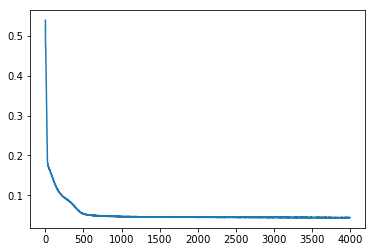
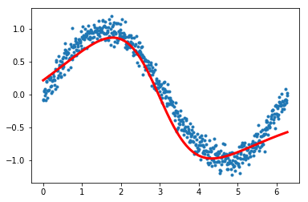



## Contents
{:.no_toc}
*  
{: toc}


```python
import torch
import torch.nn as nn
from torch.nn import functional as fn
from torch.autograd import Variable
class MLRegP(nn.Module):
    def __init__(self, input_dim, hidden_dim, nonlinearity = fn.tanh, additional_hidden_wide=0):
        super(MLRegP, self).__init__()
        self.fc_initial = nn.Linear(input_dim, hidden_dim)
        self.fc_mid = nn.ModuleList()
        self.additional_hidden_wide = additional_hidden_wide
        for i in range(self.additional_hidden_wide):
            self.fc_mid.append(nn.Linear(hidden_dim, hidden_dim))
        self.fc_final = nn.Linear(hidden_dim, 1)
        self.nonlinearity = nonlinearity

    def forward(self, x):
        x = self.fc_initial(x)
        out_init = self.nonlinearity(x)
        x = self.nonlinearity(x)
        for i in range(self.additional_hidden_wide):
            x = self.fc_mid[i](x)
            x = self.nonlinearity(x)
        out_final = self.fc_final(x)
        return out_final, x, out_init
```


```python
%matplotlib inline
import numpy as np
import matplotlib.pyplot as plt
x = np.arange(0, 2*np.pi, 0.01)
y = np.sin(x) + 0.1*np.random.normal(size=x.shape[0])
xgrid=x
ygrid=y
plt.plot(x,y, '.', alpha=0.2);
```


```python
xgrid.shape
```


    (629,)


```python
from sklearn.linear_model import LinearRegression
est = LinearRegression().fit(x.reshape(-1,1), y)
plt.plot(x,y, '.', alpha=0.2);
plt.plot(x,est.predict(x.reshape(-1,1)), 'k-', lw=3, alpha=0.2);
```


```python
xdata = Variable(torch.Tensor(xgrid))
ydata = Variable(torch.Tensor(ygrid))
```


```python
import torch.utils.data
dataset = torch.utils.data.TensorDataset(torch.from_numpy(xgrid.reshape(-1,1)), torch.from_numpy(ygrid))
loader = torch.utils.data.DataLoader(dataset, batch_size=64, shuffle=True)
```


```python
dataset.data_tensor.shape, dataset.target_tensor.shape
```


    (torch.Size([629, 1]), torch.Size([629]))


```python
def run_model(model, epochs):
    criterion = nn.MSELoss()
    lr, epochs, batch_size = 1e-1 , epochs , 64
    optimizer = torch.optim.SGD(model.parameters(), lr = lr )
    accum=[]
    for k in range(epochs):
        localaccum = []
        for localx, localy in iter(loader):
            localx = Variable(localx.float())
            localy = Variable(localy.float())
            output, _, _ = model.forward(localx)
            loss = criterion(output, localy)
            model.zero_grad()
            loss.backward()
            optimizer.step()
            localaccum.append(loss.data[0])
        accum.append((np.mean(localaccum), np.std(localaccum)))
    return accum
```


### input dim 1, 2 hidden layers width 2, linear output


```python
model = MLRegP(1, 2, nonlinearity=fn.sigmoid, additional_hidden_wide=1)
```


```python
print(model)
```


    MLRegP(
      (fc_initial): Linear(in_features=1, out_features=2)
      (fc_mid): ModuleList(
        (0): Linear(in_features=2, out_features=2)
      )
      (fc_final): Linear(in_features=2, out_features=1)
    )


```python
accum = run_model(model, 2000)
```


```python
plt.plot([a[0] for a in accum]);
```


```python
plt.plot([a[0]+a[1] for a in accum]);
plt.plot([a[0]-a[1] for a in accum]);
plt.xlim(0, 1000)
```


    (0, 1000)


```python
finaloutput, init_output, mid_output = model.forward(xdata.view(-1,1))
plt.plot(xgrid, ygrid, '.')
plt.plot(xgrid, finaloutput.data.numpy(), lw=3, color="r")
#plt.xticks([])
#plt.yticks([])
```


    [<matplotlib.lines.Line2D at 0x122320c88>]


```python
io = mid_output.data.numpy()
io.shape
```


    (629, 2)


```python
plt.plot(xgrid, ygrid, '.', alpha=0.2)
for j in range(io.shape[1]):
    plt.plot(xgrid, io[:, j], lw=2)
```


### input dim 1, 2 hidden layers width 4, linear output


```python
model2 = MLRegP(1, 4, nonlinearity=fn.sigmoid, additional_hidden_wide=1)
accum = run_model(model2, 4000)
```


```python
print(model2)
```


    MLRegP(
      (fc_initial): Linear(in_features=1, out_features=4)
      (fc_mid): ModuleList(
        (0): Linear(in_features=4, out_features=4)
      )
      (fc_final): Linear(in_features=4, out_features=1)
    )


```python
plt.plot([a[0] for a in accum]);
```





```python
finaloutput, init_output, mid_output = model2.forward(xdata.view(-1,1))
plt.plot(xgrid, ygrid, '.')
plt.plot(xgrid, finaloutput.data.numpy(), lw=3, color="r")
```


    [<matplotlib.lines.Line2D at 0x12304ae80>]


```python
io = mid_output.data.numpy()
io.shape
```


    (629, 4)


```python
plt.plot(xgrid, ygrid, '.', alpha=0.2)
for j in range(io.shape[1]):
    plt.plot(xgrid, io[:, j], lw=2)
```


### input dim 1, 2 hidden layers width 8, linear output


```python
model3 = MLRegP(1, 8, nonlinearity=fn.sigmoid, additional_hidden_wide=1)
accum = run_model(model3, 4000)
plt.plot([a[0] for a in accum]);
```


```python
print(model3)
```


    MLRegP(
      (fc_initial): Linear(in_features=1, out_features=8)
      (fc_mid): ModuleList(
        (0): Linear(in_features=8, out_features=8)
      )
      (fc_final): Linear(in_features=8, out_features=1)
    )


```python
finaloutput, init_output, mid_output = model3.forward(xdata.view(-1,1))
plt.plot(xgrid, ygrid, '.')
plt.plot(xgrid, finaloutput.data.numpy(), lw=3, color="r")
```


    [<matplotlib.lines.Line2D at 0x1220cc630>]


```python
io = mid_output.data.numpy()
plt.plot(xgrid, ygrid, '.', alpha=0.2)
for j in range(io.shape[1]):
    plt.plot(xgrid, io[:, j], lw=2)
```


### input dim 1, 3 hidden layers width 4, linear output


```python
model4 = MLRegP(1, 4, nonlinearity=fn.sigmoid, additional_hidden_wide=2)
accum = run_model(model4, 4000)
plt.plot([a[0] for a in accum]);
```


```python
print(model4)
```


    MLRegP(
      (fc_initial): Linear(in_features=1, out_features=4)
      (fc_mid): ModuleList(
        (0): Linear(in_features=4, out_features=4)
        (1): Linear(in_features=4, out_features=4)
      )
      (fc_final): Linear(in_features=4, out_features=1)
    )


```python
finaloutput, init_output, mid_output = model4.forward(xdata.view(-1,1))
plt.plot(xgrid, ygrid, '.')
plt.plot(xgrid, finaloutput.data.numpy(), lw=3, color="r")
```


    [<matplotlib.lines.Line2D at 0x12249c780>]


### input dim 1, 3 hidden layers width 2, linear output


```python
model5 = MLRegP(1, 2, nonlinearity=fn.sigmoid, additional_hidden_wide=2)
accum = run_model(model5, 4000)
plt.plot([a[0] for a in accum]);
```


```python
print(model5)
```


    MLRegP(
      (fc_initial): Linear(in_features=1, out_features=2)
      (fc_mid): ModuleList(
        (0): Linear(in_features=2, out_features=2)
        (1): Linear(in_features=2, out_features=2)
      )
      (fc_final): Linear(in_features=2, out_features=1)
    )


```python
finaloutput, init_output, mid_output = model5.forward(xdata.view(-1,1))
plt.plot(xgrid, ygrid, '.')
plt.plot(xgrid, finaloutput.data.numpy(), lw=3, color="r")
```


    [<matplotlib.lines.Line2D at 0x12349d7b8>]


```python
io = mid_output.data.numpy()
plt.plot(xgrid, ygrid, '.', alpha=0.2)
for j in range(io.shape[1]):
    plt.plot(xgrid, io[:, j], lw=2)
```


### input dim 1, 1 hidden layers width 2, linear output


```python
model6 = MLRegP(1, 2, nonlinearity=fn.sigmoid, additional_hidden_wide=0)
accum = run_model(model6, 4000)
plt.plot([a[0] for a in accum]);
```


```python
print(model6)
```


    MLRegP(
      (fc_initial): Linear(in_features=1, out_features=2)
      (fc_mid): ModuleList(
      )
      (fc_final): Linear(in_features=2, out_features=1)
    )


```python
finaloutput, init_output, mid_output = model6.forward(xdata.view(-1,1))
plt.plot(xgrid, ygrid, '.')
plt.plot(xgrid, finaloutput.data.numpy(), lw=3, color="r")
```


    [<matplotlib.lines.Line2D at 0x123365cc0>]





```python
io = mid_output.data.numpy()
plt.plot(xgrid, ygrid, '.', alpha=0.2)
for j in range(io.shape[1]):
    plt.plot(xgrid, io[:, j], lw=2)
```


### input dim 1, 1 hidden layers width 1, linear output


```python
model7 = MLRegP(1, 1, nonlinearity=fn.sigmoid, additional_hidden_wide=0)
accum = run_model(model7, 4000)
plt.plot([a[0] for a in accum]);
```


```python
print(model7)
```


    MLRegP(
      (fc_initial): Linear(in_features=1, out_features=1)
      (fc_mid): ModuleList(
      )
      (fc_final): Linear(in_features=1, out_features=1)
    )


```python
finaloutput, init_output, mid_output = model7.forward(xdata.view(-1,1))
plt.plot(xgrid, ygrid, '.')
plt.plot(xgrid, finaloutput.data.numpy(), lw=3, color="r")
```


    [<matplotlib.lines.Line2D at 0x121f65b70>]


```python
io = mid_output.data.numpy()
plt.plot(xgrid, ygrid, '.', alpha=0.2)
for j in range(io.shape[1]):
    plt.plot(xgrid, io[:, j], lw=2)
```


### input dim 1, 1 hidden layers width 16, linear output


```python
model8 = MLRegP(1, 16, nonlinearity=fn.sigmoid, additional_hidden_wide=0)
accum = run_model(model8, 4000)
plt.plot([a[0] for a in accum]);
```


```python
print(model8)
```


    MLRegP(
      (fc_initial): Linear(in_features=1, out_features=16)
      (fc_mid): ModuleList(
      )
      (fc_final): Linear(in_features=16, out_features=1)
    )


```python
finaloutput, init_output, mid_output = model8.forward(xdata.view(-1,1))
plt.plot(xgrid, ygrid, '.')
plt.plot(xgrid, finaloutput.data.numpy(), lw=3, color="r")
plt.title("input dim 1, 1 hidden layers width 16, linear output");
```


```python
io = mid_output.data.numpy()
plt.plot(xgrid, ygrid, '.', alpha=0.2)
for j in range(io.shape[1]):
    plt.plot(xgrid, io[:, j], lw=2)
```


