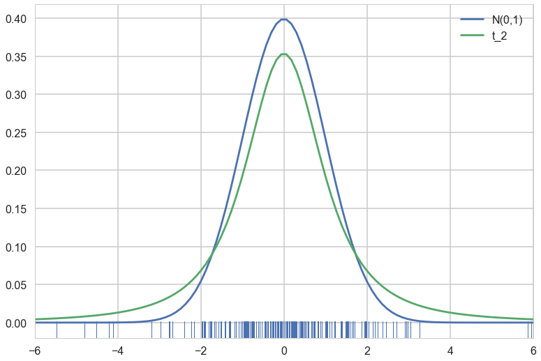
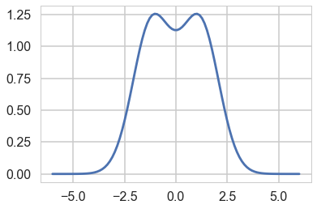
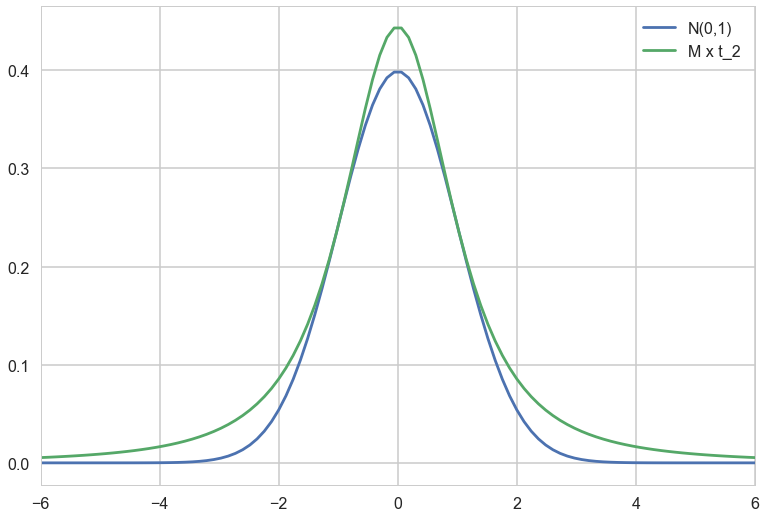
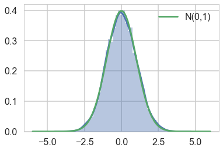
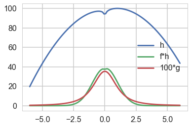



## Contents
{:.no_toc}
*  
{: toc}


```python
%matplotlib inline
import numpy as np
import scipy as sp
import matplotlib as mpl
import matplotlib.cm as cm
import matplotlib.pyplot as plt
import pandas as pd
pd.set_option('display.width', 500)
pd.set_option('display.max_columns', 100)
pd.set_option('display.notebook_repr_html', True)
import seaborn as sns
sns.set_style("whitegrid")
sns.set_context("poster")
```


## Generating samples from N(0,1)

In what I call ny "fake-news" examples, we are going to generate samples from $N(0,1)$ using a t-distribution with 2 degrees of freedom to majorize it.


```python
from scipy.stats import norm, t
n = norm()
t2 = t(2)
```


Here is a plot of the two distributions. Note that since the t has larger tails, it is shorter than the normal in the middle..we also make a rugplot of samples from the t, since we will be using these samples


```python
with sns.plotting_context('poster'):
    xx = np.linspace(-6., 6., 100)
    plt.plot(xx, n.pdf(xx), label='N(0,1)');
    plt.plot(xx, t2.pdf(xx), label = 't_2');
    t2samps = t2.rvs(200)
    ax = plt.gca()
    sns.rugplot(t2samps, ax=ax);
    plt.xlim(-6, 6)
    plt.legend();
```





We are interested  in finding the $f/g$ for these distributions, since we will want to set $M$ to the supremum of this ratio across the domain we are interested in


```python
fbyg = n.pdf(xx)/t2.pdf(xx)
plt.plot(xx, fbyg);
```





As you can see, the supremum is achived at two points. Lets get one and thus the $M$.


```python
M = fbyg[np.argmax(fbyg)]
M
```


    1.2569255634535634


Lets rescale the t by $M$ and plot it so that we can see the majorization. 


```python
with sns.plotting_context('poster'):
    xx = np.linspace(-6., 6., 100)
    plt.plot(xx, n.pdf(xx), label='N(0,1)');
    plt.plot(xx, M*t2.pdf(xx), label = 'M x t_2');
    plt.xlim(-6, 6)
    plt.legend();
```





## Rejection Sampling Implementation


```python

# domain limits
xmin = -6 # the lower limit of our domain
xmax = 6 # the upper limit of our domain


N = 10000 # the total of samples we wish to generate
accepted = 0 # the number of accepted samples
samples = np.zeros(N)
count = 0 # the total count of proposals
outside = 0
f = norm.pdf
g = t2.pdf

# generation loop
while (accepted < N):
    
    while 1:
        xproposal = t2.rvs()
        if xproposal > xmin and xproposal < xmax:
            break
        outside+=1
    # pick a uniform number on [0, 1)
    y = np.random.uniform(0,1)
    
    # Do the accept/reject comparison
    if y < f(xproposal)/(M*g(xproposal)):
        samples[accepted] = xproposal
        accepted += 1
    
    count +=1
    
print("Count", count, "Accepted", accepted, "Outside", outside)


# plot the histogram
sns.distplot(samples);
plt.plot(xx, n.pdf(xx), label='N(0,1)');


# turn on the legend
plt.legend();
```


    Count 12149 Accepted 10000 Outside 307





Notice that the number of rejected samples is roughly 2500. This is because the probability of acceptance is $1/M$.

## Expectation values

Lets calculate the expectation value $$E_f[h]$$ using the rejection samples obtained.

Here is a $h$:


```python
hfun = lambda x: np.log(x**2) - 2*x**2 +2*x +100
plt.plot(xx, hfun(xx), label='h');
plt.plot(xx, f(xx)*hfun(xx), label='f*h');
plt.plot(xx, 100*g(xx), label = '100*g')
plt.legend();
```





and here is its expectation:


```python
exp_f_of_h = np.mean(hfun(samples))
exp_f_of_h
```


    96.72828784400869


## Expectations from Importance Sampling

Remember that in imporance sampling we are calculating

$$E_f[h(x)] = E_g[ \frac{f(x)}{g(x)} h(x)] = E_g[w(x)h(x)]$$

where

$$w(x) = f(x)/g(x)$$


```python
t2.cdf(6) - t2.cdf(-6), n.cdf(6) - n.cdf(-6)
```


    (0.97332852678457527, 0.9999999980268246)


```python
normer = (t2.cdf(6) - t2.cdf(-6))/(n.cdf(6) - n.cdf(-6))
normer
```


    0.97332852870512321


```python
t2samps = t2.rvs(10300)
t2samps = t2samps[ (t2samps<xmax) & (t2samps>xmin)]
print(t2samps.shape)
fbygfunc = lambda x: (normer*n.pdf(x))/t2.pdf(x)
expec = np.mean(hfun(t2samps)*fbygfunc(t2samps))
expec
```


    (10005,)


    96.597949242826999


## Some notes on variance 

Lets check the "vanilla" monte-carlo variance


```python
vanilla=[]
for k in range(1000):
    vm = np.mean(hfun(n.rvs(2000)))
    vanilla.append(vm)
np.mean(vanilla), np.std(vanilla)
```


    (96.730847038738176, 0.068037907988511573)


Lets compare the importance sampler's variance:


```python
eval_is=[]
for k in range(1000):
    t2samps = t2.rvs(1000)
    t2samps = t2samps[ (t2samps<xmax) & (t2samps>xmin)]
    fbygfunc = lambda x: (normer*n.pdf(x))/t2.pdf(x)
    expec = np.mean((hfun(t2samps)*fbygfunc(t2samps)))
    eval_is.append(expec)
```


```python
np.mean(eval_is), np.std(eval_is)
```


    (96.774862122671578, 1.0746718309648289)


## A different importance sampling estimator

Wow, look at the variance, its really high. An alternative to the standard importance sampling estimator ( $(1/N) \sum_{x_i \sim g} w(x_i) h(x_i)$ ) is the "self normalized" estimator:

$$\frac{\sum_{x_i \sim g} w(x_i) h(x_i)}{\sum_{x_i \sim g} w(x_i)}$$

Notice that in the limit $N \to \infty$, the denominator converges to 1 and the entire expectation to out usual case. But in the case of a finite number of samples (and worse for smaller sample sizes), this latter estimator is much more stable, leading to lower variance. Lets try it (we have only 1000 samples)


```python
eval_is=[]
for k in range(1000):
    t2samps = t2.rvs(1000)
    t2samps = t2samps[ (t2samps<xmax) & (t2samps>xmin)]
    fbygfunc = lambda x: (n.pdf(x))/t2.pdf(x)
    expec = np.mean((hfun(t2samps)*fbygfunc(t2samps)))
    expec = expec/np.mean(fbygfunc(t2samps))
    eval_is.append(expec)
```


```python
np.mean(eval_is), np.std(eval_is)
```


    (96.734905750040383, 0.085451606923249823)


I leave further experimentation, including trying other h and g, to you.
