


```python
%matplotlib inline
import numpy as np
import scipy as sp
import matplotlib as mpl
import matplotlib.cm as cm
import matplotlib.pyplot as plt
import pandas as pd
pd.set_option('display.width', 500)
pd.set_option('display.max_columns', 100)
pd.set_option('display.notebook_repr_html', True)
import seaborn as sns
sns.set_style("whitegrid")
sns.set_context("poster")
```


## A switchpoint model

This is a model of coal-mine diasaters in England. Somewhere around 1900, regulation was introduced, and in response, miing became safer. But if we were forensically looking at such data, we would be able to detect such change using a switchpoint model. We'd then have to search for the causality.

### Data


```python
disasters_data = np.array([4, 5, 4, 0, 1, 4, 3, 4, 0, 6, 3, 3, 4, 0, 2, 6,
                         3, 3, 5, 4, 5, 3, 1, 4, 4, 1, 5, 5, 3, 4, 2, 5,
                         2, 2, 3, 4, 2, 1, 3, 2, 2, 1, 1, 1, 1, 3, 0, 0,
                         1, 0, 1, 1, 0, 0, 3, 1, 0, 3, 2, 2, 0, 1, 1, 1,
                         0, 1, 0, 1, 0, 0, 0, 2, 1, 0, 0, 0, 1, 1, 0, 2,
                         3, 3, 1, 1, 2, 1, 1, 1, 1, 2, 4, 2, 0, 0, 1, 4,
                         0, 0, 0, 1, 0, 0, 0, 0, 0, 1, 0, 0, 1, 0, 1])

n_years = len(disasters_data)

plt.figure(figsize=(12.5, 3.5))
plt.bar(np.arange(1851, 1962), disasters_data, color="#348ABD")
plt.xlabel("Year")
plt.ylabel("Disasters")
plt.title("UK coal mining disasters, 1851-1962")
plt.xlim(1851, 1962);
```


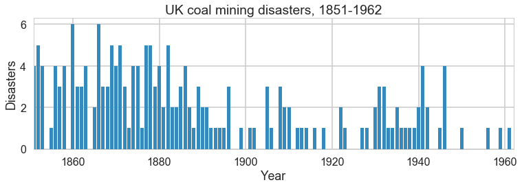


One can see the swtich roughly in the picture above.

### Model

We'll assume a Poisson model for the mine disasters; appropriate because the counts are low.

$$
y \vert \tau, \lambda_1, \lambda_2 \sim Poisson(r_t)\\
r_t = \lambda_1 \,{\rm if}\, t < \tau \,{\rm else}\, \lambda_2 \,{\rm for}\, t \in [t_l, t_h]\\
\tau \sim DiscreteUniform(t_l, t_h)\\
\lambda_1 \sim Exp(a)\\
\lambda_2 \sim Exp(b)\\
$$

The rate parameter varies before and after the switchpoint, which itseld has a discrete-uniform prior on it. Rate parameters get exponential priors.


```python
import pymc3 as pm
from pymc3.math import switch
with pm.Model() as coaldis1:
    early_mean = pm.Exponential('early_mean', 1)
    late_mean = pm.Exponential('late_mean', 1)
    switchpoint = pm.DiscreteUniform('switchpoint', lower=0, upper=n_years)
    rate = switch(switchpoint >= np.arange(n_years), early_mean, late_mean)
    disasters = pm.Poisson('disasters', mu=rate, observed=disasters_data)

```


```python
pm.model_to_graphviz(coaldis1)
```


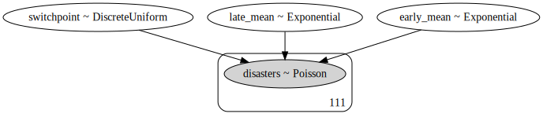


Let us interrogate our model about the various parts of it. Notice that our stochastics are logs of the rate params and the switchpoint, while our deterministics are the rate parameters themselves.


```python
coaldis1.vars #stochastics
```


    [early_mean_log__, late_mean_log__, switchpoint]


```python
type(coaldis1['early_mean_log__'])
```


    pymc3.model.FreeRV


```python
coaldis1.deterministics #deterministics
```


    [early_mean, late_mean]


Labelled variables show up in traces, or for predictives. We also list the "likelihood" stochastics.


```python
coaldis1.named_vars
```


    {'disasters': disasters,
     'early_mean': early_mean,
     'early_mean_log__': early_mean_log__,
     'late_mean': late_mean,
     'late_mean_log__': late_mean_log__,
     'switchpoint': switchpoint}


```python
coaldis1.observed_RVs, type(coaldis1['disasters'])
```


    ([disasters], pymc3.model.ObservedRV)


The DAG based structure and notation used in pymc3 and similar software makes no distinction between random variables and data. Everything is a node, and some nodes are conditioned upon. This is reminiscent of the likelihood being considered a function of its parameters. But you can consider it as a function of data with fixed parameters and sample from it.

You can sample from the distributions in `pymc3`.


```python
plt.hist(switchpoint.random(size=1000));
```


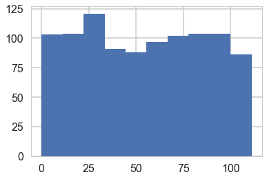


```python
early_mean.transformed, switchpoint.distribution
```


    (early_mean_log__,
     <pymc3.distributions.discrete.DiscreteUniform at 0x129f73b00>)


```python
switchpoint.distribution.defaults
```


    ('mode',)


```python
ed=pm.Exponential.dist(1)
print(type(ed))
ed.random(size=10)
```


    <class 'pymc3.distributions.continuous.Exponential'>


    array([ 0.82466332,  0.10209366,  3.35122292,  0.22771453,  1.35351198,
            0.697511  ,  0.04523932,  0.36786232,  0.12309128,  0.90947997])


```python
type(switchpoint), type(early_mean)
```


    (pymc3.model.FreeRV, pymc3.model.TransformedRV)


Most importantly, anything distribution-like must have a `logp` method. This is what enables calculating the acceptance ratio for sampling:


```python
switchpoint.logp({'switchpoint':55, 'early_mean_log__':1, 'late_mean_log__':1})
```


    array(-4.718498871295094)


Ok, enough talk, lets sample:


```python
with coaldis1:
    #stepper=pm.Metropolis()
    #trace = pm.sample(40000, step=stepper)
    trace = pm.sample(40000)
```


    Multiprocess sampling (2 chains in 2 jobs)
    CompoundStep
    >NUTS: [late_mean, early_mean]
    >Metropolis: [switchpoint]
    Sampling 2 chains: 100%|██████████| 81000/81000 [00:53<00:00, 1522.59draws/s]
    The number of effective samples is smaller than 25% for some parameters.


```python
pm.summary(trace[4000::5])
```


<div>
<style scoped>
    .dataframe tbody tr th:only-of-type {
        vertical-align: middle;
    }

    .dataframe tbody tr th {
        vertical-align: top;
    }

    .dataframe thead th {
        text-align: right;
    }
</style>
<table border="1" class="dataframe">
  <thead>
    <tr style="text-align: right;">
      <th></th>
      <th>mean</th>
      <th>sd</th>
      <th>mc_error</th>
      <th>hpd_2.5</th>
      <th>hpd_97.5</th>
      <th>n_eff</th>
      <th>Rhat</th>
    </tr>
  </thead>
  <tbody>
    <tr>
      <th>switchpoint</th>
      <td>38.983542</td>
      <td>2.421821</td>
      <td>0.027554</td>
      <td>33.000000</td>
      <td>43.000000</td>
      <td>7206.241420</td>
      <td>0.999931</td>
    </tr>
    <tr>
      <th>early_mean</th>
      <td>3.070557</td>
      <td>0.283927</td>
      <td>0.002575</td>
      <td>2.537039</td>
      <td>3.641404</td>
      <td>13267.970663</td>
      <td>0.999966</td>
    </tr>
    <tr>
      <th>late_mean</th>
      <td>0.936715</td>
      <td>0.118837</td>
      <td>0.001056</td>
      <td>0.709629</td>
      <td>1.174810</td>
      <td>13197.164982</td>
      <td>1.000034</td>
    </tr>
  </tbody>
</table>
</div>


```python
t2=trace[4000::5]
pm.traceplot(t2);
```


    //anaconda/envs/py3l/lib/python3.6/site-packages/matplotlib/axes/_base.py:3449: MatplotlibDeprecationWarning: 
    The `ymin` argument was deprecated in Matplotlib 3.0 and will be removed in 3.2. Use `bottom` instead.
      alternative='`bottom`', obj_type='argument')


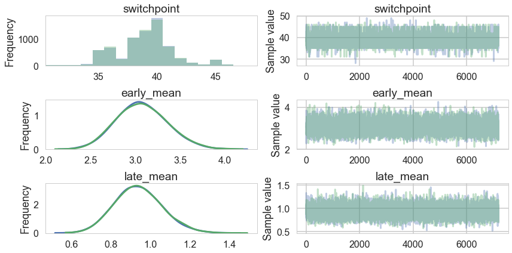


A forestplot gives us 95% credible intervals...


```python
pm.forestplot(t2);
```


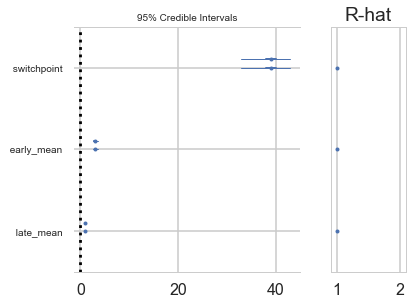


```python
pm.autocorrplot(t2);
```


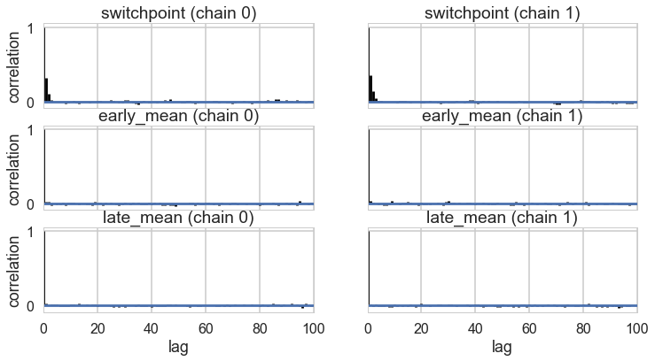


```python
plt.hist(trace['switchpoint']);
```


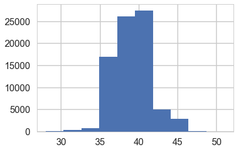


```python
pm.trace_to_dataframe(t2).corr()
```


<div>
<style scoped>
    .dataframe tbody tr th:only-of-type {
        vertical-align: middle;
    }

    .dataframe tbody tr th {
        vertical-align: top;
    }

    .dataframe thead th {
        text-align: right;
    }
</style>
<table border="1" class="dataframe">
  <thead>
    <tr style="text-align: right;">
      <th></th>
      <th>switchpoint</th>
      <th>early_mean</th>
      <th>late_mean</th>
    </tr>
  </thead>
  <tbody>
    <tr>
      <th>switchpoint</th>
      <td>1.000000</td>
      <td>-0.257867</td>
      <td>-0.235158</td>
    </tr>
    <tr>
      <th>early_mean</th>
      <td>-0.257867</td>
      <td>1.000000</td>
      <td>0.058679</td>
    </tr>
    <tr>
      <th>late_mean</th>
      <td>-0.235158</td>
      <td>0.058679</td>
      <td>1.000000</td>
    </tr>
  </tbody>
</table>
</div>


## Imputation

Imputation of missing data vaues has a very nice process in Bayesian stats: just sample them from the posterior predictive. There is a very nice process to do this built into pync3..you could abuse this to calculate predictives at arbitrary points. (There is a better way for that, though, using Theano shared variables, so you might want to restrict this process to the situation where you need to impute a few values only).

Below we use -999 to handle mising data:


```python
disasters_missing = np.array([ 4, 5, 4, 0, 1, 4, 3, 4, 0, 6, 3, 3, 4, 0, 2, 6,
3, 3, 5, 4, 5, 3, 1, 4, 4, 1, 5, 5, 3, 4, 2, 5,
2, 2, 3, 4, 2, 1, 3, -999, 2, 1, 1, 1, 1, 3, 0, 0,
1, 0, 1, 1, 0, 0, 3, 1, 0, 3, 2, 2, 0, 1, 1, 1,
0, 1, 0, 1, 0, 0, 0, 2, 1, 0, 0, 0, 1, 1, 0, 2,
3, 3, 1, -999, 2, 1, 1, 1, 1, 2, 4, 2, 0, 0, 1, 4,
0, 0, 0, 1, 0, 0, 0, 0, 0, 1, 0, 0, 1, 0, 1])
```


```python
disasters_masked = np.ma.masked_values(disasters_missing, value=-999)
disasters_masked
```


    masked_array(data = [4 5 4 0 1 4 3 4 0 6 3 3 4 0 2 6 3 3 5 4 5 3 1 4 4 1 5 5 3 4 2 5 2 2 3 4 2
     1 3 -- 2 1 1 1 1 3 0 0 1 0 1 1 0 0 3 1 0 3 2 2 0 1 1 1 0 1 0 1 0 0 0 2 1 0
     0 0 1 1 0 2 3 3 1 -- 2 1 1 1 1 2 4 2 0 0 1 4 0 0 0 1 0 0 0 0 0 1 0 0 1 0 1],
                 mask = [False False False False False False False False False False False False
     False False False False False False False False False False False False
     False False False False False False False False False False False False
     False False False  True False False False False False False False False
     False False False False False False False False False False False False
     False False False False False False False False False False False False
     False False False False False False False False False False False  True
     False False False False False False False False False False False False
     False False False False False False False False False False False False
     False False False],
           fill_value = -999)


```python
with pm.Model() as missing_data_model:
    switchpoint = pm.DiscreteUniform('switchpoint', lower=0, upper=len(disasters_masked))
    early_mean = pm.Exponential('early_mean', lam=1.)
    late_mean = pm.Exponential('late_mean', lam=1.)
    idx = np.arange(len(disasters_masked))
    rate = pm.Deterministic('rate', switch(switchpoint >= idx, early_mean, late_mean))
    disasters = pm.Poisson('disasters', rate, observed=disasters_masked)
```


```python
pm.model_to_graphviz(missing_data_model)
```


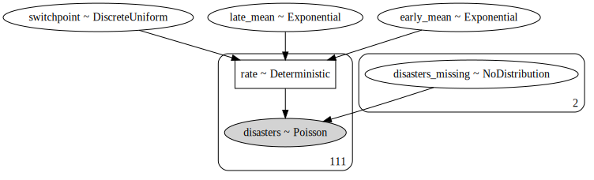


By supplying a masked array to the likelihood part of our model, we ensure that the masked data points show up in our traces:


```python
with missing_data_model:
    stepper=pm.Metropolis()
    trace_missing = pm.sample(40000, step=stepper)
```


    Multiprocess sampling (2 chains in 2 jobs)
    CompoundStep
    >Metropolis: [disasters_missing]
    >Metropolis: [late_mean]
    >Metropolis: [early_mean]
    >Metropolis: [switchpoint]
    Sampling 2 chains: 100%|██████████| 81000/81000 [00:40<00:00, 2008.25draws/s]
    The number of effective samples is smaller than 10% for some parameters.


```python
tm2=trace_missing[4000::5]
```


```python
pm.summary(tm2)
```


<div>
<style scoped>
    .dataframe tbody tr th:only-of-type {
        vertical-align: middle;
    }

    .dataframe tbody tr th {
        vertical-align: top;
    }

    .dataframe thead th {
        text-align: right;
    }
</style>
<table border="1" class="dataframe">
  <thead>
    <tr style="text-align: right;">
      <th></th>
      <th>mean</th>
      <th>sd</th>
      <th>mc_error</th>
      <th>hpd_2.5</th>
      <th>hpd_97.5</th>
      <th>n_eff</th>
      <th>Rhat</th>
    </tr>
  </thead>
  <tbody>
    <tr>
      <th>switchpoint</th>
      <td>38.721806</td>
      <td>2.460939</td>
      <td>0.043931</td>
      <td>34.000000</td>
      <td>43.000000</td>
      <td>3701.337711</td>
      <td>1.000138</td>
    </tr>
    <tr>
      <th>disasters_missing__0</th>
      <td>2.100694</td>
      <td>1.790212</td>
      <td>0.039944</td>
      <td>0.000000</td>
      <td>5.000000</td>
      <td>2415.221405</td>
      <td>0.999964</td>
    </tr>
    <tr>
      <th>disasters_missing__1</th>
      <td>0.907778</td>
      <td>0.945733</td>
      <td>0.010209</td>
      <td>0.000000</td>
      <td>3.000000</td>
      <td>6751.376254</td>
      <td>1.000121</td>
    </tr>
    <tr>
      <th>early_mean</th>
      <td>3.086498</td>
      <td>0.288385</td>
      <td>0.003494</td>
      <td>2.547688</td>
      <td>3.681163</td>
      <td>6722.815884</td>
      <td>0.999999</td>
    </tr>
    <tr>
      <th>late_mean</th>
      <td>0.931478</td>
      <td>0.118384</td>
      <td>0.001440</td>
      <td>0.713553</td>
      <td>1.177016</td>
      <td>7011.001490</td>
      <td>1.000466</td>
    </tr>
    <tr>
      <th>rate__0</th>
      <td>3.086498</td>
      <td>0.288385</td>
      <td>0.003494</td>
      <td>2.547688</td>
      <td>3.681163</td>
      <td>6722.815884</td>
      <td>0.999999</td>
    </tr>
    <tr>
      <th>rate__1</th>
      <td>3.086498</td>
      <td>0.288385</td>
      <td>0.003494</td>
      <td>2.547688</td>
      <td>3.681163</td>
      <td>6722.815884</td>
      <td>0.999999</td>
    </tr>
    <tr>
      <th>rate__2</th>
      <td>3.086498</td>
      <td>0.288385</td>
      <td>0.003494</td>
      <td>2.547688</td>
      <td>3.681163</td>
      <td>6722.815884</td>
      <td>0.999999</td>
    </tr>
    <tr>
      <th>rate__3</th>
      <td>3.086498</td>
      <td>0.288385</td>
      <td>0.003494</td>
      <td>2.547688</td>
      <td>3.681163</td>
      <td>6722.815884</td>
      <td>0.999999</td>
    </tr>
    <tr>
      <th>rate__4</th>
      <td>3.086498</td>
      <td>0.288385</td>
      <td>0.003494</td>
      <td>2.547688</td>
      <td>3.681163</td>
      <td>6722.815884</td>
      <td>0.999999</td>
    </tr>
    <tr>
      <th>rate__5</th>
      <td>3.086498</td>
      <td>0.288385</td>
      <td>0.003494</td>
      <td>2.547688</td>
      <td>3.681163</td>
      <td>6722.815884</td>
      <td>0.999999</td>
    </tr>
    <tr>
      <th>rate__6</th>
      <td>3.086498</td>
      <td>0.288385</td>
      <td>0.003494</td>
      <td>2.547688</td>
      <td>3.681163</td>
      <td>6722.815884</td>
      <td>0.999999</td>
    </tr>
    <tr>
      <th>rate__7</th>
      <td>3.086498</td>
      <td>0.288385</td>
      <td>0.003494</td>
      <td>2.547688</td>
      <td>3.681163</td>
      <td>6722.815884</td>
      <td>0.999999</td>
    </tr>
    <tr>
      <th>rate__8</th>
      <td>3.086498</td>
      <td>0.288385</td>
      <td>0.003494</td>
      <td>2.547688</td>
      <td>3.681163</td>
      <td>6722.815884</td>
      <td>0.999999</td>
    </tr>
    <tr>
      <th>rate__9</th>
      <td>3.086498</td>
      <td>0.288385</td>
      <td>0.003494</td>
      <td>2.547688</td>
      <td>3.681163</td>
      <td>6722.815884</td>
      <td>0.999999</td>
    </tr>
    <tr>
      <th>rate__10</th>
      <td>3.086498</td>
      <td>0.288385</td>
      <td>0.003494</td>
      <td>2.547688</td>
      <td>3.681163</td>
      <td>6722.815884</td>
      <td>0.999999</td>
    </tr>
    <tr>
      <th>rate__11</th>
      <td>3.086498</td>
      <td>0.288385</td>
      <td>0.003494</td>
      <td>2.547688</td>
      <td>3.681163</td>
      <td>6722.815884</td>
      <td>0.999999</td>
    </tr>
    <tr>
      <th>rate__12</th>
      <td>3.086498</td>
      <td>0.288385</td>
      <td>0.003494</td>
      <td>2.547688</td>
      <td>3.681163</td>
      <td>6722.815884</td>
      <td>0.999999</td>
    </tr>
    <tr>
      <th>rate__13</th>
      <td>3.086498</td>
      <td>0.288385</td>
      <td>0.003494</td>
      <td>2.547688</td>
      <td>3.681163</td>
      <td>6722.815884</td>
      <td>0.999999</td>
    </tr>
    <tr>
      <th>rate__14</th>
      <td>3.086498</td>
      <td>0.288385</td>
      <td>0.003494</td>
      <td>2.547688</td>
      <td>3.681163</td>
      <td>6722.815884</td>
      <td>0.999999</td>
    </tr>
    <tr>
      <th>rate__15</th>
      <td>3.086498</td>
      <td>0.288385</td>
      <td>0.003494</td>
      <td>2.547688</td>
      <td>3.681163</td>
      <td>6722.815884</td>
      <td>0.999999</td>
    </tr>
    <tr>
      <th>rate__16</th>
      <td>3.086498</td>
      <td>0.288385</td>
      <td>0.003494</td>
      <td>2.547688</td>
      <td>3.681163</td>
      <td>6722.815884</td>
      <td>0.999999</td>
    </tr>
    <tr>
      <th>rate__17</th>
      <td>3.086498</td>
      <td>0.288385</td>
      <td>0.003494</td>
      <td>2.547688</td>
      <td>3.681163</td>
      <td>6722.815884</td>
      <td>0.999999</td>
    </tr>
    <tr>
      <th>rate__18</th>
      <td>3.086498</td>
      <td>0.288385</td>
      <td>0.003494</td>
      <td>2.547688</td>
      <td>3.681163</td>
      <td>6722.815884</td>
      <td>0.999999</td>
    </tr>
    <tr>
      <th>rate__19</th>
      <td>3.086498</td>
      <td>0.288385</td>
      <td>0.003494</td>
      <td>2.547688</td>
      <td>3.681163</td>
      <td>6722.815884</td>
      <td>0.999999</td>
    </tr>
    <tr>
      <th>rate__20</th>
      <td>3.086498</td>
      <td>0.288385</td>
      <td>0.003494</td>
      <td>2.547688</td>
      <td>3.681163</td>
      <td>6722.815884</td>
      <td>0.999999</td>
    </tr>
    <tr>
      <th>rate__21</th>
      <td>3.086498</td>
      <td>0.288385</td>
      <td>0.003494</td>
      <td>2.547688</td>
      <td>3.681163</td>
      <td>6722.815884</td>
      <td>0.999999</td>
    </tr>
    <tr>
      <th>rate__22</th>
      <td>3.086498</td>
      <td>0.288385</td>
      <td>0.003494</td>
      <td>2.547688</td>
      <td>3.681163</td>
      <td>6722.815884</td>
      <td>0.999999</td>
    </tr>
    <tr>
      <th>rate__23</th>
      <td>3.086498</td>
      <td>0.288385</td>
      <td>0.003494</td>
      <td>2.547688</td>
      <td>3.681163</td>
      <td>6722.815884</td>
      <td>0.999999</td>
    </tr>
    <tr>
      <th>rate__24</th>
      <td>3.086498</td>
      <td>0.288385</td>
      <td>0.003494</td>
      <td>2.547688</td>
      <td>3.681163</td>
      <td>6722.815884</td>
      <td>0.999999</td>
    </tr>
    <tr>
      <th>...</th>
      <td>...</td>
      <td>...</td>
      <td>...</td>
      <td>...</td>
      <td>...</td>
      <td>...</td>
      <td>...</td>
    </tr>
    <tr>
      <th>rate__81</th>
      <td>0.931478</td>
      <td>0.118384</td>
      <td>0.001440</td>
      <td>0.713553</td>
      <td>1.177016</td>
      <td>7011.001490</td>
      <td>1.000466</td>
    </tr>
    <tr>
      <th>rate__82</th>
      <td>0.931478</td>
      <td>0.118384</td>
      <td>0.001440</td>
      <td>0.713553</td>
      <td>1.177016</td>
      <td>7011.001490</td>
      <td>1.000466</td>
    </tr>
    <tr>
      <th>rate__83</th>
      <td>0.931478</td>
      <td>0.118384</td>
      <td>0.001440</td>
      <td>0.713553</td>
      <td>1.177016</td>
      <td>7011.001490</td>
      <td>1.000466</td>
    </tr>
    <tr>
      <th>rate__84</th>
      <td>0.931478</td>
      <td>0.118384</td>
      <td>0.001440</td>
      <td>0.713553</td>
      <td>1.177016</td>
      <td>7011.001490</td>
      <td>1.000466</td>
    </tr>
    <tr>
      <th>rate__85</th>
      <td>0.931478</td>
      <td>0.118384</td>
      <td>0.001440</td>
      <td>0.713553</td>
      <td>1.177016</td>
      <td>7011.001490</td>
      <td>1.000466</td>
    </tr>
    <tr>
      <th>rate__86</th>
      <td>0.931478</td>
      <td>0.118384</td>
      <td>0.001440</td>
      <td>0.713553</td>
      <td>1.177016</td>
      <td>7011.001490</td>
      <td>1.000466</td>
    </tr>
    <tr>
      <th>rate__87</th>
      <td>0.931478</td>
      <td>0.118384</td>
      <td>0.001440</td>
      <td>0.713553</td>
      <td>1.177016</td>
      <td>7011.001490</td>
      <td>1.000466</td>
    </tr>
    <tr>
      <th>rate__88</th>
      <td>0.931478</td>
      <td>0.118384</td>
      <td>0.001440</td>
      <td>0.713553</td>
      <td>1.177016</td>
      <td>7011.001490</td>
      <td>1.000466</td>
    </tr>
    <tr>
      <th>rate__89</th>
      <td>0.931478</td>
      <td>0.118384</td>
      <td>0.001440</td>
      <td>0.713553</td>
      <td>1.177016</td>
      <td>7011.001490</td>
      <td>1.000466</td>
    </tr>
    <tr>
      <th>rate__90</th>
      <td>0.931478</td>
      <td>0.118384</td>
      <td>0.001440</td>
      <td>0.713553</td>
      <td>1.177016</td>
      <td>7011.001490</td>
      <td>1.000466</td>
    </tr>
    <tr>
      <th>rate__91</th>
      <td>0.931478</td>
      <td>0.118384</td>
      <td>0.001440</td>
      <td>0.713553</td>
      <td>1.177016</td>
      <td>7011.001490</td>
      <td>1.000466</td>
    </tr>
    <tr>
      <th>rate__92</th>
      <td>0.931478</td>
      <td>0.118384</td>
      <td>0.001440</td>
      <td>0.713553</td>
      <td>1.177016</td>
      <td>7011.001490</td>
      <td>1.000466</td>
    </tr>
    <tr>
      <th>rate__93</th>
      <td>0.931478</td>
      <td>0.118384</td>
      <td>0.001440</td>
      <td>0.713553</td>
      <td>1.177016</td>
      <td>7011.001490</td>
      <td>1.000466</td>
    </tr>
    <tr>
      <th>rate__94</th>
      <td>0.931478</td>
      <td>0.118384</td>
      <td>0.001440</td>
      <td>0.713553</td>
      <td>1.177016</td>
      <td>7011.001490</td>
      <td>1.000466</td>
    </tr>
    <tr>
      <th>rate__95</th>
      <td>0.931478</td>
      <td>0.118384</td>
      <td>0.001440</td>
      <td>0.713553</td>
      <td>1.177016</td>
      <td>7011.001490</td>
      <td>1.000466</td>
    </tr>
    <tr>
      <th>rate__96</th>
      <td>0.931478</td>
      <td>0.118384</td>
      <td>0.001440</td>
      <td>0.713553</td>
      <td>1.177016</td>
      <td>7011.001490</td>
      <td>1.000466</td>
    </tr>
    <tr>
      <th>rate__97</th>
      <td>0.931478</td>
      <td>0.118384</td>
      <td>0.001440</td>
      <td>0.713553</td>
      <td>1.177016</td>
      <td>7011.001490</td>
      <td>1.000466</td>
    </tr>
    <tr>
      <th>rate__98</th>
      <td>0.931478</td>
      <td>0.118384</td>
      <td>0.001440</td>
      <td>0.713553</td>
      <td>1.177016</td>
      <td>7011.001490</td>
      <td>1.000466</td>
    </tr>
    <tr>
      <th>rate__99</th>
      <td>0.931478</td>
      <td>0.118384</td>
      <td>0.001440</td>
      <td>0.713553</td>
      <td>1.177016</td>
      <td>7011.001490</td>
      <td>1.000466</td>
    </tr>
    <tr>
      <th>rate__100</th>
      <td>0.931478</td>
      <td>0.118384</td>
      <td>0.001440</td>
      <td>0.713553</td>
      <td>1.177016</td>
      <td>7011.001490</td>
      <td>1.000466</td>
    </tr>
    <tr>
      <th>rate__101</th>
      <td>0.931478</td>
      <td>0.118384</td>
      <td>0.001440</td>
      <td>0.713553</td>
      <td>1.177016</td>
      <td>7011.001490</td>
      <td>1.000466</td>
    </tr>
    <tr>
      <th>rate__102</th>
      <td>0.931478</td>
      <td>0.118384</td>
      <td>0.001440</td>
      <td>0.713553</td>
      <td>1.177016</td>
      <td>7011.001490</td>
      <td>1.000466</td>
    </tr>
    <tr>
      <th>rate__103</th>
      <td>0.931478</td>
      <td>0.118384</td>
      <td>0.001440</td>
      <td>0.713553</td>
      <td>1.177016</td>
      <td>7011.001490</td>
      <td>1.000466</td>
    </tr>
    <tr>
      <th>rate__104</th>
      <td>0.931478</td>
      <td>0.118384</td>
      <td>0.001440</td>
      <td>0.713553</td>
      <td>1.177016</td>
      <td>7011.001490</td>
      <td>1.000466</td>
    </tr>
    <tr>
      <th>rate__105</th>
      <td>0.931478</td>
      <td>0.118384</td>
      <td>0.001440</td>
      <td>0.713553</td>
      <td>1.177016</td>
      <td>7011.001490</td>
      <td>1.000466</td>
    </tr>
    <tr>
      <th>rate__106</th>
      <td>0.931478</td>
      <td>0.118384</td>
      <td>0.001440</td>
      <td>0.713553</td>
      <td>1.177016</td>
      <td>7011.001490</td>
      <td>1.000466</td>
    </tr>
    <tr>
      <th>rate__107</th>
      <td>0.931478</td>
      <td>0.118384</td>
      <td>0.001440</td>
      <td>0.713553</td>
      <td>1.177016</td>
      <td>7011.001490</td>
      <td>1.000466</td>
    </tr>
    <tr>
      <th>rate__108</th>
      <td>0.931478</td>
      <td>0.118384</td>
      <td>0.001440</td>
      <td>0.713553</td>
      <td>1.177016</td>
      <td>7011.001490</td>
      <td>1.000466</td>
    </tr>
    <tr>
      <th>rate__109</th>
      <td>0.931478</td>
      <td>0.118384</td>
      <td>0.001440</td>
      <td>0.713553</td>
      <td>1.177016</td>
      <td>7011.001490</td>
      <td>1.000466</td>
    </tr>
    <tr>
      <th>rate__110</th>
      <td>0.931478</td>
      <td>0.118384</td>
      <td>0.001440</td>
      <td>0.713553</td>
      <td>1.177016</td>
      <td>7011.001490</td>
      <td>1.000466</td>
    </tr>
  </tbody>
</table>
<p>116 rows × 7 columns</p>
</div>


```python
missing_data_model.vars
```


    [switchpoint, early_mean_log__, late_mean_log__, disasters_missing]


```python
pm.traceplot(tm2);
```


    //anaconda/envs/py3l/lib/python3.6/site-packages/matplotlib/axes/_base.py:3449: MatplotlibDeprecationWarning: 
    The `ymin` argument was deprecated in Matplotlib 3.0 and will be removed in 3.2. Use `bottom` instead.
      alternative='`bottom`', obj_type='argument')


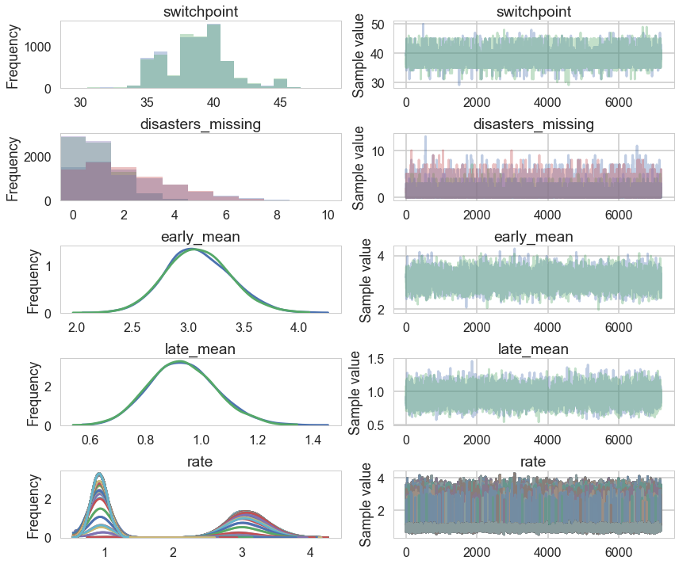


## Convergence of our model

Going back to the original model...

### Histograms every m samples

As a visual check, we plot histograms or kdeplots every 500 samples and check that they look identical.


```python
import matplotlib.pyplot as plt

emtrace = t2['early_mean']

fig, axes = plt.subplots(2, 5, figsize=(14,6))
axes = axes.ravel()
for i in range(10):
    axes[i].hist(emtrace[500*i:500*(i+1)], normed=True, alpha=0.2)
    sns.kdeplot(emtrace[500*i:500*(i+1)], ax=axes[i])
plt.tight_layout()
```


    //anaconda/envs/py3l/lib/python3.6/site-packages/matplotlib/axes/_axes.py:6499: MatplotlibDeprecationWarning: 
    The 'normed' kwarg was deprecated in Matplotlib 2.1 and will be removed in 3.1. Use 'density' instead.
      alternative="'density'", removal="3.1")


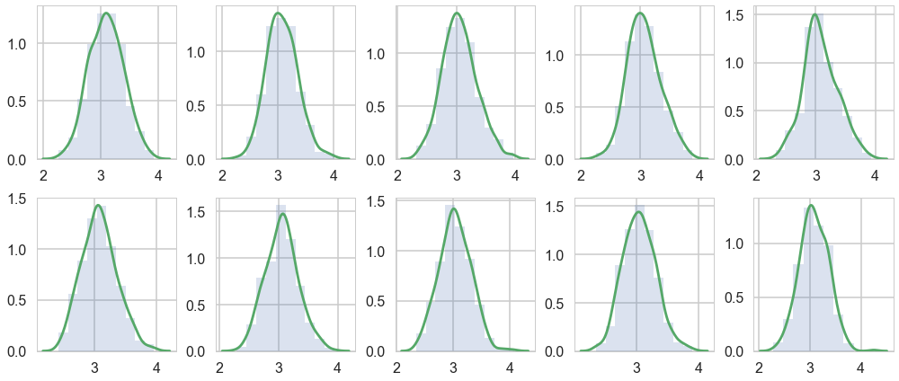


### Gewecke test

The gewecke test tests that the difference of means of chain-parts written as a Z-score oscilates between 1 and -1

$$\vert \mu_{\theta_1}  - \mu_{\theta_2}  \vert < 2 \sigma_{\theta_1 - \theta_2} $$


```python
from pymc3 import geweke
    
z = geweke(t2, intervals=15)[0]
```


```python
z
```


    {'early_mean': array([[  0.00000000e+00,   5.61498762e-02],
            [  2.57000000e+02,   3.30181736e-02],
            [  5.14000000e+02,  -1.13386479e-02],
            [  7.71000000e+02,  -1.08683708e-02],
            [  1.02800000e+03,  -3.18609424e-02],
            [  1.28500000e+03,  -2.44007294e-02],
            [  1.54200000e+03,  -9.42940333e-03],
            [  1.79900000e+03,   1.38612211e-02],
            [  2.05600000e+03,   2.44459326e-02],
            [  2.31300000e+03,   1.76236156e-02],
            [  2.57000000e+03,  -1.83317207e-02],
            [  2.82700000e+03,  -2.08740078e-02],
            [  3.08400000e+03,  -3.78760002e-02],
            [  3.34100000e+03,  -2.33616055e-02],
            [  3.59800000e+03,  -8.93753177e-02]]),
     'early_mean_log__': array([[  0.00000000e+00,   5.40712421e-02],
            [  2.57000000e+02,   3.20225634e-02],
            [  5.14000000e+02,  -1.21207399e-02],
            [  7.71000000e+02,  -1.53444650e-02],
            [  1.02800000e+03,  -3.41697516e-02],
            [  1.28500000e+03,  -2.60208461e-02],
            [  1.54200000e+03,  -9.58032469e-03],
            [  1.79900000e+03,   1.20771272e-02],
            [  2.05600000e+03,   2.27472686e-02],
            [  2.31300000e+03,   1.62502583e-02],
            [  2.57000000e+03,  -1.83595794e-02],
            [  2.82700000e+03,  -2.06877678e-02],
            [  3.08400000e+03,  -3.68628168e-02],
            [  3.34100000e+03,  -1.96692332e-02],
            [  3.59800000e+03,  -9.00174724e-02]]),
     'late_mean': array([[  0.00000000e+00,   4.08287159e-02],
            [  2.57000000e+02,  -2.92363937e-02],
            [  5.14000000e+02,  -5.38270045e-02],
            [  7.71000000e+02,   5.63678903e-03],
            [  1.02800000e+03,   1.34028136e-02],
            [  1.28500000e+03,   6.38604399e-02],
            [  1.54200000e+03,   4.89896588e-02],
            [  1.79900000e+03,   6.99272457e-02],
            [  2.05600000e+03,   3.55314031e-02],
            [  2.31300000e+03,   9.88599384e-03],
            [  2.57000000e+03,   1.72258915e-02],
            [  2.82700000e+03,   4.12609613e-02],
            [  3.08400000e+03,   2.16946625e-02],
            [  3.34100000e+03,   3.15327875e-02],
            [  3.59800000e+03,   1.50735157e-02]]),
     'late_mean_log__': array([[  0.00000000e+00,   4.19113445e-02],
            [  2.57000000e+02,  -2.82149481e-02],
            [  5.14000000e+02,  -5.57252602e-02],
            [  7.71000000e+02,   4.42927658e-04],
            [  1.02800000e+03,   1.01563960e-02],
            [  1.28500000e+03,   6.69668358e-02],
            [  1.54200000e+03,   5.47312239e-02],
            [  1.79900000e+03,   7.11500876e-02],
            [  2.05600000e+03,   3.36857501e-02],
            [  2.31300000e+03,   7.20640643e-03],
            [  2.57000000e+03,   1.52483860e-02],
            [  2.82700000e+03,   3.62744473e-02],
            [  3.08400000e+03,   2.07380857e-02],
            [  3.34100000e+03,   2.89119928e-02],
            [  3.59800000e+03,   1.12619091e-02]]),
     'switchpoint': array([[  0.00000000e+00,  -4.39653271e-02],
            [  2.57000000e+02,  -2.69927320e-02],
            [  5.14000000e+02,   2.04644938e-02],
            [  7.71000000e+02,  -1.34952058e-02],
            [  1.02800000e+03,   9.72819474e-05],
            [  1.28500000e+03,  -2.60017648e-02],
            [  1.54200000e+03,  -9.28102162e-02],
            [  1.79900000e+03,  -9.90854028e-02],
            [  2.05600000e+03,  -1.61978444e-02],
            [  2.31300000e+03,  -1.96622006e-03],
            [  2.57000000e+03,  -7.48155186e-02],
            [  2.82700000e+03,  -4.25450296e-02],
            [  3.08400000e+03,  -2.14223408e-04],
            [  3.34100000e+03,  -2.63551341e-02],
            [  3.59800000e+03,   5.57747320e-03]])}


Here is a plot for `early_mean`. You sould really be plotting all of these...


```python
z['early_mean'].T
```


    array([[  0.00000000e+00,   2.57000000e+02,   5.14000000e+02,
              7.71000000e+02,   1.02800000e+03,   1.28500000e+03,
              1.54200000e+03,   1.79900000e+03,   2.05600000e+03,
              2.31300000e+03,   2.57000000e+03,   2.82700000e+03,
              3.08400000e+03,   3.34100000e+03,   3.59800000e+03],
           [  5.61498762e-02,   3.30181736e-02,  -1.13386479e-02,
             -1.08683708e-02,  -3.18609424e-02,  -2.44007294e-02,
             -9.42940333e-03,   1.38612211e-02,   2.44459326e-02,
              1.76236156e-02,  -1.83317207e-02,  -2.08740078e-02,
             -3.78760002e-02,  -2.33616055e-02,  -8.93753177e-02]])


```python
plt.scatter(*z['early_mean'].T)
plt.axhline(-1, 0, 1, linestyle='dotted')
plt.axhline(1, 0, 1, linestyle='dotted')
```


    <matplotlib.lines.Line2D at 0x122770438>


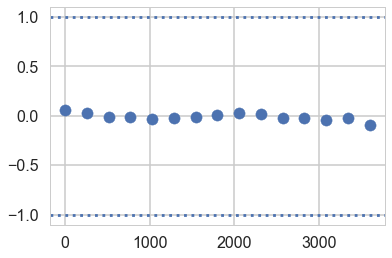


### Gelman-Rubin

For this test, which calculates 

$$\hat{R} = \sqrt{\frac{\hat{Var}(\theta)}{w}}$$

we need more than 1-chain. This is done through `njobs=4` (the defaukt is 2 and reported in `pm.summary`). See the trace below:


```python
with coaldis1:
    stepper=pm.Metropolis()
    tr2 = pm.sample(40000, step=stepper, njobs=4)
```


    Multiprocess sampling (4 chains in 4 jobs)
    CompoundStep
    >Metropolis: [switchpoint]
    >Metropolis: [late_mean]
    >Metropolis: [early_mean]
    Sampling 4 chains: 100%|██████████| 162000/162000 [00:57<00:00, 2837.84draws/s]
    The number of effective samples is smaller than 10% for some parameters.


```python
tr2
```


    <MultiTrace: 4 chains, 40000 iterations, 5 variables>


```python
tr2_cut = tr2[4000::5]
```


```python
from pymc3 import gelman_rubin

gelman_rubin(tr2_cut)
```


    {'early_mean': 1.0001442735491479,
     'late_mean': 1.0000078726931823,
     'switchpoint': 1.0002808010976048}


For the best results, each chain should be initialized to highly dispersed starting values for each stochastic node.

A foresplot will show you the credible-interval consistency of our chains..


```python
from pymc3 import forestplot

forestplot(tr2_cut)
```


    GridSpec(1, 2, width_ratios=[3, 1])


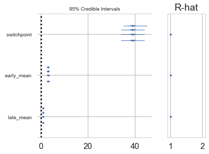


### Autocorrelation

This can be probed by plotting the correlation plot and effective sample size


```python
from pymc3 import effective_n

effective_n(tr2_cut)
```


    {'early_mean': 13037.380191598249,
     'late_mean': 15375.337202610448,
     'switchpoint': 11955.470326961806}


```python
pm.autocorrplot(tr2_cut);
```


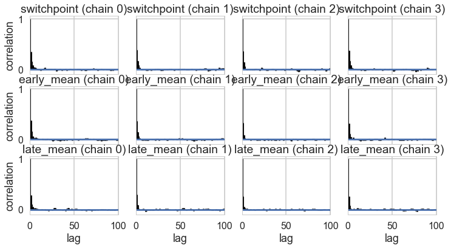


```python
pm.autocorrplot(tr2);
```


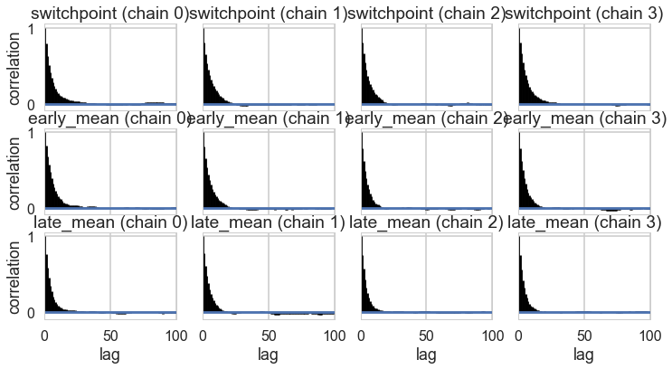


## Posterior predictive checks

Finally let us peek into posterior predictive checks: something we'll talk more about soon.


```python
with coaldis1:
    sim = pm.sample_ppc(t2, samples=200)
```


    100%|██████████| 200/200 [00:02<00:00, 99.38it/s]


```python
sim['disasters'].shape
```


    (200, 111)


This gives us 200 samples at each of the 111 diasters we have data on.

We plot the first 4 posteriors against actual data for consistency...


```python
fig, axes = plt.subplots(1, 4, figsize=(12, 6))
print(axes.shape)
for obs, s, ax in zip(disasters_data, sim['disasters'].T, axes):
    print(obs)
    ax.hist(s, bins=10)
    ax.plot(obs+0.5, 1, 'ro')
```


    (4,)
    4
    5
    4
    0


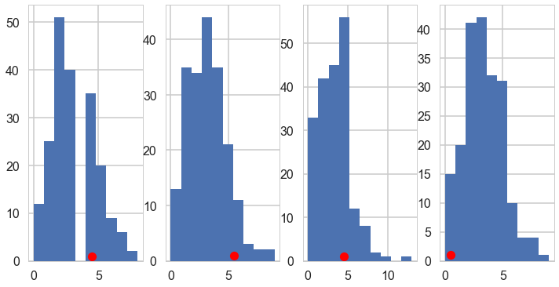

