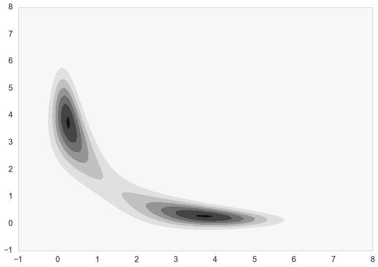
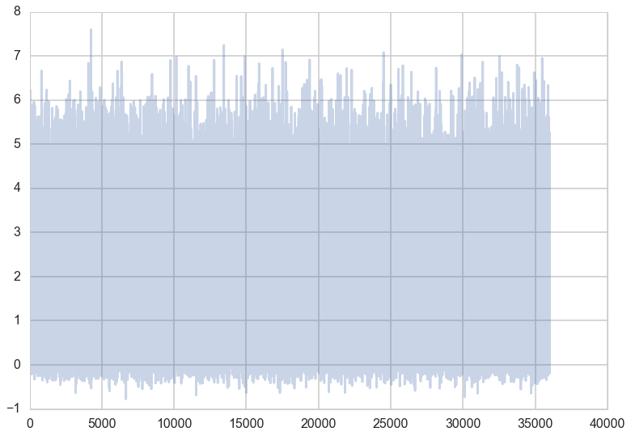
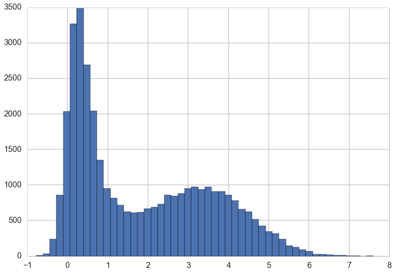
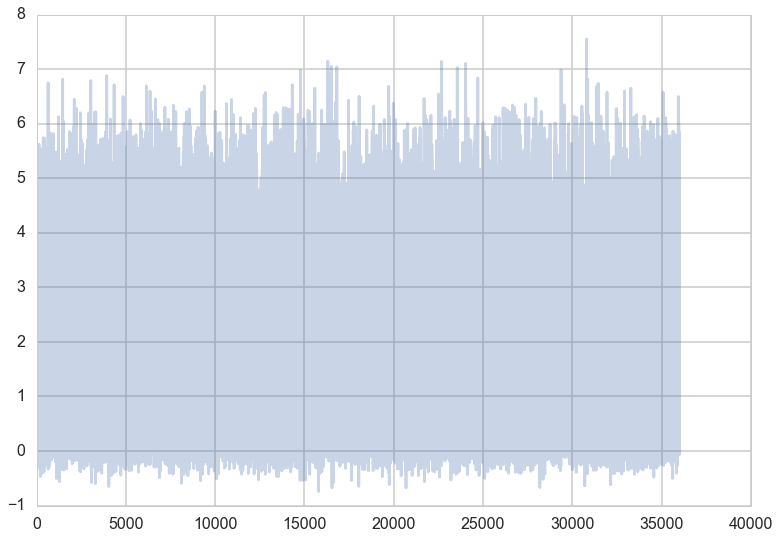
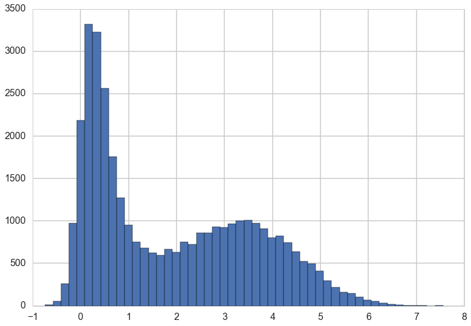
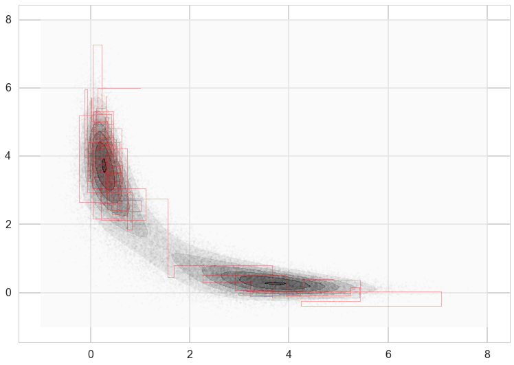
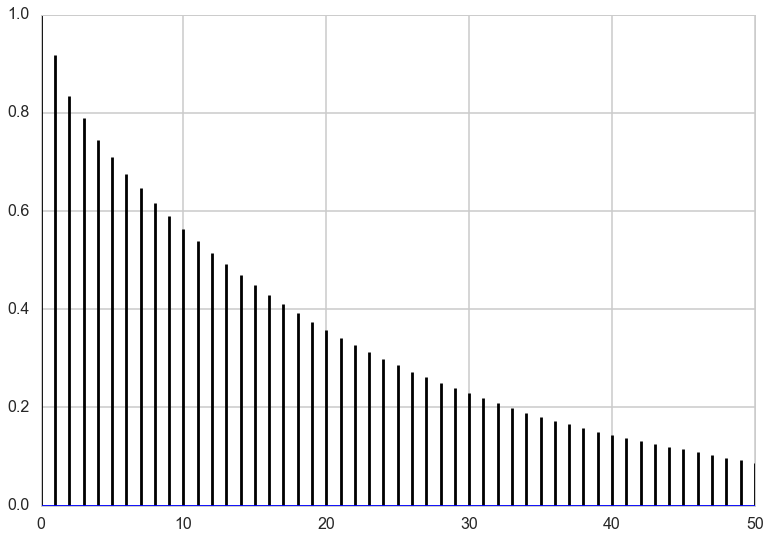
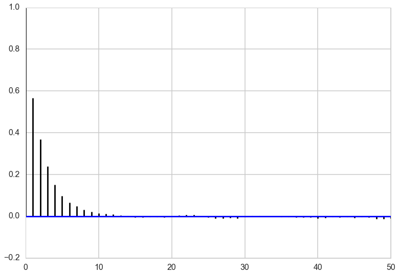




## Contents
{:.no_toc}
* 
{: toc}

## A tetchy posterior

Imagine your posterior distribution has the following form:

$$ f(x, y \mid data) =  (1/C)*e^{-\frac{(x^2*y^2+x^2+y^2-8x-8y)}{2}} $$

As is typical in Bayesian inference, you don't know what C (the normalizing constant) is, so you can't sample from this distribution using conventional methods. However, MCMC techniques allow us to sample from probability distributions without knowing this constant, and we will use oGibbs sampling, to do this here.

Gibbs sampling allows you to sample from a probability distribution by iteratively sampling from its **conditional** distributions. This strategy is very useful in problems where each unknown would have a very simple distribution if we knew all of the other unknowns. In this problem, the posterior distribution $f(x, y \mid data)$ is over two unknowns, $x$ and $y$. To perform Gibbs sampling, we sample from the distribution of $x$ holding $y$ constant at its current value, then sample from the distribution of $y$ holding $x$ constant at its current value. As it turns out, even though $f(x, y \mid data)$ is incredibly ugly, the conditional distributions are relatively simple.

### Conditionals

After some simplification (completing the square and throwing all factors that do not involve $x$ into $g(y)$ for the first equation, and vice versa for the second), we find that the conditional distributions have a relatively simple form.

$$ p(x \mid y, data) = g(y) e^{-\left(x-\frac{4}{(1+y^2)}\right)^{2}\frac{(1+y^2)}{2}} $$

and

$$ p(y \mid x, data) = g(x) e^{-\left(y-\frac{4}{(1+x^2)}\right)^{2}\frac{(1+x^2)}{2}} $$

What are these distributions? They are in fact normals. Writing this in distributional notation,

$$ x \mid y, data \sim N\left(\frac{4}{1+y^2}, \sqrt{\frac{1}{1+y^2}}\right) $$

and similarly

$$ y \mid x, data \sim N\left(\frac{4}{1+x^2}, \sqrt{\frac{1}{1+x^2}}\right) $$.

We know how to draw from normal distributions, so if we iterate back and forth, we should be able to sample from $f(x, y \mid data)$!


```python
f= lambda x,y: np.exp(-(x*x*y*y+x*x+y*y-8*x-8*y)/2.)
```


### Contour plot

First, let's make a contour plot of the posterior density.


```python
xx=np.linspace(-1,8,100)
yy=np.linspace(-1,8,100)
xg,yg = np.meshgrid(xx,yy)
z=f(xg.ravel(),yg.ravel())
z2 = z.reshape(xg.shape)
z2
plt.contourf(xg,yg,z2)
```


    <matplotlib.contour.QuadContourSet at 0x116d1ab00>





## Gibbs Sampler

Now let's run the sampler, by iteratively drawing from the conditional distribution of $x$ and $y$ given the other.


```python
N = 400000
xall=np.zeros(N+1)
yall=np.zeros(N+1)
#Initialize x and y.
xall[0]=1.
yall[0]=6.
sig = lambda z,i: np.sqrt(1./(1.+z[i]*z[i]))
mu = lambda z,i: 4./(1.+z[i]*z[i])

for i in range(1,N,2):
    sig_x = sig(yall,i-1)
    mu_x = mu(yall,i-1)
    xall[i] = np.random.normal(mu_x, sig_x)
    yall[i] = yall[i-1]
    
    sig_y = sig(xall, i)
    mu_y = mu(xall, i)
    yall[i+1] = np.random.normal(mu_y, sig_y)
    xall[i+1] = xall[i]
    

```


```python
x=xall[N//10::10]
y=yall[N//10::10]
```


### Traceplots

To assess how the sampler is exploring the space, we can plot a **traceplot** for each dimension. A traceplot plots the value of each sample against the iteration number and gives a sense of how well the sampler is exploring the space.


```python
def traceplot(z):
    plt.plot(z, alpha=0.3);
```


```python
traceplot(x)
```





You can see from the traceplot the when sampling $x$, the sampler spends long periods of time near zero, and occasionally moves to and hangs out at higher values. These correspond to the two areas of high density in the countour plot.

### Marginals

We can also draw a histogram of $x$ to get an estimate of its **marginal distribution**.


```python
plt.hist(x, bins=50);
```





This is exactly what we would expect if we projected the distribution in the contour plot down to the $x$ axis.

We can do the same plots for $y$.


```python
traceplot(y)
```





```python
plt.hist(y, bins=50);
```





### How we move

Because we are in two dimensions, we can also plot the path that the sampler took through the $xy$ plane. Note that the path always takes right angles, because we are alternating between moves that only move in the $x$ direction and only move in the $y$ direction.


```python
plt.contourf(xg,yg,z2, alpha=0.6)
plt.scatter(xall[::10],yall[::10], alpha=0.01, c='k', s=5)
plt.plot(xall[:200],yall[:200], c='r', alpha=0.3, lw=1)
```


    [<matplotlib.lines.Line2D at 0x108fee128>]





### Autocorrelations

To see how effective the samples we have drawn will be at approximating summaries of the posterior distribution (for example the posterior mean), we can look at the autocorrelation of the samples. High autocorrelation would mean that the sample average that we take to approximate the posterior mean would be higher than expected if we had taken independent samples from the posterior distribution.


```python
def corrplot(trace, maxlags=50):
    plt.acorr(trace-np.mean(trace),  normed=True, maxlags=maxlags);
    plt.xlim([0, maxlags])
corrplot(xall[N//10:])
```





```python
corrplot(y)
```





### Effective Sample Size

In both $x$ and $y$, we can see that the autocorrelation is quite high. This is not a big problem though because the sampler is so simple that we can draw millions of samples to make up for the high autocorrelation.

To figure out exactly how many samples we would have to draw, we can compute **effective sample size**, a measure of how many independent samples our our samples are equivalent to. This usese the same quantities that were used to compute the autocorrelation plot above. The following code is taken from https://code.google.com/p/biopy/source/browse/trunk/biopy/bayesianStats.py?r=67. You don't need to try to understand the function -- it's just here to run it, and this is a rather slow implementation.


```python
def effectiveSampleSize(data, stepSize = 1) :
  """ Effective sample size, as computed by BEAST Tracer."""
  samples = len(data)

  assert len(data) > 1,"no stats for short sequences"
  
  maxLag = min(samples//3, 1000)

  gammaStat = [0,]*maxLag
  #varGammaStat = [0,]*maxLag

  varStat = 0.0;

  if type(data) != np.ndarray :
    data = np.array(data)

  normalizedData = data - data.mean()
  
  for lag in range(maxLag) :
    v1 = normalizedData[:samples-lag]
    v2 = normalizedData[lag:]
    v = v1 * v2
    gammaStat[lag] = sum(v) / len(v)
    #varGammaStat[lag] = sum(v*v) / len(v)
    #varGammaStat[lag] -= gammaStat[0] ** 2

    # print lag, gammaStat[lag], varGammaStat[lag]
    
    if lag == 0 :
      varStat = gammaStat[0]
    elif lag % 2 == 0 :
      s = gammaStat[lag-1] + gammaStat[lag]
      if s > 0 :
         varStat += 2.0*s
      else :
        break
      
  # standard error of mean
  # stdErrorOfMean = Math.sqrt(varStat/samples);

  # auto correlation time
  act = stepSize * varStat / gammaStat[0]

  # effective sample size
  ess = (stepSize * samples) / act

  return ess
```


Now we can compute effective sample size for x and y.


```python
esx = effectiveSampleSize(xall)
esy = effectiveSampleSize(yall)
print("Effective Size for x: ", esx, " of ", len(x), " samples, rate of", esx/len(x)*100, "%.")
print("Effective Size for y: ", esy, " of ", len(y), " samples, rate of", esy/len(y)*100, "%.")
```


    Effective Size for x:  10115.8236073  of  36001  samples, rate of 28.0987295001 %.
    Effective Size for y:  10264.5088434  of  36001  samples, rate of 28.5117325726 %.


Note that while the effective size is only just over 25% of the actual sample size, we can draw samples so quickly from the posterior that this is not a major hindrance. 
