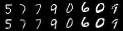
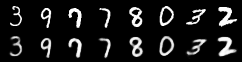



## Contents
{:.no_toc}
*  
{: toc}


```python
import torch
import torch.utils.data
from torch import nn, optim
from torch.autograd import Variable
from torch.nn import functional as F
from torchvision import datasets, transforms
from torchvision.utils import save_image
```


This example is taken and adapted from the torch example repository


```python
BATCH_SIZE = 128
```


```python
train_loader = torch.utils.data.DataLoader(
    datasets.MNIST('./data', train=True, download=True,
                   transform=transforms.ToTensor()),
    batch_size=BATCH_SIZE, shuffle=True)
test_loader = torch.utils.data.DataLoader(
    datasets.MNIST('./data', train=False, transform=transforms.ToTensor()),
    batch_size=BATCH_SIZE, shuffle=True)
```


```python
class VAE(nn.Module):
    def __init__(self):
        super(VAE, self).__init__()

        self.fc1 = nn.Linear(784, 400)
        self.fc21 = nn.Linear(400, 20)
        self.fc22 = nn.Linear(400, 20)
        self.fc3 = nn.Linear(20, 400)
        self.fc4 = nn.Linear(400, 784)

        self.relu = nn.ReLU()
        self.sigmoid = nn.Sigmoid()

    def encode(self, x):
        h1 = self.relu(self.fc1(x))
        return self.fc21(h1), self.fc22(h1)

    def reparameterize(self, mu, logvar):
        if self.training:
            std = logvar.mul(0.5).exp_()
            eps = Variable(std.data.new(std.size()).normal_())
            return eps.mul(std).add_(mu)
        else:
            return mu

    def decode(self, z):
        h3 = self.relu(self.fc3(z))
        return self.sigmoid(self.fc4(h3))

    def forward(self, x):
        mu, logvar = self.encode(x.view(-1, 784))
        z = self.reparameterize(mu, logvar)
        return self.decode(z), mu, logvar
```


```python
model = VAE()
optimizer = optim.Adam(model.parameters(), lr=1e-3)
```


```python
def loss_function(recon_x, x, mu, logvar):
    BCE = F.binary_cross_entropy(recon_x, x.view(-1, 784), size_average=False)

    # see Appendix B from VAE paper:
    # Kingma and Welling. Auto-Encoding Variational Bayes. ICLR, 2014
    # https://arxiv.org/abs/1312.6114
    # 0.5 * sum(1 + log(sigma^2) - mu^2 - sigma^2)
    KLD = -0.5 * torch.sum(1 + logvar - mu.pow(2) - logvar.exp())

    return BCE + KLD
```


```python
def train(epoch):
    model.train()
    train_loss = 0
    for batch_idx, (data, _) in enumerate(train_loader):
        data = Variable(data)
        optimizer.zero_grad()
        recon_batch, mu, logvar = model(data)
        loss = loss_function(recon_batch, data, mu, logvar)
        loss.backward()
        train_loss += loss.data[0]
        optimizer.step()
        if batch_idx % 20 == 0:
            print('Train Epoch: {} [{}/{} ({:.0f}%)]\tLoss: {:.6f}'.format(
                epoch, batch_idx * len(data), len(train_loader.dataset),
                100. * batch_idx / len(train_loader),
                loss.data[0] / len(data)))

    print('====> Epoch: {} Average loss: {:.4f}'.format(
          epoch, train_loss / len(train_loader.dataset)))
```


```python
def test(epoch):
    model.eval()
    test_loss = 0
    for i, (data, _) in enumerate(test_loader):
        data = Variable(data, volatile=True)
        recon_batch, mu, logvar = model(data)
        test_loss += loss_function(recon_batch, data, mu, logvar).data[0]
        if i == 0:
            n = min(data.size(0), 8)
            comparison = torch.cat([data[:n],
                                  recon_batch.view(BATCH_SIZE, 1, 28, 28)[:n]])
            save_image(comparison.data,
                     'results/reconstruction_' + str(epoch) + '.png', nrow=n)

    test_loss /= len(test_loader.dataset)
    print('====> Test set loss: {:.4f}'.format(test_loss))
```


```python
for epoch in range(1, 10 + 1):
    train(epoch)
    test(epoch)
    sample = Variable(torch.randn(64, 20))
    sample = model.decode(sample)
    save_image(sample.data.view(64, 1, 28, 28),
               'results/sample_' + str(epoch) + '.png')
```


    Train Epoch: 1 [0/60000 (0%)]	Loss: 130.947617
    Train Epoch: 1 [2560/60000 (4%)]	Loss: 126.545685
    Train Epoch: 1 [5120/60000 (9%)]	Loss: 123.523026
    Train Epoch: 1 [7680/60000 (13%)]	Loss: 128.016113
    Train Epoch: 1 [10240/60000 (17%)]	Loss: 129.142212
    Train Epoch: 1 [12800/60000 (21%)]	Loss: 124.724266
    Train Epoch: 1 [15360/60000 (26%)]	Loss: 125.705635
    Train Epoch: 1 [17920/60000 (30%)]	Loss: 121.349472
    Train Epoch: 1 [20480/60000 (34%)]	Loss: 123.418205
    Train Epoch: 1 [23040/60000 (38%)]	Loss: 125.095291
    Train Epoch: 1 [25600/60000 (43%)]	Loss: 123.296555
    Train Epoch: 1 [28160/60000 (47%)]	Loss: 127.556244
    Train Epoch: 1 [30720/60000 (51%)]	Loss: 119.878548
    Train Epoch: 1 [33280/60000 (55%)]	Loss: 116.423630
    Train Epoch: 1 [35840/60000 (60%)]	Loss: 122.963539
    Train Epoch: 1 [38400/60000 (64%)]	Loss: 120.465958
    Train Epoch: 1 [40960/60000 (68%)]	Loss: 119.415527
    Train Epoch: 1 [43520/60000 (72%)]	Loss: 118.011818
    Train Epoch: 1 [46080/60000 (77%)]	Loss: 115.847961
    Train Epoch: 1 [48640/60000 (81%)]	Loss: 116.022537
    Train Epoch: 1 [51200/60000 (85%)]	Loss: 117.892502
    Train Epoch: 1 [53760/60000 (90%)]	Loss: 120.581963
    Train Epoch: 1 [56320/60000 (94%)]	Loss: 114.086029
    Train Epoch: 1 [58880/60000 (98%)]	Loss: 115.312630
    ====> Epoch: 1 Average loss: 121.2506
    ====> Test set loss: 107.3968
    Train Epoch: 2 [0/60000 (0%)]	Loss: 118.672333
    Train Epoch: 2 [2560/60000 (4%)]	Loss: 112.215057
    Train Epoch: 2 [5120/60000 (9%)]	Loss: 120.704193
    Train Epoch: 2 [7680/60000 (13%)]	Loss: 116.141243
    Train Epoch: 2 [10240/60000 (17%)]	Loss: 114.599747
    Train Epoch: 2 [12800/60000 (21%)]	Loss: 115.905037
    Train Epoch: 2 [15360/60000 (26%)]	Loss: 113.297394
    Train Epoch: 2 [17920/60000 (30%)]	Loss: 117.256203
    Train Epoch: 2 [20480/60000 (34%)]	Loss: 120.340149
    Train Epoch: 2 [23040/60000 (38%)]	Loss: 114.307144
    Train Epoch: 2 [25600/60000 (43%)]	Loss: 114.925385
    Train Epoch: 2 [28160/60000 (47%)]	Loss: 110.241531
    Train Epoch: 2 [30720/60000 (51%)]	Loss: 113.410187
    Train Epoch: 2 [33280/60000 (55%)]	Loss: 111.207977
    Train Epoch: 2 [35840/60000 (60%)]	Loss: 113.412979
    Train Epoch: 2 [38400/60000 (64%)]	Loss: 114.008179
    Train Epoch: 2 [40960/60000 (68%)]	Loss: 115.001892
    Train Epoch: 2 [43520/60000 (72%)]	Loss: 113.112885
    Train Epoch: 2 [46080/60000 (77%)]	Loss: 114.121735
    Train Epoch: 2 [48640/60000 (81%)]	Loss: 109.933098
    Train Epoch: 2 [51200/60000 (85%)]	Loss: 114.632385
    Train Epoch: 2 [53760/60000 (90%)]	Loss: 114.272446
    Train Epoch: 2 [56320/60000 (94%)]	Loss: 111.709930
    Train Epoch: 2 [58880/60000 (98%)]	Loss: 111.490089
    ====> Epoch: 2 Average loss: 114.4169
    ====> Test set loss: 103.3040
    Train Epoch: 3 [0/60000 (0%)]	Loss: 112.177597
    Train Epoch: 3 [2560/60000 (4%)]	Loss: 110.884583
    Train Epoch: 3 [5120/60000 (9%)]	Loss: 113.694000
    Train Epoch: 3 [7680/60000 (13%)]	Loss: 107.972748
    Train Epoch: 3 [10240/60000 (17%)]	Loss: 107.872520
    Train Epoch: 3 [12800/60000 (21%)]	Loss: 113.191475
    Train Epoch: 3 [15360/60000 (26%)]	Loss: 111.741043
    Train Epoch: 3 [17920/60000 (30%)]	Loss: 109.133118
    Train Epoch: 3 [20480/60000 (34%)]	Loss: 110.066849
    Train Epoch: 3 [23040/60000 (38%)]	Loss: 110.372345
    Train Epoch: 3 [25600/60000 (43%)]	Loss: 111.947525
    Train Epoch: 3 [28160/60000 (47%)]	Loss: 109.785149
    Train Epoch: 3 [30720/60000 (51%)]	Loss: 112.531845
    Train Epoch: 3 [33280/60000 (55%)]	Loss: 111.531975
    Train Epoch: 3 [35840/60000 (60%)]	Loss: 108.604050
    Train Epoch: 3 [38400/60000 (64%)]	Loss: 109.769753
    Train Epoch: 3 [40960/60000 (68%)]	Loss: 108.968239
    Train Epoch: 3 [43520/60000 (72%)]	Loss: 111.568512
    Train Epoch: 3 [46080/60000 (77%)]	Loss: 113.894569
    Train Epoch: 3 [48640/60000 (81%)]	Loss: 108.581863
    Train Epoch: 3 [51200/60000 (85%)]	Loss: 109.200699
    Train Epoch: 3 [53760/60000 (90%)]	Loss: 109.031929
    Train Epoch: 3 [56320/60000 (94%)]	Loss: 116.003304
    Train Epoch: 3 [58880/60000 (98%)]	Loss: 113.317078
    ====> Epoch: 3 Average loss: 111.4263
    ====> Test set loss: 100.8624
    Train Epoch: 4 [0/60000 (0%)]	Loss: 104.970657
    Train Epoch: 4 [2560/60000 (4%)]	Loss: 111.912689
    Train Epoch: 4 [5120/60000 (9%)]	Loss: 114.365204
    Train Epoch: 4 [7680/60000 (13%)]	Loss: 104.927101
    Train Epoch: 4 [10240/60000 (17%)]	Loss: 111.897621
    Train Epoch: 4 [12800/60000 (21%)]	Loss: 105.974190
    Train Epoch: 4 [15360/60000 (26%)]	Loss: 106.415184
    Train Epoch: 4 [17920/60000 (30%)]	Loss: 108.324875
    Train Epoch: 4 [20480/60000 (34%)]	Loss: 104.400742
    Train Epoch: 4 [23040/60000 (38%)]	Loss: 111.296143
    Train Epoch: 4 [25600/60000 (43%)]	Loss: 112.088722
    Train Epoch: 4 [28160/60000 (47%)]	Loss: 107.338860
    Train Epoch: 4 [30720/60000 (51%)]	Loss: 109.269875
    Train Epoch: 4 [33280/60000 (55%)]	Loss: 109.228989
    Train Epoch: 4 [35840/60000 (60%)]	Loss: 105.805740
    Train Epoch: 4 [38400/60000 (64%)]	Loss: 107.620621
    Train Epoch: 4 [40960/60000 (68%)]	Loss: 110.464294
    Train Epoch: 4 [43520/60000 (72%)]	Loss: 109.221573
    Train Epoch: 4 [46080/60000 (77%)]	Loss: 108.348160
    Train Epoch: 4 [48640/60000 (81%)]	Loss: 107.898636
    Train Epoch: 4 [51200/60000 (85%)]	Loss: 108.670448
    Train Epoch: 4 [53760/60000 (90%)]	Loss: 109.036354
    Train Epoch: 4 [56320/60000 (94%)]	Loss: 109.631660
    Train Epoch: 4 [58880/60000 (98%)]	Loss: 111.293343
    ====> Epoch: 4 Average loss: 109.7152
    ====> Test set loss: 99.8303
    Train Epoch: 5 [0/60000 (0%)]	Loss: 109.308372
    Train Epoch: 5 [2560/60000 (4%)]	Loss: 106.484604
    Train Epoch: 5 [5120/60000 (9%)]	Loss: 110.796989
    Train Epoch: 5 [7680/60000 (13%)]	Loss: 110.933578
    Train Epoch: 5 [10240/60000 (17%)]	Loss: 108.186401
    Train Epoch: 5 [12800/60000 (21%)]	Loss: 106.193451
    Train Epoch: 5 [15360/60000 (26%)]	Loss: 112.305084
    Train Epoch: 5 [17920/60000 (30%)]	Loss: 105.249863
    Train Epoch: 5 [20480/60000 (34%)]	Loss: 110.519218
    Train Epoch: 5 [23040/60000 (38%)]	Loss: 106.572647
    Train Epoch: 5 [25600/60000 (43%)]	Loss: 106.948723
    Train Epoch: 5 [28160/60000 (47%)]	Loss: 111.378998
    Train Epoch: 5 [30720/60000 (51%)]	Loss: 106.661171
    Train Epoch: 5 [33280/60000 (55%)]	Loss: 111.069473
    Train Epoch: 5 [35840/60000 (60%)]	Loss: 106.672134
    Train Epoch: 5 [38400/60000 (64%)]	Loss: 104.435905
    Train Epoch: 5 [40960/60000 (68%)]	Loss: 103.413010
    Train Epoch: 5 [43520/60000 (72%)]	Loss: 107.953156
    Train Epoch: 5 [46080/60000 (77%)]	Loss: 106.375259
    Train Epoch: 5 [48640/60000 (81%)]	Loss: 110.178543
    Train Epoch: 5 [51200/60000 (85%)]	Loss: 105.992706
    Train Epoch: 5 [53760/60000 (90%)]	Loss: 109.940163
    Train Epoch: 5 [56320/60000 (94%)]	Loss: 118.116432
    Train Epoch: 5 [58880/60000 (98%)]	Loss: 106.719810
    ====> Epoch: 5 Average loss: 108.6296
    ====> Test set loss: 98.6751
    Train Epoch: 6 [0/60000 (0%)]	Loss: 106.851334
    Train Epoch: 6 [2560/60000 (4%)]	Loss: 106.103539
    Train Epoch: 6 [5120/60000 (9%)]	Loss: 114.746155
    Train Epoch: 6 [7680/60000 (13%)]	Loss: 111.548714
    Train Epoch: 6 [10240/60000 (17%)]	Loss: 109.248825
    Train Epoch: 6 [12800/60000 (21%)]	Loss: 104.833405
    Train Epoch: 6 [15360/60000 (26%)]	Loss: 107.927345
    Train Epoch: 6 [17920/60000 (30%)]	Loss: 104.476349
    Train Epoch: 6 [20480/60000 (34%)]	Loss: 108.687843
    Train Epoch: 6 [23040/60000 (38%)]	Loss: 107.353699
    Train Epoch: 6 [25600/60000 (43%)]	Loss: 108.007736
    Train Epoch: 6 [28160/60000 (47%)]	Loss: 107.868362
    Train Epoch: 6 [30720/60000 (51%)]	Loss: 106.253708
    Train Epoch: 6 [33280/60000 (55%)]	Loss: 105.815300
    Train Epoch: 6 [35840/60000 (60%)]	Loss: 105.352737
    Train Epoch: 6 [38400/60000 (64%)]	Loss: 105.844803
    Train Epoch: 6 [40960/60000 (68%)]	Loss: 108.240929
    Train Epoch: 6 [43520/60000 (72%)]	Loss: 111.048996
    Train Epoch: 6 [46080/60000 (77%)]	Loss: 105.255127
    Train Epoch: 6 [48640/60000 (81%)]	Loss: 109.986931
    Train Epoch: 6 [51200/60000 (85%)]	Loss: 109.335754
    Train Epoch: 6 [53760/60000 (90%)]	Loss: 105.740288
    Train Epoch: 6 [56320/60000 (94%)]	Loss: 105.981888
    Train Epoch: 6 [58880/60000 (98%)]	Loss: 103.360977
    ====> Epoch: 6 Average loss: 107.7314
    ====> Test set loss: 98.0009
    Train Epoch: 7 [0/60000 (0%)]	Loss: 108.494263
    Train Epoch: 7 [2560/60000 (4%)]	Loss: 108.926987
    Train Epoch: 7 [5120/60000 (9%)]	Loss: 107.330200
    Train Epoch: 7 [7680/60000 (13%)]	Loss: 106.781509
    Train Epoch: 7 [10240/60000 (17%)]	Loss: 107.951202
    Train Epoch: 7 [12800/60000 (21%)]	Loss: 107.386658
    Train Epoch: 7 [15360/60000 (26%)]	Loss: 104.632584
    Train Epoch: 7 [17920/60000 (30%)]	Loss: 108.450882
    Train Epoch: 7 [20480/60000 (34%)]	Loss: 108.679131
    Train Epoch: 7 [23040/60000 (38%)]	Loss: 104.169197
    Train Epoch: 7 [25600/60000 (43%)]	Loss: 111.214149
    Train Epoch: 7 [28160/60000 (47%)]	Loss: 104.767151
    Train Epoch: 7 [30720/60000 (51%)]	Loss: 107.733498
    Train Epoch: 7 [33280/60000 (55%)]	Loss: 106.171135
    Train Epoch: 7 [35840/60000 (60%)]	Loss: 111.200249
    Train Epoch: 7 [38400/60000 (64%)]	Loss: 109.771301
    Train Epoch: 7 [40960/60000 (68%)]	Loss: 106.400970
    Train Epoch: 7 [43520/60000 (72%)]	Loss: 108.982056
    Train Epoch: 7 [46080/60000 (77%)]	Loss: 104.985939
    Train Epoch: 7 [48640/60000 (81%)]	Loss: 105.039474
    Train Epoch: 7 [51200/60000 (85%)]	Loss: 108.774582
    Train Epoch: 7 [53760/60000 (90%)]	Loss: 106.817993
    Train Epoch: 7 [56320/60000 (94%)]	Loss: 104.451523
    Train Epoch: 7 [58880/60000 (98%)]	Loss: 105.258888
    ====> Epoch: 7 Average loss: 107.0961
    ====> Test set loss: 97.7128
    Train Epoch: 8 [0/60000 (0%)]	Loss: 106.874474
    Train Epoch: 8 [2560/60000 (4%)]	Loss: 110.468712
    Train Epoch: 8 [5120/60000 (9%)]	Loss: 109.503601
    Train Epoch: 8 [7680/60000 (13%)]	Loss: 106.714111
    Train Epoch: 8 [10240/60000 (17%)]	Loss: 106.208153
    Train Epoch: 8 [12800/60000 (21%)]	Loss: 105.945038
    Train Epoch: 8 [15360/60000 (26%)]	Loss: 106.855057
    Train Epoch: 8 [17920/60000 (30%)]	Loss: 108.356575
    Train Epoch: 8 [20480/60000 (34%)]	Loss: 103.148331
    Train Epoch: 8 [23040/60000 (38%)]	Loss: 106.390480
    Train Epoch: 8 [25600/60000 (43%)]	Loss: 105.489662
    Train Epoch: 8 [28160/60000 (47%)]	Loss: 105.080795
    Train Epoch: 8 [30720/60000 (51%)]	Loss: 105.097633
    Train Epoch: 8 [33280/60000 (55%)]	Loss: 106.926498
    Train Epoch: 8 [35840/60000 (60%)]	Loss: 102.924255
    Train Epoch: 8 [38400/60000 (64%)]	Loss: 103.494537
    Train Epoch: 8 [40960/60000 (68%)]	Loss: 103.280830
    Train Epoch: 8 [43520/60000 (72%)]	Loss: 105.227028
    Train Epoch: 8 [46080/60000 (77%)]	Loss: 104.997528
    Train Epoch: 8 [48640/60000 (81%)]	Loss: 103.981361
    Train Epoch: 8 [51200/60000 (85%)]	Loss: 106.375412
    Train Epoch: 8 [53760/60000 (90%)]	Loss: 104.942261
    Train Epoch: 8 [56320/60000 (94%)]	Loss: 105.518242
    Train Epoch: 8 [58880/60000 (98%)]	Loss: 108.243698
    ====> Epoch: 8 Average loss: 106.6001
    ====> Test set loss: 97.9871
    Train Epoch: 9 [0/60000 (0%)]	Loss: 109.136597
    Train Epoch: 9 [2560/60000 (4%)]	Loss: 110.349030
    Train Epoch: 9 [5120/60000 (9%)]	Loss: 106.056290
    Train Epoch: 9 [7680/60000 (13%)]	Loss: 104.278488
    Train Epoch: 9 [10240/60000 (17%)]	Loss: 101.987411
    Train Epoch: 9 [12800/60000 (21%)]	Loss: 104.477669
    Train Epoch: 9 [15360/60000 (26%)]	Loss: 109.266243
    Train Epoch: 9 [17920/60000 (30%)]	Loss: 106.018631
    Train Epoch: 9 [20480/60000 (34%)]	Loss: 110.606224
    Train Epoch: 9 [23040/60000 (38%)]	Loss: 107.573906
    Train Epoch: 9 [25600/60000 (43%)]	Loss: 104.110825
    Train Epoch: 9 [28160/60000 (47%)]	Loss: 102.152885
    Train Epoch: 9 [30720/60000 (51%)]	Loss: 107.815475
    Train Epoch: 9 [33280/60000 (55%)]	Loss: 106.448303
    Train Epoch: 9 [35840/60000 (60%)]	Loss: 103.239548
    Train Epoch: 9 [38400/60000 (64%)]	Loss: 107.163681
    Train Epoch: 9 [40960/60000 (68%)]	Loss: 104.591759
    Train Epoch: 9 [43520/60000 (72%)]	Loss: 109.600845
    Train Epoch: 9 [46080/60000 (77%)]	Loss: 108.393692
    Train Epoch: 9 [48640/60000 (81%)]	Loss: 107.948845
    Train Epoch: 9 [51200/60000 (85%)]	Loss: 102.624336
    Train Epoch: 9 [53760/60000 (90%)]	Loss: 110.419006
    Train Epoch: 9 [56320/60000 (94%)]	Loss: 105.913132
    Train Epoch: 9 [58880/60000 (98%)]	Loss: 104.930641
    ====> Epoch: 9 Average loss: 106.1260
    ====> Test set loss: 96.6504
    Train Epoch: 10 [0/60000 (0%)]	Loss: 104.734459
    Train Epoch: 10 [2560/60000 (4%)]	Loss: 104.526756
    Train Epoch: 10 [5120/60000 (9%)]	Loss: 108.317116
    Train Epoch: 10 [7680/60000 (13%)]	Loss: 108.203842
    Train Epoch: 10 [10240/60000 (17%)]	Loss: 104.988670
    Train Epoch: 10 [12800/60000 (21%)]	Loss: 107.709480
    Train Epoch: 10 [15360/60000 (26%)]	Loss: 106.635895
    Train Epoch: 10 [17920/60000 (30%)]	Loss: 103.206345
    Train Epoch: 10 [20480/60000 (34%)]	Loss: 108.104279
    Train Epoch: 10 [23040/60000 (38%)]	Loss: 106.824570
    Train Epoch: 10 [25600/60000 (43%)]	Loss: 104.695076
    Train Epoch: 10 [28160/60000 (47%)]	Loss: 107.833580
    Train Epoch: 10 [30720/60000 (51%)]	Loss: 107.228340
    Train Epoch: 10 [33280/60000 (55%)]	Loss: 100.837341
    Train Epoch: 10 [35840/60000 (60%)]	Loss: 107.368477
    Train Epoch: 10 [38400/60000 (64%)]	Loss: 97.259567
    Train Epoch: 10 [40960/60000 (68%)]	Loss: 108.766205
    Train Epoch: 10 [43520/60000 (72%)]	Loss: 104.630051
    Train Epoch: 10 [46080/60000 (77%)]	Loss: 109.153473
    Train Epoch: 10 [48640/60000 (81%)]	Loss: 108.978912
    Train Epoch: 10 [51200/60000 (85%)]	Loss: 105.008514
    Train Epoch: 10 [53760/60000 (90%)]	Loss: 106.032272
    Train Epoch: 10 [56320/60000 (94%)]	Loss: 109.140762
    Train Epoch: 10 [58880/60000 (98%)]	Loss: 111.210938
    ====> Epoch: 10 Average loss: 105.7745
    ====> Test set loss: 96.6486


```python
from IPython.display import Image
```


```python
Image("results/reconstruction_3.png")
```





```python
Image("results/reconstruction_9.png")
```





