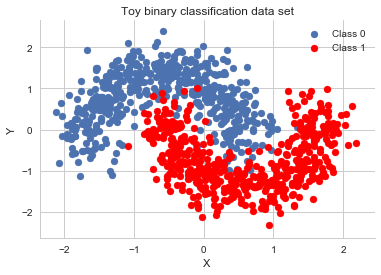
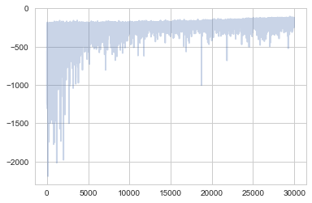
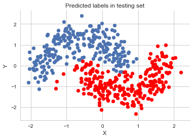
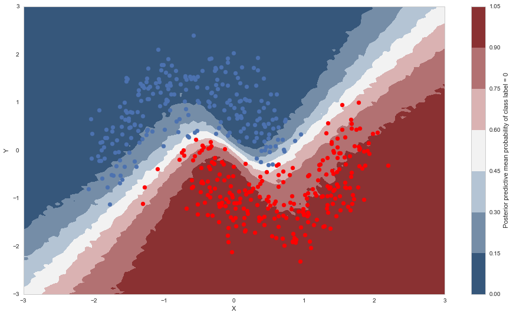
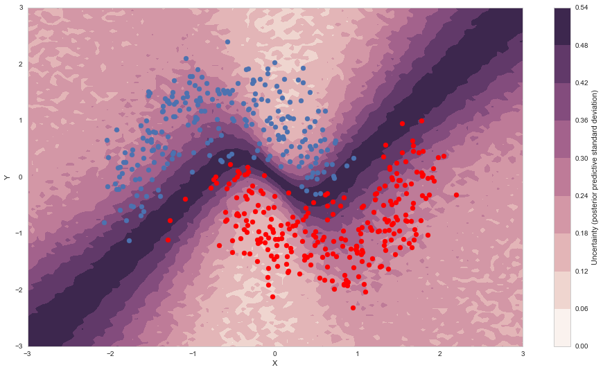
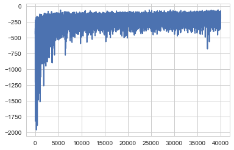



## Contents
{:.no_toc}
*  
{: toc}


```python
%matplotlib inline
import theano
import pymc3 as pm
import theano.tensor as T
import sklearn
import numpy as np
import matplotlib.pyplot as plt
import seaborn as sns
from warnings import filterwarnings
from sklearn import datasets
from sklearn.preprocessing import scale
from sklearn.model_selection import train_test_split
from sklearn.datasets import make_moons
sns.set_style('whitegrid')
```


```python
X, Y = make_moons(noise=0.2, random_state=0, n_samples=1000)
X = scale(X)
```


```python
Y = Y.astype('float64')
```


```python
X_train, X_test, Y_train, Y_test = train_test_split(X, Y, test_size=.5)
```


```python
fig, ax = plt.subplots()
ax.scatter(X[Y==0, 0], X[Y==0, 1], label='Class 0')
ax.scatter(X[Y==1, 0], X[Y==1, 1], color='r', label='Class 1')
sns.despine(); ax.legend()
ax.set(xlabel='X', ylabel='Y', title='Toy binary classification data set');
```





```python
X_train.shape
```


    (500, 2)


```python
def construct_nn(ann_input, ann_output):
    n_hidden = 5

    # Initialize random weights between each layer
    init_1 = np.random.randn(X.shape[1], n_hidden)
    init_2 = np.random.randn(n_hidden, n_hidden)
    init_out = np.random.randn(n_hidden)

    with pm.Model() as neural_network:
        # Weights from input to hidden layer
        weights_in_1 = pm.Normal('w_in_1', 0, sd=1,
                                 shape=(X.shape[1], n_hidden),
                                 testval=init_1)

        # Weights from 1st to 2nd layer
        weights_1_2 = pm.Normal('w_1_2', 0, sd=1,
                                shape=(n_hidden, n_hidden),
                                testval=init_2)

        # Weights from hidden layer to output
        weights_2_out = pm.Normal('w_2_out', 0, sd=1,
                                  shape=(n_hidden,),
                                  testval=init_out)

        # Build neural-network using tanh activation function
        act_1 = pm.math.tanh(pm.math.dot(ann_input,
                                         weights_in_1))
        act_2 = pm.math.tanh(pm.math.dot(act_1,
                                         weights_1_2))
        act_out = pm.math.sigmoid(pm.math.dot(act_2,
                                              weights_2_out))

        # Binary classification -> Bernoulli likelihood
        out = pm.Bernoulli('out',
                           act_out,
                           observed=ann_output,
                           total_size=Y_train.shape[0] # IMPORTANT for minibatches
                          )
    return neural_network

# Trick: Turn inputs and outputs into shared variables.
# It's still the same thing, but we can later change the values of the shared variable
# (to switch in the test-data later) and pymc3 will just use the new data.
# Kind-of like a pointer we can redirect.
# For more info, see: http://deeplearning.net/software/theano/library/compile/shared.html
ann_input = theano.shared(X_train)
ann_output = theano.shared(Y_train)
neural_network = construct_nn(ann_input, ann_output)
```


```python
with neural_network:
    nutstrace = pm.sample(2000, tune=1000)
```


    Auto-assigning NUTS sampler...
    Initializing NUTS using jitter+adapt_diag...
    Multiprocess sampling (2 chains in 2 jobs)
    NUTS: [w_2_out, w_1_2, w_in_1]
    100%|██████████| 3000/3000 [03:52<00:00, 12.92it/s]
    There were 232 divergences after tuning. Increase `target_accept` or reparameterize.
    The acceptance probability does not match the target. It is 0.651692949328, but should be close to 0.8. Try to increase the number of tuning steps.
    There were 120 divergences after tuning. Increase `target_accept` or reparameterize.
    The acceptance probability does not match the target. It is 0.682274841411, but should be close to 0.8. Try to increase the number of tuning steps.
    The gelman-rubin statistic is larger than 1.05 for some parameters. This indicates slight problems during sampling.
    The estimated number of effective samples is smaller than 200 for some parameters.


```python
pm.summary(nutstrace)
```


<div>
<style>
    .dataframe thead tr:only-child th {
        text-align: right;
    }

    .dataframe thead th {
        text-align: left;
    }

    .dataframe tbody tr th {
        vertical-align: top;
    }
</style>
<table border="1" class="dataframe">
  <thead>
    <tr style="text-align: right;">
      <th></th>
      <th>mean</th>
      <th>sd</th>
      <th>mc_error</th>
      <th>hpd_2.5</th>
      <th>hpd_97.5</th>
      <th>n_eff</th>
      <th>Rhat</th>
    </tr>
  </thead>
  <tbody>
    <tr>
      <th>w_in_1__0_0</th>
      <td>0.123930</td>
      <td>1.330869</td>
      <td>0.116547</td>
      <td>-2.460931</td>
      <td>2.930068</td>
      <td>9.0</td>
      <td>1.137070</td>
    </tr>
    <tr>
      <th>w_in_1__0_1</th>
      <td>-0.493261</td>
      <td>1.431399</td>
      <td>0.130625</td>
      <td>-3.050534</td>
      <td>2.414883</td>
      <td>23.0</td>
      <td>1.107352</td>
    </tr>
    <tr>
      <th>w_in_1__0_2</th>
      <td>-0.391219</td>
      <td>1.359743</td>
      <td>0.118412</td>
      <td>-2.887345</td>
      <td>2.457370</td>
      <td>51.0</td>
      <td>0.999820</td>
    </tr>
    <tr>
      <th>w_in_1__0_3</th>
      <td>0.265870</td>
      <td>1.427571</td>
      <td>0.128061</td>
      <td>-2.439405</td>
      <td>3.031381</td>
      <td>24.0</td>
      <td>1.018467</td>
    </tr>
    <tr>
      <th>w_in_1__0_4</th>
      <td>-0.135690</td>
      <td>1.161102</td>
      <td>0.101015</td>
      <td>-2.902407</td>
      <td>2.339875</td>
      <td>18.0</td>
      <td>1.051387</td>
    </tr>
    <tr>
      <th>w_in_1__1_0</th>
      <td>0.071497</td>
      <td>0.948036</td>
      <td>0.068116</td>
      <td>-2.057060</td>
      <td>2.555026</td>
      <td>67.0</td>
      <td>1.013077</td>
    </tr>
    <tr>
      <th>w_in_1__1_1</th>
      <td>-0.023531</td>
      <td>0.901718</td>
      <td>0.072519</td>
      <td>-2.280693</td>
      <td>2.076487</td>
      <td>81.0</td>
      <td>1.000335</td>
    </tr>
    <tr>
      <th>w_in_1__1_2</th>
      <td>0.053893</td>
      <td>1.127319</td>
      <td>0.087329</td>
      <td>-2.456869</td>
      <td>2.609779</td>
      <td>67.0</td>
      <td>1.008521</td>
    </tr>
    <tr>
      <th>w_in_1__1_3</th>
      <td>0.047101</td>
      <td>0.900319</td>
      <td>0.075818</td>
      <td>-2.516146</td>
      <td>1.791953</td>
      <td>12.0</td>
      <td>1.055726</td>
    </tr>
    <tr>
      <th>w_in_1__1_4</th>
      <td>-0.035805</td>
      <td>0.962708</td>
      <td>0.082209</td>
      <td>-2.360810</td>
      <td>2.205260</td>
      <td>47.0</td>
      <td>1.000899</td>
    </tr>
    <tr>
      <th>w_1_2__0_0</th>
      <td>0.045259</td>
      <td>1.230785</td>
      <td>0.044207</td>
      <td>-2.419610</td>
      <td>2.257352</td>
      <td>564.0</td>
      <td>1.003747</td>
    </tr>
    <tr>
      <th>w_1_2__0_1</th>
      <td>0.041488</td>
      <td>1.301054</td>
      <td>0.055290</td>
      <td>-2.277383</td>
      <td>2.743031</td>
      <td>446.0</td>
      <td>0.999899</td>
    </tr>
    <tr>
      <th>w_1_2__0_2</th>
      <td>0.125124</td>
      <td>1.280967</td>
      <td>0.046201</td>
      <td>-2.312125</td>
      <td>2.697887</td>
      <td>566.0</td>
      <td>0.999813</td>
    </tr>
    <tr>
      <th>w_1_2__0_3</th>
      <td>-0.028414</td>
      <td>1.304735</td>
      <td>0.050443</td>
      <td>-2.587809</td>
      <td>2.428393</td>
      <td>538.0</td>
      <td>1.000262</td>
    </tr>
    <tr>
      <th>w_1_2__0_4</th>
      <td>0.001644</td>
      <td>1.287256</td>
      <td>0.051705</td>
      <td>-2.583537</td>
      <td>2.315840</td>
      <td>448.0</td>
      <td>1.000342</td>
    </tr>
    <tr>
      <th>w_1_2__1_0</th>
      <td>-0.004406</td>
      <td>1.205375</td>
      <td>0.041829</td>
      <td>-2.514428</td>
      <td>2.244782</td>
      <td>746.0</td>
      <td>0.999793</td>
    </tr>
    <tr>
      <th>w_1_2__1_1</th>
      <td>0.121821</td>
      <td>1.251840</td>
      <td>0.050935</td>
      <td>-2.261252</td>
      <td>2.517510</td>
      <td>518.0</td>
      <td>1.000542</td>
    </tr>
    <tr>
      <th>w_1_2__1_2</th>
      <td>-0.008304</td>
      <td>1.254002</td>
      <td>0.051344</td>
      <td>-2.213697</td>
      <td>2.390261</td>
      <td>498.0</td>
      <td>1.000063</td>
    </tr>
    <tr>
      <th>w_1_2__1_3</th>
      <td>-0.005456</td>
      <td>1.291233</td>
      <td>0.048944</td>
      <td>-2.536668</td>
      <td>2.415580</td>
      <td>638.0</td>
      <td>0.999986</td>
    </tr>
    <tr>
      <th>w_1_2__1_4</th>
      <td>-0.057718</td>
      <td>1.277334</td>
      <td>0.052935</td>
      <td>-2.423612</td>
      <td>2.380413</td>
      <td>473.0</td>
      <td>1.006059</td>
    </tr>
    <tr>
      <th>w_1_2__2_0</th>
      <td>-0.019780</td>
      <td>1.189632</td>
      <td>0.047975</td>
      <td>-2.274943</td>
      <td>2.288784</td>
      <td>561.0</td>
      <td>0.999921</td>
    </tr>
    <tr>
      <th>w_1_2__2_1</th>
      <td>-0.064628</td>
      <td>1.254670</td>
      <td>0.054349</td>
      <td>-2.402784</td>
      <td>2.431458</td>
      <td>416.0</td>
      <td>1.000838</td>
    </tr>
    <tr>
      <th>w_1_2__2_2</th>
      <td>0.078829</td>
      <td>1.258498</td>
      <td>0.055981</td>
      <td>-2.252705</td>
      <td>2.592491</td>
      <td>371.0</td>
      <td>1.004758</td>
    </tr>
    <tr>
      <th>w_1_2__2_3</th>
      <td>-0.048391</td>
      <td>1.272118</td>
      <td>0.044732</td>
      <td>-2.434831</td>
      <td>2.407843</td>
      <td>625.0</td>
      <td>1.001006</td>
    </tr>
    <tr>
      <th>w_1_2__2_4</th>
      <td>-0.018019</td>
      <td>1.240764</td>
      <td>0.056564</td>
      <td>-2.332373</td>
      <td>2.334165</td>
      <td>389.0</td>
      <td>1.000648</td>
    </tr>
    <tr>
      <th>w_1_2__3_0</th>
      <td>-0.011157</td>
      <td>1.239160</td>
      <td>0.038526</td>
      <td>-2.365355</td>
      <td>2.310785</td>
      <td>902.0</td>
      <td>0.999805</td>
    </tr>
    <tr>
      <th>w_1_2__3_1</th>
      <td>0.046428</td>
      <td>1.260380</td>
      <td>0.050470</td>
      <td>-2.314920</td>
      <td>2.407944</td>
      <td>536.0</td>
      <td>0.999840</td>
    </tr>
    <tr>
      <th>w_1_2__3_2</th>
      <td>-0.078094</td>
      <td>1.292863</td>
      <td>0.051612</td>
      <td>-2.612755</td>
      <td>2.369275</td>
      <td>488.0</td>
      <td>1.002045</td>
    </tr>
    <tr>
      <th>w_1_2__3_3</th>
      <td>0.018767</td>
      <td>1.302577</td>
      <td>0.049790</td>
      <td>-2.517321</td>
      <td>2.450889</td>
      <td>381.0</td>
      <td>1.005646</td>
    </tr>
    <tr>
      <th>w_1_2__3_4</th>
      <td>0.047618</td>
      <td>1.268120</td>
      <td>0.052708</td>
      <td>-2.293177</td>
      <td>2.450042</td>
      <td>499.0</td>
      <td>1.000193</td>
    </tr>
    <tr>
      <th>w_1_2__4_0</th>
      <td>-0.024577</td>
      <td>1.280421</td>
      <td>0.051886</td>
      <td>-2.530172</td>
      <td>2.461077</td>
      <td>634.0</td>
      <td>1.000493</td>
    </tr>
    <tr>
      <th>w_1_2__4_1</th>
      <td>-0.015574</td>
      <td>1.292227</td>
      <td>0.051797</td>
      <td>-2.667592</td>
      <td>2.328790</td>
      <td>455.0</td>
      <td>1.000200</td>
    </tr>
    <tr>
      <th>w_1_2__4_2</th>
      <td>-0.020678</td>
      <td>1.314246</td>
      <td>0.051867</td>
      <td>-2.589785</td>
      <td>2.605920</td>
      <td>494.0</td>
      <td>1.004190</td>
    </tr>
    <tr>
      <th>w_1_2__4_3</th>
      <td>-0.024291</td>
      <td>1.278493</td>
      <td>0.047599</td>
      <td>-2.407167</td>
      <td>2.504326</td>
      <td>666.0</td>
      <td>0.999903</td>
    </tr>
    <tr>
      <th>w_1_2__4_4</th>
      <td>-0.005184</td>
      <td>1.287306</td>
      <td>0.053009</td>
      <td>-2.486049</td>
      <td>2.611267</td>
      <td>414.0</td>
      <td>0.999980</td>
    </tr>
    <tr>
      <th>w_2_out__0</th>
      <td>0.156560</td>
      <td>2.219129</td>
      <td>0.105795</td>
      <td>-4.386398</td>
      <td>4.350683</td>
      <td>437.0</td>
      <td>1.000577</td>
    </tr>
    <tr>
      <th>w_2_out__1</th>
      <td>0.223283</td>
      <td>2.321585</td>
      <td>0.117838</td>
      <td>-3.916271</td>
      <td>5.231669</td>
      <td>206.0</td>
      <td>1.002508</td>
    </tr>
    <tr>
      <th>w_2_out__2</th>
      <td>-0.082721</td>
      <td>2.400420</td>
      <td>0.118276</td>
      <td>-4.787125</td>
      <td>4.424813</td>
      <td>283.0</td>
      <td>0.999791</td>
    </tr>
    <tr>
      <th>w_2_out__3</th>
      <td>-0.388788</td>
      <td>2.341725</td>
      <td>0.110378</td>
      <td>-5.037902</td>
      <td>4.127480</td>
      <td>332.0</td>
      <td>1.009560</td>
    </tr>
    <tr>
      <th>w_2_out__4</th>
      <td>-0.067230</td>
      <td>2.405774</td>
      <td>0.133776</td>
      <td>-4.656133</td>
      <td>4.642663</td>
      <td>240.0</td>
      <td>1.000985</td>
    </tr>
  </tbody>
</table>
</div>


```python
with neural_network:
    inference = pm.ADVI()
    approx = pm.fit(n=30000, method=inference)
```


    Average Loss = 151.75: 100%|██████████| 30000/30000 [00:28<00:00, 1057.53it/s]
    Finished [100%]: Average Loss = 151.75


```python
advitrace = approx.sample(draws=5000)
```


```python
pm.summary(advitrace)
```


<div>
<style>
    .dataframe thead tr:only-child th {
        text-align: right;
    }

    .dataframe thead th {
        text-align: left;
    }

    .dataframe tbody tr th {
        vertical-align: top;
    }
</style>
<table border="1" class="dataframe">
  <thead>
    <tr style="text-align: right;">
      <th></th>
      <th>mean</th>
      <th>sd</th>
      <th>mc_error</th>
      <th>hpd_2.5</th>
      <th>hpd_97.5</th>
    </tr>
  </thead>
  <tbody>
    <tr>
      <th>w_in_1__0_0</th>
      <td>-0.521386</td>
      <td>0.112502</td>
      <td>0.001786</td>
      <td>-0.741013</td>
      <td>-0.297054</td>
    </tr>
    <tr>
      <th>w_in_1__0_1</th>
      <td>0.122723</td>
      <td>0.319251</td>
      <td>0.004560</td>
      <td>-0.504744</td>
      <td>0.743053</td>
    </tr>
    <tr>
      <th>w_in_1__0_2</th>
      <td>-0.543037</td>
      <td>0.113075</td>
      <td>0.001731</td>
      <td>-0.769624</td>
      <td>-0.328908</td>
    </tr>
    <tr>
      <th>w_in_1__0_3</th>
      <td>3.255195</td>
      <td>0.487644</td>
      <td>0.006504</td>
      <td>2.279137</td>
      <td>4.182791</td>
    </tr>
    <tr>
      <th>w_in_1__0_4</th>
      <td>-0.464174</td>
      <td>0.162645</td>
      <td>0.002485</td>
      <td>-0.789237</td>
      <td>-0.154705</td>
    </tr>
    <tr>
      <th>w_in_1__1_0</th>
      <td>0.362184</td>
      <td>0.177318</td>
      <td>0.002432</td>
      <td>0.008508</td>
      <td>0.706695</td>
    </tr>
    <tr>
      <th>w_in_1__1_1</th>
      <td>-0.153209</td>
      <td>0.440645</td>
      <td>0.006077</td>
      <td>-0.998433</td>
      <td>0.710622</td>
    </tr>
    <tr>
      <th>w_in_1__1_2</th>
      <td>0.328326</td>
      <td>0.182822</td>
      <td>0.002778</td>
      <td>-0.036471</td>
      <td>0.671428</td>
    </tr>
    <tr>
      <th>w_in_1__1_3</th>
      <td>0.814828</td>
      <td>0.332562</td>
      <td>0.004819</td>
      <td>0.187650</td>
      <td>1.495967</td>
    </tr>
    <tr>
      <th>w_in_1__1_4</th>
      <td>0.262358</td>
      <td>0.236041</td>
      <td>0.003509</td>
      <td>-0.200934</td>
      <td>0.738899</td>
    </tr>
    <tr>
      <th>w_1_2__0_0</th>
      <td>0.430823</td>
      <td>0.900179</td>
      <td>0.012896</td>
      <td>-1.306313</td>
      <td>2.182824</td>
    </tr>
    <tr>
      <th>w_1_2__0_1</th>
      <td>0.159472</td>
      <td>1.001399</td>
      <td>0.015379</td>
      <td>-1.865583</td>
      <td>2.044132</td>
    </tr>
    <tr>
      <th>w_1_2__0_2</th>
      <td>1.769050</td>
      <td>0.488465</td>
      <td>0.006968</td>
      <td>0.793287</td>
      <td>2.708693</td>
    </tr>
    <tr>
      <th>w_1_2__0_3</th>
      <td>-0.798432</td>
      <td>0.219366</td>
      <td>0.002937</td>
      <td>-1.225897</td>
      <td>-0.375460</td>
    </tr>
    <tr>
      <th>w_1_2__0_4</th>
      <td>-0.138738</td>
      <td>1.058936</td>
      <td>0.015063</td>
      <td>-2.161605</td>
      <td>1.937199</td>
    </tr>
    <tr>
      <th>w_1_2__1_0</th>
      <td>-0.014915</td>
      <td>0.998757</td>
      <td>0.015708</td>
      <td>-1.996569</td>
      <td>1.954171</td>
    </tr>
    <tr>
      <th>w_1_2__1_1</th>
      <td>-0.112639</td>
      <td>1.036376</td>
      <td>0.014671</td>
      <td>-2.166837</td>
      <td>1.896193</td>
    </tr>
    <tr>
      <th>w_1_2__1_2</th>
      <td>-0.279527</td>
      <td>0.607058</td>
      <td>0.007500</td>
      <td>-1.462639</td>
      <td>0.905531</td>
    </tr>
    <tr>
      <th>w_1_2__1_3</th>
      <td>0.030542</td>
      <td>0.262629</td>
      <td>0.003622</td>
      <td>-0.449362</td>
      <td>0.566730</td>
    </tr>
    <tr>
      <th>w_1_2__1_4</th>
      <td>0.033081</td>
      <td>1.031896</td>
      <td>0.014412</td>
      <td>-1.996529</td>
      <td>2.026740</td>
    </tr>
    <tr>
      <th>w_1_2__2_0</th>
      <td>0.698759</td>
      <td>0.894654</td>
      <td>0.013301</td>
      <td>-1.058448</td>
      <td>2.480351</td>
    </tr>
    <tr>
      <th>w_1_2__2_1</th>
      <td>0.075845</td>
      <td>0.993218</td>
      <td>0.014997</td>
      <td>-1.837229</td>
      <td>2.087505</td>
    </tr>
    <tr>
      <th>w_1_2__2_2</th>
      <td>0.227468</td>
      <td>0.470235</td>
      <td>0.006694</td>
      <td>-0.692072</td>
      <td>1.136107</td>
    </tr>
    <tr>
      <th>w_1_2__2_3</th>
      <td>-1.266305</td>
      <td>0.213226</td>
      <td>0.003163</td>
      <td>-1.653136</td>
      <td>-0.825669</td>
    </tr>
    <tr>
      <th>w_1_2__2_4</th>
      <td>-0.140237</td>
      <td>1.001324</td>
      <td>0.014957</td>
      <td>-2.069265</td>
      <td>1.830847</td>
    </tr>
    <tr>
      <th>w_1_2__3_0</th>
      <td>0.697528</td>
      <td>0.698237</td>
      <td>0.009634</td>
      <td>-0.619907</td>
      <td>2.115031</td>
    </tr>
    <tr>
      <th>w_1_2__3_1</th>
      <td>0.260246</td>
      <td>0.865400</td>
      <td>0.012721</td>
      <td>-1.346997</td>
      <td>1.989603</td>
    </tr>
    <tr>
      <th>w_1_2__3_2</th>
      <td>1.164568</td>
      <td>0.346030</td>
      <td>0.004961</td>
      <td>0.499555</td>
      <td>1.842212</td>
    </tr>
    <tr>
      <th>w_1_2__3_3</th>
      <td>-1.060768</td>
      <td>0.125721</td>
      <td>0.001927</td>
      <td>-1.293945</td>
      <td>-0.800757</td>
    </tr>
    <tr>
      <th>w_1_2__3_4</th>
      <td>-0.395368</td>
      <td>0.913273</td>
      <td>0.013130</td>
      <td>-2.218135</td>
      <td>1.333269</td>
    </tr>
    <tr>
      <th>w_1_2__4_0</th>
      <td>0.021826</td>
      <td>0.933852</td>
      <td>0.013489</td>
      <td>-1.863657</td>
      <td>1.834411</td>
    </tr>
    <tr>
      <th>w_1_2__4_1</th>
      <td>0.042679</td>
      <td>1.048042</td>
      <td>0.015151</td>
      <td>-2.087779</td>
      <td>2.004247</td>
    </tr>
    <tr>
      <th>w_1_2__4_2</th>
      <td>0.582934</td>
      <td>0.556188</td>
      <td>0.007582</td>
      <td>-0.457234</td>
      <td>1.709272</td>
    </tr>
    <tr>
      <th>w_1_2__4_3</th>
      <td>-0.659373</td>
      <td>0.240979</td>
      <td>0.003342</td>
      <td>-1.121006</td>
      <td>-0.194694</td>
    </tr>
    <tr>
      <th>w_1_2__4_4</th>
      <td>-0.121137</td>
      <td>1.025468</td>
      <td>0.013284</td>
      <td>-2.159029</td>
      <td>1.859368</td>
    </tr>
    <tr>
      <th>w_2_out__0</th>
      <td>-0.312281</td>
      <td>0.265692</td>
      <td>0.003796</td>
      <td>-0.832638</td>
      <td>0.205428</td>
    </tr>
    <tr>
      <th>w_2_out__1</th>
      <td>-0.076431</td>
      <td>0.253095</td>
      <td>0.003764</td>
      <td>-0.557819</td>
      <td>0.428869</td>
    </tr>
    <tr>
      <th>w_2_out__2</th>
      <td>-1.139659</td>
      <td>0.268075</td>
      <td>0.003511</td>
      <td>-1.672406</td>
      <td>-0.614689</td>
    </tr>
    <tr>
      <th>w_2_out__3</th>
      <td>3.192447</td>
      <td>0.274850</td>
      <td>0.004289</td>
      <td>2.655092</td>
      <td>3.718204</td>
    </tr>
    <tr>
      <th>w_2_out__4</th>
      <td>0.112249</td>
      <td>0.257997</td>
      <td>0.003784</td>
      <td>-0.414541</td>
      <td>0.584599</td>
    </tr>
  </tbody>
</table>
</div>


```python
plt.plot(-inference.hist, alpha=.3)
```


    [<matplotlib.lines.Line2D at 0x121ced550>]





```python
ann_input.set_value(X_test)
ann_output.set_value(Y_test)
with neural_network:
    ppc = pm.sample_ppc(advitrace, samples=1000)
```


    100%|██████████| 1000/1000 [00:00<00:00, 1593.05it/s]


```python
pred = ppc['out'].mean(axis=0) > 0.5
```


```python
fig, ax = plt.subplots()
ax.scatter(X_test[pred==0, 0], X_test[pred==0, 1])
ax.scatter(X_test[pred==1, 0], X_test[pred==1, 1], color='r')
sns.despine()
ax.set(title='Predicted labels in testing set', xlabel='X', ylabel='Y');
```





```python
print('Accuracy = {}%'.format((Y_test == pred).mean() * 100))
```


    Accuracy = 95.19999999999999%


```python
grid = pm.floatX(np.mgrid[-3:3:100j,-3:3:100j])
grid_2d = grid.reshape(2, -1).T
dummy_out = np.ones(grid.shape[1], dtype=np.int8)
```


```python
ann_input.set_value(grid_2d)
ann_output.set_value(dummy_out)
with neural_network:
    ppc_grid = pm.sample_ppc(advitrace ,500)
```


    100%|██████████| 500/500 [00:02<00:00, 227.28it/s]


```python
cmap = sns.diverging_palette(250, 12, s=85, l=25, as_cmap=True)
fig, ax = plt.subplots(figsize=(16, 9))
contour = ax.contourf(grid[0], grid[1], ppc_grid['out'].mean(axis=0).reshape(100, 100), cmap=cmap)
ax.scatter(X_test[pred==0, 0], X_test[pred==0, 1])
ax.scatter(X_test[pred==1, 0], X_test[pred==1, 1], color='r')
cbar = plt.colorbar(contour, ax=ax)
_ = ax.set(xlim=(-3, 3), ylim=(-3, 3), xlabel='X', ylabel='Y');
cbar.ax.set_ylabel('Posterior predictive mean probability of class label = 0');
```





```python
cmap = sns.cubehelix_palette(light=1, as_cmap=True)
fig, ax = plt.subplots(figsize=(16, 9))
contour = ax.contourf(grid[0], grid[1], ppc_grid['out'].std(axis=0).reshape(100, 100), cmap=cmap)
ax.scatter(X_test[pred==0, 0], X_test[pred==0, 1])
ax.scatter(X_test[pred==1, 0], X_test[pred==1, 1], color='r')
cbar = plt.colorbar(contour, ax=ax)
_ = ax.set(xlim=(-3, 3), ylim=(-3, 3), xlabel='X', ylabel='Y');
cbar.ax.set_ylabel('Uncertainty (posterior predictive standard deviation)');
```





```python
minibatch_x = pm.Minibatch(X_train, batch_size=50)
minibatch_y = pm.Minibatch(Y_train, batch_size=50)
neural_network_minibatch = construct_nn(minibatch_x, minibatch_y)
with neural_network_minibatch:
    approx_mb = pm.fit(40000, method=pm.ADVI())
```


    Average Loss = 162.17: 100%|██████████| 40000/40000 [00:28<00:00, 1425.03it/s]
    Finished [100%]: Average Loss = 162.06


```python
plt.plot(-approx_mb.hist)
```


    [<matplotlib.lines.Line2D at 0x120b2fa58>]




